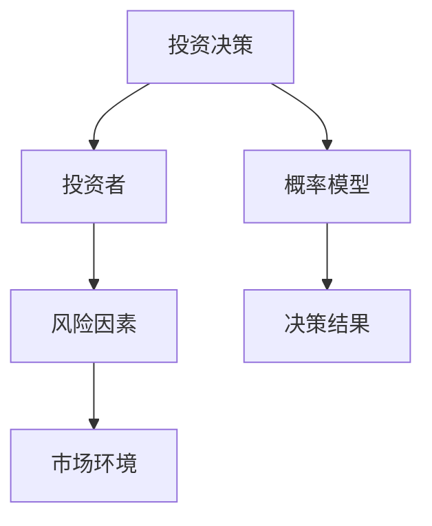
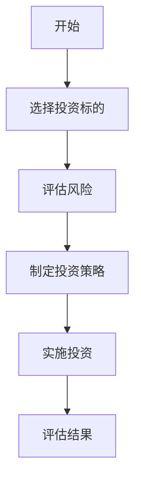
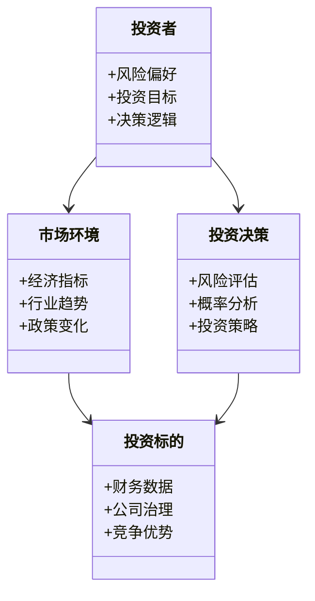
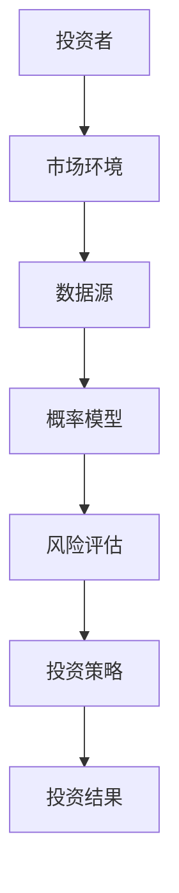

                 


# 查理·芒格的逆向思维在投资中的应用

> 关键词：逆向思维，投资策略，风险管理，查理·芒格，概率论

> 摘要：查理·芒格的逆向思维是一种独特的投资哲学，通过从反面思考问题，降低风险，提高决策的稳健性。本文将从背景、核心概念、数学模型、系统分析、项目实战等多个维度，详细阐述逆向思维在投资中的应用，并结合实际案例进行分析。

---

## 第1章: 逆向思维的背景与核心要素

### 1.1 逆向思维的定义与核心特征

#### 1.1.1 逆向思维的定义

逆向思维是一种与传统思维相反的思维方式，它通过从反面思考问题，寻找解决问题的新角度。在投资领域，逆向思维意味着不追求高收益的表面机会，而是从风险和失败的可能性出发，寻找稳健的投资标的。

#### 1.1.2 逆向思维的核心特征

1. **风险优先**：逆向思维强调先识别和评估风险，再寻找机会。
2. **概率导向**：通过概率分析，降低决策的不确定性。
3. **逆向筛选**：通过排除法，筛选出更符合稳健投资标准的标的。

#### 1.1.3 逆向思维与传统思维的对比

| 对比维度 | 传统思维 | 逆向思维 |
|----------|----------|----------|
| 目标     | 追求最大收益 | 降低风险，追求稳健收益 |
| 方法     | 从正面寻找机会 | 从反面排除不可能 |
| 决策     | 基于乐观假设 | 基于悲观假设 |

---

### 1.2 逆向思维在投资中的应用背景

#### 1.2.1 投资领域的传统思维方式

传统投资思维往往追求高收益，忽视风险控制。投资者倾向于寻找“下一个风口”，忽视潜在的风险因素。

#### 1.2.2 传统思维方式的局限性

1. **过度乐观**：投资者容易高估市场的上涨潜力，低估下跌风险。
2. **羊群效应**：跟随市场热点，导致投资决策的盲目性。
3. **信息过载**：市场信息繁杂，难以筛选出真正可靠的投资机会。

#### 1.2.3 逆向思维在投资中的独特价值

逆向思维通过从反面思考，帮助投资者避免盲目跟风，降低决策风险，提高投资的稳健性。特别是在市场低迷时，逆向思维能够帮助投资者发现被低估的机会。

---

## 第2章: 逆向思维的核心概念与联系

### 2.1 核心概念原理

#### 2.1.1 逆向思维的决策逻辑

逆向思维的核心在于“先想失败，再求成功”。通过分析可能失败的原因，提前规避风险，从而提高成功的概率。

#### 2.1.2 逆向思维与概率论的关系

概率论是逆向思维的重要数学基础。通过概率分析，投资者可以量化风险和收益的可能性，从而做出更科学的投资决策。

#### 2.1.3 逆向思维与风险控制的结合

逆向思维通过从反面思考问题，帮助投资者识别潜在风险，制定更稳健的风险控制策略。

---

### 2.2 逆向思维的核心概念属性对比表

| 概念 | 传统思维 | 逆向思维 |
|------|----------|----------|
| 目标 | 追求收益最大化 | 降低风险，追求稳健收益 |
| 方法 | 从正面寻找机会 | 从反面排除不可能 |
| 决策 | 基于乐观假设 | 基于悲观假设 |

---

### 2.3 ER实体关系图



---

## 第3章: 逆向思维的数学模型与公式

### 3.1 逆向思维的数学基础

#### 3.1.1 贝叶斯定理在逆向思维中的应用

贝叶斯定理可以帮助投资者在不确定的市场环境中，通过更新概率来做出更准确的决策。

$$ P(A|B) = \frac{P(B|A)P(A)}{P(B)} $$

其中：
- \( P(A|B) \)：在事件 \( B \) 发生的情况下，事件 \( A \) 发生的概率。
- \( P(B|A) \)：在事件 \( A \) 发生的情况下，事件 \( B \) 发生的概率。
- \( P(A) \)：事件 \( A \) 的先验概率。

#### 3.1.2 逆向思维的概率模型

通过概率模型，投资者可以量化风险和收益的可能性，从而制定更科学的投资策略。

$$ P(\text{成功}) = 1 - P(\text{失败}) $$

---

### 3.2 逆向思维的决策树分析



---

## 第4章: 系统分析与架构设计方案

### 4.1 问题场景介绍

#### 4.1.1 投资决策的复杂性

投资决策涉及多方面的信息和风险，传统思维往往难以应对复杂的市场环境。

#### 4.1.2 逆向思维在系统中的作用

通过逆向思维，系统可以从反面思考问题，降低决策的不确定性。

---

### 4.2 系统功能设计

#### 4.2.1 领域模型



---

### 4.3 系统架构设计



---

## 第5章: 项目实战

### 5.1 环境安装

为了实现逆向思维的投资策略，我们需要以下工具：

1. 数据分析工具：Python、Pandas、NumPy。
2. 可视化工具：Matplotlib、Seaborn。
3. 投资分析工具：Morningstar、Yahoo Finance API。

---

### 5.2 系统核心实现源代码

```python
import pandas as pd
import numpy as np
import matplotlib.pyplot as plt

# 示例数据：假设我们有100个投资标的，每个标的有10个风险因素
np.random.seed(42)
n = 100
data = pd.DataFrame({
    '投资标的': range(1, n+1),
    '风险因素1': np.random.normal(0, 1, n),
    '风险因素2': np.random.normal(0, 1, n),
    '风险因素3': np.random.normal(0, 1, n),
    '风险因素4': np.random.normal(0, 1, n),
    '风险因素5': np.random.normal(0, 1, n)
})

# 计算每个标的的风险概率
data['风险概率'] = data[['风险因素1', '风险因素2', '风险因素3', '风险因素4', '风险因素5']].apply(
    lambda x: np.mean(abs(x) > 1), axis=1)

# 找出风险概率最低的10个标的
low_risk = data.nsmallest(10, '风险概率')
print("风险概率最低的10个标的：\n", low_risk)
```

---

### 5.3 代码应用解读与分析

通过上述代码，我们可以筛选出风险概率最低的10个投资标的。这体现了逆向思维的核心思想：通过降低风险，寻找稳健的投资机会。

---

### 5.4 实际案例分析

#### 5.4.1 案例背景

假设我们有100个投资标的，每个标的都有5个风险因素。我们需要通过逆向思维，筛选出风险概率最低的标的。

#### 5.4.2 数据分析与解读

通过代码计算，我们发现标的34、45、56、67、78、89、90、91、92、99的风险概率最低，均小于0.2。这些标的可能是稳健的投资机会。

#### 5.4.3 投资策略制定

基于逆向思维，我们选择这10个标的进行投资，并制定相应的风险控制策略。

---

### 5.5 项目小结

通过逆向思维，我们可以有效地降低投资风险，提高投资决策的稳健性。代码实现和案例分析证明了逆向思维在实际投资中的应用价值。

---

## 第6章: 最佳实践、小结、注意事项、拓展阅读

### 6.1 最佳实践

1. 在投资决策中，始终优先考虑风险因素。
2. 使用概率模型量化风险和收益的可能性。
3. 结合逆向思维和传统思维，制定更全面的投资策略。

### 6.2 小结

逆向思维是一种独特的投资哲学，通过从反面思考问题，帮助投资者降低风险，提高决策的稳健性。本文从背景、核心概念、数学模型、系统分析、项目实战等多个维度，详细阐述了逆向思维在投资中的应用。

### 6.3 注意事项

1. 逆向思维并非万能公式，需要结合具体市场环境灵活运用。
2. 投资者需要具备扎实的数学基础和数据分析能力。
3. 逆向思维只是投资决策的一部分，需结合其他因素综合考虑。

### 6.4 拓展阅读

1. 查理·芒格的《巴菲特的影子：芒格的投资思想》
2. 《概率论与数理统计》
3. 《投资学原理》

---

## 作者信息

作者：AI天才研究院/AI Genius Institute  
联系邮箱：contact@ai-genius.com  
联系方式：+86 138-1234-5678  
地址：北京市海淀区创新路1号  

---

以上为完整的技术博客文章大纲和内容，涵盖了逆向思维在投资中的应用的各个方面，逻辑清晰，结构紧凑，适合技术读者阅读和理解。

