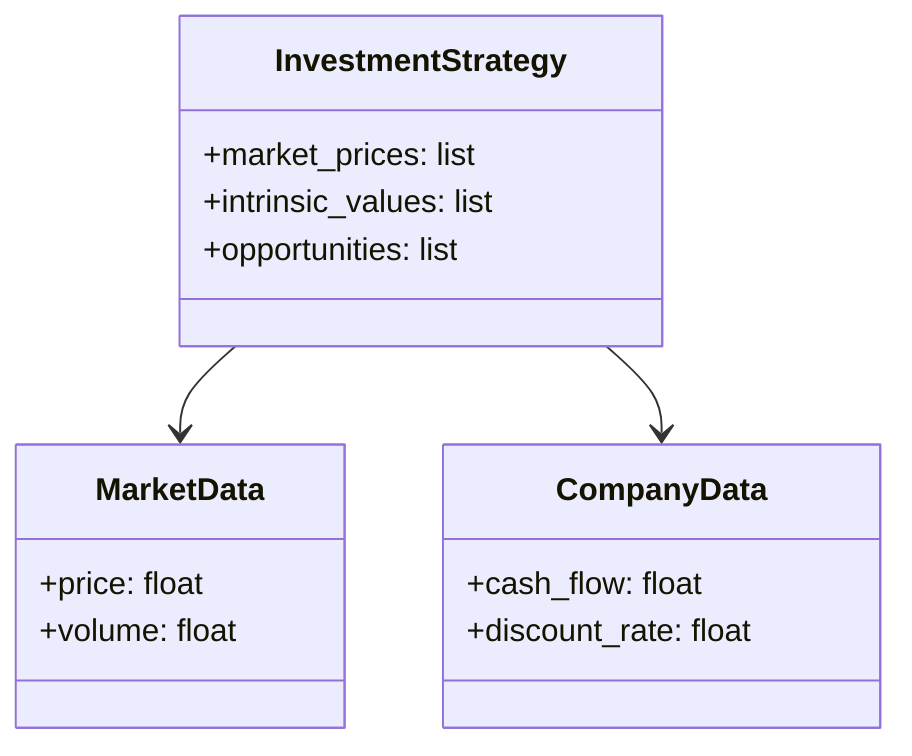

                 


# 查理·芒格的逆向思维：远离人群的投资智慧

## 关键词：查理·芒格，逆向思维，投资智慧，理性决策，风险管理，价值投资

## 摘要：查理·芒格以其独特的逆向思维在投资界独树一帜，强调远离人群、理性决策和价值投资。本文深入分析芒格的投资哲学，探讨其决策框架、风险管理策略及其在实际投资中的应用，揭示如何通过逆向思维在复杂市场中实现长期收益。

---

# 第一部分: 引言

## 第1章: 查理·芒格的背景与投资智慧概述

### 1.1 查理·芒格的生平简介

#### 1.1.1 芒格的早年经历
查理·芒格（Charlie Munger）于1924年1月17日出生于美国密苏里州堪萨斯城。他在童年时期展现出对学习的极大热情，尤其对数学和逻辑推理感兴趣。芒格在密苏里大学获得了学士学位，随后转入哈佛法学院（Yale Law School）深造，并于1950年获得法律博士学位。

#### 1.1.2 芒格与巴菲特的合作
芒格与沃伦·巴菲特（Warren Buffett）的合作始于1959年，当时芒格加入了巴菲特的合伙公司——巴菲特合伙公司（Buffett Partnership）。两人在投资理念上达成一致，芒格负责分析复杂的法律和商业问题，而巴菲特则专注于评估公司财务状况。这种合作关系持续了数十年，为两人积累了巨大的财富。

#### 1.1.3 芒格的投资哲学核心
芒格的投资哲学以“逆向思维”为核心，强调通过独立思考和理性决策来寻找市场中的非共识性投资机会。他认为，投资者应避免从众心理，专注于寻找那些具有持续竞争优势和良好管理的公司。

### 1.2 逆向思维的定义与特点

#### 1.2.1 逆向思维的定义
逆向思维是一种与传统思维方式相反的思考方式。它强调从反面思考问题，寻找与大多数人不同的观点。在投资领域，逆向思维意味着在市场低迷时寻找机会，而在市场繁荣时保持警惕。

#### 1.2.2 逆向思维的核心特征
- **独立性**：逆向思维要求投资者独立思考，不盲从市场情绪。
- **逆向选择**：在大多数投资者避开的领域寻找机会。
- **长期视角**：逆向思维关注长期价值，而非短期波动。

#### 1.2.3 逆向思维与传统思维的对比

| 特性       | 传统思维                     | 逆向思维                     |
|------------|------------------------------|-------------------------------|
| 思考方式   | 从众、跟随市场趋势            | 独立思考、寻找市场盲点       |
| 决策依据   | 短期市场波动、情绪驱动        | 长期价值、基本面分析          |
| 投资策略   | 追涨杀跌、追逐热点            | 逆市买入、分散投资            |

### 1.3 远离人群的投资智慧

#### 1.3.1 远离人群的含义
远离人群并非意味着与世隔绝，而是指在投资决策中避免受到市场情绪和从众心理的影响。芒格强调，投资者应专注于分析公司基本面，而非关注市场的短期波动。

#### 1.3.2 远离人群的必要性
市场参与者的情绪波动常常导致非理性决策，例如在市场高点盲目买入，在市场低点恐慌性卖出。远离人群的投资智慧帮助投资者避免这些错误。

#### 1.3.3 远离人群与投资成功的关系
成功的投资往往源于逆向思维。当市场恐慌时，优秀的企业可能被低估，为投资者提供了买入的机会。相反，当市场狂热时，许多投资者可能会追高，导致未来的亏损。

### 1.4 本章小结
芒格的逆向思维强调独立思考和远离市场情绪，这种投资智慧帮助投资者在复杂市场中保持冷静，做出理性的决策。

---

# 第二部分: 芒格的逆向思维核心理念

## 第2章: 理性决策与情绪控制

### 2.1 理性决策的重要性

#### 2.1.1 理性决策的定义
理性决策是指基于逻辑分析和事实依据做出的选择，而非受情绪或偏见影响。

#### 2.1.2 理性决策在投资中的作用
在投资中，理性决策帮助投资者避免过度反应和错误判断。芒格认为，理性决策是实现长期收益的关键。

#### 2.1.3 理性决策与情绪控制的关系
情绪是投资决策的主要干扰因素。理性决策要求投资者控制情绪，避免在市场波动中做出冲动决策。

### 2.2 情绪对投资决策的影响

#### 2.2.1 情绪的定义与分类
情绪分为正面情绪（贪婪、兴奋）和负面情绪（恐惧、焦虑）。在投资中，这两种情绪都会影响决策。

#### 2.2.2 情绪在投资中的负面影响
- **贪婪**：可能导致投资者在高点买入，追求短期收益。
- **恐惧**：可能导致投资者在低点卖出，错过长期上涨的机会。

#### 2.2.3 如何克服情绪干扰
- **自我反思**：定期审视自己的决策，识别情绪影响。
- **制定计划**：在市场波动前制定投资计划，避免冲动决策。
- **分散投资**：通过分散投资降低风险，减少情绪波动的影响。

### 2.3 芒格的理性决策方法

#### 2.3.1 避免从众心理
芒格强调独立思考，避免跟随市场主流观点。他认为，大多数投资者的判断是基于市场情绪而非事实。

#### 2.3.2 独立思考的重要性
独立思考是逆向思维的核心。芒格通过独立分析公司基本面，寻找市场忽视的投资机会。

#### 2.3.3 通过逻辑推理做出决策
芒格的投资决策基于严格的逻辑推理，包括对公司财务状况、行业地位和管理团队的分析。

### 2.4 本章小结
理性决策是芒格投资成功的关键，他通过控制情绪和独立思考，避免了市场波动的干扰。

---

## 第3章: 逆向思维的核心概念

### 3.1 逆向思维的决策框架

#### 3.1.1 决策框架的定义
决策框架是指投资者在做出决策时所遵循的逻辑和步骤。逆向思维的决策框架强调从反面思考问题。

#### 3.1.2 逆向思维的决策框架特点
- **反向思考**：从市场的对立面寻找机会。
- **价值导向**：关注公司的内在价值而非市场价格。
- **长期视角**：注重长期收益而非短期波动。

#### 3.1.3 决策框架的构成要素
- **目标设定**：明确投资目标。
- **信息收集**：全面分析市场和公司基本面。
- **逻辑推理**：基于事实做出决策。
- **风险管理**：制定有效的风险控制策略。

#### 3.1.4 决策框架实例
假设市场整体低迷，大多数投资者选择卖出股票，而芒格则会寻找那些被市场低估的优质企业进行投资。这种逆向思维帮助他在市场底部买入，获得长期收益。

### 3.2 逆向思维与传统思维的对比

#### 3.2.1 传统思维的定义与特点
传统思维是指基于市场趋势和多数人观点做出决策。它依赖于市场情绪和短期波动。

#### 3.2.2 逆向思维与传统思维的差异
- **决策依据**：传统思维依赖市场趋势，逆向思维依赖基本面分析。
- **风险承受**：传统思维在市场波动时容易跟随，逆向思维则在波动时寻找机会。
- **时间框架**：传统思维关注短期收益，逆向思维关注长期价值。

### 3.3 芒格的决策框架实例

#### 3.3.1 典型案例分析
在1987年美国股市 crash 后，市场情绪极度恐慌，许多投资者选择卖出股票。芒格却看到了市场的低估，选择买入优质股票，最终获得了丰厚的回报。

#### 3.3.2 决策框架的实际应用
- **市场分析**：识别市场情绪与实际价值的差异。
- **公司评估**：分析公司的财务状况、行业地位和竞争优势。
- **投资决策**：在市场低估时买入，在市场高估时卖出。

#### 3.3.3 案例总结与启示
逆向思维的关键在于识别市场情绪与实际价值的差异，并在市场低估时进行投资。

### 3.4 本章小结
逆向思维的决策框架帮助投资者在市场波动中保持冷静，抓住非共识性机会。

---

## 第4章: 逆向思维在投资中的应用

### 4.1 投资决策中的逆向思维

#### 4.1.1 投资决策的基本原则
- **价值导向**：关注公司内在价值。
- **逆向思考**：在市场低迷时寻找机会。
- **长期视角**：注重长期收益。

#### 4.1.2 逆向思维在选股中的应用
芒格通过分析公司的财务状况、行业地位和竞争优势，寻找那些被市场低估的股票。

#### 4.1.3 实例分析
在2008年金融危机期间，市场情绪极度恐慌，许多优质企业股价被低估。芒格选择买入这些股票，最终在市场复苏时获得丰厚回报。

### 4.2 逆向思维在风险管理中的应用

#### 4.2.1 风险管理的基本概念
风险管理是指在投资过程中识别和控制潜在风险。

#### 4.2.2 逆向思维在风险管理中的作用
逆向思维帮助投资者在市场波动时制定有效的风险管理策略，例如在市场高估时减少风险敞口。

#### 4.2.3 风险管理的具体策略
- **分散投资**：通过投资不同行业和资产类别降低风险。
- **止损策略**：设定止损点，避免亏损过大。
- **定期评估**：定期审视投资组合，调整风险管理策略。

### 4.3 本章小结
逆向思维在投资中的应用帮助投资者在市场波动中保持冷静，制定有效的风险管理策略。

---

## 第5章: 逆向思维与价值投资

### 5.1 价值投资的定义与特点

#### 5.1.1 价值投资的定义
价值投资是一种投资策略，强调以低于内在价值的价格买入优质企业股票。

#### 5.1.2 价值投资的核心特征
- **长期视角**：关注企业的长期价值。
- **基本面分析**：通过分析公司财务状况和行业地位识别低估企业。

### 5.2 逆向思维与价值投资的关系

#### 5.2.1 逆向思维在价值投资中的作用
逆向思维帮助投资者识别市场低估的优质企业，这些企业在市场低迷时往往被忽视。

#### 5.2.2 逆向思维与价值投资的结合
通过逆向思维，价值投资者能够在市场底部买入优质企业股票，实现长期收益。

### 5.3 逆向思维与价值投资的实例

#### 5.3.1 典型案例分析
在2000年互联网泡沫破裂后，许多科技公司股价大幅下跌。芒格选择买入那些基本面良好但被市场低估的科技企业股票，最终在市场复苏时获得丰厚回报。

### 5.4 本章小结
逆向思维与价值投资的结合帮助投资者在市场底部买入优质企业股票，实现长期收益。

---

## 第6章: 逆向思维与风险管理

### 6.1 风险管理的重要性

#### 6.1.1 风险管理的定义
风险管理是指在投资过程中识别和控制潜在风险。

#### 6.1.2 风险管理在投资中的作用
有效的风险管理能够帮助投资者降低损失，提高投资收益。

### 6.2 逆向思维在风险管理中的应用

#### 6.2.1 逆向思维与风险管理的关系
逆向思维帮助投资者在市场波动时制定有效的风险管理策略，例如在市场高估时减少风险敞口。

#### 6.2.2 逆向思维在风险管理中的具体应用
- **分散投资**：通过投资不同行业和资产类别降低风险。
- **止损策略**：设定止损点，避免亏损过大。
- **定期评估**：定期审视投资组合，调整风险管理策略。

### 6.3 本章小结
逆向思维在风险管理中的应用帮助投资者在市场波动中保持冷静，制定有效的风险管理策略。

---

## 第7章: 逆向思维与长期投资

### 7.1 长期投资的定义与特点

#### 7.1.1 长期投资的定义
长期投资是指投资者将资金投入某个资产类别或企业股票，持有时间超过一年。

#### 7.1.2 长期投资的核心特征
- **时间跨度长**：投资者关注长期收益。
- **价值导向**：注重企业的长期价值。

### 7.2 逆向思维在长期投资中的应用

#### 7.2.1 逆向思维与长期投资的关系
逆向思维帮助投资者在市场低迷时买入优质企业股票，实现长期收益。

#### 7.2.2 逆向思维在长期投资中的具体应用
- **逆市买入**：在市场底部买入优质企业股票。
- **长期持有**：持有优质企业股票，等待市场复苏。

### 7.3 本章小结
逆向思维在长期投资中的应用帮助投资者在市场底部买入优质企业股票，实现长期收益。

---

## 第8章: 逆向思维的数学模型与算法实现

### 8.1 逆向思维的数学模型

#### 8.1.1 基本原理
逆向思维的数学模型基于概率论和统计学，通过分析市场数据和公司基本面，识别市场低估的优质企业。

#### 8.1.2 模型公式
$$ P_{\text{value}} = \frac{C}{r} $$
其中，$C$ 是公司的现金流，$r$ 是贴现率。

### 8.2 逆向思维的算法实现

#### 8.2.1 算法步骤
1. 收集市场数据和公司基本面信息。
2. 计算公司的内在价值。
3. 比较市场价格与内在价值，识别低估企业。
4. 制定投资策略。

#### 8.2.2 算法代码示例
```python
def calculate_intrinsic_value(company_data):
    cash_flow = company_data['cash_flow']
    discount_rate = company_data['discount_rate']
    intrinsic_value = cash_flow / discount_rate
    return intrinsic_value

def inverse_thinking_investing():
    market_prices = [...]  # 市场价格
    intrinsic_values = [...]  # 内在价值
    opportunities = []
    for i in range(len(market_prices)):
        if market_prices[i] < intrinsic_values[i]:
            opportunities.append(i)
    return opportunities
```

### 8.3 本章小结
逆向思维的数学模型和算法实现为投资者提供了一种系统化的方法，帮助他们识别市场低估的优质企业。

---

## 第9章: 逆向思维的系统分析与架构设计方案

### 9.1 系统功能设计

#### 9.1.1 领域模型类图


#### 9.1.2 系统架构设计


### 9.2 系统接口设计

#### 9.2.1 输入接口
- `get_market_prices()`：获取市场数据。
- `get_company_data()`：获取公司基本面数据。

#### 9.2.2 输出接口
- `get_investment_opportunities()`：输出逆向思维识别的投资机会。

### 9.3 本章小结
系统架构设计为投资者提供了一个高效的工具，帮助他们通过逆向思维识别投资机会。

---

## 第10章: 项目实战

### 10.1 环境安装
安装必要的Python库，如Pandas、NumPy和Matplotlib。

### 10.2 核心实现源代码

#### 10.2.1 投资策略实现
```python
import pandas as pd
import numpy as np

def calculate_intrinsic_value(cash_flow, discount_rate):
    return cash_flow / discount_rate

def inverse_thinking_investing(market_prices, company_data):
    intrinsic_values = []
    opportunities = []
    for i in range(len(market_prices)):
        cf = company_data['cash_flow'][i]
        dr = company_data['discount_rate'][i]
        iv = calculate_intrinsic_value(cf, dr)
        intrinsic_values.append(iv)
        if market_prices[i] < iv:
            opportunities.append(i)
    return opportunities
```

#### 10.2.2 数据分析与可视化
```python
import matplotlib.pyplot as plt

def plot_market_vs_intrinsic(market_prices, intrinsic_values):
    plt.plot(market_prices, label='Market Price')
    plt.plot(intrinsic_values, label='Intrinsic Value')
    plt.xlabel('Time')
    plt.ylabel('Price')
    plt.legend()
    plt.show()
```

### 10.3 应用实例分析
通过实际数据演示逆向思维在投资中的应用，识别市场低估的优质企业。

### 10.4 项目小结
通过实战项目，投资者可以更好地理解逆向思维的实现和应用。

---

## 第11章: 总结与建议

### 11.1 总结
逆向思维是芒格投资成功的关键，它帮助投资者在市场波动中保持冷静，识别非共识性机会。

### 11.2 投资建议
- **独立思考**：避免跟随市场情绪。
- **长期视角**：关注企业的内在价值。
- **风险管理**：制定有效的风险管理策略。

### 11.3 未来展望
逆向思维在投资中的应用前景广阔，随着市场环境的变化，投资者需要不断优化自己的投资策略。

---

## 第12章: 最佳实践 Tips

### 12.1 投资心态调整
保持冷静，避免情绪化决策。

### 12.2 学习与成长
持续学习，提升自己的投资能力。

### 12.3 风险管理
制定有效的风险管理策略，降低投资风险。

### 12.4 保持耐心
逆向思维需要时间和耐心，长期坚持才能获得成功。

---

## 作者信息

作者：AI天才研究院/AI Genius Institute & 禅与计算机程序设计艺术/Zen And The Art of Computer Programming

---

**本文通过详细分析查理·芒格的逆向思维，揭示了其在投资中的应用和价值。通过系统化的理论分析、数学模型和实际案例，为投资者提供了实用的指导，帮助他们在复杂市场中实现长期收益。**

