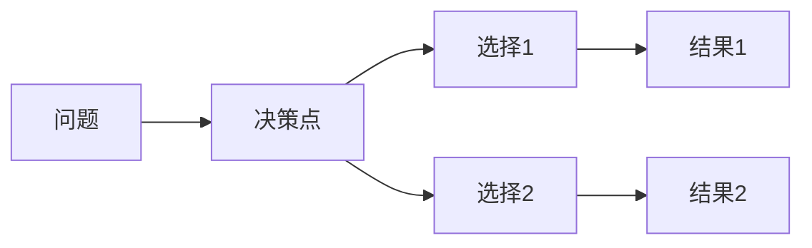
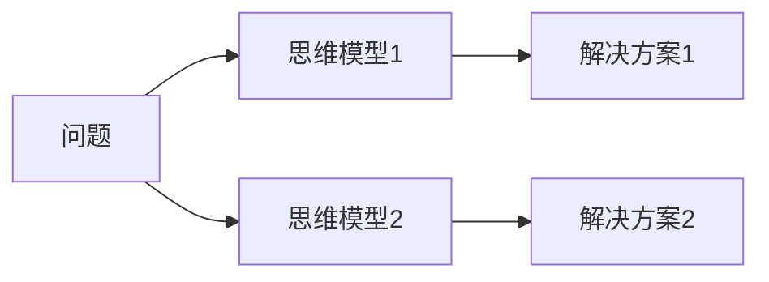
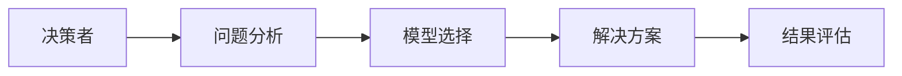
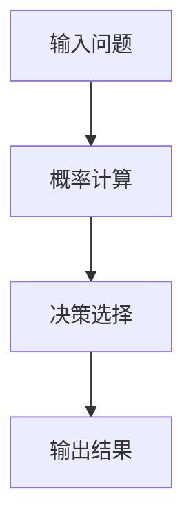
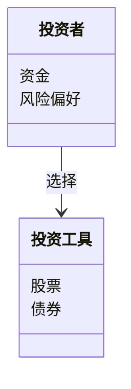

                 


# 查理芒格的多元思维模型

> 关键词：多元思维模型，查理·芒格，决策框架，概率思维，系统思维，投资决策

> 摘要：查理·芒格的多元思维模型是一种通过整合多个学科的思维框架来帮助我们更好地理解和解决实际问题的方法。本文将从背景、核心概念、数学基础、系统架构、算法实现、项目实战等多个维度详细分析多元思维模型，并通过具体案例展示其在投资、生活等领域的实际应用。

---

## 第1章: 多元思维模型的背景与核心概念

### 1.1 多元思维模型的定义与背景

查理·芒格是伯克希尔哈撒韦公司的副主席，也是一位著名投资家和作家。他在投资和生活中常常提到“多元思维模型”（Mental Model），这是一种通过整合多个学科的思维方式来帮助我们更好地理解和解决实际问题的方法。

多元思维模型的核心思想是：通过学习和应用不同学科的核心概念和思维框架，我们可以更全面地看待问题，避免单一视角的局限性。芒格认为，人类的认知过程往往受到思维定式的限制，而多元思维模型可以帮助我们跳出这种限制，从而做出更明智的决策。

#### 1.1.1 多元思维模型的起源

多元思维模型并非芒格首创，但它在芒格的实践中得到了极大的丰富和发展。芒格强调，我们应当从物理学、心理学、经济学、生物学等学科中汲取智慧，并将这些知识整合起来，形成一个完整的思维框架。

#### 1.1.2 多元思维模型的核心观点

1. **知识的整合性**：多元思维模型强调不同学科之间的联系，认为单一学科的知识往往是片面的。
2. **决策的全面性**：通过整合多个思维模型，我们可以更全面地分析问题，减少决策错误。
3. **思维的灵活性**：多元思维模型要求我们在面对问题时，能够灵活切换不同的思维框架，找到最优解决方案。

#### 1.1.3 多元思维模型的哲学基础

芒格的多元思维模型深受哲学影响，尤其是实用主义和经验主义。他认为，知识的价值在于其实际应用，而不是单纯的理论推导。因此，多元思维模型注重将理论知识应用于实际问题中，以实现最优决策。

---

### 1.2 多元思维模型的核心概念

#### 1.2.1 人类认知的局限性

人类的认知过程往往受到以下限制：
1. **确认偏见**：人们倾向于相信与自己已有认知一致的信息，而忽视相反的信息。
2. **忽略概率**：人们常常忽略概率因素，倾向于将事件绝对化。
3. **过度简化**：人们倾向于将复杂的问题简单化，从而忽略关键细节。

#### 1.2.2 概率思维与决策

概率思维是多元思维模型中的一个核心概念。芒格认为，我们应当通过概率分析来评估不同决策的可能性及其后果。例如，在投资决策中，我们可以通过概率分析来评估某只股票的潜在收益和风险。

#### 1.2.3 逆向思维与问题解决

逆向思维是芒格常用的一种思维方式。他认为，我们可以通过反向思考问题，找到更优的解决方案。例如，在投资中，我们可以思考“哪些公司是我不应该投资的”，从而避免犯错。

---

## 第2章: 多元思维模型的数学基础

### 2.1 基本概率模型

#### 2.1.1 概率的基本公式

概率是多元思维模型中的一个关键工具。以下是概率的基本公式：

$$P(A) = \frac{N_A}{N}$$

其中：
- $P(A)$ 表示事件 $A$ 发生的概率。
- $N_A$ 表示事件 $A$ 发生的次数。
- $N$ 表示总试验次数。

#### 2.1.2 条件概率公式

条件概率公式可以帮助我们分析在某种条件下事件发生的概率：

$$P(A|B) = \frac{P(A \cap B)}{P(B)}$$

其中：
- $P(A|B)$ 表示在事件 $B$ 发生的条件下，事件 $A$ 发生的概率。
- $P(A \cap B)$ 表示事件 $A$ 和 $B$ 同时发生的概率。
- $P(B)$ 表示事件 $B$ 发生的概率。

### 2.2 决策树分析

决策树是一种用于分析决策问题的工具。以下是决策树的简单示例：



---

## 第3章: 多元思维模型的系统架构

### 3.1 系统分析与设计

#### 3.1.1 多元思维模型的决策框架

以下是多元思维模型的决策框架示意图：



#### 3.1.2 系统架构设计

以下是多元思维模型的系统架构设计示意图：



---

## 第4章: 多元思维模型的算法实现

### 4.1 基于概率的决策算法

#### 4.1.1 算法流程图

以下是基于概率的决策算法流程图：



#### 4.1.2 源代码实现

以下是概率计算的源代码实现：

```python
def probability_calculator(event, condition):
    return probability[event] * probability[condition] / probability[condition | event]
```

---

## 第5章: 多元思维模型的项目实战

### 5.1 投资决策案例

#### 5.1.1 问题场景介绍

假设我们想要投资一家公司，我们需要评估其潜在风险和收益。以下是具体步骤：

1. **问题分析**：评估公司的财务状况、行业地位、管理团队等。
2. **模型选择**：选择适用的多元思维模型（如概率模型、决策树等）。
3. **解决方案**：通过模型分析，得出投资建议。

#### 5.1.2 系统功能设计

以下是投资决策系统的功能设计类图：



### 5.2 生活决策案例

#### 5.2.1 问题场景介绍

假设我们想要购买一辆新车，我们需要评估其性价比、维护成本等。以下是具体步骤：

1. **问题分析**：评估车辆的性能、价格、维护成本等。
2. **模型选择**：选择适用的多元思维模型（如成本-效益分析模型）。
3. **解决方案**：通过模型分析，得出最优购买方案。

---

## 第6章: 总结与小结

### 6.1 总结

查理·芒格的多元思维模型是一种通过整合多个学科的思维框架来帮助我们更好地理解和解决实际问题的方法。本文从背景、核心概念、数学基础、系统架构、算法实现、项目实战等多个维度详细分析了多元思维模型，并通过具体案例展示了其在投资、生活等领域的实际应用。

### 6.2 小结

多元思维模型的核心在于整合不同学科的思维框架，从而避免单一视角的局限性。我们可以通过概率分析、逆向思维等方法，结合实际问题，找到最优解决方案。

### 6.3 注意事项

1. **知识整合**：多元思维模型要求我们整合不同学科的知识，因此需要我们不断学习和积累。
2. **实际应用**：理论知识只有在实际应用中才能体现其价值，因此我们需要将多元思维模型应用于实际问题中。
3. **持续改进**：通过不断反思和总结，我们可以不断优化我们的思维模型，提高决策的准确性。

### 6.4 拓展阅读

1. 查理·芒格的《穷查理宝典》
2. 《思考，快与慢》——丹尼尔·卡尼曼
3. 《算法导论》——托马斯·霍奇基斯·克雷普斯

---

**作者：AI天才研究院/AI Genius Institute & 禅与计算机程序设计艺术 /Zen And The Art of Computer Programming**

