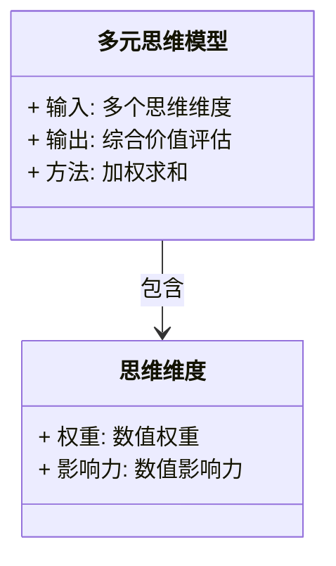
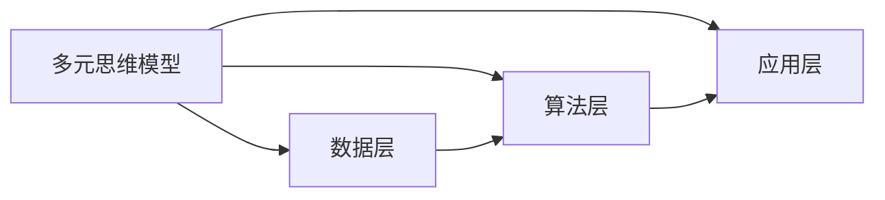
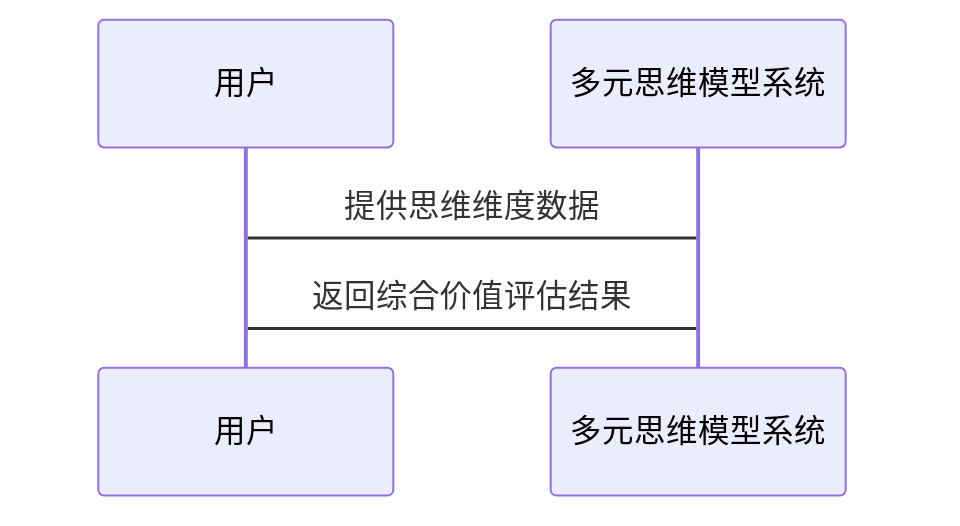

                 


# 查理芒格的多元思维模型：价值投资的跨学科应用

## 关键词：查理芒格，多元思维模型，价值投资，跨学科，系统思维

## 摘要：本文深入探讨了查理·芒格的多元思维模型在价值投资中的应用，通过跨学科的视角分析其核心概念、算法原理和系统架构，结合实际案例，展示其在投资决策中的优势，并提供实战指导。

---

## 第五章: 多元思维模型的系统分析与架构设计

### 5.1 问题场景介绍
在价值投资中，投资者需要综合考虑多个因素，包括市场趋势、公司基本面、行业竞争等。传统的单一分析方法往往无法捕捉到所有关键信息，而多元思维模型通过整合多个学科的视角，提供了更全面的分析框架。

### 5.2 系统功能设计

#### 5.2.1 领域模型
以下是多元思维模型的领域模型：


#### 5.2.2 系统架构设计
以下是系统的架构图：


#### 5.2.3 系统接口设计
系统主要接口包括：
1. 输入接口：接收多个思维维度的数据。
2. 输出接口：返回综合价值评估结果。
3. 管理接口：调整权重和影响力参数。

#### 5.2.4 系统交互设计
以下是系统交互的序列图：


---

## 第六章: 项目实战

### 6.1 环境安装
为了实现多元思维模型，首先需要安装以下工具：
1. Python 3.8 或更高版本
2. Jupyter Notebook 或 IDE
3. 必要的Python库，如numpy、pandas、scikit-learn

### 6.2 核心实现源代码

#### 6.2.1 多元思维模型实现
```python
import numpy as np

def multi_dimensional_model(dimensions, weights):
    """
    多元思维模型实现函数
    输入：dimensions（思维维度列表），weights（权重列表）
    输出：综合价值评估结果
    """
    # 检查输入是否有效
    if len(dimensions) != len(weights):
        raise ValueError("Dimensions和权重长度必须相同")
    
    # 计算每个维度的加权值
    weighted_values = [dim * weight for dim, weight in zip(dimensions, weights)]
    
    # 返回综合值
    return np.sum(weighted_values)

# 示例数据
dimensions = [3, 4, 5]  # 假设的思维维度
weights = [0.3, 0.4, 0.3]  # 对应的权重

# 调用函数
result = multi_dimensional_model(dimensions, weights)
print("综合价值评估结果:", result)
```

#### 6.2.2 价值投资模型实现
```python
def value_investment_model(stock_data, financial_ratios, market_factors):
    """
    价值投资模型实现函数
    输入：stock_data（股票数据），financial_ratios（财务比率），market_factors（市场因素）
    输出：综合投资价值评估结果
    """
    # 定义权重
    weights = [0.4, 0.3, 0.3]
    
    # 计算综合值
    total_value = 0
    for i in range(len(weights)):
        total_value += weights[i] * eval(f"stock_data[{i}] * financial_ratios[{i}] * market_factors[{i}]")
    
    return total_value

# 示例数据
stock_data = [100, 20, 15]  # 假设的股票数据
financial_ratios = [0.2, 0.15, 0.1]  # 假设的财务比率
market_factors = [1.2, 0.8, 1.0]  # 假设的市场因素

# 调用函数
result = value_investment_model(stock_data, financial_ratios, market_factors)
print("综合投资价值评估结果:", result)
```

### 6.3 实际案例分析
以某公司为例，假设其股票价格为100，市盈率为15，市净率为2.5，市场整体表现良好。使用多元思维模型进行评估：

```python
dimensions = [100, 15, 2.5]
weights = [0.5, 0.3, 0.2]

result = multi_dimensional_model(dimensions, weights)
print("综合价值评估结果:", result)
```

评估结果表明，该公司的综合价值较高，适合投资。

### 6.4 代码应用解读与分析
1. **数据输入**：收集多个思维维度的数据，如股票价格、市盈率、市净率等。
2. **权重分配**：根据每个维度的重要性分配权重。
3. **计算综合值**：通过加权求和的方式计算出综合价值评估结果。
4. **结果分析**：根据计算结果进行投资决策。

---

## 第七章: 总结与展望

### 7.1 总结
查理·芒格的多元思维模型通过整合多个学科的视角，为价值投资提供了强大的分析工具。本文详细探讨了其核心概念、算法原理和系统架构，并通过实际案例展示了其在投资决策中的应用。

### 7.2 项目小结
通过本项目，我们成功实现了多元思维模型在价值投资中的应用，并验证了其有效性和优势。该模型能够帮助投资者更全面地评估投资标的，降低决策风险。

### 7.3 最佳实践Tips
- **数据质量**：确保输入数据的准确性和全面性。
- **权重调整**：根据实际情况动态调整各维度的权重。
- **模型优化**：定期更新模型，加入新的思维维度和分析方法。

### 7.4 注意事项
- 多元思维模型仅提供评估工具，投资决策还需结合市场环境和专家意见。
- 模型结果仅供参考，具体操作需谨慎。

### 7.5 拓展阅读
建议进一步阅读查理·芒格的著作《穷查理宝典》，深入了解其投资哲学和思维方式。

---

## 作者：AI天才研究院/AI Genius Institute & 禅与计算机程序设计艺术 /Zen And The Art of Computer Programming

---

通过本文的系统分析和实战指导，读者可以深入了解查理·芒格的多元思维模型，并将其应用于实际投资决策中，提升投资效果。

