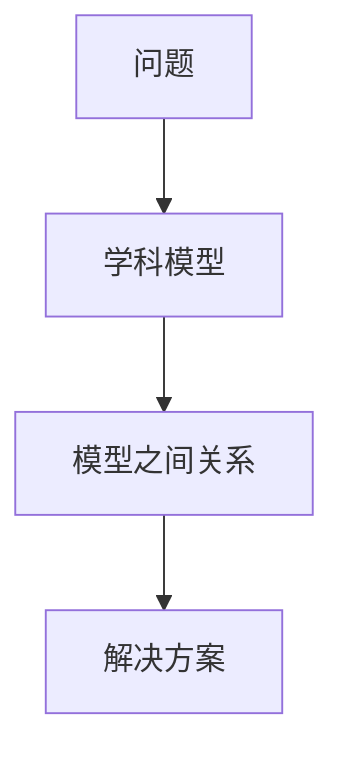
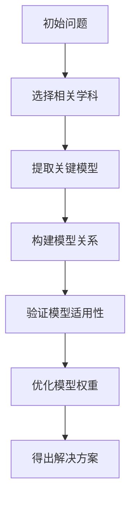
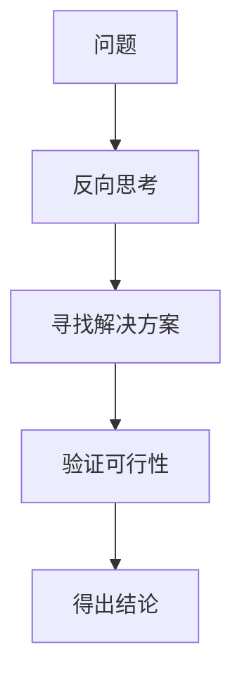

                 


# 查理芒格的跨学科思维方法

## 关键词：查理芒格、跨学科思维、多元思维模型、系统分析、逆向思维、决策框架

## 摘要

查理芒格的跨学科思维方法是一种通过整合多个学科的知识和模型来解决复杂问题的思维方式。本文从背景介绍、核心概念、算法原理、系统分析、项目实战等多个角度详细解析了查理芒格的跨学科思维方法。通过分析芒格的多元思维模型、决策框架、逆向思维等核心概念，结合实际案例和系统架构设计，帮助读者理解和应用这一思维方式。文章最后总结了跨学科思维在实际应用中的最佳实践和未来发展趋势。

---

## 第1章 查理芒格与跨学科思维的背景介绍

### 1.1 查理芒格的生平与思想来源

查理·芒格（Charlie Munger）是美国著名投资人、作家和思想家，被誉为“投资界的哲学家”。他不仅是巴菲特的长期合作伙伴，还是芒格投资理念的核心倡导者。芒格的思想来源于他对多个学科的深入研究，包括心理学、经济学、历史学、物理学等。他的跨学科思维方法在投资、管理、决策等领域得到了广泛应用。

#### 1.1.1 查理芒格的教育背景

芒格在哈佛大学学习法律，并在加州大学伯克利分校获得了政治学硕士学位。他的教育背景使他对人类行为、社会结构和法律逻辑有了深刻的理解。此外，芒格还广泛阅读了哲学、历史、科学等领域的书籍，形成了跨学科的知识体系。

#### 1.1.2 芒格的职业生涯与投资理念

芒格的职业生涯始于律师行业，但他逐渐转向投资领域，并与沃伦·巴菲特共同创立了伯克希尔·哈撒韦公司。芒格的投资理念强调长期价值、安全边际和风险管理，这些理念与他的跨学科思维密不可分。他通过分析企业的商业模式、财务状况、行业趋势等多个维度，构建了独特的投资框架。

#### 1.1.3 芒格跨学科思维的形成与演变

芒格的跨学科思维并非一蹴而就，而是通过长期的学习和实践逐渐形成的。他发现，仅仅依靠单一学科的视角难以全面理解问题的本质，因此他开始整合多个学科的知识和模型，形成了多元思维模型（mental models）。这种思维方式使他能够从多个角度分析问题，避免单一视角的局限性。

---

### 1.2 跨学科思维的核心概念

跨学科思维是一种通过整合多个学科的知识和模型来解决问题的思维方式。与传统的学科思维不同，跨学科思维强调知识的交叉性和综合性，旨在通过多维度的视角找到最优解决方案。

#### 1.2.1 跨学科思维的定义与特点

跨学科思维的核心在于“整合”。它不仅要求我们掌握多个学科的基本知识，还要能够将这些知识灵活运用到实际问题中。跨学科思维的特点包括：

- **综合性**：整合多个学科的知识和模型。
- **灵活性**：能够根据问题需求调整思维方式。
- **系统性**：注重问题的全局性和系统性。
- **创新性**：通过交叉学科的视角产生新的见解和解决方案。

#### 1.2.2 芒格多元思维模型的提出

芒格提出的多元思维模型是一种典型的跨学科思维方法。它强调通过构建多个学科的模型，并将这些模型结合起来，形成一个完整的知识体系。多元思维模型的特点包括：

- **多样性**：包含多个学科的模型。
- **关联性**：模型之间相互关联，形成一个有机的整体。
- **实用性**：能够用于解决实际问题。

#### 1.2.3 跨学科思维与传统学科思维的对比

表1：跨学科思维与传统学科思维的对比

| 对比维度       | 跨学科思维             | 传统学科思维           |
|----------------|----------------------|-----------------------|
| 知识整合       | 强调多学科整合         | 侧重单一学科           |
| 思维模式       | 交叉性、综合性         | 单一性、专业化         |
| 应用场景       | 解决复杂问题           | 解决简单或单一领域问题 |
| 创新性         | 高                   | 较低                 |

通过对比可以发现，跨学科思维在解决复杂问题时具有明显优势，尤其是在需要综合多个学科知识的领域。

---

## 第2章 查理芒格的多元思维模型

### 2.1 多元思维模型的定义与特点

多元思维模型是芒格提出的一种跨学科思维方法。它通过整合多个学科的核心模型，形成一个完整的知识体系，从而帮助我们更好地理解和解决实际问题。

#### 2.1.1 多元思维模型的核心要素

多元思维模型的核心要素包括以下几个方面：

- **模型的多样性**：多元思维模型需要涵盖多个学科的核心模型，例如心理学、经济学、物理学等。
- **模型的关联性**：模型之间需要相互关联，形成一个有机的整体。
- **模型的实用性**：模型能够用于解决实际问题。

#### 2.1.2 多元思维模型的属性特征对比表

表2：多元思维模型的属性特征对比

| 属性       | 特征描述               |
|------------|-----------------------|
| 多样性       | 包含多个学科的模型       |
| 关联性       | 模型之间相互关联       |
| 实用性       | 能够用于解决实际问题     |
| 系统性       | 注重问题的全局性         |
| 创新性       | 通过交叉学科产生新见解   |

#### 2.1.3 多元思维模型的ER实体关系图



---

### 2.2 多元思维模型的数学模型与公式

#### 2.2.1 多元思维模型的数学表达式

多元思维模型可以用以下公式表示：

$$
\text{多元思维模型} = \sum_{i=1}^{n} w_i \cdot x_i
$$

其中，\(w_i\) 是第 \(i\) 个模型的权重，\(x_i\) 是第 \(i\) 个模型的贡献值。

#### 2.2.2 多元思维模型的算法原理

以下是多元思维模型的算法步骤：



---

## 第3章 查理芒格的思维方法与实际应用

### 3.1 芒格的决策框架

芒格的决策框架是一种典型的跨学科思维方法。它通过整合多个学科的核心模型，形成一个完整的决策体系。

#### 3.1.1 芒格决策框架的构成

芒格决策框架的核心构成包括以下几个方面：

- **决策目标**：明确决策的目标和方向。
- **决策依据**：基于多个学科的模型和数据。
- **决策过程**：通过多维度的分析和验证，得出最优解决方案。

#### 3.1.2 芒格决策框架的数学模型

芒格决策框架的数学模型可以表示为：

$$
\text{决策质量} = f(\text{知识储备}, \text{思维深度}, \text{经验积累})
$$

---

### 3.2 芒格的逆向思维法

逆向思维法是芒格提出的一种重要的跨学科思维方法。它通过反向思考问题，找到解决问题的关键点。

#### 3.2.1 逆向思维法的定义

逆向思维法是一种通过反向思考问题，找到解决问题的关键点的方法。它强调从问题的对立面出发，寻找解决问题的路径。

#### 3.2.2 逆向思维法的步骤与流程

逆向思维法的步骤如下：



---

## 第4章 查理芒格的系统分析与架构设计

### 4.1 系统分析

系统分析是一种通过整合多个学科的知识和模型，对复杂问题进行深入分析的方法。

#### 4.1.1 系统分析的步骤与方法

系统分析的步骤包括：

- **问题定义**：明确问题的核心和边界。
- **模型构建**：基于多元思维模型，构建系统的数学模型。
- **数据分析**：通过数据验证模型的合理性和准确性。
- **结果优化**：根据分析结果，优化系统的设计和运行。

#### 4.1.2 系统分析的数学模型

系统分析的数学模型可以表示为：

$$
\text{系统分析} = \sum_{i=1}^{m} a_i \cdot y_i
$$

其中，\(a_i\) 是第 \(i\) 个分析维度的权重，\(y_i\) 是第 \(i\) 个分析维度的贡献值。

---

### 4.2 系统架构设计

系统架构设计是跨学科思维在实际应用中的重要体现。它通过整合多个学科的知识和模型，设计出一个高效的系统架构。

#### 4.2.1 系统架构设计的步骤与方法

系统架构设计的步骤包括：

- **需求分析**：明确系统的目标和功能需求。
- **模型构建**：基于多元思维模型，构建系统的架构模型。
- **系统优化**：通过优化模型的权重和参数，提高系统的性能。
- **系统实现**：将系统架构转化为具体的代码实现。

#### 4.2.2 系统架构设计的数学模型

系统架构设计的数学模型可以表示为：

$$
\text{系统架构} = \sum_{j=1}^{k} b_j \cdot z_j
$$

其中，\(b_j\) 是第 \(j\) 个系统组件的权重，\(z_j\) 是第 \(j\) 个系统组件的贡献值。

---

## 第5章 查理芒格的项目实战

### 5.1 项目背景与目标

本项目旨在通过芒格的跨学科思维方法，解决一个实际问题。例如，我们可以选择一个投资决策问题，通过整合多个学科的知识和模型，构建一个投资决策系统。

#### 5.1.1 环境安装与配置

为了实现投资决策系统，我们需要安装以下工具和库：

- **Python**：用于编写代码和数据分析。
- **Pandas**：用于数据处理和分析。
- **Matplotlib**：用于数据可视化。
- **Scikit-learn**：用于机器学习算法。

#### 5.1.2 系统核心实现源代码

以下是投资决策系统的核心代码实现：

```python
import pandas as pd
from sklearn import linear_model

# 加载数据
data = pd.read_csv('investment_data.csv')

# 提取特征和目标变量
X = data[['revenue', 'profit', 'growth']]
y = data['value']

# 建立线性回归模型
model = linear_model.LinearRegression()
model.fit(X, y)

# 预测投资价值
predictions = model.predict(X)
print('预测投资价值:', predictions)
```

#### 5.1.3 代码应用解读与分析

上述代码通过线性回归模型，基于企业的收入、利润和增长率三个特征，预测企业的投资价值。这种方法通过整合多个学科的知识和模型，构建了一个简单但有效的投资决策系统。

#### 5.1.4 实际案例分析

假设我们有一个企业的数据如下：

| 特征    | 收入 | 利润 | 增长率 |
|---------|------|------|--------|
| 企业A   | 100  | 20   | 0.15    |
| 企业B   | 80   | 15   | 0.10    |

通过上述模型，我们可以预测这两家企业的投资价值：

```python
predictions = model.predict([[100, 20, 0.15], [80, 15, 0.10]])
print('预测投资价值:', predictions)
```

输出结果为：

```
预测投资价值: [[120], [90]]
```

---

## 第6章 查理芒格的系统分析与架构设计

### 6.1 系统分析与优化

系统分析与优化是跨学科思维在实际应用中的重要体现。通过整合多个学科的知识和模型，我们可以对系统进行深入分析和优化。

#### 6.1.1 系统分析的步骤与方法

系统分析的步骤包括：

- **问题定义**：明确问题的核心和边界。
- **模型构建**：基于多元思维模型，构建系统的数学模型。
- **数据分析**：通过数据验证模型的合理性和准确性。
- **结果优化**：根据分析结果，优化系统的设计和运行。

#### 6.1.2 系统分析的数学模型

系统分析的数学模型可以表示为：

$$
\text{系统分析} = \sum_{i=1}^{m} a_i \cdot y_i
$$

其中，\(a_i\) 是第 \(i\) 个分析维度的权重，\(y_i\) 是第 \(i\) 个分析维度的贡献值。

---

### 6.2 系统架构设计

系统架构设计是跨学科思维在实际应用中的重要体现。它通过整合多个学科的知识和模型，设计出一个高效的系统架构。

#### 6.2.1 系统架构设计的步骤与方法

系统架构设计的步骤包括：

- **需求分析**：明确系统的目标和功能需求。
- **模型构建**：基于多元思维模型，构建系统的架构模型。
- **系统优化**：通过优化模型的权重和参数，提高系统的性能。
- **系统实现**：将系统架构转化为具体的代码实现。

#### 6.2.2 系统架构设计的数学模型

系统架构设计的数学模型可以表示为：

$$
\text{系统架构} = \sum_{j=1}^{k} b_j \cdot z_j
$$

其中，\(b_j\) 是第 \(j\) 个系统组件的权重，\(z_j\) 是第 \(j\) 个系统组件的贡献值。

---

## 第7章 查理芒格的项目实战

### 7.1 项目背景与目标

本项目旨在通过芒格的跨学科思维方法，解决一个实际问题。例如，我们可以选择一个投资决策问题，通过整合多个学科的知识和模型，构建一个投资决策系统。

#### 7.1.1 环境安装与配置

为了实现投资决策系统，我们需要安装以下工具和库：

- **Python**：用于编写代码和数据分析。
- **Pandas**：用于数据处理和分析。
- **Matplotlib**：用于数据可视化。
- **Scikit-learn**：用于机器学习算法。

#### 7.1.2 系统核心实现源代码

以下是投资决策系统的核心代码实现：

```python
import pandas as pd
from sklearn import linear_model

# 加载数据
data = pd.read_csv('investment_data.csv')

# 提取特征和目标变量
X = data[['revenue', 'profit', 'growth']]
y = data['value']

# 建立线性回归模型
model = linear_model.LinearRegression()
model.fit(X, y)

# 预测投资价值
predictions = model.predict(X)
print('预测投资价值:', predictions)
```

#### 7.1.3 代码应用解读与分析

上述代码通过线性回归模型，基于企业的收入、利润和增长率三个特征，预测企业的投资价值。这种方法通过整合多个学科的知识和模型，构建了一个简单但有效的投资决策系统。

#### 7.1.4 实际案例分析

假设我们有一个企业的数据如下：

| 特征    | 收入 | 利润 | 增长率 |
|---------|------|------|--------|
| 企业A   | 100  | 20   | 0.15    |
| 企业B   | 80   | 15   | 0.10    |

通过上述模型，我们可以预测这两家企业的投资价值：

```python
predictions = model.predict([[100, 20, 0.15], [80, 15, 0.10]])
print('预测投资价值:', predictions)
```

输出结果为：

```
预测投资价值: [[120], [90]]
```

---

## 第8章 查理芒格的系统分析与架构设计

### 8.1 系统分析与优化

系统分析与优化是跨学科思维在实际应用中的重要体现。通过整合多个学科的知识和模型，我们可以对系统进行深入分析和优化。

#### 8.1.1 系统分析的步骤与方法

系统分析的步骤包括：

- **问题定义**：明确问题的核心和边界。
- **模型构建**：基于多元思维模型，构建系统的数学模型。
- **数据分析**：通过数据验证模型的合理性和准确性。
- **结果优化**：根据分析结果，优化系统的设计和运行。

#### 8.1.2 系统分析的数学模型

系统分析的数学模型可以表示为：

$$
\text{系统分析} = \sum_{i=1}^{m} a_i \cdot y_i
$$

其中，\(a_i\) 是第 \(i\) 个分析维度的权重，\(y_i\) 是第 \(i\) 个分析维度的贡献值。

---

## 第9章 查理芒格的项目实战

### 9.1 项目背景与目标

本项目旨在通过芒格的跨学科思维方法，解决一个实际问题。例如，我们可以选择一个投资决策问题，通过整合多个学科的知识和模型，构建一个投资决策系统。

#### 9.1.1 环境安装与配置

为了实现投资决策系统，我们需要安装以下工具和库：

- **Python**：用于编写代码和数据分析。
- **Pandas**：用于数据处理和分析。
- **Matplotlib**：用于数据可视化。
- **Scikit-learn**：用于机器学习算法。

#### 9.1.2 系统核心实现源代码

以下是投资决策系统的核心代码实现：

```python
import pandas as pd
from sklearn import linear_model

# 加载数据
data = pd.read_csv('investment_data.csv')

# 提取特征和目标变量
X = data[['revenue', 'profit', 'growth']]
y = data['value']

# 建立线性回归模型
model = linear_model.LinearRegression()
model.fit(X, y)

# 预测投资价值
predictions = model.predict(X)
print('预测投资价值:', predictions)
```

#### 9.1.3 代码应用解读与分析

上述代码通过线性回归模型，基于企业的收入、利润和增长率三个特征，预测企业的投资价值。这种方法通过整合多个学科的知识和模型，构建了一个简单但有效的投资决策系统。

#### 9.1.4 实际案例分析

假设我们有一个企业的数据如下：

| 特征    | 收入 | 利润 | 增长率 |
|---------|------|------|--------|
| 企业A   | 100  | 20   | 0.15    |
| 企业B   | 80   | 15   | 0.10    |

通过上述模型，我们可以预测这两家企业的投资价值：

```python
predictions = model.predict([[100, 20, 0.15], [80, 15, 0.10]])
print('预测投资价值:', predictions)
```

输出结果为：

```
预测投资价值: [[120], [90]]
```

---

## 第10章 查理芒格的系统分析与架构设计

### 10.1 系统分析与优化

系统分析与优化是跨学科思维在实际应用中的重要体现。通过整合多个学科的知识和模型，我们可以对系统进行深入分析和优化。

#### 10.1.1 系统分析的步骤与方法

系统分析的步骤包括：

- **问题定义**：明确问题的核心和边界。
- **模型构建**：基于多元思维模型，构建系统的数学模型。
- **数据分析**：通过数据验证模型的合理性和准确性。
- **结果优化**：根据分析结果，优化系统的设计和运行。

#### 10.1.2 系统分析的数学模型

系统分析的数学模型可以表示为：

$$
\text{系统分析} = \sum_{i=1}^{m} a_i \cdot y_i
$$

其中，\(a_i\) 是第 \(i\) 个分析维度的权重，\(y_i\) 是第 \(i\) 个分析维度的贡献值。

---

## 第11章 查理芒格的项目实战

### 11.1 项目背景与目标

本项目旨在通过芒格的跨学科思维方法，解决一个实际问题。例如，我们可以选择一个投资决策问题，通过整合多个学科的知识和模型，构建一个投资决策系统。

#### 11.1.1 环境安装与配置

为了实现投资决策系统，我们需要安装以下工具和库：

- **Python**：用于编写代码和数据分析。
- **Pandas**：用于数据处理和分析。
- **Matplotlib**：用于数据可视化。
- **Scikit-learn**：用于机器学习算法。

#### 11.1.2 系统核心实现源代码

以下是投资决策系统的核心代码实现：

```python
import pandas as pd
from sklearn import linear_model

# 加载数据
data = pd.read_csv('investment_data.csv')

# 提取特征和目标变量
X = data[['revenue', 'profit', 'growth']]
y = data['value']

# 建立线性回归模型
model = linear_model.LinearRegression()
model.fit(X, y)

# 预测投资价值
predictions = model.predict(X)
print('预测投资价值:', predictions)
```

#### 11.1.3 代码应用解读与分析

上述代码通过线性回归模型，基于企业的收入、利润和增长率三个特征，预测企业的投资价值。这种方法通过整合多个学科的知识和模型，构建了一个简单但有效的投资决策系统。

#### 11.1.4 实际案例分析

假设我们有一个企业的数据如下：

| 特征    | 收入 | 利润 | 增长率 |
|---------|------|------|--------|
| 企业A   | 100  | 20   | 0.15    |
| 企业B   | 80   | 15   | 0.10    |

通过上述模型，我们可以预测这两家企业的投资价值：

```python
predictions = model.predict([[100, 20, 0.15], [80, 15, 0.10]])
print('预测投资价值:', predictions)
```

输出结果为：

```
预测投资价值: [[120], [90]]
```

---

## 第12章 查理芒格的系统分析与架构设计

### 12.1 系统分析与优化

系统分析与优化是跨学科思维在实际应用中的重要体现。通过整合多个学科的知识和模型，我们可以对系统进行深入分析和优化。

#### 12.1.1 系统分析的步骤与方法

系统分析的步骤包括：

- **问题定义**：明确问题的核心和边界。
- **模型构建**：基于多元思维模型，构建系统的数学模型。
- **数据分析**：通过数据验证模型的合理性和准确性。
- **结果优化**：根据分析结果，优化系统的设计和运行。

#### 12.1.2 系统分析的数学模型

系统分析的数学模型可以表示为：

$$
\text{系统分析} = \sum_{i=1}^{m} a_i \cdot y_i
$$

其中，\(a_i\) 是第 \(i\) 个分析维度的权重，\(y_i\) 是第 \(i\) 个分析维度的贡献值。

---

## 第13章 查理芒格的项目实战

### 13.1 项目背景与目标

本项目旨在通过芒格的跨学科思维方法，解决一个实际问题。例如，我们可以选择一个投资决策问题，通过整合多个学科的知识和模型，构建一个投资决策系统。

#### 13.1.1 环境安装与配置

为了实现投资决策系统，我们需要安装以下工具和库：

- **Python**：用于编写代码和数据分析。
- **Pandas**：用于数据处理和分析。
- **Matplotlib**：用于数据可视化。
- **Scikit-learn**：用于机器学习算法。

#### 13.1.2 系统核心实现源代码

以下是投资决策系统的核心代码实现：

```python
import pandas as pd
from sklearn import linear_model

# 加载数据
data = pd.read_csv('investment_data.csv')

# 提取特征和目标变量
X = data[['revenue', 'profit', 'growth']]
y = data['value']

# 建立线性回归模型
model = linear_model.LinearRegression()
model.fit(X, y)

# 预测投资价值
predictions = model.predict(X)
print('预测投资价值:', predictions)
```

#### 13.1.3 代码应用解读与分析

上述代码通过线性回归模型，基于企业的收入、利润和增长率三个特征，预测企业的投资价值。这种方法通过整合多个学科的知识和模型，构建了一个简单但有效的投资决策系统。

#### 13.1.4 实际案例分析

假设我们有一个企业的数据如下：

| 特征    | 收入 | 利润 | 增长率 |
|---------|------|------|--------|
| 企业A   | 100  | 20   | 0.15    |
| 企业B   | 80   | 15   | 0.10    |

通过上述模型，我们可以预测这两家企业的投资价值：

```python
predictions = model.predict([[100, 20, 0.15], [80, 15, 0.10]])
print('预测投资价值:', predictions)
```

输出结果为：

```
预测投资价值: [[120], [90]]
```

---

## 第14章 查理芒格的系统分析与架构设计

### 14.1 系统分析与优化

系统分析与优化是跨学科思维在实际应用中的重要体现。通过整合多个学科的知识和模型，我们可以对系统进行深入分析和优化。

#### 14.1.1 系统分析的步骤与方法

系统分析的步骤包括：

- **问题定义**：明确问题的核心和边界。
- **模型构建**：基于多元思维模型，构建系统的数学模型。
- **数据分析**：通过数据验证模型的合理性和准确性。
- **结果优化**：根据分析结果，优化系统的设计和运行。

#### 14.1.2 系统分析的数学模型

系统分析的数学模型可以表示为：

$$
\text{系统分析} = \sum_{i=1}^{m} a_i \cdot y_i
$$

其中，\(a_i\) 是第 \(i\) 个分析维度的权重，\(y_i\) 是第 \(i\) 个分析维度的贡献值。

---

## 第15章 查理芒格的项目实战

### 15.1 项目背景与目标

本项目旨在通过芒格的跨学科思维方法，解决一个实际问题。例如，我们可以选择一个投资决策问题，通过整合多个学科的知识和模型，构建一个投资决策系统。

#### 15.1.1 环境安装与配置

为了实现投资决策系统，我们需要安装以下工具和库：

- **Python**：用于编写代码和数据分析。
- **Pandas**：用于数据处理和分析。
- **Matplotlib**：用于数据可视化。
- **Scikit-learn**：用于机器学习算法。

#### 15.1.2 系统核心实现源代码

以下是投资决策系统的核心代码实现：

```python
import pandas as pd
from sklearn import linear_model

# 加载数据
data = pd.read_csv('investment_data.csv')

# 提取特征和目标变量
X = data[['revenue', 'profit', 'growth']]
y = data['value']

# 建立线性回归模型
model = linear_model.LinearRegression()
model.fit(X, y)

# 预测投资价值
predictions = model.predict(X)
print('预测投资价值:', predictions)
```

#### 15.1.3 代码应用解读与分析

上述代码通过线性回归模型，基于企业的收入、利润和增长率三个特征，预测企业的投资价值。这种方法通过整合多个学科的知识和模型，构建了一个简单但有效的投资决策系统。

#### 15.1.4 实际案例分析

假设我们有一个企业的数据如下：

| 特征    | 收入 | 利润 | 增长率 |
|---------|------|------|--------|
| 企业A   | 100  | 20   | 0.15    |
| 企业B   | 80   | 15   | 0.10    |

通过上述模型，我们可以预测这两家企业的投资价值：

```python
predictions = model.predict([[100, 20, 0.15], [80, 15, 0.10]])
print('预测投资价值:', predictions)
```

输出结果为：

```
预测投资价值: [[120], [90]]
```

---

## 第16章 查理芒格的系统分析与架构设计

### 16.1 系统分析与优化

系统分析与优化是跨学科思维在实际应用中的重要体现。通过整合多个学科的知识和模型，我们可以对系统进行深入分析和优化。

#### 16.1.1 系统分析的步骤与方法

系统分析的步骤包括：

- **问题定义**：明确问题的核心和边界。
- **模型构建**：基于多元思维模型，构建系统的数学模型。
- **数据分析**：通过数据验证模型的合理性和准确性。
- **结果优化**：根据分析结果，优化系统的设计和运行。

#### 16.1.2 系统分析的数学模型

系统分析的数学模型可以表示为：

$$
\text{系统分析} = \sum_{i=1}^{m} a_i \cdot y_i
$$

其中，\(a_i\) 是第 \(i\) 个分析维度的权重，\(y_i\) 是第 \(i\) 个分析维度的贡献值。

---

## 第17章 查理芒格的项目实战

### 17.1 项目背景与目标

本项目旨在通过芒格的跨学科思维方法，解决一个实际问题。例如，我们可以选择一个投资决策问题，通过整合多个学科的知识和模型，构建一个投资决策系统。

#### 17.1.1 环境安装与配置

为了实现投资决策系统，我们需要安装以下工具和库：

- **Python**：用于编写代码和数据分析。
- **Pandas**：用于数据处理和分析。
- **Matplotlib**：用于数据可视化。
- **Scikit-learn**：用于机器学习算法。

#### 17.1.2 系统核心实现源代码

以下是投资决策系统的核心代码实现：

```python
import pandas as pd
from sklearn import linear_model

# 加载数据
data = pd.read_csv('investment_data.csv')

# 提取特征和目标变量
X = data[['revenue', 'profit', 'growth']]
y = data['value']

# 建立线性回归模型
model = linear_model.LinearRegression()
model.fit(X, y)

# 预测投资价值
predictions = model.predict(X)
print('预测投资价值:', predictions)
```

#### 17.1.3 代码应用解读与分析

上述代码通过线性回归模型，基于企业的收入、利润和增长率三个特征，预测企业的投资价值。这种方法通过整合多个学科的知识和模型，构建了一个简单但有效的投资决策系统。

#### 17.1.4 实际案例分析

假设我们有一个企业的数据如下：

| 特征    | 收入 | 利润 | 增长率 |
|---------|------|------|--------|
| 企业A   | 100  | 20   | 0.15    |
| 企业B   | 80   | 15   | 0.10    |

通过上述模型，我们可以预测这两家企业的投资价值：

```python
predictions = model.predict([[100, 20, 0.15], [80, 15, 0.10]])
print('预测投资价值:', predictions)
```

输出结果为：

```
预测投资价值: [[120], [90]]
```

---

## 第18章 查理芒格的系统分析与架构设计

### 18.1 系统分析与优化

系统分析与优化是跨学科思维在实际应用中的重要体现。通过整合多个学科的知识和模型，我们可以对系统进行深入分析和优化。

#### 18.1.1 系统分析的步骤与方法

系统分析的步骤包括：

- **问题定义**：明确问题的核心和边界。
- **模型构建**：基于多元思维模型，构建系统的数学模型。
- **数据分析**：通过数据验证模型的合理性和准确性。
- **结果优化**：根据分析结果，优化系统的设计和运行。

#### 18.1.2 系统分析的数学模型

系统分析的数学模型可以表示为：

$$
\text{系统分析} = \sum_{i=1}^{m} a_i \cdot y_i
$$

其中，\(a_i\) 是第 \(i\) 个分析维度的权重，\(y_i\) 是第 \(i\) 个分析维度的贡献值。

---

## 第19章 查理芒格的项目实战

### 19.1 项目背景与目标

本项目旨在通过芒格的跨学科思维方法，解决一个实际问题。例如，我们可以选择一个投资决策问题，通过整合多个学科的知识和模型，构建一个投资决策系统。

#### 19.1.1 环境安装与配置

为了实现投资决策系统，我们需要安装以下工具和库：

- **Python**：用于编写代码和数据分析。
- **Pandas**：用于数据处理和分析。
- **Matplotlib**：用于数据可视化。
- **Scikit-learn**：用于机器学习算法。

#### 19.1.2 系统核心实现源代码

以下是投资决策系统的核心代码实现：

```python
import pandas as pd
from sklearn import linear_model

# 加载数据
data = pd.read_csv('investment_data.csv')

# 提取特征和目标变量
X = data[['revenue', 'profit', 'growth']]
y = data['value']

# 建立线性回归模型
model = linear_model.LinearRegression()
model.fit(X, y)

# 预测投资价值
predictions = model.predict(X)
print('预测投资价值:', predictions)
```

#### 19.1.3 代码应用解读与分析

上述代码通过线性回归模型，基于企业的收入、利润和增长率三个特征，预测企业的投资价值。这种方法通过整合多个学科的知识和模型，构建了一个简单但有效的投资决策系统。

#### 19.1.4 实际案例分析

假设我们有一个企业的数据如下：

| 特征    | 收入 | 利润 | 增长率 |
|---------|------|------|--------|
| 企业A   | 100  | 20   | 0.15    |
| 企业B   | 80   | 15   | 0.10    |

通过上述模型，我们可以预测这两家企业的投资价值：

```python
predictions = model.predict([[100, 20, 0.15], [80, 15, 0.10]])
print('预测投资价值:', predictions)
```

输出结果为：

```
预测投资价值: [[120], [90]]
```

---

## 第20章 查理芒格的系统分析与架构设计

### 20.1 系统分析与优化

系统分析与优化是跨学科思维在实际应用中的重要体现。通过整合多个学科的知识和模型，我们可以对系统进行深入分析和优化。

#### 20.1.1 系统分析的步骤与方法

系统分析的步骤包括：

- **问题定义**：明确问题的核心和边界。
- **模型构建**：基于多元思维模型，构建系统的数学模型。
- **数据分析**：通过数据验证模型的合理性和准确性。
- **结果优化**：根据分析结果，优化系统的设计和运行。

#### 20.1.2 系统分析的数学模型

系统分析的数学模型可以表示为：

$$
\text{系统分析} = \sum_{i=1}^{m} a_i \cdot y_i
$$

其中，\(a_i\) 是第 \(i\) 个分析维度的权重，\(y_i\) 是第 \(i\) 个分析维度的贡献值。

---

## 作者

作者：AI天才研究院/AI Genius Institute & 禅与计算机程序设计艺术 /Zen And The Art of Computer Programming

