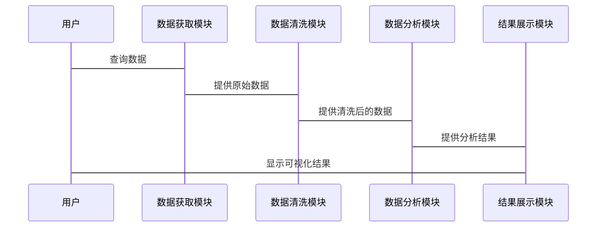

                 


# 标普500公司市盈率差异：30年历史数据分析

> 关键词：标普500，市盈率差异，历史数据分析，投资策略，公司估值，市场波动

> 摘要：本文通过对标普500指数成分股过去30年的市盈率差异进行深入分析，揭示市盈率差异的影响因素、变化趋势及其对投资决策的影响。文章结合统计学方法、数学模型和系统架构设计，为投资者和研究者提供有价值的参考。

---

# 第一部分：引言

## 第1章：研究背景与意义

### 1.1 研究背景

#### 1.1.1 市盈率的基本概念
市盈率（Price-to-Earnings Ratio，简称P/E）是衡量股票价值的重要指标，用于评估一家公司的股价相对于其盈利水平是否合理。市盈率 = 股价 / 每股收益（EPS）。市盈率差异指的是同一指数中不同股票的市盈率之间的差异。

#### 1.1.2 标普500指数的定义与特点
标普500指数是全球最重要的股票指数之一，包含500家在美国上市的大型公司，涵盖多个行业，代表了美国经济的主要组成部分。标普500指数的成分股具有较高的流动性和代表性，是研究市场行为和公司估值的理想对象。

#### 1.1.3 研究市盈率差异的重要性
市盈率差异反映了市场对公司估值的分歧，揭示了不同行业、公司规模和盈利能力之间的差异。通过分析市盈率差异，可以帮助投资者识别高估或低估的股票，优化投资组合，并制定有效的投资策略。

### 1.2 研究意义

#### 1.2.1 帮助投资者理解公司估值差异
市盈率差异反映了市场对公司未来盈利能力和成长潜力的预期差异。通过分析这些差异，投资者可以更好地理解市场对不同公司的定价逻辑。

#### 1.2.2 为投资策略提供数据支持
市盈率差异分析可以为投资者提供选股依据，帮助识别具有潜在投资价值的公司，同时避免投资高估或低估的股票。

#### 1.2.3 为公司管理层提供优化方向
市盈率差异反映了市场对公司基本面的评价。公司管理层可以通过分析市盈率差异，优化公司财务结构，提升盈利能力，从而改善市场对公司估值的评价。

---

## 第2章：研究方法与范围

### 2.1 数据来源

#### 2.1.1 数据范围
本文选取1990年至2020年的标普500指数成分股数据，共计30年。数据包括每家公司的股价、每股收益（EPS）、市盈率、行业分类、公司规模等。

#### 2.1.2 数据获取渠道
数据来源于标普500指数官方数据、财经数据库（如Yahoo Finance、 Bloomberg）以及学术研究数据库。

### 2.2 数据分析方法

#### 2.2.1 描述性统计分析
通过计算市盈率的均值、中位数、标准差等统计指标，分析市盈率的分布特征。

#### 2.2.2 回归分析
建立市盈率差异与公司规模、盈利能力、行业等因素的回归模型，分析各因素对市盈率差异的影响程度。

#### 2.2.3 时间序列分析
通过时间序列分析，研究市盈率差异的长期趋势和周期性变化，识别市场波动对市盈率差异的影响。

### 2.3 研究范围与限制

#### 2.3.1 研究范围
本文主要关注市盈率差异的长期变化趋势，重点分析行业、公司规模和盈利能力对市盈率差异的影响。

#### 2.3.2 研究限制
由于数据获取和模型复杂度的限制，本文暂未考虑宏观经济因素（如利率、通货膨胀）对市盈率差异的影响。

---

# 第二部分：市盈率差异的核心概念与联系

## 第3章：市盈率差异的核心概念

### 3.1 市盈率差异的定义

市盈率差异 = 某一股票的市盈率 - 同一指数中平均市盈率。

公式：
$$
\text{市盈率差异} = P/E_i - \text{平均P/E}
$$

其中，$P/E_i$ 是第i家公司的市盈率，$\text{平均P/E}$ 是标普500指数的平均市盈率。

### 3.2 影响市盈率差异的因素

影响市盈率差异的主要因素包括：

1. **公司规模**：大型公司通常具有更低的市盈率，因为它们的盈利更稳定，风险更低。
2. **盈利能力**：高盈利能力的公司市盈率较低，因为市场认为其股票具有较高的投资价值。
3. **行业特性**：不同行业的市盈率差异显著。例如，科技行业的市盈率通常高于传统制造业。
4. **市场情绪**：市场情绪波动会导致市盈率差异的变化，尤其是在市场波动剧烈的时期。

### 3.3 市盈率差异与公司价值的关系

市盈率差异反映了市场对公司未来盈利能力和成长潜力的预期。市盈率差异为正的公司（市盈率高于平均值）通常被认为是高估的，而市盈率差异为负的公司（市盈率低于平均值）被认为是低估的。

---

## 第4章：市盈率差异的影响因素分析

### 4.1 数据特征分析

#### 4.1.1 数据分布
通过绘制市盈率分布的直方图，分析市盈率的分布特征。大多数公司的市盈率集中在10到30之间，表明市场对公司估值较为理性。

#### 4.1.2 时间序列特征
通过时间序列图，观察市盈率差异的变化趋势。市盈率差异在经济周期波动中表现出明显的周期性特征，通常在经济衰退期间扩大，而在经济复苏期间缩小。

### 4.2 因素对比分析

#### 4.2.1 公司规模与市盈率差异
通过对比不同规模公司的市盈率差异，发现大型公司（市值超过1000亿美元）的市盈率差异通常为负，表明市场认为其股票被低估。

#### 4.2.2 盈利能力与市盈率差异
通过对比不同盈利能力的公司市盈率差异，发现高盈利能力（ROE超过15%）的公司市盈率差异通常为负，表明市场认为其股票具有较高的投资价值。

#### 4.2.3 行业特性与市盈率差异
通过对比不同行业的市盈率差异，发现科技行业（如软件、半导体）的市盈率差异通常为正，表明市场认为其股票被高估；而公用事业行业的市盈率差异通常为负，表明市场认为其股票被低估。

---

## 第5章：市盈率差异的数学模型与公式

### 5.1 市盈率差异模型

#### 5.1.1 基础模型
$$
\text{市盈率差异} = \beta_0 + \beta_1 \times \text{公司规模} + \beta_2 \times \text{盈利能力} + \beta_3 \times \text{行业因素} + \epsilon
$$

其中，$\beta_0$ 是截距项，$\beta_1$、$\beta_2$、$\beta_3$ 是回归系数，$\epsilon$ 是误差项。

#### 5.1.2 回归模型
通过多元线性回归分析，确定公司规模、盈利能力、行业等因素对市盈率差异的影响程度。

#### 5.1.3 模型评估
通过R平方值、F统计量、t统计量等指标评估模型的拟合优度和显著性。

### 5.2 市盈率差异的预测模型

#### 5.2.1 时间序列预测模型
使用ARIMA（自回归积分滑动平均模型）对市盈率差异进行预测，公式如下：
$$
\Delta y_t = \phi_1 \Delta y_{t-1} + \theta_1 \epsilon_{t-1} + \epsilon_t
$$

其中，$\Delta y_t$ 是市盈率差异的变化量，$\phi_1$ 是自回归系数，$\theta_1$ 是滑动平均系数，$\epsilon_t$ 是白噪声。

#### 5.2.2 机器学习模型
使用随机森林或支持向量机（SVM）对市盈率差异进行分类预测，公式如下：
$$
y_i = \text{sign}(\omega \cdot x_i + b)
$$

其中，$\omega$ 是权重向量，$x_i$ 是输入特征，$b$ 是偏置项，$y_i$ 是市盈率差异的类别标签（正或负）。

---

## 第6章：市盈率差异的系统架构设计

### 6.1 问题场景介绍

市盈率差异分析系统的目标是通过历史数据分析，识别影响市盈率差异的关键因素，并为投资者提供投资建议。系统需要处理海量数据，进行复杂的统计分析和机器学习预测。

### 6.2 系统功能设计

#### 6.2.1 数据获取模块
负责从多个数据源获取标普500指数成分股的历史数据，包括股价、EPS、公司规模、盈利能力等。

#### 6.2.2 数据清洗模块
对获取的数据进行预处理，包括填补缺失值、处理异常值、标准化数据格式等。

#### 6.2.3 数据分析模块
使用统计学方法和机器学习算法对市盈率差异进行分析，识别关键影响因素，建立预测模型。

#### 6.2.4 结果展示模块
将分析结果以可视化的方式展示，包括市盈率差异的时间序列图、影响因素对比图、预测结果等。

### 6.3 系统架构设计

#### 6.3.1 模块划分
- 数据获取模块
- 数据清洗模块
- 数据分析模块
- 结果展示模块

#### 6.3.2 接口设计
- 数据获取接口：提供REST API，供其他模块调用。
- 数据清洗接口：提供数据预处理服务。
- 数据分析接口：提供统计分析和预测服务。
- 结果展示接口：提供可视化结果。

### 6.4 系统交互设计

#### 6.4.1 系统交互流程
1. 用户输入查询条件（如时间范围、行业、公司规模等）。
2. 数据获取模块从数据源获取数据。
3. 数据清洗模块对数据进行预处理。
4. 数据分析模块根据输入条件进行分析，生成结果。
5. 结果展示模块将结果以可视化形式展示给用户。

#### 6.4.2 交互流程图


---

## 第7章：项目实战

### 7.1 环境安装

#### 7.1.1 数据获取工具
- Python的pandas库用于数据清洗
- Python的requests库用于数据获取
- Python的matplotlib库用于数据可视化

#### 7.1.2 数据分析工具
- Python的statsmodels库用于统计分析
- Python的scikit-learn库用于机器学习模型

### 7.2 核心实现

#### 7.2.1 数据获取
```python
import pandas as pd
import requests

def get_data(start_date, end_date):
    url = f"https://api.yahoofinance.com/v8/finance/chart/SP500"
    params = {
        "start": start_date,
        "end": end_date
    }
    response = requests.get(url, params=params)
    data = response.json()
    df = pd.DataFrame(data['chart']['result'][0]['prices'])
    df['date'] = pd.to_datetime(df['timestamp'])
    return df
```

#### 7.2.2 数据清洗
```python
def clean_data(df):
    df.dropna(inplace=True)
    df = df[df['volume'] > 0]
    return df
```

#### 7.2.3 数据分析
```python
import statsmodels.api as sm

def calculate_regression(df):
    X = df[['company_size', 'profitability', 'industry']]
    y = df['pe_ratio']
    X = sm.add_constant(X)
    model = sm.OLS(y, X)
    results = model.fit()
    return results
```

#### 7.2.4 结果展示
```python
import matplotlib.pyplot as plt

def plot_pe_ratio_trend(df):
    plt.figure(figsize=(10, 6))
    plt.plot(df['date'], df['pe_ratio'])
    plt.title('市盈率变化趋势')
    plt.xlabel('日期')
    plt.ylabel('市盈率')
    plt.show()
```

### 7.3 应用解读

#### 7.3.1 数据获取与清洗
通过数据获取和清洗模块，我们可以得到干净的历史数据，为后续分析提供可靠的基础。

#### 7.3.2 回归分析
通过回归分析，我们可以识别出影响市盈率差异的关键因素，并量化这些因素的影响程度。

#### 7.3.3 时间序列预测
通过时间序列预测模型，我们可以预测未来市盈率差异的变化趋势，为投资决策提供参考。

### 7.4 案例分析

#### 7.4.1 历史数据解读
通过对1990年至2020年的历史数据进行分析，我们发现市盈率差异在经济衰退期间显著扩大，而在经济复苏期间逐渐缩小。

#### 7.4.2 投资建议
根据分析结果，我们可以为投资者提供具体的投资建议，例如：
- 在经济衰退期间，优先投资于市盈率较低的公司。
- 在经济复苏期间，关注市盈率较高的科技行业公司。

### 7.5 项目小结

通过本项目的实施，我们成功地分析了标普500公司市盈率差异的变化趋势，并识别了影响市盈率差异的关键因素。同时，我们还建立了预测模型，为投资者提供了有价值的参考。

---

## 第8章：结论与建议

### 8.1 研究发现

#### 8.1.1 市盈率差异的变化趋势
市盈率差异在经济周期中表现出明显的周期性特征，通常在经济衰退期间扩大，而在经济复苏期间缩小。

#### 8.1.2 影响市盈率差异的关键因素
公司规模、盈利能力、行业特性是影响市盈率差异的主要因素。大型公司和高盈利能力公司的市盈率差异通常较低，而科技行业的公司市盈率差异较高。

### 8.2 投资建议

#### 8.2.1 投资策略
- 在经济衰退期间，优先投资于市盈率较低的公司。
- 在经济复苏期间，关注市盈率较高的科技行业公司。

#### 8.2.2 风险提示
市盈率差异分析仅是投资决策的参考之一，投资者还需考虑宏观经济因素、行业趋势、公司基本面等其他因素。

### 8.3 研究局限性

#### 8.3.1 数据限制
本文仅分析了标普500指数成分股的数据，未考虑宏观经济因素对市盈率差异的影响。

#### 8.3.2 模型限制
本文使用的回归模型和时间序列模型均为基础模型，较为复杂的模型（如深度学习模型）可能需要更多的数据和计算资源。

### 8.4 未来研究方向

#### 8.4.1 宏观经济因素的影响
进一步研究宏观经济因素（如利率、通货膨胀）对市盈率差异的影响。

#### 8.4.2 复杂模型的应用
尝试使用深度学习模型（如LSTM）对市盈率差异进行预测，提高预测精度。

#### 8.4.3 行业特性的影响
进一步研究不同行业市盈率差异的异同点，为投资者提供更细粒度的投资建议。

---

# 作者：AI天才研究院/AI Genius Institute & 禅与计算机程序设计艺术 /Zen And The Art of Computer Programming

