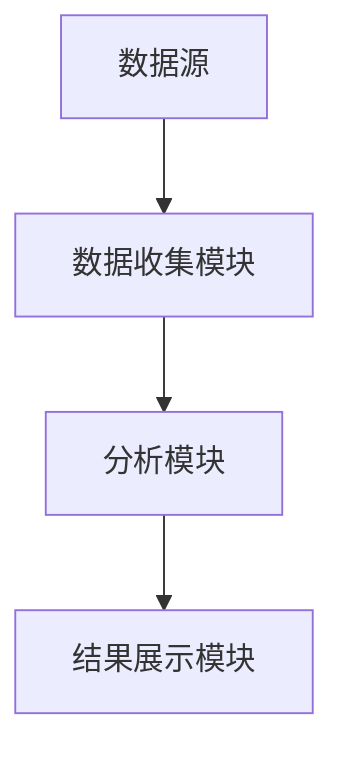

                 


# 格雷厄姆·多德的固定收益证券分析方法

> 关键词：固定收益证券，格雷厄姆·多德，投资分析，债券定价，信用评级

> 摘要：本文详细探讨了格雷厄姆·多德的固定收益证券分析方法，从基本概念到高级策略，结合数学公式、图表和实际案例，系统性地介绍了如何运用这些方法进行有效的投资分析。

---

## 第一部分：固定收益证券的背景与基本概念

### 第1章：固定收益证券的定义与特点

#### 1.1 固定收益证券的定义
固定收益证券是指那些能够提供固定利息支付和本金偿还的金融工具。这类证券的收益主要来源于 coupon（息票）和本金的偿还，常见的形式包括国债、企业债、市政债等。

#### 1.2 固定收益证券的主要类型
- **政府债券**：由政府发行，通常风险较低，收益稳定。
- **企业债券**：由企业发行，风险和收益通常高于政府债券。
- **抵押债券**：以特定资产作为抵押品，如抵押贷款支持证券（MBS）。
- **零息债券**：没有利息支付，到期时按面值偿还。

#### 1.3 固定收益证券的市场参与者
- **投资者**：包括个人、机构投资者和基金公司。
- **发行者**：政府、企业和金融机构。
- **中介机构**：券商、承销商和评级机构。

### 第2章：固定收益证券的市场与功能

#### 2.1 债券市场的基本构成
债券市场分为一级市场和二级市场：
- **一级市场**：新债券的发行市场，发行人通过招标或承销发行债券。
- **二级市场**：已发行债券的交易市场，投资者可以买卖债券。

#### 2.2 债券市场的功能
- **资金筹集**：为企业和个人提供融资渠道。
- **价格发现**：通过市场交易确定债券的公允价值。
- **风险管理**：投资者可以通过债券投资来对冲风险。

---

## 第二部分：固定收益证券的核心概念

### 第3章：债券的定价与收益率

#### 3.1 债券定价的基本原理
债券的市场价格由其未来现金流的现值决定。现金流包括定期支付的利息和到期时偿还的本金。

#### 3.2 到期收益率的计算
到期收益率（YTM）是债券的内部收益率，即投资者以当前价格购买债券并持有至到期时的预期收益率。

公式：
$$
YTM = \frac{C + (F - P)}{n \times (F + P)/2}
$$
其中，\( C \) 是每年的利息，\( F \) 是面值，\( P \) 是当前价格，\( n \) 是剩余期限。

#### 3.3 债券收益率与价格的关系
债券价格与收益率呈反向关系：当收益率上升时，债券价格下跌，反之亦然。

---

## 第三部分：固定收益证券的风险分析

### 第4章：信用评级与风险评估

#### 4.1 信用评级的定义
信用评级是对债券发行人偿还债务能力的评估，通常由评级机构（如穆迪、标普）给出。

#### 4.2 信用风险的度量
- **违约风险**：债券发行人无法按时偿还本金和利息的风险。
- **信用利差**：债券收益率与无风险收益率之间的差额，反映信用风险。

#### 4.3 信用评级与债券价格的关系
信用评级越高，债券的风险越低，通常对应的收益率也越低。

---

## 第四部分：格雷厄姆·多德的分析方法

### 第5章：格雷厄姆·多德的投资理念

#### 5.1 价值投资的核心思想
格雷厄姆倡导“安全边际”投资，即以低于内在价值的价格买入优质资产。

#### 5.2 固定收益证券的内在价值
内在价值是基于债券的现金流折现计算得出的公允价值。

#### 5.3 安全边际的应用
通过购买价格低于内在价值的债券，降低投资风险。

---

## 第五部分：固定收益证券的系统分析

### 第6章：固定收益分析的系统架构

#### 6.1 系统功能设计
- 数据收集模块：获取债券的基本信息和市场数据。
- 分析模块：计算收益率、评估信用风险。
- 结果展示模块：生成报告和可视化图表。

#### 6.2 系统架构图


---

## 第六部分：项目实战与案例分析

### 第7章：固定收益分析的实战应用

#### 7.1 环境搭建
- 安装Python和必要的库（如Pandas、NumPy）。

#### 7.2 核心代码实现
```python
import pandas as pd

def calculate_yield(price, face_value, coupon_rate, years):
    coupon = face_value * coupon_rate
    yield_to_maturity = (coupon + (face_value - price) / years) / ((face_value + price) / 2)
    return yield_to_maturity

# 示例
price = 95
face_value = 100
coupon_rate = 0.05
years = 5

ytm = calculate_yield(price, face_value, coupon_rate, years)
print(f"到期收益率为：{ytm:.2f}%")
```

#### 7.3 案例分析
以某公司发行的5年期债券为例，计算其到期收益率并评估其信用风险。

---

## 第七部分：总结与最佳实践

### 第8章：总结与注意事项

#### 8.1 总结
格雷厄姆·多德的分析方法为固定收益证券的投资提供了系统的理论框架，结合定量分析和定性判断，能够有效降低投资风险。

#### 8.2 小结
- 重视债券的信用评级和安全性。
- 合理配置资产，分散风险。
- 定期复评和调整投资组合。

#### 8.3 注意事项
- 避免过度依赖模型，忽略市场变化。
- 留意政策风险和流动性风险。

---

## 作者

作者：AI天才研究院 & 禅与计算机程序设计艺术

