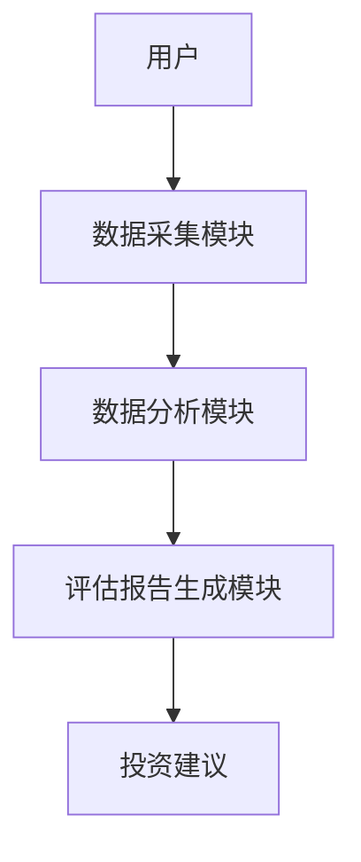
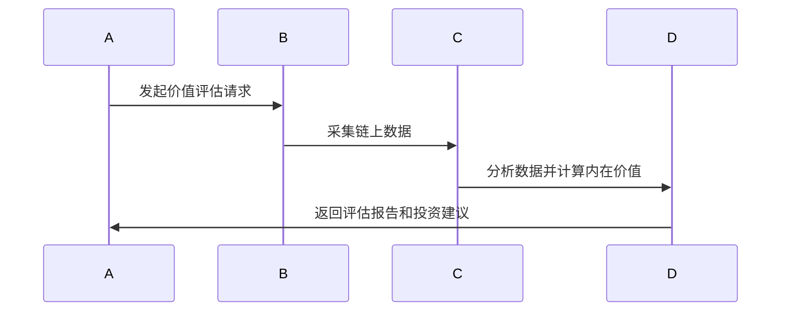

                 


# 格雷厄姆价值投资理念在区块链时代的新解读

> 关键词：格雷厄姆价值投资，区块链，价值评估，投资策略，智能合约

> 摘要：本文探讨了格雷厄姆的经典价值投资理念在区块链时代的应用与演变。通过分析区块链技术的核心特征，结合价值投资的基本原理，提出了一种基于区块链的新型价值评估框架，并详细阐述了该框架的实现方法和实际应用案例。文章还提供了具体的Python代码实现和系统架构设计，为投资者和开发者提供了实践指导。

---

# 第一部分：引言

## 1.1 本书的背景与意义

### 1.1.1 格雷厄姆价值投资理念的核心思想
格雷厄姆的价值投资理念强调以低于内在价值的价格购买优质的资产。其核心思想包括：
1. **安全边际**：购买价格远低于内在价值，以降低风险。
2. **内在价值**：通过基本面分析确定资产的真实价值。
3. **长期视角**：投资应以长期价值为导向，而非短期波动。

### 1.1.2 区块链时代的投资新特征
区块链技术的兴起为投资领域带来了深远的影响，主要体现在：
1. **去中心化**：消除了传统金融的中间环节，提高了透明度。
2. **智能合约**：实现了自动化的交易和执行，降低了信任成本。
3. **数据透明性**：区块链上的数据不可篡改，为价值评估提供了可靠的基础。

### 1.1.3 重新解读价值投资理念的必要性
在区块链时代，传统的价值投资理念需要重新审视和调整，以适应新的技术和市场环境。本文将探讨如何将格雷厄姆的价值投资理念与区块链技术相结合，提出一种新的价值评估框架。

---

# 第二部分：价值投资理念的背景与基础

## 2.1 格雷厄姆价值投资理论概述

### 2.1.1 价值投资的核心原则
- **安全边际**：购买价格低于内在价值，确保投资的安全性。
- **内在价值计算**：通过基本面分析，如现金流、盈利能力等，确定资产的真实价值。
- **长期视角**：投资应着眼于企业的长期增长潜力，而非短期价格波动。

### 2.1.2 投资的三重安全边际
格雷厄姆提出的三重安全边际：
1. **价格安全边际**：购买价格低于内在价值。
2. **质量安全边际**：选择具有强大竞争优势的企业。
3. **时间安全边际**：长期持有优质资产，避免短期波动的影响。

## 2.2 区块链技术的基本原理

### 2.2.1 区块链的定义与特征
- **分布式账本**：数据分散存储在多个节点，确保数据的不可篡改性。
- **智能合约**：通过代码自动执行交易和合约，减少信任成本。
- **去中心化**：消除了传统金融的中心化机构，提高了透明度和效率。

### 2.2.2 区块链的核心技术
- **共识机制**：如PoW、PoS等，确保数据的一致性和安全性。
- **节点网络**：分布式网络中的节点共同维护账本。
- **数据加密**：通过密码学技术确保数据的安全性。

## 2.3 价值投资与区块链的结合点

### 2.3.1 区块链对传统金融的颠覆
- **透明性**：区块链上的数据公开透明，便于投资者进行基本面分析。
- **效率**：智能合约自动执行交易，降低了时间和成本。
- **信任**：通过技术手段减少对中间机构的信任依赖。

### 2.3.2 区块链时代的投资机会
- **DeFi（去中心化金融）**：提供新的投资工具和场景。
- **NFTs（非同质化代币）**：为数字资产提供价值评估的新方式。
- **区块链数据分析**：利用链上数据进行更精准的价值评估。

### 2.3.3 价值投资理念的延申与创新
- **数据驱动**：区块链上的数据为价值评估提供了新的维度。
- **自动化投资**：通过智能合约实现自动化的投资策略。
- **去中心化价值评估**：构建基于区块链的分布式价值评估系统。

---

# 第三部分：区块链时代的价值评估模型

## 3.1 区块链项目的价值评估框架

### 3.1.1 项目背景与团队分析
- **团队背景**：评估创始团队的经验和声誉。
- **项目目标**：明确项目的核心目标和应用场景。

### 3.1.2 项目技术与应用场景
- **技术实现**：评估项目的技术架构和创新能力。
- **应用场景**：分析项目在实际场景中的应用潜力。

### 3.1.3 项目经济模型与代币机制
- **代币经济**：评估代币的发行机制和经济模型。
- **通货膨胀率**：分析代币的通胀和通缩机制。

## 3.2 格雷厄姆价值评估方法的区块链适配

### 3.2.1 内在价值的重新定义
在区块链时代，内在价值的计算需要考虑以下因素：
- **链上数据**：如交易量、活跃用户数、智能合约执行情况等。
- **经济模型**：如代币的供需关系、通货膨胀率等。

### 3.2.2 安全边际的区块链实现
通过智能合约实现安全边际的自动计算和执行，确保投资的安全性。

### 3.2.3 投资组合的分散化策略
在区块链时代，分散化投资尤为重要。通过投资多个不同的项目，降低风险。

## 3.3 区块链价值评估的数学模型

### 3.3.1 价值评估的公式推导
基于贴现现金流模型，我们可以推导出区块链项目的内在价值公式：
$$ V = \frac{CF}{(r - g)} $$
其中：
- \( CF \)：未来现金流
- \( r \)：折现率
- \( g \)：增长率

### 3.3.2 区块链价值评估的流程
1. **数据采集**：收集区块链项目的链上数据。
2. **数据分析**：分析数据以计算内在价值。
3. **评估结果**：输出投资建议。

---

# 第四部分：系统分析与架构设计

## 4.1 问题场景介绍
区块链价值评估系统需要解决以下问题：
- 如何高效采集链上数据？
- 如何分析链上数据并计算内在价值？
- 如何输出投资建议并实现自动化交易？

## 4.2 系统功能设计

### 4.2.1 数据采集模块
- **功能**：采集区块链项目的链上数据，如交易量、活跃用户数等。
- **实现**：使用区块链API接口获取数据。

### 4.2.2 数据分析模块
- **功能**：对采集的数据进行分析，计算内在价值和安全边际。
- **实现**：使用Python进行数据清洗和分析。

### 4.2.3 评估报告生成模块
- **功能**：生成评估报告，输出投资建议。
- **实现**：基于分析结果生成报告。

## 4.3 系统架构设计

### 4.3.1 系统架构图


### 4.3.2 系统交互图


## 4.4 系统接口设计

### 4.4.1 数据采集接口
```python
def get_chain_data(blockchain, start_block, end_block):
    # 实现数据采集逻辑
    return data
```

### 4.4.2 数据分析接口
```python
def calculate_intrinsic_value(data):
    # 实现内在价值计算逻辑
    return value
```

---

# 第五部分：项目实战

## 5.1 环境安装
- **Python**：安装Python 3.x及以上版本。
- **区块链API**：选择一个可靠的区块链API服务。

## 5.2 系统核心实现源代码

### 5.2.1 数据采集模块
```python
import requests

def get_chain_data(blockchain, start_block, end_block):
    url = f"https://api.{blockchain}.com/blockscanner/block/{start_block}/{end_block}"
    response = requests.get(url)
    return response.json()
```

### 5.2.2 数据分析模块
```python
def calculate_intrinsic_value(data):
    cf = sum(data['cash_flows'])
    r = 0.05  # 假设折现率为5%
    g = 0.02  # 假设增长率为2%
    return cf / (r - g)
```

### 5.2.3 评估报告生成模块
```python
def generate_report(value, price):
    margin = (value - price) / value * 100
    return f"投资建议：当前价格为{price}，内在价值为{value}，安全边际为{margin}%。"
```

## 5.3 代码应用解读与分析
- **数据采集模块**：通过区块链API获取链上数据。
- **数据分析模块**：使用贴现现金流模型计算内在价值。
- **评估报告生成模块**：生成投资建议报告。

## 5.4 实际案例分析
以某DeFi项目为例，分析其链上数据，计算其内在价值，并给出投资建议。

---

# 第六部分：总结与展望

## 6.1 本书总结
本文探讨了格雷厄姆价值投资理念在区块链时代的应用与创新，提出了基于区块链的价值评估框架，并详细阐述了其实现方法和应用场景。

## 6.2 未来展望
随着区块链技术的不断发展，价值投资理念将在更多领域得到应用。未来的研究方向包括：
- 更精准的链上数据分析方法。
- 自动化的投资策略实现。
- 更高效的区块链价值评估系统。

---

# 作者信息

作者：AI天才研究院/AI Genius Institute & 禅与计算机程序设计艺术 /Zen And The Art of Computer Programming

---

通过本文的系统性分析和实践，读者可以深入理解格雷厄姆价值投资理念在区块链时代的应用，并掌握其具体实现方法。希望本文能为投资者和开发者提供有价值的参考和启发。

