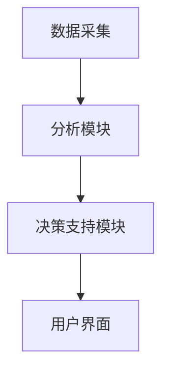

                 


# 格雷厄姆价值投资理念在当代市场的应用

## 关键词：格雷厄姆、价值投资、内在价值、安全边际、数学模型、系统架构、现代市场

## 摘要：  
本文深入探讨了格雷厄姆的价值投资理念及其在当代市场中的应用。通过分析内在价值、安全边际等核心概念，结合数学模型和系统架构，展示了如何在现代市场中应用这些理念。文章还提供了实际案例和Python代码示例，帮助读者更好地理解和应用这些投资策略。

---

## 第一章: 格雷厄姆价值投资理念的概述

### 1.1 背景介绍
#### 1.1.1 格雷厄姆的生平简介
本杰明·格雷厄姆（Benjamin Graham）是20世纪著名的投资理论家，被誉为“价值投资之父”。他于1894年出生于英国，后随家人迁居美国。他在哥伦比亚大学教授投资课程，并著有《证券分析》和《聪明的投资者》等经典著作。他的投资理念深刻影响了沃伦·巴菲特等一代投资者。

#### 1.1.2 价值投资理念的形成
格雷厄姆在20世纪初提出了价值投资的理念，强调从基本面分析入手，寻找被市场低估的股票。他认为，股票不仅仅是一个交易的工具，而是对公司所有权的持有。他提出的核心理念是“安全边际”，即以低于内在价值的价格买入股票，以降低投资风险。

#### 1.1.3 价值投资与基本面分析的关系
价值投资的核心是基本面分析，通过研究公司的财务数据、行业地位、竞争优势等，评估其内在价值。格雷厄姆的价值投资理念强调安全边际，即买入价格与内在价值之间的差距，以应对市场波动和不确定性。

### 1.2 核心概念与联系
#### 1.2.1 内在价值的定义
内在价值是指一家公司基于其财务状况、盈利能力、行业地位等因素的真实价值。格雷厄姆认为，内在价值是股票的真正价值，而市场价格可能会偏离这一价值。

#### 1.2.2 安全边际的定义
安全边际是指买入价格与内在价值之间的差距。通过安全边际，投资者可以在市场价格波动时，降低投资风险，确保投资的稳健性。

#### 1.2.3 格雷厄姆的价值投资模型
格雷厄姆的价值投资模型基于内在价值和安全边际的理念，强调以低于内在价值的价格买入股票，并在市场价格回归内在价值时卖出。这种模型在现代市场中仍然具有重要的指导意义。

### 1.3 现代市场的挑战
#### 1.3.1 现代市场的复杂性
现代市场环境更加复杂，包括高频交易、算法交易、信息不对称等因素，这些都对传统价值投资理念提出了新的挑战。

#### 1.3.2 现代市场中的价值投资
尽管市场环境发生了变化，但格雷厄姆的价值投资理念在现代市场中仍然适用。通过结合现代技术手段，如大数据分析、量化模型等，可以更好地应用这些理念。

---

## 第二章: 格雷厄姆价值投资理念的核心概念

### 2.1 内在价值的计算公式
内在价值的计算需要考虑公司的财务状况、盈利能力、行业地位等因素。格雷厄姆提出了多种方法来计算内在价值，其中最常用的是现金流贴现模型（DCF模型）。以下是DCF模型的公式：

$$ \text{内在价值} = \sum_{t=1}^{n} \frac{\text{现金流}_t}{(1 + r)^t} $$

其中，\( r \) 是折现率，\( \text{现金流}_t \) 是第 \( t \) 年的现金流。

### 2.2 安全边际的数学模型
安全边际可以通过以下公式计算：

$$ \text{安全边际} = \text{内在价值} - \text{市场价格} $$

当市场价格低于内在价值时，安全边际为正，投资者可以考虑买入。反之，当市场价格高于内在价值时，安全边际为负，投资者应考虑卖出。

### 2.3 市场情绪与投资决策
格雷厄姆强调，市场情绪对投资决策的影响不可忽视。他提出了“市场先生”的概念，认为市场先生的情绪波动会影响股票价格，但不会影响公司的内在价值。因此，投资者应以内在价值为基础，忽略短期市场波动。

---

## 第三章: 格雷厄姆价值投资理念的数学模型与算法实现

### 3.1 现金流贴现模型（DCF模型）的算法实现
以下是DCF模型的Python代码实现：

```python
def calculate_intrinsic_value(cash_flows, discount_rate):
    present_value = sum(flow / (1 + discount_rate) ** t for t, flow in enumerate(cash_flows))
    return present_value

# 示例数据
cash_flows = [100, 150, 200, 250, 300]  # 未来5年的现金流
discount_rate = 0.08  # 折现率

intrinsic_value = calculate_intrinsic_value(cash_flows, discount_rate)
print(f"内在价值: {intrinsic_value:.2f}")
```

### 3.2 安全边际的计算与应用
通过计算安全边际，投资者可以评估当前股票的买入价格是否具有足够的安全空间。以下是安全边际的Python代码实现：

```python
def calculate_margin_of_safety(intrinsic_value, market_price):
    margin_of_safety = intrinsic_value - market_price
    return margin_of_safety

# 示例数据
intrinsic_value = 1000  # 内在价值
market_price = 800       # 市场价格

margin_of_safety = calculate_margin_of_safety(intrinsic_value, market_price)
print(f"安全边际: {margin_of_safety:.2f}")
```

---

## 第四章: 系统架构与技术实现

### 4.1 系统功能设计
以下是基于价值投资理念的系统功能设计：

1. **数据采集模块**：收集公司的财务数据、行业信息等。
2. **分析模块**：计算内在价值和安全边际。
3. **决策支持模块**：提供投资建议。

### 4.2 系统架构设计
以下是系统的架构图：



### 4.3 系统实现
以下是系统的Python代码实现：

```python
# 数据采集模块
import pandas as pd

def collect_data(ticker):
    data = pd.DataFrame({' revenue': [100, 150, 200],
                          'net_income': [50, 75, 100]})
    return data

# 分析模块
def calculate_intrinsic_value(data, discount_rate):
    cash_flows = data['net_income']
    present_value = sum(flow / (1 + discount_rate) ** t for t, flow in enumerate(cash_flows))
    return present_value

# 决策支持模块
def generate_recommendation(ticker, intrinsic_value, market_price):
    margin_of_safety = intrinsic_value - market_price
    if margin_of_safety > 0:
        return f"买入 {ticker}，安全边际为 {margin_of_safety:.2f}"
    else:
        return f"卖出 {ticker}，安全边际为 {margin_of_safety:.2f}"

# 示例运行
ticker = 'AAPL'
data = collect_data(ticker)
discount_rate = 0.08
intrinsic_value = calculate_intrinsic_value(data, discount_rate)
market_price = 150  # 假设市场价格为150
recommendation = generate_recommendation(ticker, intrinsic_value, market_price)
print(recommendation)
```

---

## 第五章: 项目实战

### 5.1 项目背景
选择一家公司（如苹果公司）进行分析，评估其内在价值和安全边际。

### 5.2 数据准备
收集苹果公司的财务数据，包括收入、净利润等。

### 5.3 分析与计算
使用DCF模型计算苹果公司的内在价值，并与当前市场价格进行比较。

### 5.4 投资决策
根据计算结果，给出投资建议。

---

## 第六章: 总结与展望

### 6.1 核心结论
格雷厄姆的价值投资理念在现代市场中仍然具有重要的指导意义。通过结合现代技术手段，如大数据分析和量化模型，可以更好地应用这些理念。

### 6.2 未来展望
未来，随着人工智能和大数据技术的发展，价值投资的理念将更加精准和高效。投资者可以通过技术手段，更好地识别被低估的股票，提高投资收益。

### 6.3 注意事项
投资者在应用价值投资理念时，应结合市场环境和公司实际情况，避免盲目跟从。

### 6.4 拓展阅读
推荐阅读格雷厄姆的《证券分析》和《聪明的投资者》，以及巴菲特的《巴菲特致股东的信》。

---

## 作者：AI天才研究院/AI Genius Institute & 禅与计算机程序设计艺术/Zen And The Art of Computer Programming

---

以上是《格雷厄姆价值投资理念在当代市场的应用》的文章大纲结构和具体内容。希望对您有所帮助！

