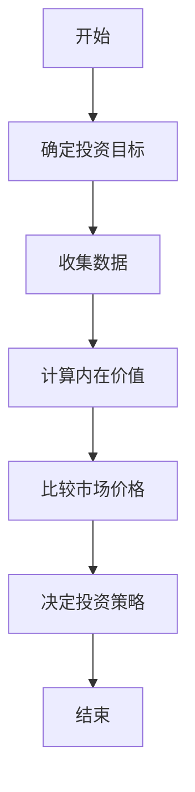
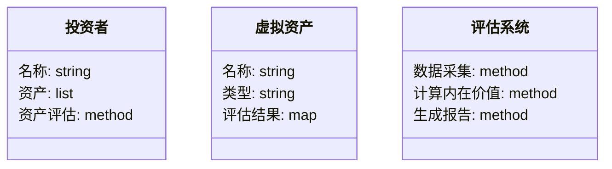

                 


# 格雷厄姆价值投资理念在虚拟经济时代的新解读

> 关键词：价值投资，虚拟经济，格雷厄姆，内在价值，算法分析，系统设计

> 摘要：本文探讨了格雷厄姆价值投资理念在虚拟经济时代的新应用，特别是在数字货币和NFT领域。通过分析虚拟经济的特点，结合格雷厄姆的价值评估方法，提出了新的投资策略和系统设计。文章详细介绍了算法模型和系统架构，并通过实际案例展示了如何在虚拟经济中应用这些理念。

---

## 第1章: 价值投资的基本原理

### 1.1 价值投资的核心概念

价值投资是一种以内在价值为核心的投资策略，强调购买价格低于内在价值的资产。格雷厄姆的价值投资体系强调安全边际、质价理论和内在价值评估。

### 1.2 投资者心态与行为

投资者的心理波动和行为模式对投资决策有重要影响。理性决策与非理性决策的对比，以及如何在虚拟经济中保持理性的投资心态，是价值投资成功的关键。

### 1.3 虚拟经济的基本情况

虚拟经济以数字货币和NFT为代表，具有去中心化、高波动性和技术驱动等特点。与传统经济相比，虚拟经济的评估体系需要重新构建。

---

## 第2章: 虚拟经济的投资机会

### 2.1 数字货币

数字货币的评估需要考虑技术基础、市场接受度和网络效应。以比特币为例，分析其内在价值和波动性。

### 2.2 NFTs

NFTs的价值取决于创作者声誉、社区影响力和稀缺性。通过案例分析，探讨NFT项目的评估方法。

### 2.3 区块链技术

区块链技术的应用潜力是虚拟经济的重要驱动力。评估区块链项目时，需考虑技术实现、团队能力和商业模式。

---

## 第3章: 格雷厄姆理念的虚拟经济应用

### 3.1 内在价值评估

使用格雷厄姆的贴现现金流模型，评估虚拟资产的内在价值。公式如下：

$$ V = \sum_{t=1}^{n} \frac{CF_t}{(1+r)^t} $$

其中，$CF_t$为自由现金流，$r$为折现率，$n$为项目周期。

### 3.2 安全边际

计算安全边际以确保投资的安全性：

$$ \text{安全边际} = \frac{\text{内在价值} - \text{市场价格}}{\text{市场价格}} $$

### 3.3 投资策略

制定长期投资策略，强调分散投资和风险管理。通过系统设计优化投资组合。

---

## 第4章: 核心概念与联系

### 4.1 概念分析

通过对比表格和ER图，展示质价理论、安全边际和内在价值之间的关系。

```mermaid
er
  actor:投资者
  class:虚拟资产
  subclass:数字货币
  subclass: NFTs
  subclass:区块链项目
  relationship:评估
```

---

## 第5章: 算法原理与流程图

### 5.1 算法流程

评估虚拟资产的算法流程如下：



### 5.2 数学模型

使用贴现现金流模型评估内在价值，并计算安全边际。公式如下：

$$ \text{安全边际} = \frac{\text{内在价值} - \text{市场价格}}{\text{市场价格}} $$

---

## 第6章: 系统设计与架构

### 6.1 系统架构

系统架构设计包括数据采集、评估计算和用户交互模块。



---

## 第7章: 项目实战

### 7.1 案例分析

评估一个NFT项目，分析其内在价值和市场价格。

### 7.2 代码实现

使用Python编写评估系统，展示如何计算内在价值和安全边际。

```python
def calculate_intrinsic_value(cash_flows, discount_rate):
    return sum(cf / (1 + discount_rate) ** t for t, cf in enumerate(cash_flows))

market_price = 100
intrinsic_value = calculate_intrinsic_value([50, 60, 70], 0.1)
safety_margin = (intrinsic_value - market_price) / market_price
```

### 7.3 项目总结

总结评估过程，强调系统的实用性和可扩展性。

---

## 第8章: 总结与展望

### 8.1 总结

格雷厄姆价值投资理念在虚拟经济中依然适用，通过调整评估方法和系统设计，可以有效指导投资决策。

### 8.2 展望

未来，随着虚拟经济的不断发展，价值投资理念将更加多元化，需要结合新技术进行创新。

---

## 参考文献

[1] 格雷厄姆《 Intelligent Investor》  
[2] 加入币安研究院《数字资产管理白皮书》  
[3] 加入链改研究院《区块链与价值投资》

---

## 作者

作者：AI天才研究院/AI Genius Institute & 禅与计算机程序设计艺术 /Zen And The Art of Computer Programming

