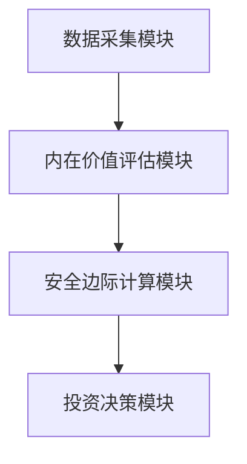

                 


# 格雷厄姆到巴菲特：价值投资理念的演变

## 关键词：价值投资、格雷厄姆、巴菲特、内在价值、安全边际、成长股投资、防御性投资

## 摘要

本文系统地探讨了价值投资从格雷厄姆到巴菲特的演变历程，分析了价值投资的核心理念、数学模型、系统架构设计以及在实际投资中的应用。文章首先介绍了格雷厄姆与多德的价值投资理论，接着深入分析了巴菲特的实践与演变，随后从数学模型、系统架构设计等技术角度详细阐述了价值投资的理念，并结合实际案例进行了项目实战分析。最后，文章总结了价值投资的最佳实践、注意事项和未来发展方向。

---

# 第一部分: 价值投资的起源与发展

## 第1章: 格雷厄姆与多德的价值投资理论

### 1.1 格雷厄姆的价值投资理念

#### 1.1.1 价值投资的定义与核心思想

价值投资是一种以基本面分析为基础的投资策略，旨在通过识别市场价格与内在价值之间的差异，寻找被市场低估的投资标的。格雷厄姆是价值投资的奠基人，他提出的核心思想是：

1. **市场波动与内在价值的分离**：市场价格波动是暂时的，而内在价值是长期稳定的。
2. **安全边际的概念**：在购买股票时，应确保市场价格远低于内在价值，以避免市场波动带来的风险。

#### 1.1.2 格雷厄姆的防御性投资策略

格雷厄姆倡导防御性投资策略，强调通过分散投资和严格筛选来降低风险。他提出的核心策略包括：

1. **分散投资**：避免将所有资金投入到单一资产中，以降低特定资产波动带来的风险。
2. **安全边际**：在购买股票时，确保市场价格远低于保守估计的内在价值。

#### 1.1.3 格雷厄姆的安全边际概念

安全边际是价值投资的核心概念之一。它是指市场价格与内在价值之间的差异，即：

$$\text{安全边际} = \text{内在价值} - \text{市场价格}$$

格雷厄姆认为，通过购买具有足够安全边际的股票，投资者可以避免市场波动带来的损失，并在长期实现资本增值。

---

### 1.2 多德的价值投资理论

#### 1.2.1 多德的投资哲学

多德是价值投资的另一位重要人物，他与格雷厄姆共同奠定了价值投资的基础。多德的投资哲学强调：

1. **内在价值的动态变化**：企业的内在价值会随着经营状况的变化而波动，投资者需要持续关注企业的基本面。
2. **成长股的投资机会**：虽然格雷厄姆主要关注防御性股票，但多德认为成长股也具有投资价值。

#### 1.2.2 多德的内在价值评估方法

多德提出了一种更为灵活的内在价值评估方法，他强调：

1. **现金流贴现法**：通过将未来现金流贴现到现值，来评估企业的内在价值。
2. **动态调整**：在评估内在价值时，需要考虑企业的成长性和行业环境的变化。

#### 1.2.3 多德与格雷厄姆的理论差异与联系

尽管格雷厄姆和多德都倡导价值投资，但两者的侧重点有所不同：

| 格雷厄姆 | 多德 |
|---------|------|
| 防御性投资策略 | 成长股投资策略 |
| 严格的安全边际要求 | 更灵活的内在价值评估 |

---

## 第2章: 巴菲特的实践与演变

### 2.1 巴菲特的成长股投资策略

#### 2.1.1 巴菲特的成长股投资理念

巴菲特是格雷厄姆的学生，但他将价值投资的理念进一步发展。他提出了一种更为积极的成长股投资策略，强调：

1. **企业的护城河**：选择具有强大竞争优势的企业。
2. **长期投资**：通过长期持有优质资产，实现资本的持续增值。

#### 2.1.2 巴菲特的“护城河”概念

巴菲特提出的“护城河”是指企业竞争优势的持续性。具有宽护城河的企业能够在长期保持竞争优势，并持续为股东创造价值。

#### 2.1.3 巴菲特的长期投资策略

巴菲特认为，短期市场的波动是无法预测的，但长期来看，市场会反映企业的内在价值。因此，他倡导长期投资，避免频繁交易。

---

### 2.2 巴菲特的合伙人制度与投资哲学

#### 2.2.1 巴菲特的合伙人制度

巴菲特的合伙企业制度是其投资哲学的重要体现。他通过与投资者签订长期合作协议，确保投资决策的稳定性和一致性。

#### 2.2.2 巴菲特的“股东资本主义”理念

巴菲特认为，企业应当以股东利益为核心，通过持续创造价值来实现企业的长期发展。

#### 2.2.3 巴菲特的长期价值投资哲学

巴菲特强调，投资的核心是寻找具有持续竞争优势的企业，并通过长期持有实现资本增值。

---

# 第二部分: 价值投资的核心理论

## 第3章: 安全边际与内在价值

### 3.1 安全边际的定义与计算

#### 3.1.1 安全边际的定义

安全边际是价值投资的核心概念之一，它是指市场价格与内在价值之间的差异。具体公式为：

$$\text{安全边际} = \text{内在价值} - \text{市场价格}$$

#### 3.1.2 安全边际的计算方法

计算安全边际需要首先确定企业的内在价值，然后减去当前市场价格。例如：

- 内在价值：$50
- 市场价格：$30
- 安全边际：$20

#### 3.1.3 安全边际与投资风险的关系

安全边际越大，投资风险越小。通过购买具有足够安全边际的股票，投资者可以降低市场波动带来的风险。

---

### 3.2 内在价值的评估方法

#### 3.2.1 内在价值的定义

内在价值是指企业在未来现金流的现值。计算公式为：

$$\text{内在价值} = \sum_{t=1}^{n} \frac{\text{现金流}_t}{(1 + r)^t}$$

其中，$r$ 是折现率，$n$ 是评估期。

#### 3.2.2 内在价值的评估模型

现金流贴现法（DCF）是评估内在价值的核心方法。通过预测未来现金流并贴现到现值，可以得出企业的内在价值。

#### 3.2.3 内在价值与市场价值的对比

| 内在价值 | 市场价值 |
|----------|----------|
| 反映企业未来现金流的现值 | 反映市场参与者对企业的估值 |
| 由企业基本面决定 | 受市场情绪影响较大 |

---

## 第4章: 价值投资的数学模型与算法

### 4.1 价值投资的数学模型

#### 4.1.1 内在价值计算公式

$$\text{内在价值} = \frac{\text{现金流}}{\text{贴现率}}$$

#### 4.1.2 安全边际计算公式

$$\text{安全边际} = \text{内在价值} - \text{市场价格}$$

---

### 4.2 价值投资的算法实现

#### 4.2.1 现金流贴现法的实现

```python
def calculate_intrinsic_value(cash_flows, discount_rate):
    intrinsic_value = sum(cash_flow / (1 + discount_rate) ** t for t, cash_flow in enumerate(cash_flows))
    return intrinsic_value
```

#### 4.2.2 安全边际计算的实现

```python
def calculate_margin_of_safety(intrinsic_value, market_price):
    margin_of_safety = intrinsic_value - market_price
    return margin_of_safety
```

---

# 第三部分: 价值投资的系统分析与架构设计

## 第5章: 投资决策的系统架构

### 5.1 投资决策的系统架构设计

#### 5.1.1 系统功能模块划分

| 模块名称 | 功能描述 |
|---------|----------|
| 数据采集模块 | 收集企业的财务数据和市场数据 |
| 内在价值评估模块 | 计算企业的内在价值 |
| 安全边际计算模块 | 计算安全边际 |
| 投资决策模块 | 根据安全边际和内在价值做出投资决策 |

#### 5.1.2 系统架构的Mermaid图



---

### 5.2 投资决策的系统接口设计

#### 5.2.1 系统接口设计

| 接口名称 | 输入 | 输出 |
|---------|------|------|
| `get_intrinsic_value` | 财务数据、贴现率 | 内在价值 |
| `get_margin_of_safety` | 内在价值、市场价格 | 安全边际 |

---

## 第6章: 价值投资的项目实战

### 6.1 环境安装

#### 6.1.1 安装Python和相关库

```bash
pip install numpy pandas matplotlib
```

---

### 6.2 系统核心实现源代码

#### 6.2.1 现金流贴现法实现

```python
import numpy as np

def calculate_intrinsic_value(cash_flows, discount_rate):
    return np.npv(discount_rate, cash_flows)
```

---

### 6.3 实际案例分析

#### 6.3.1 案例分析：某公司内在价值评估

假设某公司未来5年的现金流分别为100万、120万、150万、200万、250万，贴现率为10%。

$$\text{内在价值} = \sum_{t=1}^{5} \frac{\text{现金流}_t}{(1 + 0.1)^t}$$

计算结果如下：

| 年份 | 现金流 | 现值 |
|------|--------|------|
| 1    | 100    | 90.91|
| 2    | 120    | 96.12|
| 3    | 150    | 113.64|
| 4    | 200    | 136.61|
| 5    | 250    | 150.26|

总计内在价值为 $90.91 + 96.12 + 113.64 + 136.61 + 150.26 = 597.54$ 万。

---

## 第四部分: 总结与展望

## 第7章: 价值投资的最佳实践与注意事项

### 7.1 最佳实践

1. **持续学习**：保持对市场动态和企业基本面的关注。
2. **分散投资**：避免过度集中投资。
3. **长期持有**：耐心持有优质资产。

### 7.2 注意事项

1. **避免情绪化决策**：市场波动可能会影响情绪，但需坚持价值投资理念。
2. **定期评估**：定期重新评估投资组合的内在价值和安全边际。

---

## 作者：AI天才研究院/AI Genius Institute & 禅与计算机程序设计艺术 /Zen And The Art of Computer Programming

