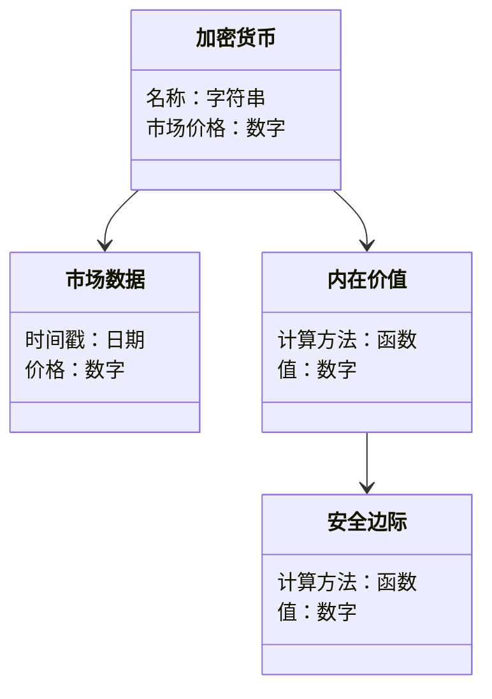
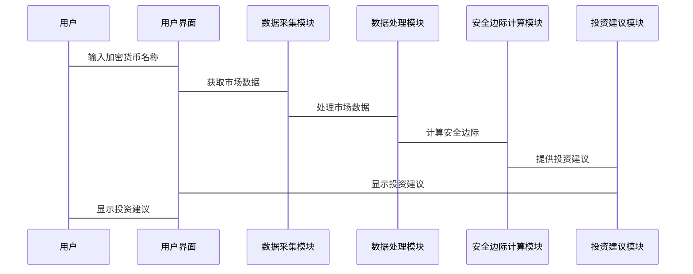

                 

<think>
好的，我将按照您的要求来撰写这篇文章。首先，我需要了解格雷厄姆的安全边际概念以及它在加密货币市场中的应用。我将从定义开始，逐步分析其在不同市场环境下的适用性，然后结合加密货币市场的特点，探讨如何应用这一概念。我还需要考虑技术细节和实际案例，以确保内容的深度和实用性。

让我们一步步来分析：

1. **安全边际的定义与核心概念**
   - 了解安全边际的基本概念，包括其在投资中的作用。
   - 探讨安全边际与投资决策的关系。

2. **加密货币市场的特点**
   - 介绍加密货币市场的基本定义和参与者。
   - 分析加密货币市场的波动性和交易机制。

3. **安全边际在加密货币投资中的应用**
   - 计算安全边际的方法，对比市场价值与内在价值。
   - 不同加密货币的安全边际比较。

4. **安全边际与市场波动性的关系**
   - 研究市场波动性对安全边际的影响。
   - 制定在波动性市场中的风险管理策略。

5. **投资策略的制定与实施**
   - 基于安全边际制定长期和短期投资策略。
   - 构建投资组合并进行动态调整。

在每个部分中，我将结合实际案例和数学模型，确保内容的实用性和可操作性。接下来，我将根据上述结构撰写详细的内容。

# 格雷厄姆安全边际概念在加密货币市场中的应用

## 关键词：格雷厄姆安全边际、加密货币、投资策略、风险管理、市场波动

## 摘要

本文深入探讨了格雷厄姆的安全边际概念在加密货币市场中的应用。通过分析加密货币市场的特点，结合安全边际的计算方法，本文提出了基于安全边际的投资策略，帮助投资者在高波动性的市场中做出明智的决策。文章还详细讨论了如何利用安全边际进行风险管理，确保投资组合的稳健性。

---

# 第一部分: 格雷厄姆安全边际概念的背景与基础

## 第1章: 安全边际的定义与核心概念

### 1.1 安全边际的定义

#### 1.1.1 安全边际的基本概念
安全边际是投资学中的一个重要概念，最早由 Benjamin Graham 提出。它指的是资产的市场价格低于其内在价值的部分，即市场价格与内在价值之间的差距。安全边际的存在为投资者提供了风险缓冲，确保即使市场价格波动，投资者也能在一定程度上避免损失。

$$ \text{安全边际} = \text{内在价值} - \text{市场价格} $$

如果市场价格低于内在价值，那么该资产就有一定的安全边际。安全边际越大，投资的风险越低。

#### 1.1.2 安全边际的核心属性
- **防御性**：安全边际为投资者提供了抵御市场价格波动的保护。
- **收益性**：通过购买低于内在价值的资产，投资者可以获得超额收益。
- **动态性**：安全边际会随着市场价格和内在价值的变化而变化。

#### 1.1.3 安全边际与投资决策的关系
安全边际是投资决策的重要依据。投资者应优先选择具有较高安全边际的资产，以降低投资风险并提高收益潜力。

### 1.2 格雷厄姆安全边际理论的背景

#### 1.2.1 格雷厄姆投资理论概述
Benjamin Graham 是价值投资的鼻祖，他的投资理论强调以内在价值为基础进行投资。他认为，市场价格常常偏离内在价值，这种偏差为投资者提供了获利的机会。

#### 1.2.2 安全边际在传统投资中的应用
在传统投资中，安全边际常用于股票市场的估值。投资者通过计算股票的内在价值，选择市场价格低于内在价值的股票进行投资。

#### 1.2.3 安全边际理论的局限性与扩展
虽然安全边际理论在传统投资中取得了成功，但其在加密货币市场的应用面临新的挑战。加密货币市场的高波动性和去中心化特性要求对安全边际理论进行调整和扩展。

---

## 第2章: 加密货币市场的基本特征

### 2.1 加密货币市场的定义与特点

#### 2.1.1 加密货币市场的基本定义
加密货币市场是指以比特币、以太坊等加密货币为交易标的的市场。与传统金融市场相比，加密货币市场具有去中心化、匿名性和高波动性的特点。

#### 2.1.2 加密货币市场的波动性特征
加密货币市场的价格波动远高于传统金融市场。这种波动性主要源于市场的不成熟性和投资者情绪的剧烈波动。

#### 2.1.3 加密货币市场的参与者与交易机制
加密货币市场的参与者包括个人投资者、机构投资者、矿工和交易所。交易机制主要包括现货交易、期货交易和杠杆交易。

### 2.2 加密货币市场的投资机会与风险

#### 2.2.1 加密货币市场的投资机会
加密货币市场的高波动性为投资者提供了快速获利的机会。此外，区块链技术的广泛应用也为加密货币带来了巨大的投资潜力。

#### 2.2.2 加密货币市场的主要风险
- **价格波动风险**：加密货币价格的剧烈波动可能导致投资损失。
- **市场流动性风险**：部分加密货币的流动性较差，可能导致买卖价差较大。
- **市场操纵风险**：加密货币市场容易受到市场操纵的影响。

#### 2.2.3 风险与收益的权衡
在加密货币市场中，高风险往往伴随着高收益。投资者需要在风险和收益之间找到平衡点，制定合适的投资策略。

---

# 第二部分: 安全边际概念在加密货币市场的应用

## 第3章: 安全边际在加密货币投资中的应用

### 3.1 安全边际的计算方法

#### 3.1.1 市场价值与内在价值的对比
在加密货币市场中，市场价格是指加密货币的当前价格，内在价值则是基于其基本面因素的估值。计算安全边际需要将市场价格与内在价值进行对比。

$$ \text{安全边际} = \text{内在价值} - \text{市场价格} $$

如果安全边际为正，说明市场价格低于内在价值，投资具有安全性。

#### 3.1.2 安全边际的量化指标
投资者可以使用以下指标来量化安全边际：

- **价格与收益比率（P/E 比率）**：用于评估股票的估值。
- **价格与书值比率（P/B 比率）**：用于评估股票的内在价值。
- **价格与现金流比率（P/CF 比率）**：用于评估企业的现金流状况。

#### 3.1.3 安全边际的动态调整
由于加密货币市场的高波动性，安全边际需要动态调整。投资者应定期重新评估资产的内在价值和市场价格，及时调整投资组合。

### 3.2 加密货币市场的安全边际分析

#### 3.2.1 加密货币市场的安全边际计算
以比特币为例，假设比特币的内在价值为 50,000 美元，市场价格为 40,000 美元，则安全边际为 10,000 美元。

$$ \text{安全边际} = 50,000 - 40,000 = 10,000 $$

#### 3.2.2 不同加密货币的安全边际比较
投资者可以比较不同加密货币的安全边际，选择具有较高安全边际的资产进行投资。

#### 3.2.3 安全边际与投资决策的关系
投资者应优先选择具有较高安全边际的加密货币。安全边际越高，投资风险越低，收益潜力越大。

---

## 第4章: 安全边际与加密货币市场的波动性

### 4.1 加密货币市场的波动性特征

#### 4.1.1 加密货币市场的价格波动性
加密货币市场的价格波动性远高于传统金融市场。例如，比特币的价格在短时间内可能波动超过 10%。

#### 4.1.2 市场情绪对价格波动的影响
投资者情绪是加密货币市场价格波动的重要因素。市场情绪的剧烈波动可能导致市场价格的短期暴涨或暴跌。

#### 4.1.3 市场参与者的行为分析
加密货币市场的参与者行为具有较强的投机性。投资者常常基于短期价格波动而非基本面因素进行交易。

### 4.2 安全边际与市场波动性的关系

#### 4.2.1 波动性对安全边际的影响
市场价格的波动会影响安全边际。当市场价格下跌时，安全边际增加；当市场价格上升时，安全边际减少。

#### 4.2.2 安全边际在波动性市场中的应用
在波动性市场中，安全边际为投资者提供了风险缓冲。投资者应利用安全边际进行风险管理，避免过度投资。

#### 4.2.3 波动性市场的风险管理策略
- **分散投资**：通过投资多种加密货币降低风险。
- **设置止损**：在市场价格下跌至一定程度时，及时止损。
- **动态调整**：根据市场波动性调整投资组合。

---

## 第5章: 安全边际与加密货币市场的投资策略

### 5.1 投资策略的制定

#### 5.1.1 基于安全边际的投资策略
投资者应基于安全边际制定投资策略。选择具有较高安全边际的加密货币进行投资。

#### 5.1.2 安全边际与长期投资策略
长期投资策略强调持有具有较高安全边际的资产，等待市场价格回归内在价值。

#### 5.1.3 安全边际与短期交易策略
短期交易策略利用安全边际进行高频率交易，抓住市场价格波动中的套利机会。

### 5.2 投资策略的实施

#### 5.2.1 投资组合的构建
投资者应根据安全边际构建投资组合。投资组合应包含具有不同安全边际的加密货币，以分散风险。

#### 5.2.2 投资组合的动态调整
根据市场波动性和资产安全边际的变化，投资者应定期调整投资组合。

---

## 第6章: 系统分析与架构设计方案

### 6.1 问题场景介绍
投资者需要一个系统来实时计算加密货币的安全边际，帮助制定投资策略。

### 6.2 项目介绍
本项目旨在开发一个基于安全边际的加密货币投资系统，提供实时市场数据、内在价值计算和投资建议。

### 6.3 系统功能设计

#### 6.3.1 领域模型设计
- 实体：加密货币、市场数据、内在价值、安全边际。
- 关系：市场数据影响内在价值，内在价值影响安全边际。



#### 6.3.2 系统架构设计

```mermaid
div class=mermaid
graph TD
    A[用户界面] --> B[数据采集模块]
    B --> C[数据处理模块]
    C --> D[安全边际计算模块]
    D --> E[投资建议模块]
    E --> F[输出结果]
```

#### 6.3.3 系统接口设计
- 数据采集模块：从加密货币交易所获取实时市场数据。
- 安全边际计算模块：根据内在价值和市场价格计算安全边际。
- 投资建议模块：基于安全边际提供投资建议。

#### 6.3.4 系统交互设计



---

## 第7章: 项目实战

### 7.1 环境安装

#### 7.1.1 安装 Python
```bash
# 安装 Python
sudo apt-get install python3
```

#### 7.1.2 安装必要的库
```bash
pip install pandas numpy matplotlib
```

### 7.2 系统核心实现源代码

#### 7.2.1 数据采集模块
```python
import pandas as pd
import requests

def get_market_data(coin):
    url = f"https://api.example.com/{coin}/price"
    response = requests.get(url)
    data = response.json()
    return data['price']
```

#### 7.2.2 内在价值计算模块
```python
def calculate_intrinsic_value(coin, market_price):
    # 假设使用市盈率模型
    pe_ratio = 15  # 假设目标市盈率为15
    earnings = market_price / pe_ratio
    return earnings
```

#### 7.2.3 安全边际计算模块
```python
def calculate_margin_of_safety(intrinsic_value, market_price):
    return intrinsic_value - market_price
```

#### 7.2.4 投资建议模块
```python
def generate_investment_recommendation(margin_of_safety):
    if margin_of_safety > 0:
        return "买入"
    elif margin_of_safety == 0:
        return "观望"
    else:
        return "卖出"
```

### 7.3 代码应用解读与分析

#### 7.3.1 数据采集模块
数据采集模块从加密货币交易所获取实时市场价格。使用 `requests` 库发送 HTTP 请求，获取 JSON 格式的市场价格数据。

#### 7.3.2 内在价值计算模块
内在价值计算模块使用市盈率模型计算资产的内在价值。市盈率模型假设目标市盈率为 15，计算得出的每股收益即为内在价值。

#### 7.3.3 安全边际计算模块
安全边际计算模块将内在价值与市场价格进行对比，计算安全边际。如果安全边际为正，说明市场价格低于内在价值，投资具有安全性。

#### 7.3.4 投资建议模块
投资建议模块基于安全边际提供投资建议。如果安全边际为正，建议买入；如果安全边际为负，建议卖出；如果安全边际为零，建议观望。

### 7.4 实际案例分析

#### 7.4.1 案例分析
假设比特币的市场价格为 40,000 美元，目标市盈率为 15，计算其内在价值和安全边际。

1. 计算内在价值：
   $$ \text{内在价值} = \frac{40,000}{15} = 2,666.67 $$

2. 计算安全边际：
   $$ \text{安全边际} = 2,666.67 - 40,000 = -37,333.33 $$

由于安全边际为负，投资建议为卖出。

---

## 第8章: 总结与展望

### 8.1 小结
本文深入探讨了格雷厄姆安全边际概念在加密货币市场中的应用。通过分析加密货币市场的特点，结合安全边际的计算方法，本文提出了基于安全边际的投资策略，帮助投资者在高波动性的市场中做出明智的决策。

### 8.2 最佳实践 tips
- **分散投资**：避免将所有资金投入到单一加密货币中。
- **动态调整**：定期重新评估投资组合，根据市场波动性调整安全边际。
- **风险管理**：设置止损点，避免过度损失。

### 8.3 注意事项
- 加密货币市场具有高波动性和高风险，投资者需谨慎操作。
- 安全边际计算需要结合实际市场情况，避免机械套用模型。

### 8.4 拓展阅读
- Benjamin Graham 的《The Intelligent Investor》
- 加密货币市场的相关研究论文

---

# 作者：AI天才研究院/AI Genius Institute & 禅与计算机程序设计艺术 /Zen And The Art of Computer Programming

---

感谢您的阅读！希望本文能为您提供有价值的投资策略和风险管理方法，帮助您在加密货币市场中实现稳健投资。

