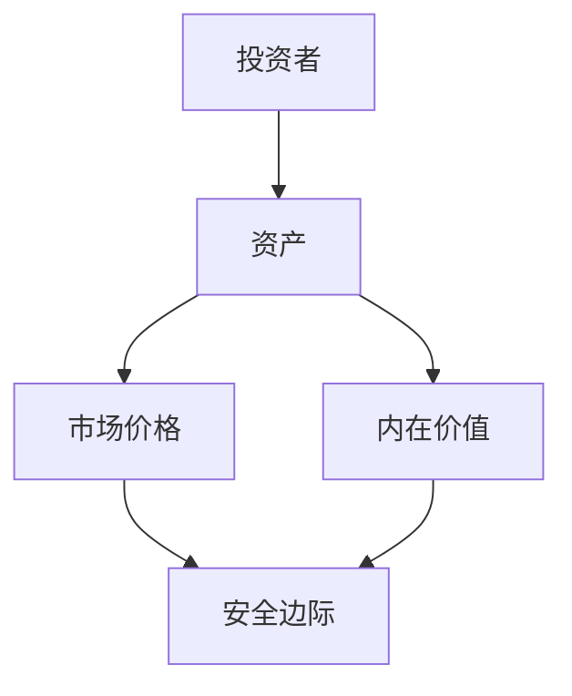
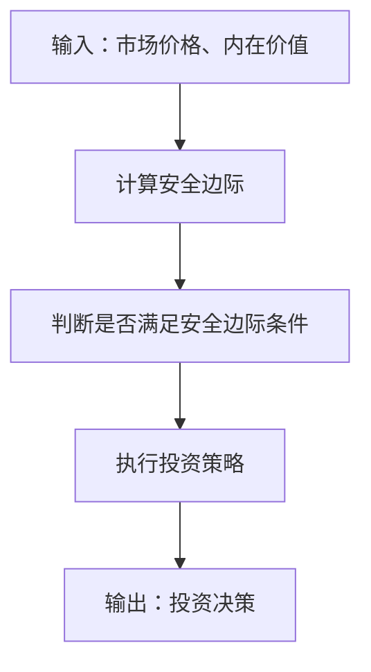
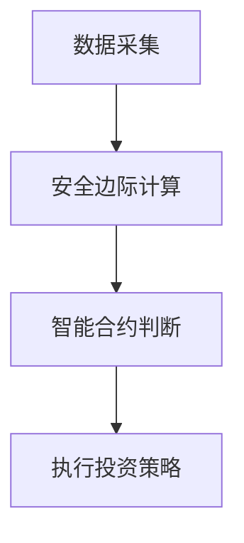

                 


# 《格雷厄姆安全边际概念在去中心化自治投资（DAI）中的应用》

> 关键词：格雷厄姆安全边际，去中心化自治投资（DAI），区块链技术，投资策略，风险管理，智能合约

> 摘要：本文系统地探讨了格雷厄姆安全边际这一经典投资概念在现代去中心化自治投资（DAI）中的应用。通过分析安全边际的核心原理、数学模型及其在DAI系统中的实现，本文提出了结合格雷厄姆安全边际的DAI算法框架，并通过实际案例验证了其有效性和可行性。文章还详细讨论了系统架构设计、项目实战及最佳实践，为读者提供了从理论到实践的全面指导。

---

# 第1章: 格雷厄姆安全边际与去中心化自治投资（DAI）概述

## 1.1 格雷厄姆安全边际的背景与核心思想

### 1.1.1 格雷厄姆安全边际的定义

安全边际是本杰明·格雷厄姆提出的一个投资概念，指的是资产的内在价值与市场价格之间的差额。它为投资者提供了在市场价格波动时的“缓冲空间”，以降低投资风险。

$$ \text{安全边际} = \text{内在价值} - \text{市场价格} $$

### 1.1.2 格雷厄姆安全边际的核心思想

- **价值投资**：强调以低于内在价值的价格购买资产。
- **风险管理**：通过安全边际降低市场价格波动带来的损失。
- **长期视角**：关注资产的长期价值而非短期价格波动。

### 1.1.3 格雷厄姆安全边际的特点

- **安全性**：提供价格波动的保护空间。
- **灵活性**：根据市场变化动态调整。
- **保守性**：以防御性投资策略为核心。

## 1.2 去中心化自治投资（DAI）的概念与特点

### 1.2.1 DAI的定义

DAI是基于区块链技术的去中心化投资工具，通过智能合约自动执行投资策略，无需中心化机构的干预。

### 1.2.2 DAI的特点

- **去中心化**：利用区块链技术实现无信任的分布式系统。
- **自动化**：智能合约自动执行投资策略。
- **透明性**：所有交易记录在区块链上，可追溯且不可篡改。
- **可编程性**：通过编写智能合约实现复杂的投资逻辑。

## 1.3 格雷厄姆安全边际与DAI的结合

### 1.3.1 DAI的投资策略

- **价值投资**：通过智能合约筛选具有安全边际的资产。
- **风险管理**：在DAI系统中嵌入安全边际的计算逻辑，确保投资决策的安全性。

### 1.3.2 格雷厄姆安全边际在DAI中的作用

- **降低投资风险**：通过安全边际筛选优质资产，减少市场价格波动带来的损失。
- **自动化决策**：智能合约自动执行安全边际的计算和投资策略。
- **透明与信任**：区块链技术确保计算过程的透明性，增强投资者信任。

---

# 第2章: 格雷厄姆安全边际的核心原理与数学模型

## 2.1 格雷厄姆安全边际的数学模型

### 2.1.1 安全边际的计算公式

$$ \text{安全边际} = \text{内在价值} - \text{市场价格} $$

### 2.1.2 内在价值的估算

内在价值是资产的真实价值，可以通过基本面分析、现金流贴现法等方法估算。

### 2.1.3 安全边际的相对性分析

- **相对安全边际**：将安全边际与市场价格进行比较，判断投资的安全性。
  $$ \text{相对安全边际} = \frac{\text{安全边际}}{\text{市场价格}} $$

## 2.2 格雷厄姆安全边际的属性特征对比

| 属性 | 安全边际 | 市场价格 | 内在价值 |
|------|----------|----------|----------|
| 定义 | 投资者在市场价格下跌时的保护空间 | 资产的市场交易价格 | 资产的真实价值 |
| 作用 | 抵御市场波动风险 | 反映市场供需关系 | 作为投资决策的基准 |
| 计算 | 市场价格与内在价值的差值 | 由市场决定 | 通过分析估算 |

## 2.3 格雷厄姆安全边际的ER实体关系图



---

# 第3章: 格雷厄姆安全边际在DAI中的算法实现

## 3.1 格雷厄姆安全边际的算法流程

### 3.1.1 输入参数

- 市场价格
- 内在价值
- 安全边际阈值

### 3.1.2 算法步骤

1. 计算安全边际：$$ \text{安全边际} = \text{内在价值} - \text{市场价格} $$
2. 判断是否满足安全边际条件：$$ \text{安全边际} \geq \text{安全边际阈值} $$
3. 执行投资策略：根据判断结果，触发买入或卖出指令。

### 3.1.3 算法流程图



## 3.2 基于格雷厄姆安全边际的DAI算法实现

### 3.2.1 智能合约的设计

```solidity
// SPDX-License-Identifier: MIT
pragma solidity ^0.8.0;

contract DAIInvestment {
    // 市场价格
    uint256 public marketPrice;
    // 内在价值
    uint256 public intrinsicValue;
    // 安全边际阈值
    uint256 public safetyMarginThreshold;

    constructor(uint256 _marketPrice, uint256 _intrinsicValue, uint256 _safetyMarginThreshold) {
        marketPrice = _marketPrice;
        intrinsicValue = _intrinsicValue;
        safetyMarginThreshold = _safetyMarginThreshold;
    }

    // 计算安全边际
    function calculateSafetyMargin() public view returns (uint256) {
        return intrinsicValue - marketPrice;
    }

    // 判断是否满足安全边际条件
    function isSafeToInvest() public view returns (bool) {
        return calculateSafetyMargin() >= safetyMarginThreshold;
    }

    // 执行投资策略
    function executeInvestment() public {
        if (isSafeToInvest()) {
            // 执行买入操作
            // （具体实现根据实际需求）
        } else {
            // 执行卖出操作
            // （具体实现根据实际需求）
        }
    }
}
```

### 3.2.2 算法实现的数学模型

$$ \text{投资决策} = \begin{cases} 
\text{买入} & \text{如果 } \text{安全边际} \geq \text{安全边际阈值} \\
\text{卖出} & \text{否则}
\end{cases} $$

---

# 第4章: 基于格雷厄姆安全边际的DAI系统架构设计

## 4.1 系统功能设计

### 4.1.1 功能模块

- 数据采集模块：采集市场价格、资产信息等数据。
- 安全边际计算模块：计算安全边际并判断是否满足投资条件。
- 智能合约执行模块：根据判断结果执行投资策略。

### 4.1.2 功能流程图



## 4.2 系统架构设计

### 4.2.1 系统架构图


### 4.2.2 接口设计

- 数据接口：与数据源（如交易所API）对接，获取市场价格数据。
- 智能合约接口：与区块链平台对接，执行投资策略。

---

# 第5章: 格雷厄姆安全边际在DAI中的项目实战

## 5.1 项目环境配置

- 区块链平台：以太坊（Ethereum）
- 编程语言：Solidity（智能合约）、Python（后端逻辑）
- 开发工具：Remix IDE、Geth、Web3.py

## 5.2 核心代码实现

### 5.2.1 智能合约实现

```solidity
// SPDX-License-Identifier: MIT
pragma solidity ^0.8.0;

contract DAIInvestment {
    uint256 public marketPrice;
    uint256 public intrinsicValue;
    uint256 public safetyMarginThreshold;

    constructor(uint256 _marketPrice, uint256 _intrinsicValue, uint256 _safetyMarginThreshold) {
        marketPrice = _marketPrice;
        intrinsicValue = _intrinsicValue;
        safetyMarginThreshold = _safetyMarginThreshold;
    }

    function calculateSafetyMargin() public view returns (uint256) {
        return intrinsicValue - marketPrice;
    }

    function isSafeToInvest() public view returns (bool) {
        return calculateSafetyMargin() >= safetyMarginThreshold;
    }

    function executeInvestment() public {
        if (isSafeToInvest()) {
            // 执行买入操作
            // （具体实现根据实际需求）
        } else {
            // 执行卖出操作
            // （具体实现根据实际需求）
        }
    }
}
```

### 5.2.2 后端逻辑实现

```python
from web3 import Web3

# 初始化Web3实例
w3 = Web3(Web3.HTTPProvider("http://localhost:8545"))

# 智能合约地址
contract_address = "0xYourContractAddress"

# 智能合约ABI
contract_abi = [
    # 合约ABI接口定义
]

# 实例化合约
contract = w3.eth.contract(address=contract_address, abi=contract_abi)

# 调用calculateSafetyMargin方法
safety_margin = contract.functions.calculateSafetyMargin().call()

# 调用isSafeToInvest方法
is_safe = contract.functions.isSafeToInvest().call()

# 执行投资策略
if is_safe:
    contract.functions.executeInvestment().transact()
else:
    # 处理卖出操作
    pass
```

## 5.3 实际案例分析

### 5.3.1 案例背景

假设某资产的市场价格为 $50，内在价值为 $60，安全边际阈值为 $5。

### 5.3.2 计算过程

1. 计算安全边际：$$ \text{安全边际} = 60 - 50 = 10 $$
2. 判断是否满足安全边际阈值：$$ 10 \geq 5 $$ → 满足条件。
3. 执行买入操作。

### 5.3.3 结果分析

通过安全边际的计算，系统自动执行买入操作，确保投资的安全性。

---

# 第6章: 格雷厄姆安全边际在DAI中的最佳实践与注意事项

## 6.1 最佳实践

- **动态调整安全边际阈值**：根据市场变化动态调整安全边际阈值，以适应不同的市场环境。
- **结合其他风险管理工具**：将安全边际与其他风险管理工具（如止损订单）结合使用，增强投资组合的稳定性。
- **定期审计与优化**：定期对DAI系统进行审计，优化算法逻辑，确保系统的安全性和高效性。

## 6.2 注意事项

- **市场波动风险**：安全边际只能降低部分市场波动风险，无法完全消除。
- **智能合约风险**：智能合约代码错误可能导致严重损失，需谨慎设计和测试。
- **合规性问题**：确保DAI系统的运行符合相关法律法规要求。

---

# 第7章: 结论与展望

## 7.1 本章小结

本文系统地探讨了格雷厄姆安全边际在去中心化自治投资（DAI）中的应用，提出了基于安全边际的DAI算法框架，并通过实际案例验证了其有效性和可行性。

## 7.2 未来展望

随着区块链技术的不断发展，DAI系统将更加智能化和自动化。未来的研究方向包括：

- **智能合约的优化**：进一步提升智能合约的执行效率和安全性。
- **多资产配置策略**：探索基于安全边际的多资产配置策略，优化投资组合的风险收益比。
- **风险管理的创新**：结合大数据、人工智能等技术，创新风险管理工具和策略。

---

# 作者：AI天才研究院/AI Genius Institute & 禅与计算机程序设计艺术 /Zen And The Art of Computer Programming

