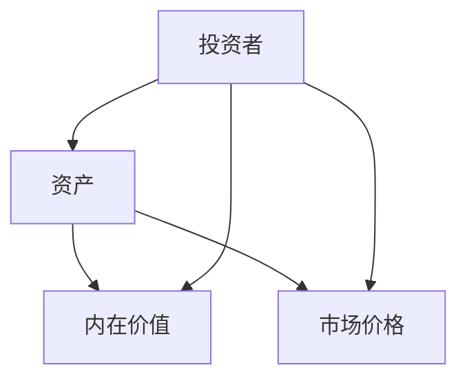

                 


# 格雷厄姆安全边际概念在市场剧烈波动中的应用

> 关键词：格雷厄姆安全边际，投资风险管理，市场波动，价值投资，内在价值评估

> 摘要：本文深入探讨了格雷厄姆安全边际概念在市场剧烈波动中的应用，分析其在投资风险管理中的作用，并通过算法和数学模型详细讲解其在波动市场中的应用策略。文章结合实际案例，系统性地展示了如何在市场波动中运用安全边际概念进行投资决策，提供了从理论到实践的全面指导。

---

# 第一章: 背景介绍

## 1.1 核心概念术语说明

- **安全边际**：投资时以低于内在价值的价格购买资产，以应对市场价格波动带来的风险。
- **内在价值**：资产在理性分析下的真实价值，与市场价格可能偏离。
- **市场波动**：市场价格因市场情绪、突发事件等因素的短期剧烈波动。

## 1.2 问题背景

市场波动是投资中的常见现象，尤其是股市经常经历剧烈波动。投资者在波动中容易受情绪影响，做出非理性决策。格雷厄姆的安全边际概念提供了一种防御性投资策略，帮助投资者在波动中保持理性，降低风险。

## 1.3 问题描述

在市场剧烈波动时，资产价格可能远低于或高于其内在价值。投资者需识别这种偏差，并利用安全边际概念进行投资决策，以稳定收益并降低风险。

## 1.4 问题解决

通过安全边际概念，投资者可以在市场价格低于内在价值时买入，利用波动带来的低价机会，同时在价格高于内在价值时卖出，避免损失。

## 1.5 边界与外延

- **边界**：适用于长期价值投资，不适用于短期交易或高频交易。
- **外延**：可扩展至其他资产类别，如房地产、债券等。

## 1.6 核心要素组成

- **内在价值评估**：准确计算资产的内在价值。
- **市场价格波动**：分析价格波动的规律和影响因素。
- **安全边际计算**：确定在波动中可接受的安全边际宽度。

---

# 第二章: 核心概念与联系

## 2.1 核心概念的原理

安全边际通过在价格低于内在价值时买入，确保投资在波动中具有缓冲空间，避免因价格波动导致的损失。

## 2.2 核心概念的属性对比

| 属性       | 安全边际                | 其他投资策略              |
|------------|------------------------|--------------------------|
| 风险控制   | 强调风险缓冲             | 可能忽略短期波动          |
| 投资目标   | 稳定收益                | 追求短期收益              |
| 适用场景   | 市场波动较大             | 市场稳定或趋势性上涨       |

## 2.3 实体关系图



---

# 第三章: 算法与数学模型

## 3.1 内在价值计算公式

$$ V = \frac{CF}{(1 + r)^n} $$
其中，\( V \) 是内在价值，\( CF \) 是未来现金流，\( r \) 是折现率，\( n \) 是时间跨度。

## 3.2 安全边际计算公式

$$ Margin = V - P $$
其中，\( P \) 是市场价格，\( V \) 是内在价值。

## 3.3 内在价值计算步骤


## 3.4 Python实现

```python
def calculate_intrinsic_value(cf, discount_rate, periods):
    return sum(cf * (1 + discount_rate) ** (-i) for i in range(periods))

cf = 1000
discount_rate = 0.05
periods = 5
iv = calculate_intrinsic_value(cf, discount_rate, periods)
print(f"内在价值为: {iv}")
```

---

# 第四章: 系统分析与架构设计

## 4.1 问题场景

投资者需在市场波动中快速计算内在价值和安全边际，做出投资决策。

## 4.2 系统功能设计

- **数据采集**：获取资产的历史数据和实时价格。
- **价值评估**：计算内在价值。
- **安全边际计算**：确定安全边际宽度。
- **决策支持**：提供买入、卖出或持有建议。

## 4.3 系统架构图


## 4.4 接口设计

- **数据接口**：API获取市场数据。
- **计算接口**：函数计算内在价值和安全边际。
- **决策接口**：基于安全边际给出投资建议。

---

# 第五章: 项目实战

## 5.1 环境安装

安装必要的库，如Pandas、NumPy、Matplotlib。

## 5.2 核心实现

编写计算内在价值和安全边际的函数，并进行数据可视化。

## 5.3 案例分析

以某股票为例，计算其内在价值和安全边际，分析投资决策。

---

# 第六章: 最佳实践与小结

## 6.1 最佳实践

- 定期重新评估内在价值和安全边际。
- 结合多种投资策略，分散风险。
- 长期持有，避免频繁交易。

## 6.2 小结

格雷厄姆的安全边际概念在市场波动中提供了有效的风险管理工具，帮助投资者在不确定性中做出理性决策。

## 6.3 注意事项

- 安全边际计算依赖于准确的内在价值评估。
- 市场波动可能影响安全边际的有效性。
- 需结合市场环境和资产特性调整安全边际宽度。

## 6.4 拓展阅读

推荐阅读格雷厄姆的《 Intelligent Investor》和彼得·林奇的投资著作。

---

作者：AI天才研究院/AI Genius Institute & 禅与计算机程序设计艺术 /Zen And The Art of Computer Programming

