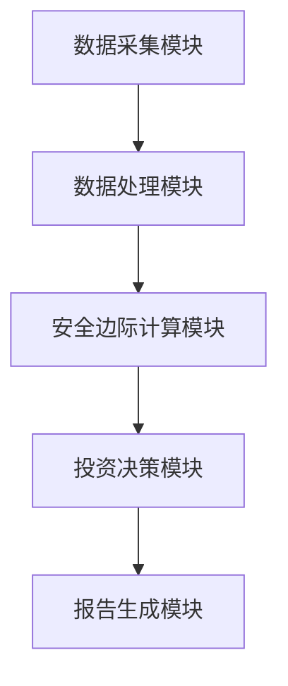

                 


# 格雷厄姆安全边际概念在特价股票选择中的应用

> 关键词：格雷厄姆，安全边际，特价股票，价值投资，股票选择，投资策略

> 摘要：本文深入探讨了格雷厄姆的安全边际概念在特价股票选择中的应用。通过分析安全边际的定义、原理及其在股票估值中的作用，结合具体的算法和系统架构设计，本文详细阐述了如何利用安全边际概念来选择具备长期投资价值的特价股票。文章还通过实际案例分析和项目实战，展示了安全边际在投资决策中的实际应用和效果。

---

## 第1章: 格雷厄姆安全边际概念的背景与定义

### 1.1 格雷厄姆投资理论的背景

本杰明·格雷厄姆是价值投资的鼻祖，他的投资理念深刻影响了巴菲特等众多投资者。格雷厄姆提出的“安全边际”概念是价值投资的核心原则之一。安全边际是指投资者在买入股票时，支付的价格低于股票的内在价值，从而为投资决策提供一个“安全空间”，以降低投资风险并确保长期收益。

#### 1.1.1 格雷厄姆与价值投资的起源

格雷厄姆在20世纪初提出了价值投资的理念，强调从基本面分析股票的价值，而不是盲目跟随市场波动。他的理论奠定了现代投资学的基础，尤其是在股票估值和风险控制方面具有深远影响。

#### 1.1.2 安全边际概念的提出与意义

安全边际的核心思想是通过购买价格低于内在价值的股票，确保在市场波动中仍能获得正收益。这一概念不仅帮助投资者在市场下跌时减少损失，还在市场上涨时增加潜在收益。

#### 1.1.3 格雷厄姆投资哲学的核心要素

格雷厄姆的投资哲学包括以下核心要素：
- 以合理的价格买入优质的资产。
- 避免情绪化投资，坚持基本面分析。
- 通过分散投资降低风险。

### 1.2 安全边际的定义与计算

#### 1.2.1 安全边际的定义

安全边际 = 内在价值 - 市场价格

安全边际越大，投资的“安全空间”越大，投资风险越小。

#### 1.2.2 安全边际与投资风险的关系

安全边际的存在为投资者提供了在市场波动中应对价格波动的缓冲空间，从而降低了投资的波动性和风险。

---

## 第2章: 特价股票选择的核心概念

### 2.1 特价股票的定义与分类

#### 2.1.1 特价股票的定义

特价股票是指市场价格显著低于其内在价值的股票。这类股票通常被市场低估，具有较大的上涨潜力。

#### 2.1.2 特价股票的特点

- 价格低于内在价值。
- 市场关注度较低。
- 具有较高的安全边际。

#### 2.1.3 特价股票的分类

根据不同的标准，特价股票可以分为以下几类：
- 周期性特价股票：受经济周期影响较大的股票。
- 价值陷阱股票：看似便宜，但实际基本面不佳的股票。
- 高质量特价股票：基本面良好且价格显著低于内在价值的股票。

### 2.2 格雷厄姆安全边际在特价股票选择中的应用

#### 2.2.1 安全边际在特价股票选择中的作用

安全边际是判断一只股票是否为特价股票的重要标准。通过计算安全边际，投资者可以筛选出价格显著低于内在价值的股票，从而提高投资的成功率。

#### 2.2.2 安全边际与特价股票的估值

投资者可以通过计算股票的内在价值和市场价格之间的差异来确定安全边际。如果安全边际较大，则该股票可能是一只特价股票。

#### 2.2.3 安全边际在特价股票选择中的优势

- 提高投资的抗风险能力。
- 增加投资的长期收益潜力。
- 降低投资决策的主观性。

---

## 第3章: 格雷厄姆安全边际的算法原理

### 3.1 安全边际计算的算法步骤

#### 3.1.1 算法步骤

1. 计算股票的内在价值。
2. 确定股票的市场价格。
3. 计算安全边际 = 内在价值 - 市场价格。
4. 判断安全边际是否大于零，如果是，则该股票可能是一只特价股票。

#### 3.1.2 算法实现的Python代码

```python
def calculate_margin_of_safety(intrinsic_value, market_price):
    margin_of_safety = intrinsic_value - market_price
    return margin_of_safety

# 示例计算
intrinsic_value = 100  # 假设股票的内在价值为100
market_price = 80      # 市场价格为80
margin_of_safety = calculate_margin_of_safety(intrinsic_value, market_price)
print(f"安全边际为: {margin_of_safety}")
```

#### 3.1.3 数学模型与公式

股票的内在价值可以使用多种方法进行评估，例如：

$$
\text{内在价值} = \sum_{t=1}^{\infty} \frac{\text{现金流}_t}{(1 + r)^t}
$$

其中，r是折现率，现金流是未来现金流的预测值。

---

## 第4章: 系统架构与设计

### 4.1 系统功能设计

#### 4.1.1 系统功能模块

- 数据采集模块：采集股票的基本面数据和市场数据。
- 计算模块：计算股票的内在价值和市场价格。
- 安全边际计算模块：计算安全边际并判断是否为特价股票。
- 报告生成模块：生成投资报告和风险提示。

#### 4.1.2 系统架构设计

系统架构设计如下：



#### 4.1.3 系统接口设计

- 数据接口：从数据源获取股票的基本面数据和市场数据。
- 计算接口：调用安全边际计算函数。
- 输出接口：生成投资报告和风险提示。

---

## 第5章: 项目实战与案例分析

### 5.1 项目环境安装

- 安装Python和必要的库（如Pandas、NumPy、Matplotlib）。
- 安装数据获取工具（如Yahoo Finance API）。

### 5.2 核心代码实现

```python
import pandas as pd
import numpy as np

def calculate_intrinsic_value(cash_flows, discount_rate):
    intrinsic_value = 0
    for t in range(len(cash_flows)):
        intrinsic_value += cash_flows[t] / (1 + discount_rate) ** t
    return intrinsic_value

# 示例数据
cash_flows = [100, 120, 140, 160]  # 假设未来四年的现金流
discount_rate = 0.08                # 折现率
iv = calculate_intrinsic_value(cash_flows, discount_rate)
print(f"内在价值为: {iv}")
```

### 5.3 代码解读与分析

- `calculate_intrinsic_value`函数：计算股票的内在价值。
- 输入参数：现金流和折现率。
- 输出结果：股票的内在价值。

### 5.4 案例分析

假设某股票的内在价值为100，市场价格为80，其安全边际为20。根据格雷厄姆的安全边际概念，该股票具有较高的投资价值。

---

## 第6章: 总结与展望

### 6.1 总结

本文详细探讨了格雷厄姆的安全边际概念在特价股票选择中的应用，通过算法和系统设计展示了如何利用安全边际概念来选择具备长期投资价值的特价股票。

### 6.2 展望

未来，随着人工智能和大数据技术的发展，安全边际的概念将被进一步优化和扩展，为投资者提供更加精准的投资决策支持。

---

## 第7章: 注意事项与最佳实践

### 7.1 注意事项

- 确保数据的准确性和及时性。
- 合理选择折现率和其他假设参数。
- 定期评估和调整投资组合。

### 7.2 最佳实践

- 结合多种估值方法进行综合评估。
- 定期跟踪股票的基本面和市场表现。
- 避免过度依赖单一指标做出投资决策。

---

## 作者信息

作者：AI天才研究院/AI Genius Institute  
联系方式：[contact@aigenius.org](mailto:contact@aigenius.org)  
网站：[https://www.aigenius.org](https://www.aigenius.org)

---

通过本文的系统分析和实战案例，读者可以深入理解格雷厄姆的安全边际概念，并将其应用于特价股票的选择中，从而实现更加稳健和高效的投资策略。

