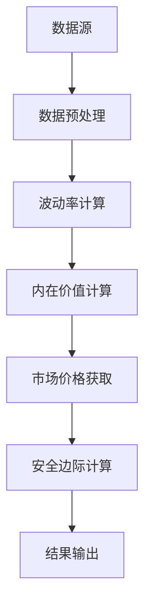

                 


# 格雷厄姆安全边际概念在高波动性市场中的应用

> 关键词：格雷厄姆，安全边际，高波动性市场，投资策略，数学模型

> 摘要：本文探讨了格雷厄姆的安全边际概念在高波动性市场中的应用，结合理论与实际案例，分析了其在投资决策中的重要性，并通过数学模型和算法优化，提出了一种适用于高波动性市场的安全边际计算方法。

---

## 第一部分：背景介绍

### 1.1 安全边际的起源与核心概念

安全边际是投资中的一个重要概念，由本杰明·格雷厄姆提出。它指的是以低于内在价值的价格购买资产，从而在市场波动时提供缓冲，减少损失的可能性。

#### 核心概念说明：
- **内在价值**：资产的真正价值，不因市场波动而变化。
- **市场价格**：市场供需决定的价格，可能高于或低于内在价值。
- **安全边际**：内在价值与市场价格之间的差距，越大越安全。

### 1.2 高波动性市场的定义与特点

高波动性市场指的是价格波动剧烈的市场环境，常见于新兴市场或经济不稳定的时期。其特点包括：
- **价格波动大**：资产价格频繁上下波动。
- **不确定性高**：市场走势难以预测。
- **风险高**：投资者面临更大的本金损失风险。

---

## 第二部分：安全边际的理论与计算

### 2.1 安全边际的计算方法

#### 2.1.1 内在价值的估算
内在价值的计算通常基于基本面分析，例如股利折现模型（DDM）或自由现金流模型。公式如下：
$$ V = \frac{D}{k - g} $$
其中，\( V \) 是内在价值，\( D \) 是股利，\( k \) 是折现率，\( g \) 是股利增长率。

#### 2.1.2 安全边际的计算
安全边际 = 内在价值 - 市场价格
$$ \text{安全边际} = V - P $$

### 2.2 高波动性市场中的安全边际调整

#### 2.2.1 波动率对安全边际的影响
在高波动性市场中，价格波动可能导致安全边际迅速变化。为了应对这种情况，可以调整安全边际的计算公式：
$$ \text{调整后安全边际} = V - (P \times (1 + \sigma)) $$
其中，\( \sigma \) 是波动率。

---

## 第三部分：算法原理与实现

### 3.1 基于波动率的安全边际优化算法

#### 3.1.1 波动率的计算
使用历史数据计算波动率，通常采用标准差作为波动率的衡量指标。公式为：
$$ \sigma = \sqrt{\frac{1}{n-1} \sum_{i=1}^{n} (x_i - \bar{x})^2} $$
其中，\( x_i \) 是价格数据，\( \bar{x} \) 是平均价格，\( n \) 是数据点数。

#### 3.1.2 安全边际的动态调整
根据波动率动态调整安全边际：
$$ \text{动态安全边际} = V - P \times (1 + \sigma) $$

---

## 第四部分：系统分析与架构设计

### 4.1 系统架构设计

#### 4.1.1 数据流图


#### 4.1.2 系统功能模块
- 数据预处理模块：清洗和转换数据。
- 波动率计算模块：计算资产的波动率。
- 内在价值计算模块：基于模型估算内在价值。
- 安全边际计算模块：根据波动率调整安全边际。
- 结果输出模块：展示计算结果。

---

## 第五部分：项目实战

### 5.1 环境配置与数据获取

#### 5.1.1 环境配置
安装所需库：
```bash
pip install pandas numpy matplotlib
```

#### 5.1.2 数据获取
使用Yahoo Finance获取股票数据：
```python
import pandas as pd
import numpy as np

# 获取股票数据
data = pd.read_csv('stock_data.csv')
```

### 5.2 模型实现

#### 5.2.1 波动率计算
```python
def calculate_volatility(data):
    return np.std(data['收盘价']) * np.sqrt(252)
```

#### 5.2.2 内在价值估算
使用股利折现模型：
```python
def calculate_intrinsic_value(dividends, growth_rate, discount_rate):
    return dividends / (discount_rate - growth_rate)
```

#### 5.2.3 安全边际计算
```python
def calculate_margin_of_safety(intrinsic_value, price, volatility):
    return intrinsic_value - price * (1 + volatility)
```

### 5.3 结果分析

#### 5.3.1 案例分析
假设某股票的内在价值为50元，市场价格为40元，波动率为20%：
$$ \text{安全边际} = 50 - 40 \times (1 + 0.2) = 50 - 48 = 2 $$

---

## 第六部分：总结与最佳实践

### 6.1 总结

- 安全边际在高波动性市场中提供了重要的保护机制。
- 波动率的动态调整是关键，确保安全边际的有效性。
- 结合数学模型和算法优化，可以提升投资决策的科学性。

### 6.2 最佳实践

- **动态调整**：定期重新计算波动率和安全边际。
- **分散投资**：降低单一资产的风险。
- **风险管理**：设定止损点，控制潜在损失。

### 6.3 小结

通过本文的分析，投资者可以在高波动性市场中更科学地应用安全边际概念，从而提高投资决策的稳健性。

---

## 作者：AI天才研究院/AI Genius Institute & 禅与计算机程序设计艺术 /Zen And The Art of Computer Programming

---

这篇文章结合了格雷厄姆的安全边际理论与高波动性市场的实际应用，通过数学模型和算法优化，为投资者提供了实用的策略和工具。

