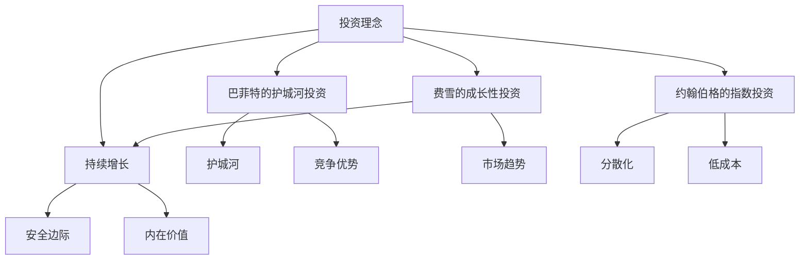

                 

# 格雷厄姆、巴菲特、费雪和约翰伯格的投资理念比较

> 关键词：投资理念，价值投资，成长投资，指数投资，巴菲特，格雷厄姆，费雪，约翰伯格

> 摘要：本文系统地比较了格雷厄姆、巴菲特、费雪和约翰伯格四位投资大师的投资理念，从背景介绍、核心概念、数学模型、系统架构设计到项目实战，逐一进行了详细分析。通过对比，我们能够理解不同投资策略的优劣，并为实际投资提供参考。

---

## 第一部分: 投资理念背景与核心概念

### 第1章: 投资理念的背景与问题背景

#### 1.1 投资理念的核心概念

投资理念是指投资者在进行资产配置和投资决策时所遵循的基本原则和方法。它涵盖了对市场行为、资产价值、风险管理和收益预期的理解和判断。投资理念的核心在于如何选择投资标的、如何评估其价值以及如何制定长期的投资策略。

现代投资市场日益复杂，投资者需要面对不断变化的市场环境、多样化的资产类型以及日益增多的市场参与者。因此，选择一种合适的投资理念显得尤为重要。本文将比较分析格雷厄姆、巴菲特、费雪和约翰伯格四位投资大师的理念，探讨它们的异同点以及实际应用中的优缺点。

#### 1.2 格雷厄姆、巴菲特、费雪和约翰伯格的背景介绍

##### 1.2.1 格雷厄姆的背景与贡献

本杰明·格雷厄姆（Benjamin Graham）被誉为“价值投资之父”，他是20世纪最伟大的投资理论家之一。格雷厄姆出生于1894年，去世于1976年。他在哥伦比亚大学教授证券分析，并与戴维·多德（David Dodd）合著了《证券分析》一书。格雷厄姆的投资理念强调安全边际和内在价值，主张以低于内在价值的价格购买股票。

##### 1.2.2 巴菲特的背景与贡献

沃伦·巴菲特（Warren Buffett）是美国著名投资家、慈善家，被誉为“奥马哈的先知”。他是格雷厄姆的学生，继承并发展了格雷厄姆的价值投资理念。巴菲特的投资策略强调长期持有、集中投资以及寻找具有强大护城河的公司。他的成功使他成为全球最富有的人之一，并且他的投资理念影响了全球无数投资者。

##### 1.2.3 费雪的背景与贡献

菲利普·费雪（Philip Fisher）是美国著名的成长型投资者，他于1906年开始投资生涯，被认为是成长投资的鼻祖。费雪的投资理念强调选择具有持续增长潜力的公司，并长期持有。他提出了“购买并持有”策略，并认为投资的成功取决于对公司的深入了解和长期的市场趋势分析。

##### 1.2.4 约翰伯格的背景与贡献

约翰·C·伯格（John C. Bogle）是美国著名的指数投资倡导者，他是先锋集团（Vanguard Group）的创始人。伯格于1949年加入富达投资，1974年创立先锋集团。他提出了指数基金的概念，并认为指数投资是普通人实现财务自由的最佳方式。伯格的投资理念强调低成本、分散化和长期投资。

#### 1.3 投资理念的核心要素

投资理念的核心要素包括以下几点：

1. **投资目标**：是追求短期收益还是长期增值。
2. **投资策略**：是主动管理还是被动跟踪市场。
3. **风险管理**：如何评估和控制投资风险。
4. **价值评估**：如何确定投资标的的内在价值。
5. **市场观点**：对市场波动、周期和趋势的看法。

### 第2章: 核心概念与联系

#### 2.1 核心概念原理

##### 2.1.1 格雷厄姆的价值投资原理

格雷厄姆的价值投资原理强调以低于内在价值的价格购买股票。他提出了“安全边际”概念，即买入价格与内在价值之间的差距，以降低投资风险。他的投资策略基于对公司基本面的深入分析，包括财务报表分析和估值模型的应用。

##### 2.1.2 巴菲特的护城河投资原理

巴菲特的投资理念是寻找具有强大护城河的公司。护城河是指公司在市场上具有竞争优势，能够长期保持高利润率和市场份额。巴菲特倾向于投资那些具有强大护城河的公司，并长期持有，以获得复利效应。

##### 2.1.3 费雪的成长性投资原理

菲利普·费雪的成长性投资原理强调选择具有持续增长潜力的公司。他认为，投资成功的关键在于选择那些能够不断增长的公司，并长期持有。他提出了“买入并持有”的策略，并认为市场先生是投资的朋友，而不是敌人。

##### 2.1.4 约翰伯格的指数投资原理

约翰·伯格的指数投资原理强调低成本、分散化和长期投资。他认为，市场很难被预测，普通投资者很难通过主动管理获得超额收益。因此，他主张通过投资指数基金，以获得市场平均收益。

#### 2.2 核心概念对比表格

| 投资理念 | 格雷厄姆的价值投资 | 巴菲特的护城河投资 | 费雪的成长性投资 | 约翰伯格的指数投资 |
|----------|-------------------|-------------------|-------------------|-------------------|
| 核心目标 | 寻找低于内在价值的股票 | 寻找具有强大竞争优势的公司 | 寻找具有持续增长潜力的公司 | 投资市场指数，获得平均收益 |
| 投资策略 | 买入并持有，强调安全边际 | 集中投资，长期持有 | 买入并持有，长期关注公司发展 | 分散投资，投资指数基金 |
| 风险管理 | 强调安全边际，降低风险 | 通过护城河降低竞争风险 | 通过公司增长降低市场风险 | 通过分散化降低市场风险 |
| 适用场景 | 适合价值被低估的市场 | 适合具有强大竞争优势的行业 | 适合成长型企业 | 适合无法选择个股的投资者 |

#### 2.3 ER实体关系图

---

## 第二部分: 算法原理讲解

### 第3章: 算法原理概述

#### 3.1 格雷厄姆的价值评估模型

格雷厄姆提出了著名的Grah

