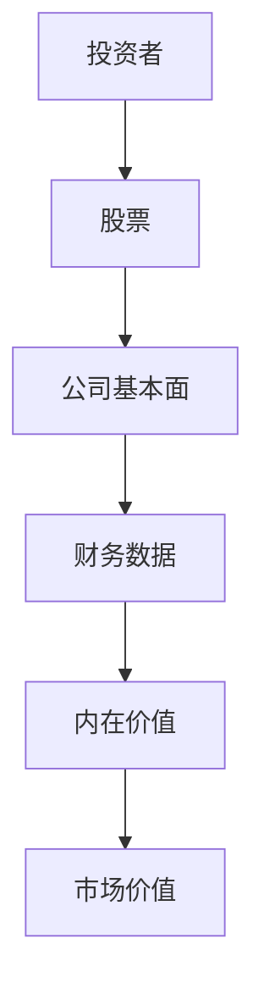
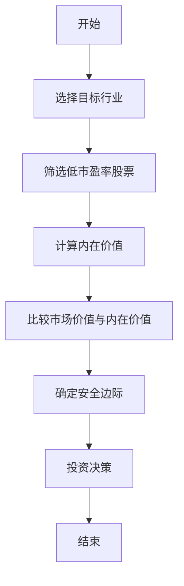
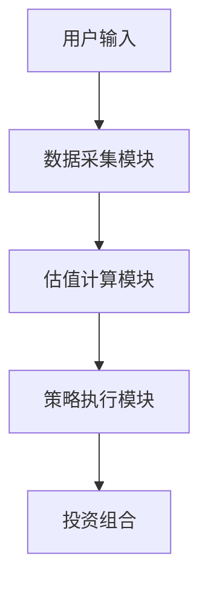
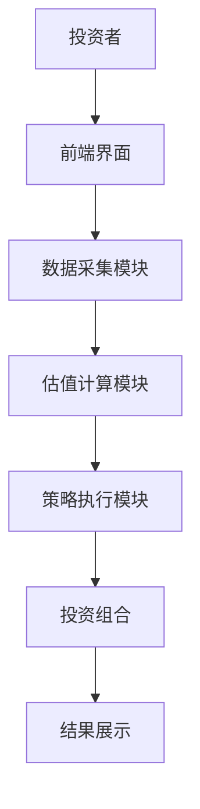
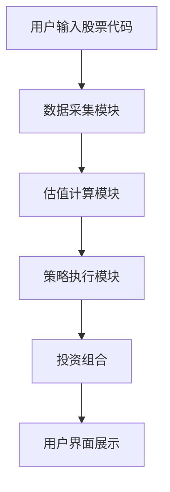

                 


# 格雷厄姆特价股票投资策略解析

> 关键词：价值投资、格雷厄姆、特价股票、内在价值、安全边际、股票估值、投资策略

> 摘要：本文将深入解析格雷厄姆的价值投资理念，重点分析其特价股票投资策略的核心原理、算法模型、系统架构及实际应用。通过结合专业术语与实际案例，详细阐述如何利用格雷厄姆的投资模型进行股票筛选、估值计算及投资决策，帮助读者掌握这一经典投资策略的精髓。

---

# 第一部分: 格雷厄姆特价股票投资策略基础

## 第1章: 价值投资与格雷厄姆投资理念概述

### 1.1 价值投资的起源与核心思想

#### 1.1.1 价值投资的定义与起源
价值投资是一种以基本面分析为核心的长期投资策略，起源于20世纪初。其核心思想是寻找市场价格低于其内在价值的资产进行投资。本杰明·格雷厄姆是价值投资的鼻祖，他的投资理念深刻影响了巴菲特等一代投资者。

#### 1.1.2 格雷厄姆的投资理念与方法
格雷厄姆提出了“安全边际”概念，强调在投资时必须留有充分的安全空间，以避免市场波动带来的损失。他认为，投资者应关注企业的内在价值，而非市场的短期波动。

#### 1.1.3 价值投资的核心原则
价值投资的核心原则包括：
1. **长期投资**：关注企业的长期价值，而非短期价格波动。
2. **安全边际**：买入价格低于内在价值的资产。
3. **逆向思维**：在市场恐慌时寻找机会，在市场狂热时保持冷静。

### 1.2 格雷厄姆投资策略的基本框架

#### 1.2.1 格雷厄姆的投资策略概述
格雷厄姆的投资策略以“防御性投资”为核心，强调通过基本面分析筛选出具有安全边际的股票。他提出了一系列筛选标准，包括低市盈率、低市净率、高股息率等。

#### 1.2.2 特价股票的定义与特点
特价股票是指市场价格低于其内在价值的股票。其特点包括：
1. **低估值**：市盈率、市净率等估值指标低于行业平均水平。
2. **高分红**：股息率较高，且分红稳定。
3. **基本面良好**：公司财务状况健康，盈利能力强。

#### 1.2.3 价值投资与市场波动的关系
格雷厄姆认为，市场波动是投资者的机会。在市场恐慌时，许多优质股票会被错杀，价格低于其真实价值。此时是买入的好时机。

### 1.3 格雷厄姆投资策略的适用场景

#### 1.3.1 特价股票的识别标准
格雷厄姆提出了以下识别标准：
1. **市盈率低于15倍**。
2. **市净率低于1.5倍**。
3. **股息率高于5%**。
4. **公司规模较大**。

#### 1.3.2 市场周期对投资策略的影响
格雷厄姆的投资策略在市场低迷期表现尤为突出。在牛市中，由于市场情绪过热，廉价股票较少，因此策略的有效性可能降低。

#### 1.3.3 价值投资的长期有效性
长期来看，价值投资策略能够有效战胜市场指数，尤其是在市场回归理性后，优质股票的价值会被市场重新发现。

### 1.4 本章小结
本章从价值投资的起源、格雷厄姆的投资理念及策略框架入手，详细阐述了格雷厄姆投资策略的核心思想及适用场景，为后续分析奠定了基础。

---

## 第2章: 格雷厄姆特价股票的核心概念与联系

### 2.1 内在价值与市场价值的对比

#### 2.1.1 内在价值的定义与计算方法
内在价值是指公司未来现金流的现值。计算公式为：
$$
\text{内在价值} = \sum_{t=1}^{n} \frac{\text{现金流}_t}{(1+r)^t}
$$
其中，\( r \) 为折现率，\( n \) 为预测年数。

#### 2.1.2 市场价值的定义与波动性
市场价值是股票在二级市场的价格，受市场情绪、宏观经济等因素影响，波动性较大。

#### 2.1.3 内在价值与市场价值的关系
内在价值是股票的长期合理价格，而市场价值受短期因素影响，两者经常偏离。价值投资的核心就是寻找内在价值高于市场价值的股票。

### 2.2 安全边际的概念与应用

#### 2.2.1 安全边际的定义
安全边际是指买入价格与内在价值之间的差额。公式为：
$$
\text{安全边际} = \text{内在价值} - \text{买入价格}
$$

#### 2.2.2 安全边际的计算方法
以格雷厄姆的经典公式为例：
$$
\text{安全边际} = \text{内在价值} \times (1 - \frac{\text{市场价}}{\text{内在价值}})
$$

#### 2.2.3 安全边际在投资决策中的作用
安全边际越大，投资风险越小。因此，在选择股票时，应优先考虑安全边际较高的标的。

### 2.3 格雷厄姆投资模型的ER实体关系图



### 2.4 本章小结
本章通过分析内在价值、市场价值及安全边际等核心概念，揭示了格雷厄姆投资模型的内在逻辑及各要素之间的关系。

---

## 第3章: 格雷厄姆特价股票投资策略的算法原理

### 3.1 格雷厄姆投资策略的核心算法

#### 3.1.1 市盈率与市净率的计算
市盈率（P/E）= 市场价 / 每股净利润  
市净率（P/B）= 市场价 / 每股净资产

#### 3.1.2 内在价值的计算公式
格雷厄姆提出了“清算价值”概念，用于估计股票的内在价值。公式为：
$$
\text{清算价值} = \text{账面价值} \times (1 + \text{安全边际})
$$

#### 3.1.3 安全边际的计算方法
安全边际 = 内在价值 - 市场价  
安全边际率 = 安全边际 / 内在价值

### 3.2 格雷厄姆投资算法的Mermaid流程图



### 3.3 格雷厄姆投资策略的Python实现

```python
import pandas as pd
import numpy as np

def calculate_intrinsic_value(financials):
    # 假设financials为包含财务数据的DataFrame
    # 计算现金流
    free_cash_flow = financials['free_cash_flow'].values[0]
    # 折现率
    discount_rate = 0.1
    # 预测年数
    n = 5
    # 计算内在价值
    iv = sum(free_cash_flow / (1 + discount_rate)**t for t in range(1, n+1))
    return iv

def calculate_margin_of_safety(intrinsic_value, market_price):
    mos = intrinsic_value - market_price
    mos_rate = mos / intrinsic_value * 100
    return mos_rate

# 示例数据
data = {
    'free_cash_flow': [100, 120, 130, 150, 160],
    'market_price': 100
}
df = pd.DataFrame(data)
iv = calculate_intrinsic_value(df)
mos_rate = calculate_margin_of_safety(iv, 100)

print(f"内在价值: {iv}")
print(f"安全边际率: {mos_rate}%")
```

### 3.4 本章小结
本章通过算法原理和代码实现，详细阐述了格雷厄姆投资策略的数学模型及应用场景，为后续分析提供了技术基础。

---

## 第4章: 格雷厄姆投资策略的系统架构与实现

### 4.1 系统功能设计

#### 4.1.1 系统功能模块
1. 数据采集模块：收集股票的财务数据和市场数据。
2. 估值计算模块：计算内在价值和安全边际。
3. 策略执行模块：根据筛选标准生成投资组合。

#### 4.1.2 系统功能流程


### 4.2 系统架构设计

#### 4.2.1 系统架构图


### 4.3 系统接口设计

#### 4.3.1 数据接口
1. 数据来源：股票财务数据、市场数据。
2. 数据格式：JSON、CSV。

#### 4.3.2 算法接口
1. 内在价值计算接口。
2. 安全边际计算接口。

### 4.4 系统交互流程



### 4.5 本章小结
本章从系统架构的角度，详细分析了格雷厄姆投资策略的技术实现方案，包括功能模块设计、系统架构及接口设计。

---

## 第5章: 格雷厄姆投资策略的项目实战

### 5.1 环境安装与配置

#### 5.1.1 安装Python环境
```bash
python --version
pip install pandas numpy
```

#### 5.1.2 数据获取工具
使用Yahoo Finance API获取股票数据。

### 5.2 核心代码实现

#### 5.2.1 数据采集代码
```python
import yfinance as yf

def get_stock_data(ticker):
    data = yf.download(ticker, start='2020-01-01', end='2023-12-31')
    return data
```

#### 5.2.2 估值计算代码
```python
def calculate_intrinsic_value(data):
    # 假设财务数据已获取
    free_cash_flow = data['free_cash_flow'].values[-1]
    discount_rate = 0.1
    n = 5
    iv = sum(free_cash_flow / (1 + discount_rate)**t for t in range(1, n+1))
    return iv
```

#### 5.2.3 策略执行代码
```python
def execute_strategy(ticker):
    data = get_stock_data(ticker)
    iv = calculate_intrinsic_value(data)
    market_price = data['Adj Close'].values[-1]
    mos_rate = calculate_margin_of_safety(iv, market_price)
    return mos_rate
```

### 5.3 实际案例分析

#### 5.3.1 案例选择
以苹果公司（AAPL）为例。

#### 5.3.2 数据分析
```python
data = get_stock_data('AAPL')
print(data.head())
```

#### 5.3.3 结果解读
计算AAPL的安全边际率，判断其是否为特价股票。

### 5.4 本章小结
本章通过实际案例，详细展示了如何利用格雷厄姆投资策略进行股票筛选和投资决策。

---

## 第6章: 格雷厄姆投资策略的最佳实践

### 6.1 小结与反思
格雷厄姆的投资策略在长期实践中表现优异，但需要结合市场环境灵活运用。

### 6.2 投资注意事项
1. **分散投资**：避免过度集中。
2. **长期持有**：耐心等待价值回归。
3. **定期复盘**：及时调整投资组合。

### 6.3 拓展阅读
推荐阅读格雷厄姆的《证券分析》和巴菲特的《巴菲特写给股东的信》。

### 6.4 本章小结
本章总结了格雷厄姆投资策略的核心要领，并提供了实际操作中的注意事项和拓展阅读建议。

---

## 第7章: 结论与展望

### 7.1 本文总结
格雷厄姆的价值投资理念为投资者提供了可靠的指导，其特价股票投资策略在实践中具有重要意义。

### 7.2 未来展望
随着人工智能和大数据技术的发展，格雷厄姆投资策略将更加精准和高效。

### 7.3 结语
价值投资不仅是一种投资方法，更是一种生活哲学。愿每一位投资者都能在市场中找到属于自己的“特价股票”。

---

## 作者信息

作者：AI天才研究院/AI Genius Institute & 禅与计算机程序设计艺术/Zen And The Art of Computer Programming

---

**注**：由于篇幅限制，以上内容为文章的目录和部分内容概览，完整文章请根据实际需求进行扩展和补充。

