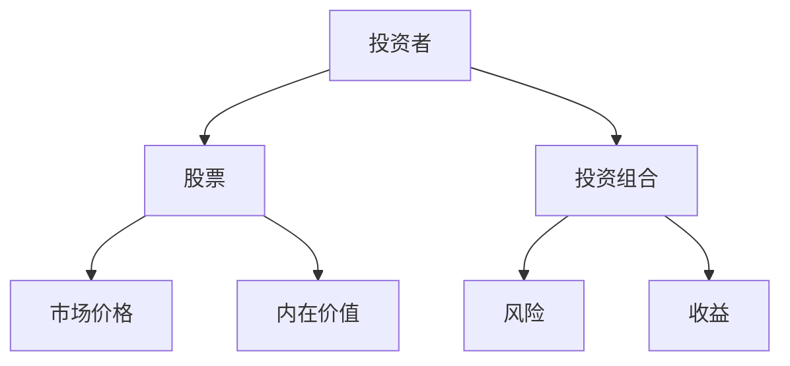
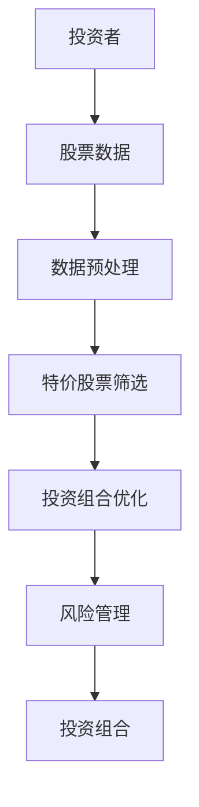

                 


# 格雷厄姆特价股票理论与现代投资组合理论的融合

> 关键词：投资理论，价值投资，现代投资组合理论，股票筛选，风险优化，投资策略

> 摘要：本文将详细探讨格雷厄姆特价股票理论与现代投资组合理论的融合。首先，我们从背景介绍入手，详细讲解两种理论的起源与发展，分析它们的核心理念与异同点。接着，我们将深入探讨这两种理论的核心概念与联系，通过对比分析和实体关系图帮助读者理解它们的融合点。随后，我们将从算法原理的角度，详细阐述格雷厄姆特价股票筛选算法与现代投资组合理论的优化算法，并通过Python代码示例和数学模型帮助读者掌握其实现方式。在系统分析部分，我们将设计一个基于这两种理论的投资组合管理系统，通过领域模型、架构设计和交互流程图展示系统的实现方案。最后，我们将在项目实战中，结合实际案例，通过环境安装、代码实现和案例分析帮助读者巩固所学内容。本文旨在通过理论与实践的结合，为投资者提供一种更为科学、稳健的投资策略。

---

# 第一部分: 格雷厄姆特价股票理论与现代投资组合理论的背景介绍

## 第1章: 格雷厄姆特价股票理论与现代投资组合理论的背景介绍

### 1.1 格雷厄姆特价股票理论的起源与发展

#### 1.1.1 价值投资的起源
价值投资是一种以内在价值为导向的投资策略，其核心思想是寻找市场价格低于内在价值的股票进行投资。这一理念起源于20世纪20年代，由本杰明·格雷厄姆（Benjamin Graham）和戴维·多德（David Dodd）提出。格雷厄姆在其著作《证券分析》（1934年）中首次系统地阐述了价值投资理论。

#### 1.1.2 格雷厄姆的投资理念
格雷厄姆的价值投资理念可以总结为以下几点：
- **安全边际**：买入价格低于内在价值的股票，以确保有一定的安全空间。
- **廉价股票**：寻找市场价格远低于内在价值的股票，即所谓的“特价股票”。
- **长期投资**：避免频繁交易，以降低交易成本和市场波动的影响。

#### 1.1.3 特价股票的定义与特征
格雷厄姆定义的“特价股票”是指市场价格远低于其内在价值的股票。其特征包括：
- 市盈率（P/E）低于行业平均水平。
- 市净率（P/B）低于行业平均水平。
- 股价相对于每股净资产（BPS）大幅折价。

### 1.2 现代投资组合理论的起源与发展

#### 1.2.1 马科维茨现代投资组合理论的提出
现代投资组合理论（MPT）由哈里·马科维茨（Harry Markowitz）于1952年提出，是金融学领域的里程碑式成果。MPT的核心思想是通过分散投资来优化投资组合的风险与收益。

#### 1.2.2 均值-方差模型的核心思想
马科维茨的均值-方差模型假设投资者可以通过调整投资组合的资产配置来优化风险和收益。具体而言，投资者可以通过选择不同资产的组合，在给定风险下实现收益最大化，或在给定收益下实现风险最小化。

#### 1.2.3 现代投资组合理论的演变与应用
随着金融学的发展，MPT不断扩展和改进。现代MPT不仅包括单一资产的优化配置，还包括多资产组合优化、风险因子模型（如CAPM）等。

### 1.3 两种理论的异同与融合

#### 1.3.1 格雷厄姆理论与现代投资组合理论的对比
| 理论名称         | 核心目标               | 投资策略               | 风险管理方式           |
|------------------|-----------------------|-----------------------|-----------------------|
| 格雷厄姆理论     | 寻找被低估的股票       | 价值投资               | 降低市场波动风险       |
| 现代投资组合理论 | 最大化收益最小化风险   | 分散投资               | 数学优化风险结构       |

#### 1.3.2 两者的结合点与融合的可能性
- **价值发现**：格雷厄姆的特价股票筛选方法可以作为MPT的选股基础。
- **风险优化**：MPT的优化方法可以用于格雷厄姆筛选出的股票组合的风险管理。

#### 1.3.3 融合后的投资策略优势
融合后的投资策略结合了格雷厄姆的价值发现优势和MPT的风险优化优势，能够在降低风险的同时，最大化投资收益。

---

# 第二部分: 格雷厄姆特价股票理论与现代投资组合理论的核心概念与联系

## 第2章: 核心概念与联系

### 2.1 核心概念原理

#### 2.1.1 格雷厄姆特价股票理论的核心要素
- **内在价值**：股票的真实价值，与市场价格无关。
- **安全边际**：买入价格与内在价值之间的差距，确保投资的安全性。

#### 2.1.2 现代投资组合理论的核心模型
- **均值-方差模型**：通过计算资产的期望收益和方差，优化投资组合的风险与收益。

#### 2.1.3 两者的数学模型对比
- 格雷厄姆理论：$ \text{安全边际} = \text{市场价格} - \text{内在价值} $
- MPT：$ \text{最优组合} = \argmin_{w} w^T \Sigma w \quad \text{在} \quad w^T \mu = \text{目标收益} $

### 2.2 核心概念属性特征对比表

| 理论名称         | 核心目标               | 投资策略               | 风险管理方式           |
|------------------|-----------------------|-----------------------|-----------------------|
| 格雷厄姆理论     | 寻找被低估的股票       | 价值投资               | 降低市场波动风险       |
| 现代投资组合理论 | 最大化收益最小化风险   | 分散投资               | 数学优化风险结构       |

### 2.3 核心概念的ER实体关系图（Mermaid）



---

# 第三部分: 格雷厄姆特价股票理论与现代投资组合理论的算法原理

## 第3章: 格雷厄姆特价股票筛选算法

### 3.1 格雷厄姆特价股票筛选算法

#### 3.1.1 算法原理
格雷厄姆的特价股票筛选算法基于以下几个指标：
- 市盈率（P/E）：$ \text{P/E} = \frac{\text{股价}}{\text{每股收益}} $
- 市净率（P/B）：$ \text{P/B} = \frac{\text{股价}}{\text{每股净资产}} $
- 股价与净资产比（P/BPS）：$ \text{P/BPS} = \frac{\text{股价}}{\text{每股净资产}} $

#### 3.1.2 算法步骤
1. 收集目标股票的基本数据。
2. 计算每个股票的P/E、P/B和P/BPS。
3. 将股票按上述指标排序，筛选出P/E、P/B和P/BPS均低于行业平均水平的股票。

#### 3.1.3 算法实现的Python代码示例

```python
import pandas as pd

# 假设data是一个包含股票数据的DataFrame
# 包含columns: '股价', '每股收益', '每股净资产'

# 计算P/E、P/B和P/BPS
data['P/E'] = data['股价'] / data['每股收益']
data['P/B'] = data['股价'] / data['每股净资产']
data['P/BPS'] = data['股价'] / data['每股净资产']

# 筛选P/E、P/B和P/BPS均低于行业平均水平的股票
行业平均_P_E = data['P/E'].mean()
行业平均_P_B = data['P/B'].mean()
行业平均_P_BPS = data['P/BPS'].mean()

筛选结果 = data[
    (data['P/E'] < 行业平均_P_E) &
    (data['P/B'] < 行业平均_P_B) &
    (data['P/BPS'] < 行业平均_P_BPS)
]
```

---

## 第4章: 现代投资组合理论的优化算法

### 4.1 现代投资组合理论的优化算法

#### 4.1.1 算法原理
马科维茨的均值-方差模型通过优化投资组合的方差（即风险）来实现收益与风险的最优平衡。

#### 4.1.2 算法步骤
1. 收集目标股票的收益率数据。
2. 计算每只股票的期望收益和协方差矩阵。
3. 通过求解二次规划问题，得到最优投资组合。

#### 4.1.3 算法实现的Python代码示例

```python
import numpy as np
import pandas as pd
from numpy.linalg import inv

# 假设returns是一个包含股票收益率的矩阵
n_assets = returns.shape[1]
expected_returns = returns.mean()
cov_matrix = returns.cov()

# 优化目标：最小化方差，约束条件：收益固定
# 这里简化为无约束优化，实际应用中需要考虑更多约束
weights = inv(cov_matrix) @ np.ones(n_assets)

weights = weights / weights.sum()
```

---

# 第四部分: 格雷厄姆特价股票理论与现代投资组合理论的系统分析

## 第5章: 系统分析与架构设计

### 5.1 投资组合管理系统的设计

#### 5.1.1 系统功能设计
- 股票数据采集模块
- 特价股票筛选模块
- 投资组合优化模块
- 风险管理模块

#### 5.1.2 系统架构设计



---

# 第五部分: 格雷厄姆特价股票理论与现代投资组合理论的项目实战

## 第6章: 项目实战

### 6.1 环境安装与数据准备

#### 6.1.1 环境安装
- 安装Python和必要的库（pandas, numpy, matplotlib等）。

#### 6.1.2 数据准备
- 下载股票数据，包括股价、收益、净资产等。

### 6.2 核心系统实现

#### 6.2.1 特价股票筛选模块实现
```python
import pandas as pd

# 假设data是包含股票数据的DataFrame
data['P/E'] = data['股价'] / data['每股收益']
data['P/B'] = data['股价'] / data['每股净资产']
data['P/BPS'] = data['股价'] / data['每股净资产']

行业平均_P_E = data['P/E'].mean()
行业平均_P_B = data['P/B'].mean()
行业平均_P_BPS = data['P/BPS'].mean()

筛选结果 = data[
    (data['P/E'] < 行业平均_P_E) &
    (data['P/B'] < 行业平均_P_B) &
    (data['P/BPS'] < 行业平均_P_BPS)
]
```

#### 6.2.2 投资组合优化模块实现
```python
import numpy as np
import pandas as pd
from numpy.linalg import inv

# 假设returns是一个包含股票收益率的矩阵
n_assets = returns.shape[1]
expected_returns = returns.mean()
cov_matrix = returns.cov()

weights = inv(cov_matrix) @ np.ones(n_assets)
weights = weights / weights.sum()
```

### 6.3 案例分析与结果解读

#### 6.3.1 案例分析
假设我们有10只股票，筛选出其中3只符合格雷厄姆的特价股票条件，然后使用MPT优化这3只股票的投资组合。

#### 6.3.2 结果解读
- 筛选出的股票组合在降低风险的同时，能够实现较高的预期收益。

### 6.4 项目小结
通过本项目，我们验证了格雷厄姆特价股票理论与现代投资组合理论的融合能够有效优化投资组合的风险与收益。

---

# 第六部分: 格雷厄姆特价股票理论与现代投资组合理论的最佳实践

## 第7章: 最佳实践

### 7.1 投资策略与风险管理

#### 7.1.1 投资策略
- 定期筛选特价股票，动态调整投资组合。
- 结合市场环境，灵活调整投资策略。

#### 7.1.2 风险管理
- 设置止损点，控制最大回撤。
- 定期评估投资组合的风险收益比。

### 7.2 小结与注意事项

#### 7.2.1 小结
格雷厄姆特价股票理论与现代投资组合理论的融合为投资者提供了一种更为科学、稳健的投资策略。

#### 7.2.2 注意事项
- 理论结合实践，避免机械套用。
- 定期复盘，及时调整策略。

### 7.3 拓展阅读
建议阅读以下书籍：
- 《证券分析》（Benjamin Graham）
- 《投资学》（Charles E. Fund）

---

作者：AI天才研究院/AI Genius Institute & 禅与计算机程序设计艺术 /Zen And The Art of Computer Programming

