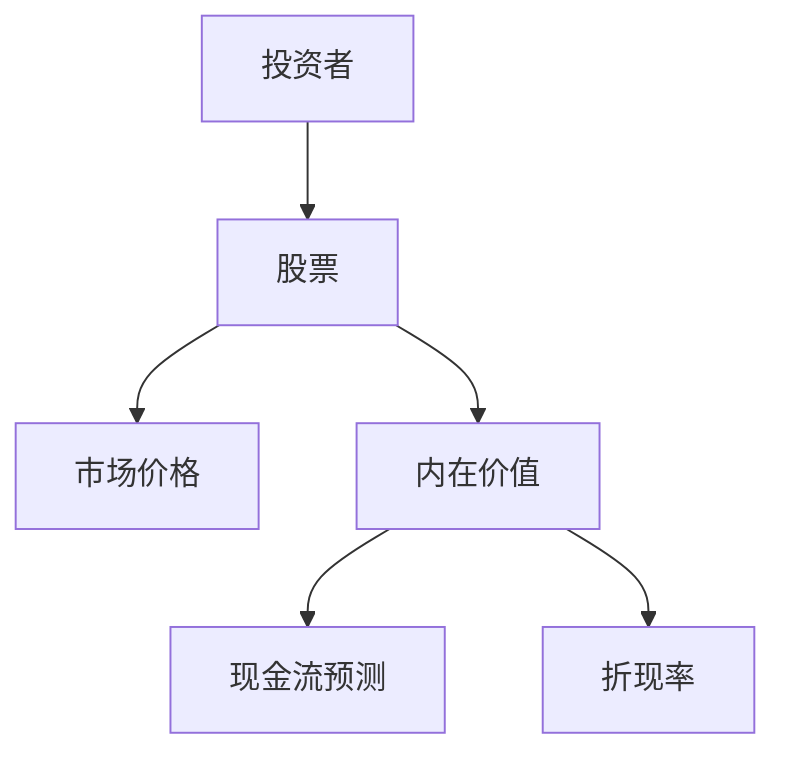
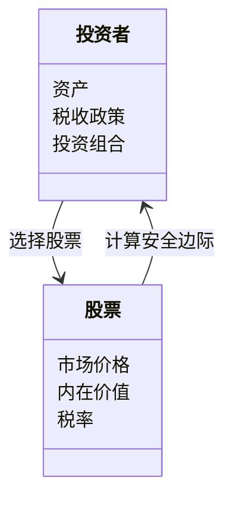
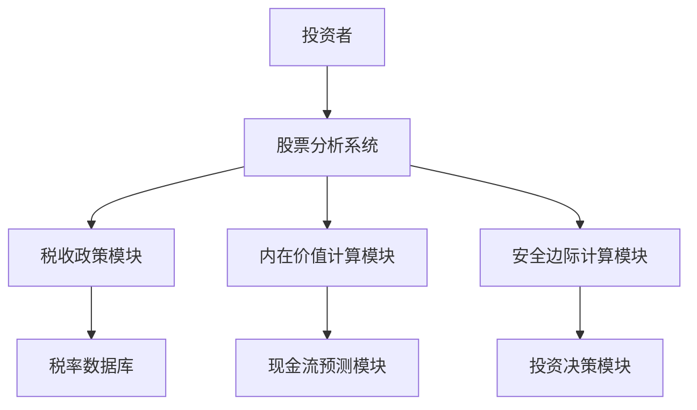
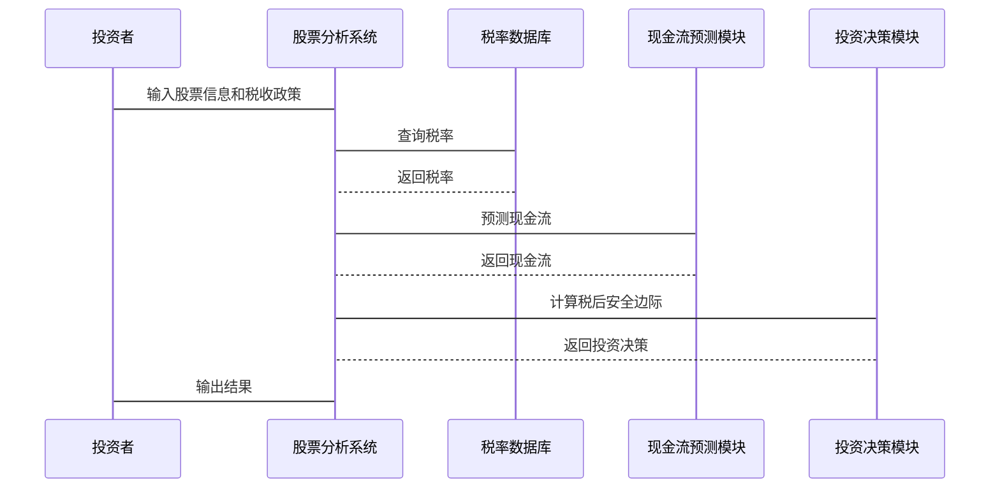

                 


# 格雷厄姆特价股票理论在不同税收环境下的调整

## 关键词：格雷厄姆投资理论、特价股票、税收环境、安全边际、内在价值

## 摘要

格雷厄姆的特价股票理论是价值投资的重要基石，其核心在于寻找市场低估的股票。然而，不同国家和地区的税收政策对投资收益有显著影响，这要求投资者根据税收环境调整投资策略。本文详细分析了格雷厄姆理论在不同税收环境下的调整方法，探讨了如何在考虑税收因素后优化投资决策。通过数学模型和实际案例，本文展示了如何在不同税收政策下应用调整后的格雷厄姆模型，确保投资者在不同环境下实现最大收益。

---

# 第一部分: 格雷厄姆特价股票理论基础

## 第1章: 格雷厄姆特价股票理论概述

### 1.1 格雷厄姆投资理论的起源与发展

#### 1.1.1 价值投资的鼻祖：本杰明·格雷厄姆

本杰明·格雷厄姆是20世纪最伟大的投资理论家之一，被誉为“价值投资之父”。他提出的格雷厄姆-多德价值投资理论，强调以低于内在价值的价格购买股票，长期持有，等待市场重新认识其价值。

#### 1.1.2 特价股票理论的核心思想

格雷厄姆认为，市场先生的短期波动为投资者提供了以低于内在价值的价格买入优质股票的机会。这种低估的股票即为“特价股票”。投资者应关注企业的内在价值，而非市场情绪。

#### 1.1.3 格雷厄姆投资理论的现代发展

格雷厄姆的投资理念深刻影响了巴菲特等投资大师，并在现代投资理论中得到进一步发展。然而，随着税收政策的变化，投资者需要在原有理论基础上进行调整。

### 1.2 特价股票的定义与特征

#### 1.2.1 特价股票的定义

特价股票是指市场价格低于其内在价值的股票。这种低估源于市场的非理性波动，为投资者提供了获利的机会。

#### 1.2.2 特价股票的核心特征对比

| 特性 | 特价股票 | 非特价股票 |
|------|----------|------------|
| 市场价格 | 低于内在价值 | 高于或等于内在价值 |
| 投资风险 | 较低 | 较高 |
| 投资价值 | 高 | 低 |

#### 1.2.3 特价股票与普通股票的区别

- **安全边际**：特价股票具有较高的安全边际，即市场价格与内在价值之间的差距较大。
- **投资风险**：特价股票的风险较低，适合长期投资。
- **收益潜力**：特价股票的潜在收益较高，因为市场价格有回归内在价值的趋势。

### 1.3 税收环境对投资策略的影响

#### 1.3.1 税收环境的基本概念

税收环境指投资者在投资过程中需要缴纳的各项税费，包括资本利得税、股息税等。不同国家和地区的税收政策差异显著，影响投资者的净收益。

#### 1.3.2 税收对投资收益的影响

税收会减少投资的实际收益。例如，资本利得税会降低股票出售后的净收益，股息税则会减少股息收入。

#### 1.3.3 不同税收政策下的投资策略调整

投资者需要根据税收政策调整投资策略。例如，在高税率环境下，应选择税后收益较高的股票，或通过税收优惠的产品（如税收递延账户）进行投资。

---

## 第2章: 格雷厄姆特价股票理论的核心原理

### 2.1 安全边际的概念与计算

#### 2.1.1 安全边际的定义

安全边际是市场价格与内在价值之间的差额。它提供了投资的安全性，即即使市场价格波动，投资者仍能获得正收益。

#### 2.1.2 安全边际的计算公式

$$ \text{安全边际} = \text{内在价值} - \text{市场价格} $$

#### 2.1.3 安全边际在投资决策中的应用

投资者应选择安全边际较高的股票，以降低投资风险。安全边际越大，投资的安全性越高。

### 2.2 内在价值的评估方法

#### 2.2.1 内在价值的定义

内在价值是股票在未来现金流的现值。它是衡量股票是否低估的基准。

#### 2.2.2 内在价值的计算公式

$$ \text{内在价值} = \sum_{t=1}^{n} \frac{\text{CF}_t}{(1 + r)^t} $$

其中，CF_t为第t年的现金流，r为折现率。

#### 2.2.3 内在价值评估中的关键因素

- **现金流预测**：准确预测未来现金流是内在价值评估的关键。
- **折现率**：折现率的选择影响内在价值的计算结果。
- **企业基本面**：企业的盈利能力、成长性和财务状况是内在价值的重要影响因素。

### 2.3 市场先生与投资者心理

#### 2.3.1 市场先生的概念

市场先生是格雷厄姆用来描述市场波动的隐喻。市场先生每天提供买入和卖出价格，投资者应利用市场先生的错误来获利。

#### 2.3.2 市场先生与投资者心理的关系

市场波动反映了投资者心理的变化。当市场恐慌时，股票价格可能大幅低于内在价值，为投资者提供了买入机会。

#### 2.3.3 市场波动对投资策略的影响

投资者应避免跟随市场情绪，而是应根据内在价值进行理性投资。

### 2.4 格雷厄姆投资策略的数学模型

#### 2.4.1 格雷厄姆投资模型的公式表示

$$ \text{安全边际} = \text{内在价值} - \text{市场价格} $$

#### 2.4.2 格雷厄姆模型的属性特征对比表格

| 特性 | 格雷厄姆模型 |
|------|--------------|
| 计算基础 | 内在价值和市场价格 |
| 核心指标 | 安全边际 |
| 适用场景 | 寻找低估股票 |

#### 2.4.3 格雷厄姆模型的ER实体关系图



---

## 第3章: 税收环境对格雷厄姆策略的影响

### 3.1 不同税收政策下的投资策略

#### 3.1.1 美国的税收政策与投资策略

在美国，资本利得税分为短期和长期。长期资本利得税较低，鼓励长期投资。投资者应选择长期持有特价股票，以享受较低的税率。

#### 3.1.2 中国的税收政策与投资策略

在中国，资本利得税暂未全面实施，但股息税较高。投资者应选择高股息率的股票，并利用税收优惠政策。

#### 3.1.3 欧盟的税收政策与投资策略

欧盟国家的税收政策差异较大，投资者应根据具体国家的税率调整投资策略。例如，在税率较低的国家进行投资。

### 3.2 税收环境对内在价值评估的影响

#### 3.2.1 税收对内在价值计算的影响

税收影响现金流的可分配部分。例如，高股息税会减少股息收入，进而影响内在价值的计算。

#### 3.2.2 不同税收政策下的内在价值调整方法

在计算内在价值时，应考虑税收对现金流的影响。例如，调整股息收入的税后金额。

#### 3.2.3 税收对安全边际的影响

税收会降低税后收益，因此在相同的价格下，税后安全边际会减小。投资者需根据税后安全边际进行投资决策。

### 3.3 税收环境下的投资策略调整

#### 3.3.1 税收对投资组合的影响

投资者应根据税收政策调整投资组合。例如，在高税率环境下，应选择税收优惠的产品。

#### 3.3.2 税收对投资期限的影响

长期投资通常享有较低的税率，因此在税收政策鼓励长期投资的环境下，投资者应选择长期持有策略。

#### 3.3.3 税收对风险偏好的影响

高税率会降低投资收益，投资者可能需要承担更高的风险以寻求更高的回报。

---

## 第4章: 数学模型与公式调整

### 4.1 格雷厄姆模型的数学调整

#### 4.1.1 考虑税收后的内在价值公式

$$ \text{内在价值}_{\text{税后}} = \sum_{t=1}^{n} \frac{\text{CF}_t \times (1 - \text{税率})}{(1 + r)^t} $$

#### 4.1.2 税后安全边际的计算公式

$$ \text{安全边际}_{\text{税后}} = \text{内在价值}_{\text{税后}} - \text{市场价格} $$

### 4.2 税收环境下的投资决策模型

#### 4.2.1 投资决策模型的构建

投资者应根据税后安全边际进行投资决策。当税后安全边际为正时，买入股票；否则，卖出股票。

#### 4.2.2 模型的数学表达

$$ \text{投资决策} = \begin{cases}
\text{买入} & \text{如果 } \text{安全边际}_{\text{税后}} > 0 \\
\text{卖出} & \text{否则}
\end{cases} $$

### 4.3 算法实现与代码

#### 4.3.1 税后内在价值计算代码

```python
def calculate_tax_intrinsic_value(cash_flows, tax_rate, discount_rate):
    tax_intrinsic = 0
    for t in range(len(cash_flows)):
        cash_flow = cash_flows[t]
        tax_adj = cash_flow * (1 - tax_rate)
        present_value = tax_adj / (1 + discount_rate) ** t
        tax_intrinsic += present_value
    return tax_intrinsic
```

#### 4.3.2 税后安全边际计算代码

```python
def calculate_tax_margin(intrinsic_value, price, tax_rate):
    tax_intrinsic = intrinsic_value * (1 - tax_rate)
    tax_margin = tax_intrinsic - price
    return tax_margin
```

---

## 第5章: 系统分析与架构设计

### 5.1 问题场景介绍

投资者需要在不同税收环境下，利用格雷厄姆特价股票理论进行投资决策。系统需要帮助投资者分析不同税收政策下的投资策略。

### 5.2 系统功能设计

#### 5.2.1 领域模型mermaid类图



#### 5.2.2 系统架构设计mermaid架构图



#### 5.2.3 系统接口设计

- **输入接口**：投资者输入股票信息和税收政策。
- **输出接口**：系统输出税后安全边际和投资决策。

#### 5.2.4 系统交互mermaid序列图



---

## 第6章: 项目实战

### 6.1 环境安装

安装必要的Python库，如numpy、pandas、scipy。

### 6.2 系统核心实现源代码

#### 6.2.1 税后内在价值计算

```python
import numpy as np
import pandas as pd

def calculate_tax_intrinsic_value(cash_flows, tax_rate, discount_rate):
    tax_intrinsic = 0
    for t in range(len(cash_flows)):
        cash_flow = cash_flows[t]
        tax_adj = cash_flow * (1 - tax_rate)
        present_value = tax_adj / (1 + discount_rate) ** t
        tax_intrinsic += present_value
    return tax_intrinsic
```

#### 6.2.2 税后安全边际计算

```python
def calculate_tax_margin(intrinsic_value, price, tax_rate):
    tax_intrinsic = intrinsic_value * (1 - tax_rate)
    tax_margin = tax_intrinsic - price
    return tax_margin
```

### 6.3 代码应用解读与分析

通过上述代码，投资者可以计算税后内在价值和安全边际，从而做出投资决策。

### 6.4 实际案例分析

以美国市场为例，假设某股票的现金流为[100, 150, 200]，折现率为10%，税率分别为20%和25%。计算税后内在价值和安全边际，比较不同税率下的投资决策。

### 6.5 项目小结

通过项目实战，投资者可以掌握在不同税收环境下调整格雷厄姆模型的方法，并将其应用于实际投资决策中。

---

## 第7章: 总结与展望

### 7.1 本章总结

本文详细分析了格雷厄姆特价股票理论在不同税收环境下的调整方法，探讨了如何在考虑税收因素后优化投资决策。通过数学模型和实际案例，本文展示了如何在不同税收政策下应用调整后的格雷厄姆模型，确保投资者在不同环境下实现最大收益。

### 7.2 未来展望

未来的研究可以进一步探讨其他税收因素，如遗产税、赠与税等，对投资策略的影响。此外，结合人工智能技术，开发更智能的投资决策系统，也是未来的重要方向。

### 7.3 最佳实践 tips

- **长期投资**：在高税率环境下，长期投资通常享有较低的税率，降低税负。
- **税收优惠产品**：利用税收递延账户等产品，降低税后收益的损失。
- **定期调整**：随着税收政策的变化，定期调整投资组合，确保最优收益。

---

## 作者：AI天才研究院/AI Genius Institute & 禅与计算机程序设计艺术/Zen And The Art of Computer Programming

