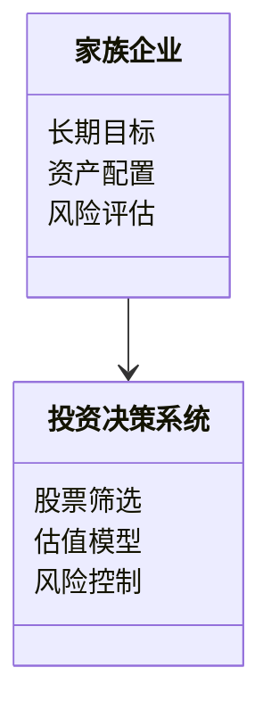
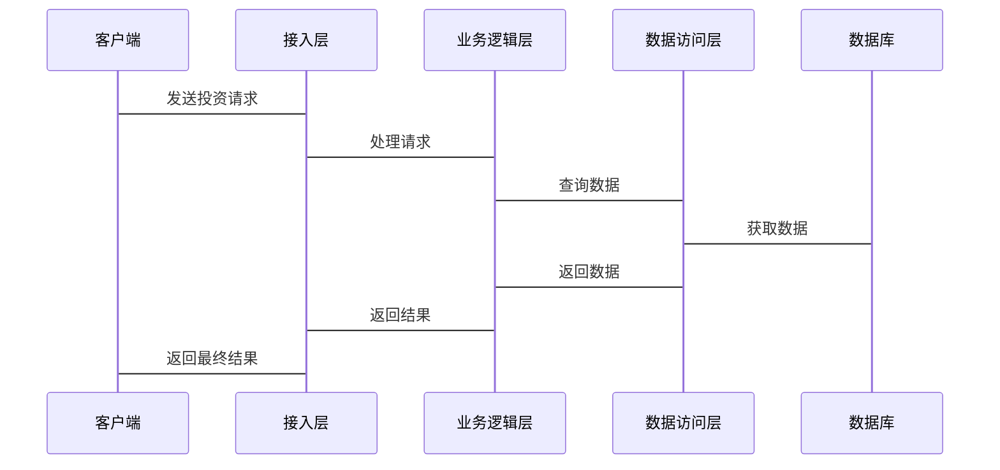

                 

# 格雷厄姆特价股票理论在家族企业投资中的应用

> 关键词：格雷厄姆，价值投资，家族企业，股票估值，投资策略

> 摘要：本文深入探讨了格雷厄姆的价值投资理论在家族企业投资中的应用，分析了家族企业的特殊需求和投资策略，结合实际案例和系统设计，提供了详细的指导和建议。

---

## 第一部分：格雷厄姆特价股票理论的背景与基础

### 第1章：价值投资与格雷厄姆理论概述

#### 1.1 价值投资的核心理念

##### 1.1.1 投资的定义与核心目标
投资的本质是通过合理配置资产，实现财富的保值与增值。格雷厄姆的价值投资理论强调以低于内在价值的价格买入优质资产，长期持有，从而获得稳定的收益。

##### 1.1.2 格雷厄姆的价值投资理论起源
本杰明·格雷厄姆是价值投资的鼻祖，他的理论在20世纪30年代提出，核心在于寻找市场价格低于内在价值的股票，尤其是那些具有稳定收益和低估值的公司。

##### 1.1.3 安全边际的概念与重要性
安全边际是指买入价格与内在价值之间的差距，用于降低投资风险。格雷厄姆认为，即使市场波动，安全边际也能确保投资者在长期中获得稳定的回报。

#### 1.2 家族企业的特殊性与投资需求

##### 1.2.1 家族企业的定义与特点
家族企业是由家族控股的企业，具有传承性、长期性和稳定性等特点。这些特点使得家族企业在投资策略上更注重长期收益和风险控制。

##### 1.2.2 家族企业投资的独特挑战
家族企业在投资中面临的风险包括市场波动、财务稳定性、传承问题等。因此，投资策略需要结合家族企业的长期目标和特殊需求。

### 第2章：家族企业的特殊性与投资需求

#### 2.1 家族企业的长期投资目标
家族企业通常有长期的传承目标，投资策略应围绕长期收益展开，注重稳定性和可持续性。

#### 2.2 家族企业投资的独特挑战
包括财务稳定性、市场波动、家族治理等因素，需要在投资策略中予以考虑。

---

## 第二部分：格雷厄姆选股标准与评估方法

### 第3章：内在价值与安全边际的评估

#### 3.1 内在价值的计算方法
格雷厄姆的内在价值公式：
$$ V = \frac{E}{n} $$
其中，E是企业的盈利总额，n是资本与债券的总和。

#### 3.2 安全边际的计算与应用
安全边际=内在价值-市场价格，确保买入价格低于内在价值。

#### 3.3 财务指标分析与估值模型
包括市盈率、市净率、股息率等指标，用于评估股票的估值。

### 第4章：企业基本面分析与财务报表解读

#### 4.1 财务报表分析基础
分析利润表、资产负债表和现金流量表，评估企业的财务健康状况。

#### 4.2 股票估值方法与应用
格雷厄姆的低市盈率策略：选择市盈率低于某个阈值的股票。

---

## 第三部分：格雷厄姆理论在家族企业中的应用

### 第5章：投资策略与组合管理

#### 5.1 长期投资计划的制定
家族企业应制定长期投资计划，注重资产配置和风险控制。

#### 5.2 投资组合管理
分散投资，平衡股票和债券的比例，降低风险。

### 第6章：风险管理与控制

#### 6.1 风险评估模型
使用VaR模型评估投资组合的风险。

#### 6.2 风险控制策略
设定止损点，定期评估投资组合的风险。

---

## 第四部分：系统分析与架构设计

### 第7章：系统架构与投资决策系统

#### 7.1 领域模型类图

#### 7.2 系统架构图

#### 7.3 接口设计与交互

---

## 第五部分：项目实战与案例分析

### 第8章：实际案例分析

#### 8.1 案例背景介绍
某家族企业投资于一家低市盈率的制造公司，运用格雷厄姆的理论进行估值。

#### 8.2 数据分析与模型应用
使用格雷厄姆的内在价值公式，计算出公司的内在价值，确定安全边际。

#### 8.3 投资决策与结果
买入股票后，公司股价回升，实现收益。

---

## 第六部分：总结与最佳实践

### 第9章：总结与最佳实践

#### 9.1 核心要点回顾
格雷厄姆理论的核心在于寻找低估的股票，注重安全边际和长期投资。

#### 9.2 最佳实践 tips
- 定期评估投资组合的风险
- 结合家族企业的特点制定策略
- 使用系统工具辅助投资决策

#### 9.3 未来展望
随着市场变化，价值投资理论需要不断更新，结合新的工具和技术。

---

## 作者简介

作者：AI天才研究院 & 禅与计算机程序设计艺术  
本文由AI天才研究院与禅与计算机程序设计艺术团队合作完成，结合价值投资理论与系统设计方法，为读者提供深度的技术分析和投资策略。

---

通过以上结构，文章系统地介绍了格雷厄姆理论在家族企业投资中的应用，从理论到实践，结合案例和系统设计，帮助读者全面理解和应用这一投资策略。

