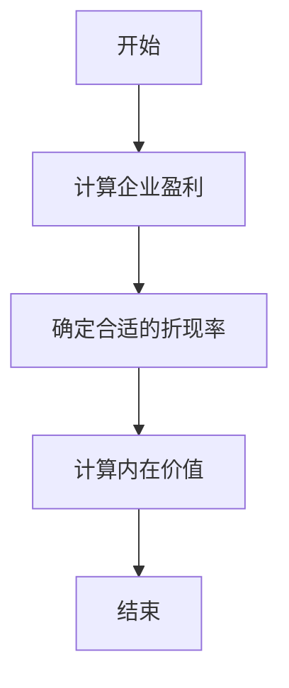
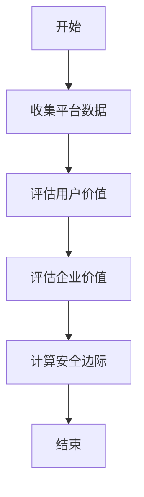

                 


# 《格雷厄姆特价股票理论在平台经济时代的新思考》

---

## 关键词：
格雷厄姆投资理论、平台经济、价值投资、安全边际、内在价值、数学模型、算法实现

---

## 摘要：
本文系统探讨了格雷厄姆特价股票理论在平台经济时代的新应用。通过分析格雷厄姆的价值投资核心原理，结合平台经济的特征，提出了一种新的企业价值评估模型。文章从理论基础、算法实现、系统架构到实际案例进行了全面分析，展示了如何在平台经济时代利用格雷厄姆理论进行投资决策。

---

## 第一部分：背景介绍

### 第1章：格雷厄姆特价股票理论概述

#### 1.1 格雷厄姆投资理论的核心概念
- **价值投资的起源与发展**：价值投资由本杰明·格雷厄姆提出，强调以低于内在价值的价格购买优质资产。
- **安全边际理论**：通过计算安全边际（内在价值 - 市场价格）来降低投资风险。
- **特价股票的定义与特征**：指市场价格远低于内在价值的股票，通常在市场低迷时出现。

#### 1.2 平台经济的定义与特点
- **平台经济的模式解析**：平台通过连接供需双方，创造双边网络效应，降低交易成本。
- **平台经济的核心要素与优势**：包括双边市场、网络效应、数据驱动等。
- **平台经济与传统经济的对比**：平台经济更依赖数据和技术创新，具有更高的扩展性和灵活性。

#### 1.3 格雷厄姆理论与平台经济的结合
- **平台经济时代的价值投资新机遇**：平台企业的网络效应和数据优势为价值投资提供了新方向。
- **特价股票理论在平台经济中的应用潜力**：利用格雷厄姆的理论筛选被低估的平台企业。
- **平台经济时代投资的挑战与风险**：数据依赖性高、竞争激烈、监管不确定性等。

---

## 第二部分：核心概念与联系

### 第2章：格雷厄姆理论的核心原理

#### 2.1 格雷厄姆理论的数学模型与公式
- **内在价值的计算公式**：
  $$ V = \frac{E}{k} $$
  其中，$E$ 是企业的盈利，$k$ 是折现率。
- **安全边际的计算方法**：
  $$ \text{安全边际} = \text{内在价值} - \text{市场价格} $$

#### 2.2 平台经济中的企业评估模型
- **平台企业的核心竞争力分析**：包括用户粘性、网络效应、数据处理能力等。
- **平台经济中的用户价值与企业价值关系**：用户数量和活跃度直接影响企业价值。
- **平台经济中的网络效应与价值放大效应**：网络效应的指数级增长特性。

#### 2.3 核心概念对比与联系
- **格雷厄姆理论与现代投资理论的对比**：格雷厄姆注重安全边际，现代理论更关注市场定价效率。
- **平台经济中的价值评估与传统企业的差异**：平台企业具有更强的外部性和动态性。
- **格雷厄姆理论在平台经济中的适用性分析**：需要结合平台的网络效应和数据优势进行调整。

---

## 第三部分：算法原理与数学模型

### 第3章：格雷厄姆理论的算法实现

#### 3.1 内在价值计算的算法流程


#### 3.2 平台经济中的价值评估算法


#### 3.3 数学模型与公式
- **内在价值公式**：
  $$ V = \frac{E}{k} $$
- **安全边际公式**：
  $$ \text{安全边际} = V - P $$

---

## 第四部分：系统分析与架构设计

### 第4章：平台经济中的企业评估系统

#### 4.1 问题场景介绍
- 平台经济中的企业价值评估需要考虑用户数量、活跃度、网络效应等因素。

#### 4.2 系统功能设计
- **领域模型（Mermaid类图）**：
  ```mermaid
  classDiagram
      class 用户
      class 平台企业
      class 数据
      class 评估结果
      用户 --> 平台企业 : 使用平台
      平台企业 --> 数据 : 生成数据
      数据 --> 评估结果 : 评估价值
  ```

#### 4.3 系统架构设计
- **系统架构（Mermaid架构图）**：
  ```mermaid
  context diagram
    participant 用户
    participant 平台企业
    participant 数据
    participant 评估结果
    用户 --> 平台企业
    平台企业 --> 数据
    数据 --> 评估结果
  ```

#### 4.4 系统接口设计
- **接口定义**：
  - 数据接口：获取用户和企业数据。
  - 评估接口：计算内在价值和安全边际。

#### 4.5 系统交互设计
- **系统交互流程（Mermaid序列图）**：
  ```mermaid
  sequenceDiagram
    用户 -> 平台企业: 提交数据请求
    平台企业 -> 数据: 获取数据
    数据 -> 平台企业: 返回数据
    平台企业 -> 用户: 返回评估结果
  ```

---

## 第五部分：项目实战

### 第5章：平台经济中的投资策略实现

#### 5.1 环境配置
- **工具安装**：安装Python、数据处理库（如Pandas）、可视化库（如Matplotlib）。

#### 5.2 核心实现
- **代码实现**：
  ```python
  def calculate_intrinsic_value(earnings, discount_rate):
      return earnings / discount_rate

  def calculate_margin_of_safety(intrinsic_value, market_price):
      return intrinsic_value - market_price

  # 示例数据
  earnings = 100
  discount_rate = 0.1
  market_price = 50

  iv = calculate_intrinsic_value(earnings, discount_rate)
  mos = calculate_margin_of_safety(iv, market_price)

  print(f"内在价值: {iv}")
  print(f"安全边际: {mos}")
  ```

#### 5.3 案例分析
- **案例选择**：以某平台企业为例，分析其用户数量、收入和利润。
- **结果讨论**：通过计算内在价值和安全边际，判断该企业是否为特价股票。

---

## 第六部分：总结与展望

### 第6章：总结与展望

#### 6.1 核心内容回顾
- 格雷厄姆理论在平台经济中的应用价值。
- 算法实现和系统设计的关键点。

#### 6.2 未来展望
- 平台经济中的数据驱动投资。
- 人工智能在价值评估中的应用。

#### 6.3 最佳实践 tips
- 投资者应关注平台企业的网络效应和数据优势。
- 长期投资，避免短期波动影响判断。

#### 6.4 小结
- 通过本文的分析，读者可以更好地理解格雷厄姆理论在平台经济中的新应用。

---

## 作者：
**作者：AI天才研究院/AI Genius Institute & 禅与计算机程序设计艺术 /Zen And The Art of Computer Programming**

---

### 本文基于格雷厄姆投资理论，结合平台经济的特点，提出了新的价值评估模型和算法，为投资者在平台经济时代提供了新的思路。

