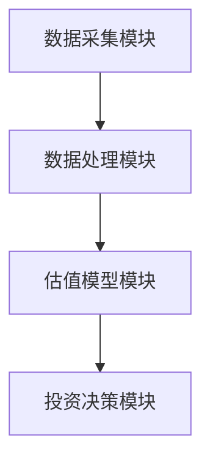

                 


# 格雷厄姆特价股票理论在循环经济产业中的应用

## 关键词：格雷厄姆理论，循环经济，股票估值，投资策略，产业分析

## 摘要：  
本文探讨了格雷厄姆特价股票理论在循环经济产业中的应用，分析了循环经济产业的特点及其投资机会，并结合格雷厄姆理论的核心思想，构建了适用于循环经济产业的股票估值模型。通过详细阐述数据采集与处理、算法实现及系统架构设计，本文为投资者提供了基于格雷厄姆理论的投资策略，帮助其在循环经济产业中发现被低估的股票，实现长期稳定的收益。

---

## 第1章: 格雷厄姆特价股票理论概述

### 1.1 格雷厄姆投资理论的起源与发展

格雷厄姆投资理论由本杰明·格雷厄姆提出，强调以低于内在价值的价格买入股票，以获取长期稳定的收益。其核心思想是寻找市场低估的股票，即“特价股票”。以下是格雷厄姆理论的几个关键点：

#### 1.1.1 格雷厄姆理论的核心原则
- **安全边际**：购买价格应低于股票的内在价值，以确保投资的安全性。
- **价值投资**：长期关注企业的基本面，而非短期市场波动。
- **Margin of Safety (安全边际)**：通过价格与价值的差异来降低投资风险。

#### 1.1.2 格雷厄姆的内在价值公式
格雷厄姆提出，股票的内在价值可以通过以下公式计算：
$$
\text{内在价值} = \frac{\text{预期收益}}{\text{折现率}}
$$

---

## 第2章: 循环经济产业的定义与特点

### 2.1 循环经济的基本概念

循环经济是一种以资源高效利用和循环再生为核心，减少资源消耗和环境污染的经济模式。其特点包括：

#### 2.1.1 循环经济的核心特征
- **资源高效利用**：最大化资源的使用效率，减少浪费。
- **闭环生产**：从原材料到产品再到废弃物的闭环管理。
- **可持续性**：强调环境友好和社会责任。

#### 2.1.2 循环经济与传统经济的区别
| 特性 | 循环经济 | 传统经济 |
|------|----------|----------|
| 资源消耗 | 最小化 | 最大化    |
| 废弃物处理 | 再利用 | 排放或填埋 |

---

## 第3章: 格雷厄姆理论与循环经济产业的结合

### 3.1 循环经济产业中的投资机会

#### 3.1.1 循环经济产业的市场潜力
循环经济产业涵盖资源再生、绿色能源等领域，市场规模持续增长。以下是主要领域的投资机会：

| 领域 | 描述 | 投资机会 |
|------|------|----------|
| 资源再生 | 废金属、废塑料的回收利用 | 投资再生资源企业 |
| 绿色能源 | 太阳能、风能等清洁能源 | 投资新能源公司 |
| 废弃物处理 | 工业废弃物的无害化处理 | 投资环保科技企业 |

#### 3.1.2 特价股票在循环经济产业中的潜在收益
格雷厄姆理论强调寻找低估的股票，循环经济产业中许多企业因市场认知不足或短期波动而被低估，为投资者提供了潜在收益。

---

## 第4章: 循环经济产业中的股票估值模型

### 4.1 格雷厄姆估值法的基本原理

#### 4.1.1 格雷厄姆的内在价值公式
$$
\text{内在价值} = \text{预期收益} \times \text{折现率倒数}
$$

#### 4.1.2 安全边际的应用
$$
\text{安全价格} = \text{内在价值} \times (1 - \text{安全边际比例})
$$

### 4.2 基于循环经济产业的估值模型

#### 4.2.1 循环经济产业的特殊估值因素
| 因素 | 描述 |
|------|------|
| 资源利用率 | 企业对资源的高效利用能力 |
| 环保合规性 | 企业是否符合环保法规 |
| 可持续性 | 企业的长期发展潜力 |

#### 4.2.2 循环经济产业股票估值模型
$$
\text{循环经济股票估值} = \text{内在价值} \times \text{资源利用率} \times \text{环保合规性}
$$

---

## 第5章: 循环经济产业数据的采集与处理

### 5.1 数据采集方法

#### 5.1.1 数据来源
- 企业财务报表
- 行业研究报告
- 政府政策文件

#### 5.1.2 数据清洗与预处理
1. 去除缺失值
2. 处理异常值
3. 标准化处理

### 5.2 数据特征分析

#### 5.2.1 数据分布
- 正态分布：企业收益、市盈率
- 偏态分布：企业负债率

#### 5.2.2 数据可视化
使用Python的matplotlib库进行数据可视化：
```python
import matplotlib.pyplot as plt
plt.hist(data, bins=10)
plt.show()
```

---

## 第6章: 基于格雷厄姆理论的股票估值算法

### 6.1 算法原理

#### 6.1.1 数据预处理
1. 清洗数据
2. 特征选择

#### 6.1.2 模型训练
使用格雷厄姆的内在价值公式进行估值：
$$
\text{内在价值} = \frac{\text{预期收益}}{\text{折现率}}
$$

#### 6.1.3 模型验证
通过历史数据验证模型的准确性。

### 6.2 算法实现

#### 6.2.1 Python代码实现
```python
def calculate_intrinsic_value(enterprise, discount_rate):
    intrinsic_value = enterprise.expected_profit / discount_rate
    return intrinsic_value

enterprise = {
    'expected_profit': 1000000,
    'discount_rate': 0.05
}

print(calculate_intrinsic_value(enterprise['expected_profit'], enterprise['discount_rate']))
```

---

## 第7章: 算法的优化与改进

### 7.1 算法优化策略

#### 7.1.1 参数优化
- 调整折现率
- 优化特征选择

#### 7.1.2 模型结构优化
引入机器学习算法，如随机森林，提高估值精度。

### 7.2 算法改进方案

#### 7.2.1 引入机器学习
使用机器学习模型对市场动态进行实时调整。

#### 7.2.2 结合市场动态
根据市场波动调整折现率，确保模型的适应性。

---

## 第8章: 循环经济产业中的系统架构设计

### 8.1 功能设计

#### 8.1.1 系统功能模块
- 数据采集模块
- 估值模型模块
- 投资决策模块

#### 8.1.2 系统架构图


### 8.2 系统交互流程

#### 8.2.1 系统交互流程图
```mermaid
sequenceDiagram
    participant 投资者
    participant 系统
    投资者 -> 系统: 提供企业数据
    系统 -> 数据处理模块: 处理数据
    数据处理模块 -> 估值模型模块: 估值计算
    估值模型模块 -> 投资决策模块: 提供投资建议
    投资者 <-- 系统: 投资建议
```

---

## 第9章: 项目实战

### 9.1 环境配置

#### 9.1.1 Python环境
安装必要的库：
```bash
pip install pandas numpy matplotlib
```

### 9.2 核心实现代码

#### 9.2.1 估值模型实现
```python
import pandas as pd
import numpy as np

def calculate_intrinsic_value(df, discount_rate):
    df['内在价值'] = df['预期收益'] / discount_rate
    return df

data = {
    '企业名称': ['企业A', '企业B', '企业C'],
    '预期收益': [1000000, 1500000, 2000000],
    '折现率': [0.05, 0.06, 0.07]
}

df = pd.DataFrame(data)
result = calculate_intrinsic_value(df, 0.05)
print(result)
```

### 9.3 案例分析

#### 9.3.1 案例选择
选择一家循环经济企业，分析其股票估值。

#### 9.3.2 分析结果
根据模型计算出的内在价值，判断其是否为特价股票。

---

## 第10章: 总结与展望

### 10.1 研究总结
本文通过格雷厄姆理论与循环经济产业的结合，构建了股票估值模型，并通过算法优化和系统设计，为投资者提供了科学的投资策略。

### 10.2 未来展望
未来，随着循环经济的进一步发展，格雷厄姆理论的应用将更加广泛。建议进一步研究如何结合人工智能技术，提升估值模型的准确性和实时性。

---

## 作者：AI天才研究院/AI Genius Institute & 禅与计算机程序设计艺术 /Zen And The Art of Computer Programming

