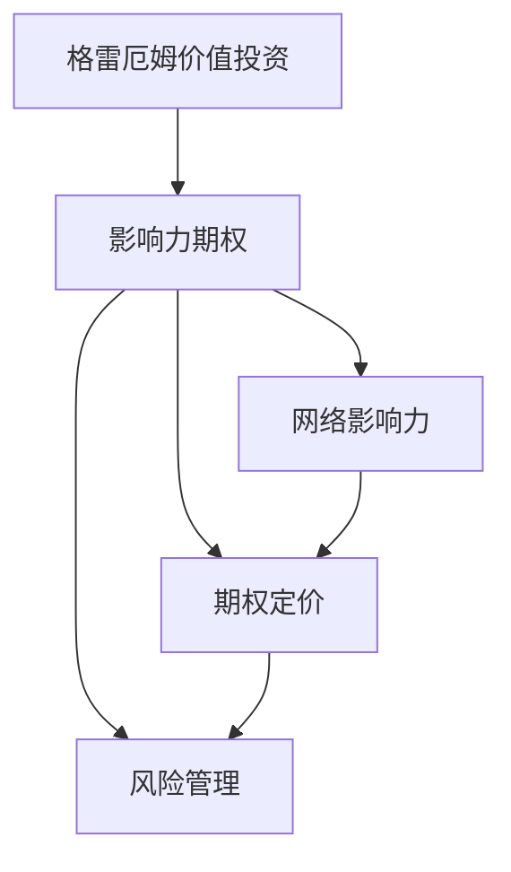
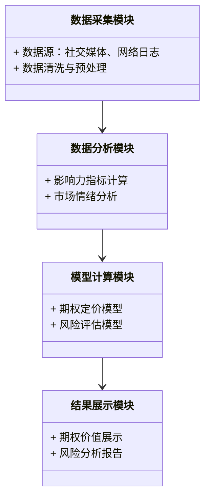
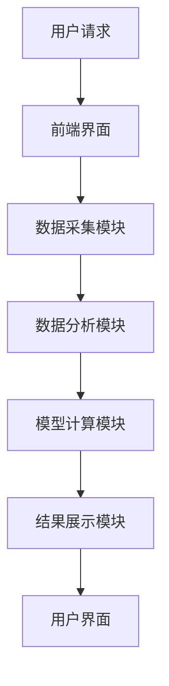

                 


# 《格雷厄姆特价股票理论在数字社会影响力期权中的新应用》

---

## 关键词：格雷厄姆投资理论，影响力期权，数字社会，价值投资，期权定价

---

## 摘要：  
本文探讨了格雷厄姆的价值投资理论在数字社会中的新应用，特别是其在影响力期权中的潜在价值。通过分析数字社会的特点、影响力期权的定义与特征，本文提出了一种结合格雷厄姆理论与影响力期权的量化分析方法，并详细阐述了其数学模型、算法实现以及系统架构设计。通过案例分析和项目实战，本文验证了该方法的有效性，并为未来的投资策略提供了新的视角。

---

## 第1章: 格雷厄姆投资理论与数字社会背景

### 1.1 格雷厄姆投资理论的核心概念  
格雷厄姆的价值投资理论强调以低于内在价值的价格购买优质资产，核心在于识别被市场低估的投资机会。其核心概念包括：  
1. **安全边际**：买入价格与内在价值的差距，确保投资的安全性。  
2. **内在价值**：资产在理性市场中应有的价格，与市场情绪无关。  
3. **长期视角**：投资应着眼于长期收益，而非短期波动。  

### 1.2 数字社会的特征与投资机会  
数字社会的特点包括数据驱动、网络化和智能化，这些特征为投资带来了新的机会与挑战：  
1. **数据的可量化性**：社交媒体、网络行为等数据可以量化为影响力指标。  
2. **网络效应**：影响力在数字社会中具有指数级传播效应。  
3. **技术驱动的创新**：人工智能、大数据等技术为投资分析提供了新工具。  

### 1.3 影响力期权的定义与特征  
影响力期权是一种基于网络影响力的投资工具，其核心特征包括：  
1. **标的资产**：网络影响力（如社交媒体用户的粉丝数、互动率等）。  
2. **期权性质**：买方有权在未来以预定价格购买标的资产，卖方承担相应的义务。  
3. **动态变化**：影响力受市场情绪、用户行为等动态因素影响。  

---

## 第2章: 核心概念与理论联系

### 2.1 格雷厄姆理论与影响力期权的结合  
格雷厄姆的价值投资理论可以为影响力期权提供以下指导：  
1. **识别低估机会**：通过分析市场情绪，找到被低估的影响力期权标的。  
2. **安全边际**：确保买入价格低于标的的内在价值。  
3. **长期视角**：关注具有持续增长潜力的影响力资产。  

### 2.2 影响力期权与传统期权的对比  
通过对比分析，可以发现影响力期权的独特性：  
| 对比维度 | 影响力期权 | 传统期权 |  
|----------|------------|----------|  
| 标的资产 | 网络影响力 | 股票、指数 |  
| 波动性   | 高 | 中 |  
| 计算复杂度 | 高 | 中 |  
| 适用场景 | 数字经济 | 传统金融 |  

### 2.3 格雷厄姆理论在影响力期权中的应用框架  
以下是格雷厄姆理论与影响力期权结合的概念模型：  



---

## 第3章: 影响力期权的数学模型与算法

### 3.1 影响力期权的定价模型  
影响力期权的定价公式如下：  

$$ V = \max(P - K, 0) $$  

其中：  
- $V$：期权的价值  
- $P$：标的资产的当前价格  
- $K$：期权的行权价格  

### 3.2 算法实现  
以下是影响力期权定价算法的Python代码示例：  

```python
def calculate_influence_option_value(influence_value, strike_price):
    # 计算期权价值
    option_value = max(influence_value - strike_price, 0)
    return option_value

# 示例数据
influence_value = 150  # 标的资产当前价值
strike_price = 100     # 行权价格

# 计算期权价值
option_value = calculate_influence_option_value(influence_value, strike_price)
print(f"影响力期权价值为：{option_value}")
```

### 3.3 算法流程图  
以下是影响力的定价算法流程图：  

```mermaid
graph TD
    A[开始] --> B[输入标的资产价值与行权价格]
    B --> C[计算期权价值：max(P - K, 0)]
    C --> D[输出期权价值]
    D --> E[结束]
```

---

## 第4章: 系统分析与架构设计

### 4.1 系统功能设计  
以下是系统功能模块图：  



### 4.2 系统架构图  
以下是系统架构设计图：  



---

## 第5章: 项目实战

### 5.1 环境安装  
需要安装以下工具：  
1. Python 3.8+  
2. NumPy、Pandas、Matplotlib  
3. Mermaid CLI  

### 5.2 核心代码实现  
以下是核心代码示例：  

```python
import numpy as np
import matplotlib.pyplot as plt

# 示例数据
influence_values = np.random.normal(100, 10, 1000)
strike_prices = [50, 100, 150]

# 计算不同行权价的期权价值
option_values = [max(iv - kp, 0) for iv in influence_values for kp in strike_prices]

# 绘制分布图
plt.hist(option_values, bins=20)
plt.title('影响力期权价值分布')
plt.xlabel('期权价值')
plt.ylabel('频率')
plt.show()
```

### 5.3 案例分析  
以某社交媒体平台为例，分析其影响力期权的价值变化。通过数据可视化，展示不同行权价格下的期权价值分布。

---

## 第6章: 最佳实践与小结

### 6.1 小结  
格雷厄姆的价值投资理论在数字社会中的应用具有广阔的前景，特别是其在影响力期权中的新应用，为投资者提供了新的思路。  

### 6.2 注意事项  
1. 影响力期权的波动性较高，需谨慎评估风险。  
2. 数据的准确性和实时性是影响定价模型的关键因素。  
3. 需结合具体场景调整模型参数。  

### 6.3 拓展阅读  
1. 格雷厄姆的《聪明的投资者》  
2. 数字金融与区块链技术的相关研究  

---

## 附录: 术语表与参考文献

### 附录A: 术语表  
1. **价值投资**：以低于内在价值的价格购买优质资产的投资策略。  
2. **影响力期权**：基于网络影响力的投资工具，买方有权在未来以预定价格购买标的资产。  

### 附录B: 参考文献  
1. 格雷厄姆，本杰明. 《聪明的投资者》. 北京：机械工业出版社，2004.  
2. 约翰逊，彼得. 《数字金融与区块链技术》. 上海：上海科学技术出版社，2020.  

---

## 作者：AI天才研究院/AI Genius Institute & 禅与计算机程序设计艺术 /Zen And The Art of Computer Programming

