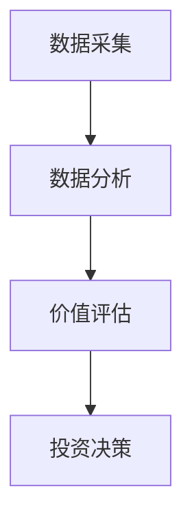
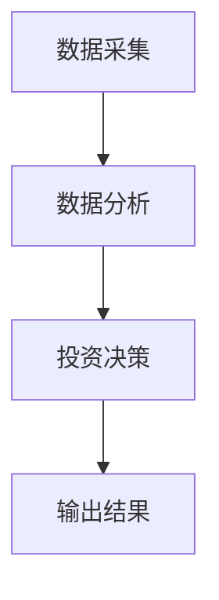

                 


# 格雷厄姆特价股票理论在数字经济时代的新解读

**关键词**：格雷厄姆投资理论、数字经济、价值投资、安全边际、投资策略

**摘要**：本文探讨了格雷厄姆的价值投资理论在数字经济环境下的新应用，结合技术分析和数据驱动的方法，重新定义了廉价股的投资策略。通过数学模型和系统架构的设计，本文详细分析了数字经济时代如何优化投资决策，实现稳健收益。

---

## 第一章：格雷厄姆特价股票理论概述

### 1.1 背景介绍

格雷厄姆是价值投资的鼻祖，其核心理念是寻找市场价格低于内在价值的股票。在数字经济时代，数据驱动和技术分析为这一理论注入新活力。

#### 1.1.1 格雷厄姆投资理论的背景与起源
- **价值投资理念的提出**：格雷厄姆强调长期投资和安全边际。
- **投资哲学**：专注于企业基本面，而非市场波动。
- **巴菲特的影响**：格雷厄姆的学生巴菲特将理论发扬光大。

#### 1.1.2 核心概念与术语说明
- **内在价值**：企业未来现金流的现值。
- **安全边际**：市场价格与内在价值的差异，确保投资的安全性。
- **廉价股**：市场价格低于内在价值的股票。

### 1.2 格雷厄姆投资策略的数学模型

#### 1.2.1 内在价值计算公式
$$ V = \frac{E}{1 + r} $$
其中，E是未来现金流，r是折现率。

#### 1.2.2 安全边际计算公式
$$ MS = V - P $$
MS为安全边际，P为市场价格。

### 1.3 格雷厄姆投资理论的系统架构

#### 1.3.1 系统架构图


---

## 第二章：格雷厄姆投资策略的数学模型

### 2.1 内在价值计算

#### 2.1.1 现金流折现模型
$$ PV = \sum_{t=1}^{n} \frac{CF_t}{(1 + r)^t} $$
通过Python代码实现：
```python
def calculate_intrinsic_value(cash_flows, discount_rate):
    return sum(cf / (1 + discount_rate)**t for t, cf in enumerate(cash_flows))
```

### 2.2 安全边际分析

#### 2.2.1 安全边际的重要性
- 确保投资的安全性。
- 减少市场波动的影响。

#### 2.2.2 价格与价值的关系
- 当市场价格低于内在价值时，存在安全边际。

---

## 第三章：格雷厄姆投资策略的系统架构

### 3.1 系统架构设计

#### 3.1.1 数据采集模块
- 采集股票的财务数据，如收入、利润等。

#### 3.1.2 数据分析模块
- 计算内在价值和安全边际。

#### 3.1.3 投资决策模块
- 根据分析结果做出投资决策。

#### 3.1.4 系统架构图


---

## 第四章：数字经济时代的新挑战与机遇

### 4.1 数字经济对投资的影响

#### 4.1.1 新兴产业的崛起
- 技术创新型企业成为投资重点。

#### 4.1.2 数据驱动的投资决策
- 利用大数据分析优化投资策略。

#### 4.1.3 技术创新对企业价值的影响
- 技术创新显著提升企业内在价值。

---

## 第五章：数字经济时代下的价值评估

### 5.1 数字经济时代的价值评估指标

#### 5.1.1 数字资产的评估
- 区块链、人工智能等技术的资产价值评估。

#### 5.1.2 技术创新的资本化
- 将技术创新转化为企业价值增长。

#### 5.1.3 数字化转型对企业价值的影响
- 评估企业数字化转型带来的价值提升。

---

## 第六章：数字经济时代下的安全边际策略

### 6.1 数字经济环境下的风险因素

#### 6.1.1 技术风险
- 技术更新换代快，可能导致投资失败。

#### 6.1.2 市场波动风险
- 数字经济环境下的市场波动加剧。

#### 6.1.3 竞争风险
- 新兴产业竞争激烈，企业盈利能力下降。

---

## 第七章：项目实战

### 7.1 环境安装

#### 7.1.1 安装Python和相关库
- 使用Anaconda安装环境，安装pandas、numpy等库。

### 7.2 核心实现

#### 7.2.1 数据获取与处理
```python
import pandas as pd
import numpy as np

# 获取股票数据
data = pd.read_csv('stock_data.csv')
```

#### 7.2.2 计算内在价值和安全边际
```python
def calculate_intrinsic_value(data, discount_rate):
    cash_flows = data['cash_flow'].tolist()
    return sum(cf / (1 + discount_rate)**t for t, cf in enumerate(cash_flows))

intrinsic_value = calculate_intrinsic_value(data, 0.05)
price = data['price'].mean()
margin = intrinsic_value - price
```

#### 7.2.3 可视化分析
```python
import matplotlib.pyplot as plt

plt.plot(data['date'], data['price'], label='Price')
plt.plot(data['date'], data['intrinsic_value'], label='Intrinsic Value')
plt.legend()
plt.show()
```

### 7.3 实际案例分析

#### 7.3.1 案例选择
- 选择一家科技公司，分析其内在价值和安全边际。

#### 7.3.2 投资决策
- 根据分析结果，决定是否投资。

---

## 第八章：最佳实践与小结

### 8.1 最佳实践 tips

- 定期更新模型参数。
- 关注行业动态和技术趋势。
- 多元化投资以分散风险。

### 8.2 小结

本文详细探讨了格雷厄姆投资理论在数字经济环境下的应用，结合数学模型和系统架构，提供了新的投资策略。通过案例分析和代码实现，展示了如何在现代市场中优化投资决策。

### 8.3 注意事项

- 投资需谨慎，市场有风险。
- 持续学习和适应市场变化。

### 8.4 拓展阅读

- 格雷厄姆的《 Intelligent Investor》。
- 技术分析相关的书籍。

---

**作者：AI天才研究院/AI Genius Institute & 禅与计算机程序设计艺术 /Zen And The Art of Computer Programming**

