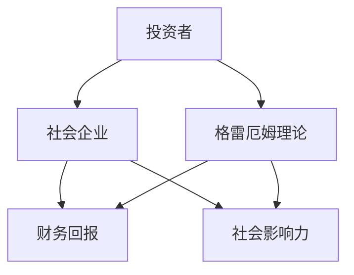
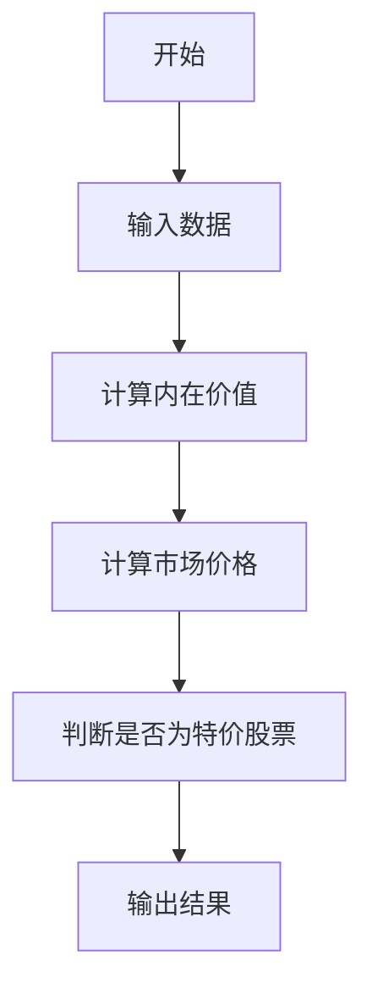
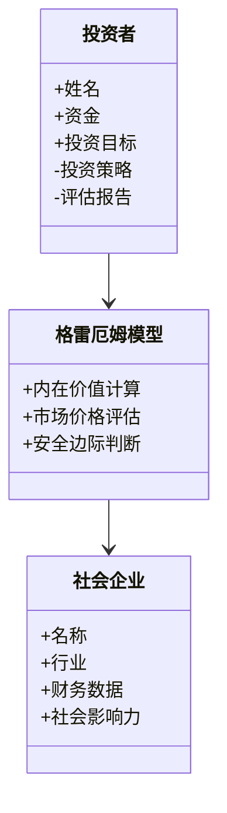
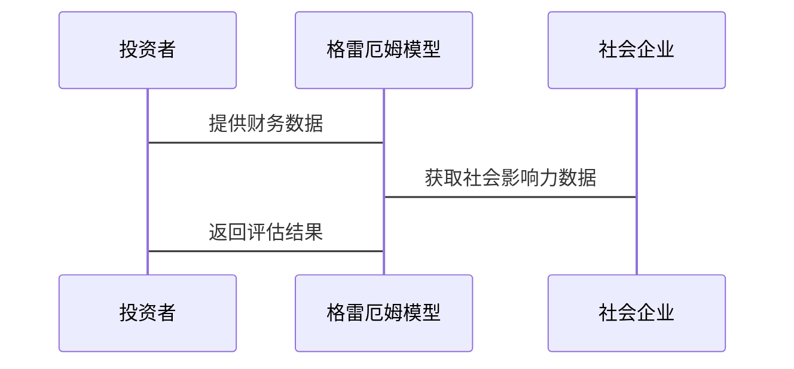

                 


# 格雷厄姆特价股票理论在社会企业家投资中的运用

## 关键词：格雷厄姆理论，社会企业家，价值投资，股票分析，投资策略

## 摘要：本文探讨了如何将格雷厄姆的价值投资理论应用于社会企业家投资中，通过分析特价股票的特征，结合社会企业的社会责任和经济效益，构建了一个创新的投资框架，帮助投资者在追求财务回报的同时，实现社会价值的最大化。

---

# 第1章: 背景介绍

## 1.1 问题背景

### 1.1.1 投资理论的演进与挑战
现代投资理论经历了从基本面分析到量化分析的转变，但市场波动和信息不对称仍对投资决策构成挑战。传统价值投资强调寻找被低估的股票，而社会企业家投资则强调企业的社会影响力。

### 1.1.2 社会企业家的定义与特点
社会企业家是以社会使命为导向的企业家，致力于解决社会问题，同时追求经济回报。他们关注环境保护、教育、医疗等领域，具有较高的社会责任感。

### 1.1.3 格雷厄姆理论的核心思想
格雷厄姆的价值投资理论强调安全边际和内在价值，主张通过分析企业的基本面，寻找市场价格低于内在价值的股票。

## 1.2 问题描述

### 1.2.1 特价股票的定义与特征
特价股票是市场价格低于其内在价值的股票，通常具有低市盈率和低市净率的特点。

### 1.2.2 社会企业家投资的独特性
社会企业家投资不仅关注财务回报，还关注企业的社会影响力，具有双重评估维度。

### 1.2.3 理论与实践的结合点
如何在社会企业家中找到具有市场低估和高社会价值的企业，是理论与实践结合的关键。

## 1.3 问题解决

### 1.3.1 格雷厄姆理论在社会企业中的应用潜力
通过分析企业的基本面，寻找具有社会价值的特价股票。

### 1.3.2 社会企业家投资的创新模式
结合社会影响力评估，构建新的投资框架。

### 1.3.3 理论与实践的结合方法
通过案例分析，展示如何在社会企业中应用格雷厄姆理论。

## 1.4 边界与外延

### 1.4.1 格雷厄姆理论的适用范围
适用于那些具有稳定财务状况和社会影响力的公司。

### 1.4.2 社会企业家投资的边界条件
需要考虑企业的社会影响力和财务表现。

### 1.4.3 理论与实践的结合边界
在实践中，需要平衡财务回报和社会影响力的权重。

## 1.5 核心要素组成

### 1.5.1 格雷厄姆理论的核心要素
内在价值、市场价格、安全边际。

### 1.5.2 社会企业家投资的核心要素
社会影响力、财务表现、行业地位。

### 1.5.3 两者的结合与互动
通过结合两者的要素，构建新的评估模型。

---

# 第2章: 核心概念与联系

## 2.1 核心概念原理

### 2.1.1 格雷厄姆理论的数学模型
内在价值计算公式：$$ V = \frac{E}{(D \times (1 - D))} $$，其中V为内在价值，E为息税前利润，D为折现率。

### 2.1.2 社会企业家投资的经济学原理
社会企业通过解决社会问题，创造可持续价值。

### 2.1.3 两者的结合机制
通过评估企业的社会影响力和财务表现，寻找具有社会价值的特价股票。

## 2.2 概念属性特征对比

| 特性       | 格雷厄姆理论                          | 社会企业家投资                  |
|------------|-------------------------------------|---------------------------------|
| 目标       | 寻找被低估的股票                     | 追求社会价值与财务回报          |
| 方法       | 基于基本面分析                       | 结合社会影响力评估和财务分析      |
| 结果       | 财务回报                            | 可持续的社会价值和财务回报      |

## 2.3 ER实体关系图


---

# 第3章: 算法原理讲解

## 3.1 算法原理

### 3.1.1 格雷厄姆选股模型
通过计算企业的内在价值和市场价格，判断是否为特价股票。

### 3.1.2 社会企业价值评估算法
结合社会影响力和财务表现，评估企业的综合价值。

### 3.1.3 两者的结合算法
综合考虑财务和非财务因素，构建新的投资模型。

## 3.2 算法流程图


## 3.3 Python代码实现

```python
def calculate_intrinsic_value(ebitda, discount_rate):
    return ebitda / (discount_rate * (1 - discount_rate))

def is_low_price(intrinsic_value, market_value):
    return intrinsic_value > market_value

# 示例数据
ebitda = 100
discount_rate = 0.05
market_value = 90

intrinsic_value = calculate_intrinsic_value(ebitda, discount_rate)
is_low = is_low_price(intrinsic_value, market_value)

print(f"内在价值: {intrinsic_value}")
print(f"是否为特价股票: {is_low}")
```

---

# 第4章: 数学公式与模型

## 4.1 格雷厄姆模型的数学公式
$$ V = \frac{E}{(D \times (1 - D))} $$

其中，V是内在价值，E是息税前利润，D是折现率。

## 4.2 优化公式
$$ V_{\text{优化}} = \frac{E}{(D \times (1 - D) \times (1 - t))} $$

其中，t是税率。

## 4.3 示例计算
假设E=100，D=0.05，t=0.2，
$$ V = \frac{100}{(0.05 \times 0.95)} \approx 2041.28 $$

---

# 第5章: 系统分析与架构设计

## 5.1 问题场景介绍
构建一个基于格雷厄姆理论的社会企业投资系统，帮助投资者筛选具有社会价值的特价股票。

## 5.2 系统功能设计


## 5.3 系统架构设计


## 5.4 系统接口设计


---

# 第6章: 项目实战

## 6.1 环境安装
安装Python和相关库，如pandas、numpy。

## 6.2 核心实现代码
```python
import pandas as pd

def calculate_intrinsic_value(ebitda, discount_rate):
    return ebitda / (discount_rate * (1 - discount_rate))

def evaluate_social_impact(impact_score):
    return impact_score > 0.7

# 示例数据
data = {
    '公司': ['公司A', '公司B', '公司C'],
    'ebitda': [100, 150, 80],
    'discount_rate': [0.05, 0.06, 0.04],
    'impact_score': [0.8, 0.6, 0.7]
}

df = pd.DataFrame(data)

for index, row in df.iterrows():
    iv = calculate_intrinsic_value(row['ebitda'], row['discount_rate'])
    si = evaluate_social_impact(row['impact_score'])
    print(f"{row['公司']}的内在价值: {iv}")
    print(f"{row['公司']}的社会影响力评估: {si}")
    print('---')
```

## 6.3 代码解读与分析
代码通过计算内在价值和社会影响力，筛选出具有高社会价值和被低估的股票。

## 6.4 实际案例分析
以具体公司为例，展示如何应用模型进行评估。

## 6.5 项目小结
总结项目的成功与失败原因，提出改进建议。

---

# 第7章: 最佳实践与总结

## 7.1 投资策略
采用分散投资和长期持有策略，平衡财务回报和社会影响力。

## 7.2 风险管理
定期评估模型的有效性，及时调整投资策略。

## 7.3 长期视角
关注企业的可持续发展和社会影响力，避免短期波动。

## 7.4 数据驱动决策
利用大数据和人工智能技术，提高评估的准确性和效率。

## 7.5 未来研究方向
探索更多社会影响力评估指标，优化投资模型。

---

# 作者：AI天才研究院/AI Genius Institute & 禅与计算机程序设计艺术/Zen And The Art of Computer Programming

---

通过将格雷厄姆的价值投资理论与社会企业家投资相结合，投资者可以在追求财务回报的同时，实现社会价值的最大化。这种方法不仅有助于发现具有潜力的企业，还能推动社会问题的解决，实现可持续发展。

