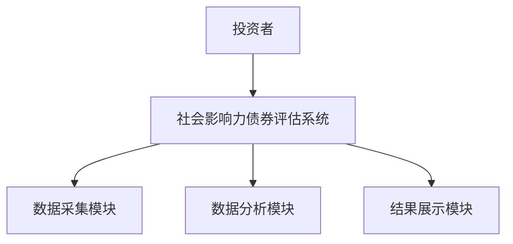
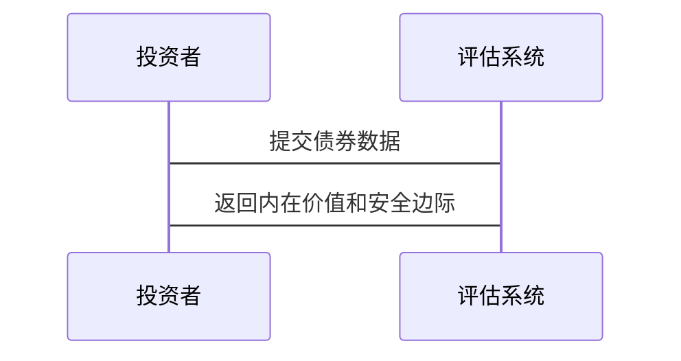

                 


# 格雷厄姆特价股票理论在社会影响力债券中的新应用

> 关键词：格雷厄姆特价股票理论、社会影响力债券、价值投资、安全边际、内在价值、投资策略、风险管理

> 摘要：本文探讨了如何将格雷厄姆的价值投资理论应用于社会影响力债券的评估与投资策略中。通过分析社会影响力债券的定义、特点及市场现状，结合格雷厄姆的安全边际和内在价值评估方法，提出了一套适用于社会影响力债券的价值评估模型和投资策略。本文还设计了一个基于格雷厄姆理论的社会影响力债券评估系统架构，并通过实际案例展示了该理论在实践中的应用效果。

---

## 第一部分: 格雷厄姆特价股票理论与社会影响力债券概述

### 第1章: 社会影响力债券的背景与概念

#### 1.1 社会影响力债券的定义与特点

社会影响力债券（Social Impact Bonds，简称 SIBs）是一种创新型金融工具，其核心目标是通过投资于社会公益项目（如教育、医疗、环保等）来实现社会价值的同时，为投资者提供经济回报。与传统的债券不同，社会影响力债券的回报不仅取决于项目的经济效益，还与其所产生的社会效益密切相关。

- **定义**：社会影响力债券是由政府或非营利组织发行的一种债券，其本金和利息的偿还依赖于特定社会项目的结果。投资者通过投资这些债券，不仅支持了社会公益项目，还可以获得财务回报。

- **特点**：
  - **双重目标**：既追求经济效益，又追求社会效益。
  - **结果导向**：债券的偿还或收益与项目的实际成果挂钩。
  - **风险分担**：通常采用公私合作模式，风险由多方分担。

#### 1.2 格雷厄姆特价股票理论的核心概念

本章节简要介绍格雷厄姆的价值投资理论，包括其核心概念和关键原则。

- **安全边际**：格雷厄姆强调以低于内在价值的价格购买资产，以确保投资的安全性和盈利能力。
- **内在价值**：资产的真实价值，与市场波动无关，可以通过基本面分析计算。
- **价值投资策略**：通过长期持有优质资产，等待其价值回归。

#### 1.3 格雷厄姆理论在社会影响力债券中的应用前景

- **潜在投资价值**：社会影响力债券的双重目标使其成为价值投资者的理想选择。
- **契合点**：格雷厄姆的安全边际和内在价值评估方法可以用于社会影响力债券的风险控制和收益预测。
- **挑战与机遇**：社会影响力债券市场的不成熟和数据的稀缺性为理论的应用带来了挑战，但也提供了创新的机会。

---

## 第二部分: 格雷厄姆特价股票理论的核心原理与数学模型

### 第2章: 格雷厄姆特价股票理论的核心原理

#### 2.1 格雷厄姆安全边际原则

- **定义**：安全边际是资产的内在价值与市场价格之间的差额，确保了投资的安全性和盈利能力。
- **计算方法**：
  - 内在价值 \( V \)：通过基本面分析确定。
  - 市场价格 \( P \)：当前市场价格。
  - 安全边际 \( = V - P \)。

#### 2.2 格雷厄姆内在价值评估方法

- **定义**：内在价值是资产的真实价值，与市场波动无关。
- **计算公式**：
  $$ V = \frac{E}{1 + r} $$
  其中，\( E \) 是预期收益，\( r \) 是折现率。

#### 2.3 格雷厄姆投资策略的数学模型

- **内在价值计算**：
  $$ V = \frac{E}{1 + r} $$
- **安全边际计算**：
  $$ \text{安全边际} = V - P $$

---

## 第三部分: 社会影响力债券的评估与分析

### 第3章: 社会影响力债券的评估方法

#### 3.1 社会影响力债券的评估维度

- **社会影响力评估**：包括项目对社会的正面影响（如减少贫困、改善环境）。
- **经济回报评估**：包括项目的盈利能力。
- **风险评估**：包括市场风险、信用风险和操作风险。

#### 3.2 格雷厄姆理论在社会影响力债券评估中的应用

- **内在价值评估**：通过基本面分析确定债券的内在价值。
- **安全边际评估**：计算内在价值与市场价格之间的差额，确保投资的安全性。
- **投资组合优化**：通过组合投资降低风险，提高收益。

#### 3.3 社会影响力债券的数学评估模型

- **社会影响力评估公式**：
  $$ S = \sum_{i=1}^{n} w_i \cdot s_i $$
  其中，\( S \) 是社会影响力总评分，\( w_i \) 是第 \( i \) 个社会影响力的权重，\( s_i \) 是第 \( i \) 个社会影响力的评分。

- **经济回报评估公式**：
  $$ R = \sum_{i=1}^{n} w_i \cdot r_i $$
  其中，\( R \) 是经济回报总评分，\( w_i \) 是第 \( i \) 个经济回报因素的权重，\( r_i \) 是第 \( i \) 个经济回报因素的评分。

---

## 第四部分: 社会影响力债券的市场分析与投资策略

### 第4章: 社会影响力债券的市场现状

#### 4.1 全球社会影响力债券市场分析

- **市场规模与增长**：近年来，全球社会影响力债券市场规模迅速增长，尤其是在发达国家市场。
- **区域分布**：欧洲和北美是主要的市场，亚洲市场正在快速发展。

#### 4.2 中国市场分析

- **发展现状**：中国社会影响力债券市场尚处于起步阶段，但潜力巨大。
- **政策支持**：中国政府通过政策引导和资金支持，推动社会影响力债券的发展。

---

## 第五部分: 系统架构与项目实战

### 第5章: 系统架构设计

#### 5.1 问题场景介绍

- **目标**：设计一个基于格雷厄姆理论的社会影响力债券评估系统。
- **用户需求**：投资者需要一个工具来评估社会影响力债券的价值和风险。

#### 5.2 系统功能设计

- **核心功能**：
  - 内在价值评估。
  - 安全边际计算。
  - 投资组合优化。

#### 5.3 系统架构设计

使用 Mermaid 绘制系统架构图：



#### 5.4 系统接口设计

- **输入接口**：接收债券的基本面数据。
- **输出接口**：输出债券的内在价值和安全边际。

#### 5.5 系统交互设计

使用 Mermaid 绘制交互流程图：



---

## 第六部分: 项目实战

### 第6章: 项目实战

#### 6.1 环境安装

- **工具安装**：安装 Python 和相关库（如 Pandas、NumPy）。
- **数据获取**：收集社会影响力债券的相关数据。

#### 6.2 核心代码实现

```python
import pandas as pd

def calculate_intrinsic_value(enterprise_value, expected_profit, discount_rate):
    return enterprise_value / (1 + discount_rate)

def calculate_margin_of_safety(intrinsic_value, market_price):
    return intrinsic_value - market_price

# 示例数据
enterprise_value = 1000
expected_profit = 500
discount_rate = 0.1
market_price = 800

# 计算内在价值
intrinsic_value = calculate_intrinsic_value(enterprise_value, expected_profit, discount_rate)
print(f"内在价值: {intrinsic_value}")

# 计算安全边际
margin_of_safety = calculate_margin_of_safety(intrinsic_value, market_price)
print(f"安全边际: {margin_of_safety}")
```

#### 6.3 实际案例分析

- **案例背景**：某社会影响力债券用于教育项目，预期回报率为 10%。
- **计算过程**：
  - 内在价值 = 1000 / 1.1 = 909.09
  - 市场价格 = 800
  - 安全边际 = 909.09 - 800 = 109.09

#### 6.4 项目小结

- **优势**：通过格雷厄姆理论，投资者可以更科学地评估社会影响力债券的价值和风险。
- **挑战**：数据的稀缺性和模型的复杂性是实际应用中的主要挑战。

---

## 第七部分: 最佳实践与总结

### 第7章: 最佳实践

- **风险管理**：投资者应密切关注社会影响力债券的信用风险和市场风险。
- **数据收集**：建立完善的数据采集和分析体系，确保评估的准确性。
- **长期投资**：社会影响力债券的投资周期较长，需要耐心和信心。

### 7.2 小结

格雷厄姆的价值投资理论为社会影响力债券的评估和投资策略提供了重要的理论基础和实践指导。通过科学的评估方法和系统的架构设计，投资者可以在实现社会价值的同时，获得稳定的经济回报。

---

## 第八部分: 扩展阅读

### 8.1 扩展阅读

- **书籍推荐**：
  - 《The Intelligent Investor》 —— 本杰明·格雷厄姆
  - 《Social Impact Bonds: Theory and Practice》 —— 彼得·蒂奇纳
- **在线资源**：
  - 格雷厄姆投资理论的相关网站和论坛。
  - 社会影响力债券的市场研究报告。

---

## 作者

作者：AI天才研究院 & 禅与计算机程序设计艺术

---

这篇文章从理论到实践，系统地探讨了格雷厄姆价值投资理论在社会影响力债券中的新应用。通过数学模型、系统架构和实际案例的分析，为投资者提供了科学的评估方法和投资策略。

