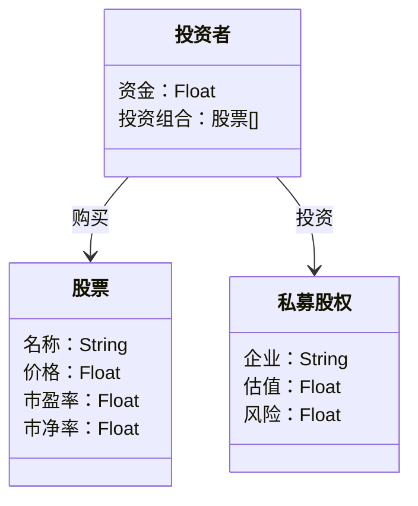

                 


# 格雷厄姆特价股票理论在私募股权投资中的运用

> 关键词：格雷厄姆理论，私募股权，价值投资，内在价值，风险管理

> 摘要：本文探讨了格雷厄姆的价值投资理念在私募股权投资中的应用，通过分析私募股权的特点、评估方法和风险管理策略，展示了如何将格雷厄姆的理论应用于实际投资中。文章详细介绍了内在价值评估、安全边际概念、数学模型设计以及系统架构，结合实际案例，为私募股权投资者提供了实用的指导。

---

## 第一部分：格雷厄姆特价股票理论的背景与基础

### 第1章：格雷厄姆特价股票理论概述

#### 1.1 格雷厄姆投资理念的核心思想

- **1.1.1 价值投资的基本概念**
  - 价值投资的定义
  - 安全边际的内涵
  - 内在价值的计算公式

- **1.1.2 安全边际的定义与重要性**
  - 安全边际的作用
  - 安全边际的计算方法
  - 安全边际与投资风险的关系

- **1.1.3 内在价值的计算方法**
  - 内在价值的定义
  - 格雷厄姆的估值模型
  - 内在价值与市场价值的对比

#### 1.2 格雷厄姆的投资策略

- **1.2.1 股票投资的三重过滤法**
  - 过滤法的定义
  - 三重过滤的具体步骤
  - 过滤法在实际投资中的应用

- **1.2.2 低市盈率与低市净率股票的选择**
  - 市盈率与市净率的计算公式
  - 低市盈率与低市净率股票的特点
  - 选择低市盈率股票的策略

- **1.2.3 高质量企业的识别标准**
  - 高质量企业的定义
  - 格雷厄姆对企业质量的评估标准
  - 高质量企业与低质量企业的对比

### 第2章：私募股权投资的基本概念

#### 2.1 私募股权的定义与特点

- **2.1.1 私募股权的定义**
  - 私募股权的定义
  - 私募股权与公开市场的区别
  - 私募股权的主要运作模式

- **2.1.2 私募股权与公开市场的区别**
  - 市场流动性对比
  - 投资门槛对比
  - 信息披露要求对比

- **2.1.3 私募股权的主要运作模式**
  - 杠杆收购
  - 管理层收购
  - 并购重组

#### 2.2 私募股权的投资流程

- **2.2.1 投资机会的筛选**
  - 投资机会的来源
  - 投资机会的初步筛选标准
  - 投资机会的评估流程

- **2.2.2 尽职调查的方法**
  - 财务尽职调查
  - 管理层访谈
  - 市场分析

- **2.2.3 投资决策的制定**
  - 投资决策的关键因素
  - 投资决策的流程
  - 投资决策的风险评估

---

## 第二部分：格雷厄姆理论在私募股权投资中的应用

### 第3章：私募股权投资中的价值评估

#### 3.1 内在价值的评估方法

- **3.1.1 现金流折现法（DCF）的原理**
  - DCF模型的定义
  - 自由现金流的计算公式
  - 折现率的确定方法

- **3.1.2 市盈率与市净率的比较分析**
  - 市盈率与市净率的定义
  - 市盈率与市净率的优缺点
  - 市盈率与市净率的适用场景

- **3.1.3 股东权益收益率（ROE）的计算**
  - ROE的定义
  - ROE的计算公式
  - ROE与企业价值的关系

#### 3.2 格雷厄姆的估值模型

- **3.2.1 低市盈率法的适用场景**
  - 低市盈率法的定义
  - 低市盈率法的适用条件
  - 低市盈率法的优缺点

- **3.2.2 低市净率法的优缺点**
  - 低市净率法的定义
  - 低市净率法的适用条件
  - 低市净率法的优缺点

- **3.2.3 高股息率股票的筛选标准**
  - 高股息率股票的定义
  - 高股息率股票的筛选标准
  - 高股息率股票的风险分析

### 第4章：私募股权投资中的风险管理

#### 4.1 风险评估与控制

- **4.1.1 系统性风险与非系统性风险的区分**
  - 系统性风险的定义
  - 非系统性风险的定义
  - 系统性风险与非系统性风险的对比

- **4.1.2 杠杆风险的管理策略**
  - 杠杆风险的定义
  - 杠杆风险的来源
  - 杠杆风险的管理策略

- **4.1.3 流动性风险的应对措施**
  - 流动性风险的定义
  - 流动性风险的来源
  - 流动性风险的应对措施

#### 4.2 格雷厄姆理论中的风险管理

- **4.2.1 安全边际在风险管理中的作用**
  - 安全边际的定义
  - 安全边际在风险管理中的作用
  - 安全边际的计算方法

- **4.2.2 投资组合的分散化策略**
  - 投资组合的定义
  - 投资组合的分散化策略
  - 投资组合的风险管理

---

## 第三部分：系统分析与架构设计

### 第5章：系统功能设计

#### 5.1 问题场景介绍

- 私募股权投资中常见的问题
- 格雷厄姆理论在系统中的应用
- 系统的目标与功能

#### 5.2 领域模型设计

- **领域模型的定义**
- **领域模型的组成部分**
  - 实体类
  - 关系类
  - 边界类

- **领域模型的 mermaid 类图**



### 第6章：系统架构设计

#### 6.1 系统架构设计

- **系统架构的定义**
- **系统架构的组成部分**
  - 数据层
  - 业务逻辑层
  - 用户界面层

- **系统架构的 mermaid 架构图**


---

## 第四部分：项目实战

### 第7章：环境安装与系统实现

#### 7.1 环境安装

- **安装 Python 环境**
- **安装相关库**
  - numpy
  - pandas
  - matplotlib

#### 7.2 核心代码实现

- **DCF 模型的实现**

```python
import numpy as np

def dcfvaluation(cash_flows, discount_rate):
    present_value = sum(cash_flows / (1 + discount_rate) ** i for i in range(len(cash_flows)))
    return present_value

# 示例数据
cash_flows = [100, 200, 300, 400]
discount_rate = 0.1

valuation = dcfvaluation(cash_flows, discount_rate)
print(f"DCF 估值：{valuation}")
```

#### 7.3 案例分析

- **案例背景**
- **案例分析步骤**
- **分析结果与解读**

---

## 第五部分：最佳实践与总结

### 第8章：最佳实践

#### 8.1 小结

- 本文的主要内容总结
- 格雷厄姆理论在私募股权投资中的应用价值
- 系统设计与实现的要点

#### 8.2 注意事项

- 投资风险提示
- 系统使用的注意事项
- 数据分析的局限性

#### 8.3 拓展阅读

- 推荐的相关书籍
- 推荐的相关文章
- 推荐的在线资源

---

## 作者：AI天才研究院 & 禅与计算机程序设计艺术

---

通过本文，读者可以系统地了解格雷厄姆理论在私募股权投资中的应用，掌握内在价值评估、风险管理策略和系统设计方法，为实际投资提供理论支持和实践指导。

