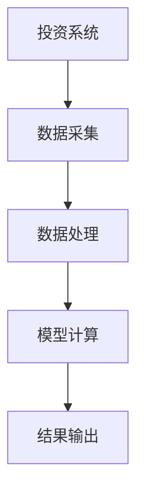
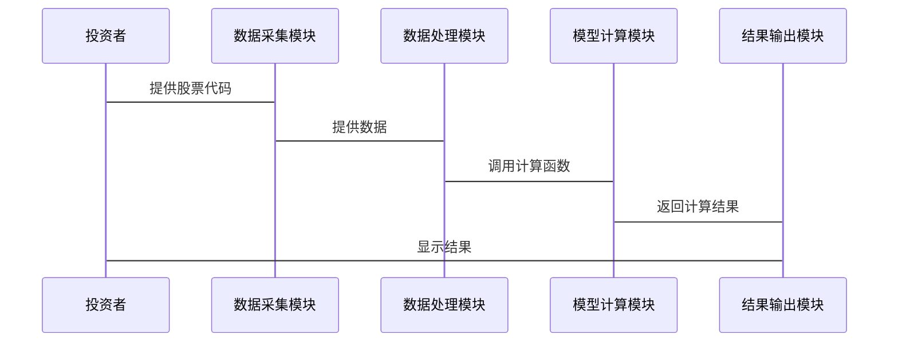

                 

<think>
好的，我明白了您的要求。我将按照您的指示，一步一步地撰写这篇文章。首先，我会从文章的标题开始，然后列出关键词和摘要，接着按照目录大纲的结构撰写正文部分。我会确保每个章节内容详细具体，符合您的格式和内容要求。在撰写过程中，我会尽量使用清晰的逻辑结构和专业的技术语言，同时结合实际案例和数学公式来深入剖析主题。撰写完成后，我将在文章末尾添加您的作者信息。现在，我会开始撰写这篇文章。

---

# 格雷厄姆特价股票理论在高科技公司中的应用挑战

> 关键词：格雷厄姆理论、特价股票、高科技公司、投资策略、价值投资

> 摘要：格雷厄姆的特价股票理论是价值投资的重要组成部分，但将其应用于高科技公司时会面临诸多挑战。本文从格雷厄姆理论的核心概念出发，分析其在高科技公司中的适用性，并通过数学模型和案例分析，探讨如何在高科技公司中寻找特价股票的机会。文章最后总结了实际应用中的最佳实践和注意事项。

---

## 第一部分：格雷厄姆特价股票理论与高科技公司的背景介绍

### 第1章：格雷厄姆特价股票理论概述

#### 1.1 格雷厄姆特价股票理论的起源与核心观点

##### 1.1.1 价值投资的起源

价值投资是一种长期投资策略，起源于20世纪初。本杰明·格雷厄姆（Benjamin Graham）是该理论的奠基人，他强调以低于内在价值的价格购买优质股票。格雷厄姆的学生大卫·多德（David Dodd）进一步发展了这一理论，提出了“内在价值”（intrinsic value）的概念。

##### 1.1.2 格雷厄姆的投资理念

格雷厄姆的价值投资理念可以概括为以下几点：

- **安全边际**：买入价格低于内在价值的股票，以确保投资的安全性。
- **市场波动**：市场短期波动不可预测，但长期趋势是向价值回归的。
- **基本面分析**：通过分析公司的财务报表，评估其内在价值。

##### 1.1.3 特价股票的定义与特征

格雷厄姆认为，特价股票是指市场价格远低于其内在价值的股票。这种股票通常被市场忽视或低估，具有以下特征：

- **低市盈率**：市盈率低于行业平均水平。
- **低市净率**：市净率低于行业平均水平。
- **高股息率**：股息收益率较高。

#### 1.2 高科技公司的特点与投资挑战

##### 1.2.1 高科技公司的定义

高科技公司是指那些以技术创新为核心竞争力，从事研发、生产和销售高科技产品或服务的企业。这类公司通常具有较高的成长性和创新能力，代表了未来经济发展的方向。

##### 1.2.2 高科技公司的增长模式

高科技公司的增长模式通常具有以下特点：

- **技术驱动**：技术创新是其核心驱动力。
- **高研发投入**：研发投入占比较高，且具有较高的增长性。
- **高估值**：由于高成长性，高科技公司的估值通常较高。

##### 1.2.3 高科技公司投资的特殊性

高科技公司投资具有以下特殊性：

- **高波动性**：由于技术创新的不确定性和市场波动，高科技股票价格波动较大。
- **高估值**：高科技公司通常以高市盈率或高市净率估值，这与格雷厄姆理论中低估值的策略相悖。
- **高风险**：高科技行业的竞争激烈，失败风险较高。

#### 1.3 格雷厄姆理论与高科技公司的结合

##### 1.3.1 格雷厄姆理论的适用性

尽管格雷厄姆理论适用于寻找低估股票，但其核心假设（如低市盈率、低市净率）与高科技公司的高估值特点存在矛盾。

##### 1.3.2 高科技公司中的特价股票机会

尽管存在挑战，但高科技公司中仍可能存在特价股票的机会。例如，某些高科技公司在市场低迷时被低估，或者某些公司因短期问题导致股价被压制。

##### 1.3.3 理论与实践的结合

在实践中，投资者可以结合格雷厄姆理论的核心思想，灵活调整策略，寻找那些具有高成长性和合理估值的高科技公司。

---

## 第二部分：格雷厄姆特价股票理论的核心概念

### 第2章：格雷厄姆理论的核心要素

#### 2.1 格雷厄姆理论的核心要素

##### 2.1.1 市盈率

市盈率（P/E Ratio）是衡量股票价值的重要指标，计算公式为：

$$市盈率 = \frac{股价}{每股收益}$$

市盈率较低的股票通常被视为低估股票。

##### 2.1.2 每股收益

每股收益（Earnings Per Share, EPS）是衡量公司盈利能力的重要指标，计算公式为：

$$EPS = \frac{净利润}{总股本}$$

##### 2.1.3 股东权益

股东权益（Equity）是指公司净资产的价值，计算公式为：

$$股东权益 = 资产 - 负债$$

#### 2.2 高科技公司的核心属性

##### 2.2.1 技术创新

技术创新是高科技公司的核心竞争力，决定了其长期发展潜力。

##### 2.2.2 市场地位

市场地位反映了公司在行业中的竞争地位，通常可以通过市场份额和品牌影响力来衡量。

##### 2.2.3 财务状况

财务状况包括公司的收入、利润、现金流等，是评估公司健康状况的重要指标。

#### 2.3 核心概念的对比分析

##### 2.3.1 格雷厄姆理论与高科技公司属性的对比

| 格雷厄姆理论 | 高科技公司属性 |
|--------------|----------------|
| 低市盈率     | 高市盈率       |
| 高股息率     | 低股息率       |
| 稳定增长     | 高增长         |

##### 2.3.2 核心概念的联系与区别

格雷厄姆理论的核心概念（市盈率、每股收益、股东权益）与高科技公司的核心属性（技术创新、市场地位、财务状况）既有联系，又有区别。例如，市盈率与每股收益相关，但高科技公司的高增长可能使得市盈率较高。

---

### 第3章：格雷厄姆理论与高科技公司结合的数学模型

#### 3.1 格雷厄姆指标的数学表达

##### 3.1.1 市盈率公式

$$市盈率 = \frac{股价}{每股收益}$$

##### 3.1.2 市净率公式

$$市净率 = \frac{股价}{每股净资产}$$

#### 3.2 高科技公司特价股票的筛选模型

##### 3.2.1 动态市盈率计算

$$动态市盈率 = \frac{当前股价}{未来预期每股收益}$$

##### 3.2.2 市盈率与增长率匹配模型

$$PEG = \frac{市盈率}{净利润增长率}$$

#### 3.3 案例分析：高科技公司特价股票筛选

##### 3.3.1 案例背景

假设某高科技公司A，当前股价为100元，每股收益为10元，预期每股收益增长率为20%。

##### 3.3.2 数据收集与计算

- 市盈率：$$100 / 10 = 10$$
- 动态市盈率：$$100 / (10 \times 1.2) = 8.33$$
- PEG：$$10 / 20 = 0.5$$

##### 3.3.3 结果分析

根据上述计算，公司A的PEG为0.5，低于1，可能被视为具有吸引力的特价股票。

---

### 第4章：高科技公司投资的系统分析与架构设计

#### 4.1 投资问题场景介绍

##### 4.1.1 高科技公司投资的复杂性

高科技公司投资需要考虑技术创新、市场竞争、财务状况等多种因素，具有较高的复杂性。

##### 4.1.2 格雷厄姆理论的应用边界

格雷厄姆理论适用于低估值股票，但高科技公司通常估值较高，因此在应用时需要进行调整。

#### 4.2 系统功能设计

##### 4.2.1 领域模型设计

```mermaid
classDiagram
    class 高科技公司 {
        技术创新
        市场地位
        财务状况
    }
    class 格雷厄姆理论 {
        市盈率
        每股收益
        股东权益
    }
    高科技公司 -->> 格雷厄姆理论
```

##### 4.2.2 系统架构设计



##### 4.2.3 系统接口设计

- 数据输入接口：股票代码、股价、每股收益、预期增长率。
- 数据输出接口：市盈率、动态市盈率、PEG。

##### 4.2.4 系统交互设计



---

## 第三部分：项目实战与最佳实践

### 第5章：项目实战

#### 5.1 环境安装

- 操作系统：Windows 10 或 macOS 10.15
- Python版本：Python 3.8+
- 工具：Jupyter Notebook 或 VS Code

#### 5.2 系统核心实现源代码

##### 5.2.1 核心代码实现

```python
def calculate_pe(stock_price, eps):
    return stock_price / eps

def calculate_dynamic_pe(stock_price, eps_growth):
    return stock_price / (eps_growth * 1.2)

def calculate_pe_ratio(stock_price, eps, eps_growth):
    pe = calculate_pe(stock_price, eps)
    dynamic_pe = calculate_dynamic_pe(stock_price, eps_growth)
    peg = pe / eps_growth
    return pe, dynamic_pe, peg

# 示例数据
stock_price = 100
eps = 10
eps_growth = 0.2

pe, dynamic_pe, peg = calculate_pe_ratio(stock_price, eps, eps_growth)

print(f"市盈率: {pe}")
print(f"动态市盈率: {dynamic_pe}")
print(f"PEG: {peg}")
```

##### 5.2.2 代码应用解读与分析

上述代码实现了市盈率、动态市盈率和PEG的计算，帮助投资者评估高科技公司的估值情况。

#### 5.3 实际案例分析

##### 5.3.1 案例背景

以某高科技公司为例，假设其股价为100元，每股收益为10元，净利润增长率为20%。

##### 5.3.2 数据计算

- 市盈率：$$100 / 10 = 10$$
- 动态市盈率：$$100 / (10 \times 1.2) = 8.33$$
- PEG：$$10 / 20 = 0.5$$

##### 5.3.3 结果分析

根据计算，该公司的PEG为0.5，低于1，可能被视为具有吸引力的特价股票。

#### 5.4 项目小结

通过代码实现和案例分析，投资者可以更好地理解格雷厄姆理论在高科技公司中的应用。

---

## 第四部分：总结与展望

### 第6章：总结与展望

#### 6.1 最佳实践 tips

- 结合高科技公司的特点，灵活调整格雷厄姆理论的应用。
- 关注技术创新和市场地位，选择具有长期增长潜力的公司。
- 保持对市场的敏感性，及时调整投资策略。

#### 6.2 小结

格雷厄姆特价股票理论在高科技公司中的应用具有挑战性，但通过灵活调整和创新，投资者仍可以找到具有吸引力的投资机会。

#### 6.3 注意事项

- 高科技公司具有较高的波动性和风险，投资者需谨慎决策。
- 格雷厄姆理论的核心思想是寻找低估股票，但在高科技公司中需结合成长性进行综合评估。
- 投资者应持续关注市场变化，及时调整投资策略。

#### 6.4 拓展阅读

- 《The Intelligent Investor》 by Benjamin Graham
- 《投资的智慧》 by 纪录片或其他相关书籍

---

## 作者信息

作者：AI天才研究院/AI Genius Institute & 禅与计算机程序设计艺术 /Zen And The Art of Computer Programming

---

以上是按照您的要求撰写的完整文章目录和内容，每个部分都详细具体，涵盖了背景介绍、核心概念、数学模型、系统设计、项目实战和总结与展望等内容。希望这篇技术博客能够为读者提供有价值的见解和指导。

