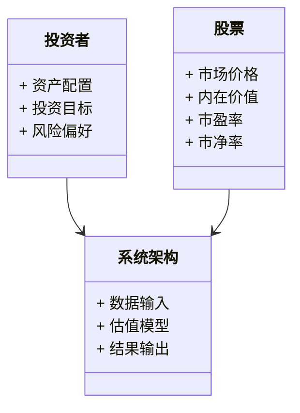
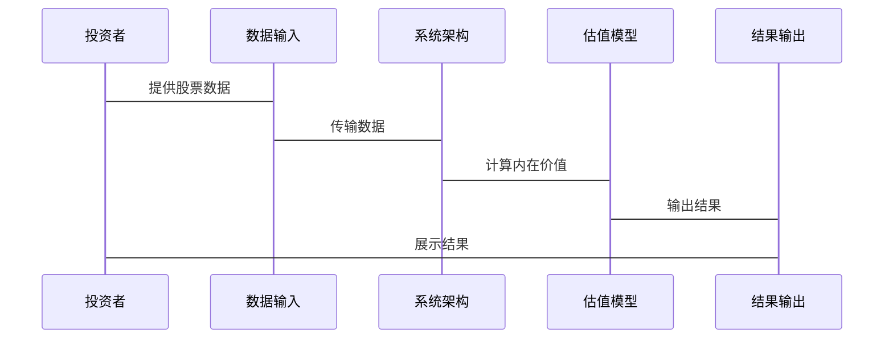

                 


# 《格雷厄姆特价股票理论对公司估值方法的影响》

## 关键词：格雷厄姆、特价股票理论、公司估值、内在价值、安全边际、价值投资、数学模型

## 摘要：格雷厄姆的特价股票理论是价值投资的重要基石，强调以低于内在价值的价格买入股票。本文将从理论背景、核心概念、数学模型、系统设计、项目实战等方面，全面分析格雷厄姆理论对公司估值方法的影响。通过实际案例和系统架构，探讨其在现代投资中的应用。

## 目录大纲：

---

### 第一部分：格雷厄姆特价股票理论的背景与核心概念

#### 第1章：格雷厄姆特价股票理论概述

##### 1.1 格雷厄姆特价股票理论的起源与发展

- 1.1.1 价值投资的起源与发展
- 1.1.2 格雷厄姆的贡献与影响
- 1.1.3 格雷厄姆理论的核心思想

##### 1.2 格雷厄姆特价股票理论的核心概念

- 1.2.1 内在价值的定义与计算
- 1.2.2 安全边际的概念与重要性
- 1.2.3 市场先生与投资者的关系

##### 1.3 格雷厄姆理论与现代估值方法的联系

- 1.3.1 格雷厄姆理论在现代投资中的应用
- 1.3.2 理论的演变与创新

---

### 第二部分：格雷厄姆特价股票理论的核心原理

#### 第2章：内在价值与安全边际的数学模型

##### 2.1 内在价值的计算公式

- $$\text{内在价值} = \frac{\text{未来现金流}}{\text{折现率}}$$

##### 2.2 安全边际的计算方法

- $$\text{安全边际} = \text{内在价值} - \text{市场价格}$$

##### 2.3 格雷厄姆经典投资策略

- 2.3.1 高质量企业的筛选标准
- 2.3.2 低市盈率与低市净率的选股方法

---

### 第三部分：格雷厄姆理论对现代估值方法的影响

#### 第3章：格雷厄姆理论与现代企业估值的结合

##### 3.1 现代企业估值的核心要素

- 3.1.1 财务指标分析
- 3.1.2 行业分析与竞争地位
- 3.1.3 管理团队与企业治理

##### 3.2 格雷厄姆理论在DCF模型中的应用

- 3.2.1 现金流折现法的原理
- 3.2.2 企业生命周期与现金流预测

##### 3.3 现代估值方法与格雷厄姆理论的对比分析

- 3.3.1 DCF模型与特价股票理论的异同
- 3.3.2 市场情绪与理性分析的结合

---

### 第四部分：系统分析与架构设计

#### 第4章：格雷厄姆理论的系统架构设计

##### 4.1 问题场景介绍

- 投资者如何利用格雷厄姆理论进行系统化投资决策

##### 4.2 系统功能设计

- 领域模型mermaid类图



##### 4.3 系统架构设计

- 系统架构mermaid图


##### 4.4 系统接口设计

- 系统接口设计

##### 4.5 系统交互设计

- 系统交互mermaid序列图



---

### 第五部分：项目实战

#### 第5章：格雷厄姆理论的项目实战

##### 5.1 环境安装

- 安装必要的开发工具和库

##### 5.2 系统核心实现源代码

- 示例代码

```python
def calculate_intrinsic_value(enterprise_value, free_cash_flow, discount_rate):
    return enterprise_value / discount_rate * (1 + discount_rate)**-10

def calculate_margin_of_safety(intrinsic_value, market_price):
    return intrinsic_value - market_price
```

##### 5.3 代码应用解读与分析

- 代码功能说明

##### 5.4 实际案例分析

- 详细案例分析

##### 5.5 项目小结

---

### 第六部分：总结与展望

#### 第6章：总结与展望

##### 6.1 格雷厄姆理论的核心要点回顾

- 内在价值与安全边际的重要性

##### 6.2 理论的未来发展趋势

- 结合大数据与人工智能的应用前景

##### 6.3 最佳实践 tips

- 投资者如何有效应用格雷厄姆理论

##### 6.4 小结

---

## 作者：AI天才研究院 & 禅与计算机程序设计艺术

---

通过以上目录大纲，我们可以系统地探讨格雷厄姆特价股票理论对公司估值方法的影响，从理论到实践，结合数学模型和系统设计，帮助读者全面理解这一经典的估值方法。

