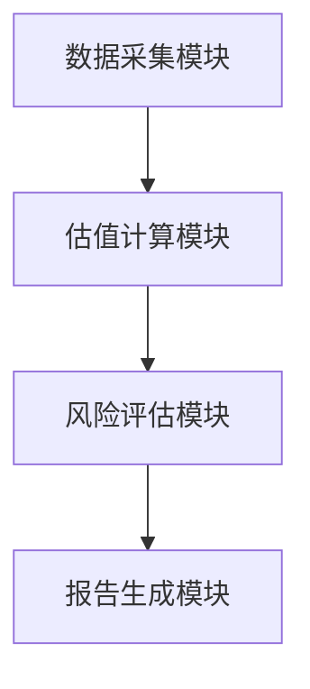
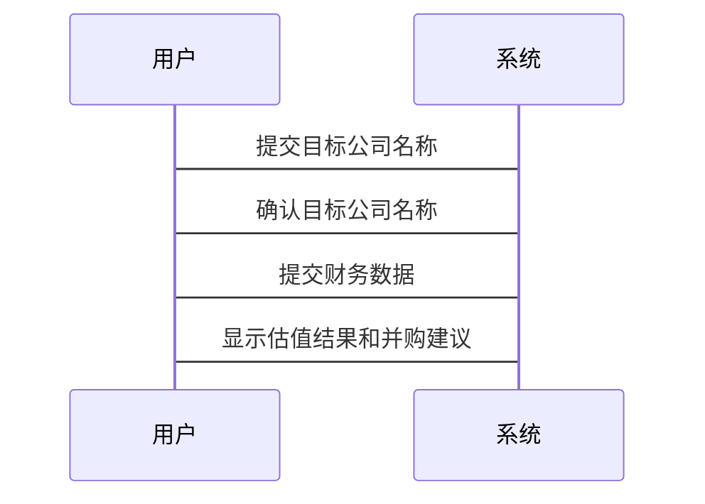

                 

# 《格雷厄姆特价股票理论对公司并购策略的影响》

---

## 关键词：
- 格雷厄姆特价股票理论
- 公司并购策略
- 价值投资
- 并购定价
- 内在价值评估

---

## 摘要：
本文探讨了格雷厄姆的特价股票理论在公司并购策略中的应用。通过分析格雷厄姆的核心思想、价值评估方法及其在并购中的实际应用，本文揭示了如何利用价值投资理念优化并购决策。文章从并购的背景与重要性入手，详细阐述了格雷厄姆理论的核心概念，包括安全边际、内在价值和低估股票的识别。接着，本文分析了并购中的价值评估方法，并结合格雷厄姆理论提出了具体的定价策略。通过案例分析和系统设计，本文展示了如何构建并购评估系统，并提出了基于格雷厄姆理论的并购策略优化方案。最后，本文总结了格雷厄姆理论在公司并购中的实际应用价值，并提供了最佳实践建议。

---

## 第1章: 公司并购的背景与重要性

### 1.1 公司并购的基本概念
#### 1.1.1 公司并购的定义
公司并购（Mergers and Acquisitions, M&A）是指一家公司（收购方）购买另一家公司（被收购方）的全部或部分资产、股权或业务的过程。并购是企业扩张和优化资产组合的重要手段。

#### 1.1.2 公司并购的类型
- **横向并购**：同一行业内的企业并购，旨在扩大市场份额。
- **纵向并购**：产业链上下游企业的并购，以增强垂直整合能力。
- **混合并购**：与自身业务无直接关联的企业并购，通常出于战略目的。

#### 1.1.3 公司并购的动机与目的
- **扩大市场份额**：通过并购快速进入新市场。
- **获取技术或资源**：通过并购获得关键技术和资源。
- **优化资产结构**：通过并购实现资产的更优化配置。
- **提升竞争力**：通过并购增强企业的市场地位。

### 1.2 格雷厄姆特价股票理论的背景
#### 1.2.1 格雷厄姆与价值投资概述
本杰明·格雷厄姆（Benjamin Graham）是价值投资的鼻祖，被誉为“价值投资之父”。他提出的价值投资理念强调以低于内在价值的价格买入优质股票，并长期持有，等待市场回归理性。

#### 1.2.2 格雷厄姆理论的核心思想
- **安全边际**：买入价格低于内在价值，确保投资的安全性。
- **低估股票**：关注市场价格低于内在价值的股票，寻找投资机会。
- **长期投资**：基于内在价值进行长期投资，避免短期市场波动的干扰。

#### 1.2.3 格雷厄姆理论与并购的关系
格雷厄姆的理论主要应用于股票投资，但其核心思想——安全边际和内在价值评估——同样适用于公司并购。通过识别低估的企业，格雷厄姆理论为并购提供了新的视角。

### 1.3 本章小结
- 公司并购的基本概念、类型和动机。
- 格雷厄姆价值投资理论的核心思想及其在并购中的潜在应用。

---

## 第2章: 格雷厄姆特价股票理论的核心概念与分析框架

### 2.1 格雷厄姆特价股票理论的定义
#### 2.1.1 特价股票的定义
特价股票是指市场价格低于其内在价值的股票。识别特价股票是价值投资的核心任务。

#### 2.1.2 特价股票的特征
- **低市盈率（P/E）**：市盈率低于行业平均水平。
- **低市净率（P/B）**：市净率低于行业平均水平。
- **高股息率**：股息收益率高于行业平均水平。
- **低估值**：市场价格低于资产净值或其他估值指标。

#### 2.1.3 特价股票的识别方法
- **基本面分析**：分析财务报表，评估公司盈利能力、成长性和财务健康状况。
- **相对估值法**：比较市盈率、市净率等指标，寻找低于行业平均水平的股票。
- **内在价值计算**：使用DCF模型等方法估算股票的内在价值，寻找低于市场价格的股票。

### 2.2 格雷厄姆的投资分析框架
#### 2.2.1 格雷厄姆的投资理念
格雷厄姆认为，股票不仅是一种金融资产，更是一种企业的所有权凭证。投资者应关注企业的基本面，而不是市场的短期波动。

#### 2.2.2 格雷厄姆的安全边际概念
安全边际是指买入价格与内在价值之间的差距。通过预留安全边际，投资者可以降低市场波动带来的风险。

#### 2.2.3 格雷厄姆的内在价值计算方法
格雷厄姆提出的内在价值计算方法主要包括：
- **DCF模型**：通过现金流折现计算企业价值。
- **资产净值法**：基于账面价值评估企业价值。
- **可比公司法**：通过与可比公司比较，估算企业价值。

### 2.3 格雷厄姆理论与公司并购的关系
#### 2.3.1 并购中的价值评估
- 并购中的价值评估是判断并购是否合理的核心步骤。
- 格雷厄姆的内在价值评估方法为并购提供了科学的估值工具。

#### 2.3.2 格雷厄姆理论在并购中的应用
- **目标识别**：通过格雷厄姆的估值方法，识别低估的并购目标。
- **定价策略**：基于安全边际原则，制定合理的并购价格。
- **风险控制**：通过安全边际降低并购风险。

#### 2.3.3 并购中的风险与机会
- **风险**：市场波动、整合失败、目标公司财务状况不佳等。
- **机会**：通过识别低估企业，实现超额收益。

### 2.4 本章小结
- 格雷厄姆特价股票理论的核心概念。
- 格雷厄姆理论在公司并购中的应用。

---

## 第3章: 并购中的价值评估与定价策略

### 3.1 并购中的价值评估方法
#### 3.1.1 市盈率法
市盈率（P/E）= 股价 / 每股净利润。

- **优点**：简单易懂，适用于盈利稳定的公司。
- **缺点**：无法反映公司的资产状况和未来增长潜力。

#### 3.1.2 市净率法
市净率（P/B）= 股价 / 每股净资产。

- **优点**：适用于净资产占主导地位的公司。
- **缺点**：无法反映公司的盈利能力和成长性。

#### 3.1.3 现金流折现法
现金流折现法（DCF模型）是通过将未来现金流折现，计算公司价值的方法。

公式：
$$ V = \sum_{t=1}^{n} \frac{CF_t}{(1 + r)^t} $$

其中：
- \( V \) 为公司价值。
- \( CF_t \) 为第 \( t \) 年的现金流。
- \( r \) 为折现率。

#### 3.1.4 其他估值方法对比
- **可比公司法**：通过与可比公司比较，估算公司价值。
- **重置成本法**：估算重建公司所需成本。

### 3.2 格雷厄姆理论在并购定价中的应用
#### 3.2.1 特价股票的识别与定价
- 通过格雷厄姆的估值方法，识别市场价格低于内在价值的企业。
- 制定合理的并购价格，确保安全边际。

#### 3.2.2 安全边际在并购中的应用
- 通过预留安全边际，降低并购风险。
- 安全边际 = 内在价值 - 并购价格。

#### 3.2.3 并购价格与内在价值的差异
- 并购价格应低于内在价值，确保投资的合理性。

### 3.3 并购中的定价策略
#### 3.3.1 低估定价策略
- 以低于市场价的价格进行并购，寻找低估目标。

#### 3.3.2 高估定价策略
- 以高于市场价的价格进行并购，通常用于战略并购。

#### 3.3.3 市场定价策略
- 以市场价格为基础，结合公司具体情况制定并购价格。

### 3.4 本章小结
- 并购中的价值评估方法。
- 格雷厄姆理论在并购定价中的应用。

---

## 第4章: 格雷厄姆特价股票理论在公司并购策略中的应用

### 4.1 并购目标的识别与选择
#### 4.1.1 特价股票的识别标准
- 低市盈率、低市净率、高股息率。
- 财务健康，盈利能力稳定。

#### 4.1.2 并购目标的筛选流程
1. 确定并购目标行业。
2. 筛选符合格雷厄姆估值标准的企业。
3. 进行尽职调查，评估目标公司的财务状况和潜在风险。

#### 4.1.3 格雷厄姆理论在目标选择中的应用
- 通过格雷厄姆的估值方法，筛选出市场价格低于内在价值的企业。

### 4.2 并购前的财务分析与风险评估
#### 4.2.1 财务指标分析
- 利润能力：净利润率、ROE（净资产收益率）。
- 偿债能力：资产负债率、流动比率。
- 成长能力：收入增长率、净利润增长率。

#### 4.2.2 并购风险的识别与评估
- **财务风险**：目标公司财务状况不佳。
- **整合风险**：并购后的整合难度。
- **市场风险**：市场波动对并购的影响。

#### 4.2.3 格雷厄姆理论在风险评估中的应用
- 通过安全边际，降低并购风险。
- 通过内在价值评估，确保并购价格合理。

### 4.3 并购后的整合与协同效应
#### 4.3.1 整合策略
- **文化整合**：统一企业文化和价值观。
- **组织整合**：优化组织结构，提高效率。
- **资源整合**：共享资源，降低成本。

#### 4.3.2 协同效应的实现
- **成本协同效应**：通过资源共享降低成本。
- **收入协同效应**：通过市场协同扩大收入。
- **管理协同效应**：通过管理优化提升效率。

### 4.4 本章小结
- 格雷厄姆理论在并购目标识别和风险评估中的应用。
- 并购后的整合策略与协同效应的实现。

---

## 第5章: 基于格雷厄姆理论的公司并购系统设计

### 5.1 系统功能设计
#### 5.1.1 系统功能模块
- 数据采集模块：收集目标公司的财务数据。
- 估值计算模块：基于格雷厄姆理论计算内在价值。
- 风险评估模块：评估并购风险。
- 报告生成模块：生成并购建议报告。

#### 5.1.2 系统功能流程
1. 数据采集模块获取目标公司的财务数据。
2. 估值计算模块计算内在价值，判断是否低于市场价格。
3. 风险评估模块评估并购风险。
4. 生成并购建议报告，指导并购决策。

### 5.2 系统架构设计
#### 5.2.1 系统架构图

#### 5.2.2 系统模块实现
- **数据采集模块**：通过爬虫技术获取目标公司的财务数据。
- **估值计算模块**：使用格雷厄姆的DCF模型计算内在价值。
- **风险评估模块**：评估并购风险，提供风险等级。
- **报告生成模块**：生成并购建议报告，包括估值结果、风险评估和整合建议。

### 5.3 系统接口设计
#### 5.3.1 数据接口
- 数据输入接口：接收目标公司的财务数据。
- 数据输出接口：输出估值结果和风险评估报告。

#### 5.3.2 用户界面
- 用户输入界面：输入目标公司的名称和财务数据。
- 用户输出界面：显示估值结果和并购建议。

### 5.4 系统交互设计
#### 5.4.1 交互流程图

### 5.5 本章小结
- 基于格雷厄姆理论的公司并购系统的功能设计。
- 系统架构和模块实现的详细说明。

---

## 第6章: 项目实战与案例分析

### 6.1 项目背景
某公司计划并购一家同行业企业，希望通过格雷厄姆的理论进行估值和定价。

### 6.2 项目实施
#### 6.2.1 数据采集
- 获取目标公司的财务数据，包括收入、利润、现金流等。

#### 6.2.2 估值计算
- 使用DCF模型计算目标公司的内在价值。
- 比较市场价格与内在价值，判断是否为低估股票。

#### 6.2.3 风险评估
- 评估目标公司的财务风险和整合风险。
- 提供并购建议和风险提示。

### 6.3 项目结果
- 目标公司的内在价值为10亿元，市场价格为8亿元，判断为低估股票。
- 建议并购价格为9亿元，预留1亿元的安全边际。

### 6.4 案例分析
#### 6.4.1 案例选择
某公司并购一家互联网企业，通过格雷厄姆理论进行估值和定价。

#### 6.4.2 分析过程
- 数据采集：目标公司的财务数据。
- 估值计算：使用DCF模型计算内在价值。
- 风险评估：评估目标公司的财务风险和整合风险。
- 并购建议：制定合理的并购价格和整合策略。

#### 6.4.3 结果解读
- 目标公司的内在价值为15亿元，市场价格为12亿元，判断为低估股票。
- 建议并购价格为13亿元，预留2亿元的安全边际。

### 6.5 本章小结
- 项目实战的实施过程和结果。
- 案例分析的具体步骤和结果解读。

---

## 第7章: 格雷厄姆理论在公司并购中的最佳实践

### 7.1 小结
- 格雷厄姆理论在公司并购中的应用价值。
- 并购中的价值评估和定价策略。

### 7.2 注意事项
- **市场风险**：并购后市场波动可能影响公司价值。
- **整合风险**：并购后的整合难度可能影响协同效应。
- **财务风险**：并购可能增加公司的债务负担。

### 7.3 拓展阅读
- 《格雷厄姆的智慧：投资策略》
- 《公司并购的策略与实践》
- 《价值投资与并购定价》

### 7.4 本章小结
- 格雷厄姆理论在公司并购中的应用总结。
- 并购中的注意事项和未来研究方向。

---

## 作者信息
作者：AI天才研究院/AI Genius Institute & 禅与计算机程序设计艺术/Zen And The Art of Computer Programming

