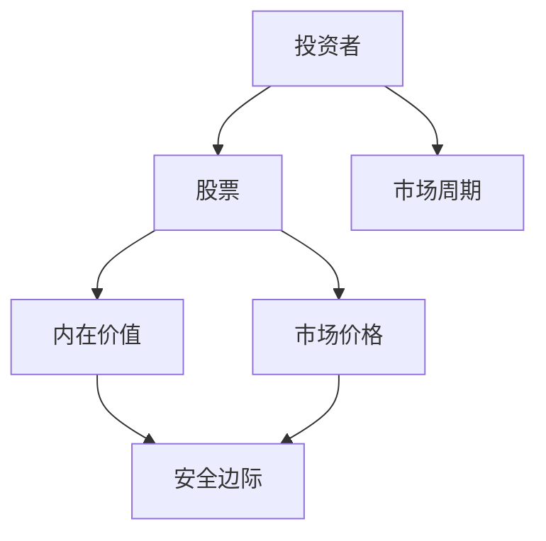
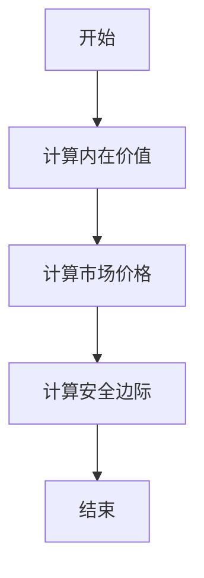
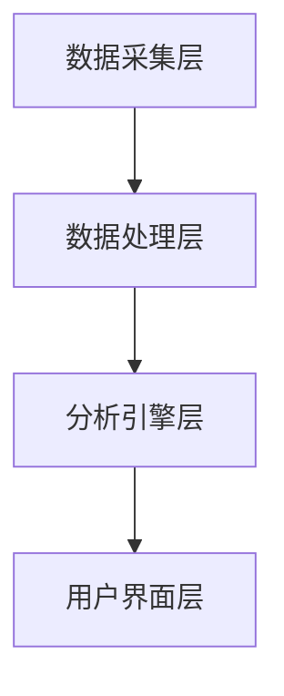

                 


# 《格雷厄姆特价股票理论对公司数字化生态战略的影响》

---

## 关键词：格雷厄姆，股票理论，数字化生态，战略影响，价值投资，安全边际，内在价值

---

## 摘要：  
本文探讨了本杰明·格雷厄姆的特价股票理论如何在数字时代影响公司的生态战略。通过分析价值投资的核心概念，结合数字化转型中的投资策略，本文揭示了如何利用格雷厄姆的理论优化企业在数字生态系统中的定位和价值创造。文章从理论背景、核心概念、算法原理、系统架构到实际案例，全面解析了格雷厄姆理论的现代应用，为企业制定数字化生态战略提供了新的视角和方法。

---

# 第1章: 格雷厄姆特价股票理论概述

## 1.1 格雷厄姆特价股票理论的起源与核心思想

### 1.1.1 价值投资的鼻祖：本杰明·格雷厄姆  
本杰明·格雷厄姆是价值投资的创始人，被誉为“投资之父”。他在20世纪初提出了格雷厄姆特价股票理论，强调以低于内在价值的价格购买股票，以实现长期稳定的收益。他的理论奠定了现代价值投资的基础。

### 1.1.2 格雷厄姆特价股票理论的核心原则  
格雷厄姆的核心思想是“安全边际”和“内在价值”。他主张投资者应以低于内在价值的价格购买股票，并通过分散投资降低风险。此外，他还强调市场情绪的非理性波动，认为市场先生是价值投资的盟友，而非敌人。

### 1.1.3 价值投资与市场有效性的关系  
格雷厄姆认为，市场并非总是有效的，股票价格经常偏离其内在价值。价值投资者的任务是识别这种偏差，并从中获利。这种观点在当时被认为是反市场的，但在实践中证明是极为有效的。

---

## 1.2 格雷厄姆特价股票理论的核心概念

### 1.2.1 安全边际：投资的核心要素  
安全边际是格雷厄姆理论的核心，指的是股票的市场价格与其内在价值之间的差距。通过计算安全边际，投资者可以确定是否以合理的价格购买股票。

### 1.2.2 内在价值：股票估值的基石  
内在价值是基于公司基本面分析得出的股票真实价值。格雷厄姆认为，内在价值是决定股票价格的唯一标准，而市场价格则是波动的、不可预测的。

### 1.2.3 股票市场的周期性与非理性  
格雷厄姆指出，股票市场具有周期性，且市场参与者的情绪化会导致价格波动。投资者应利用市场的非理性，寻找被低估的投资机会。

---

## 1.3 格雷厄姆特价股票理论的现代发展

### 1.3.1 数字化时代的价值投资新维度  
随着数字化技术的发展，股票市场变得更加复杂。数据驱动的分析和算法交易成为新的趋势，但格雷厄姆的核心理念依然适用。

### 1.3.2 数据驱动的股票分析方法  
现代技术使得数据收集和分析更加高效。通过大数据和机器学习，投资者可以更精确地计算内在价值和安全边际。

### 1.3.3 技术进步对投资理论的影响  
技术进步不仅改变了市场环境，还为格雷厄姆理论的实践提供了新的工具。例如，自动化交易系统和实时数据分析帮助投资者更快地捕捉市场机会。

---

# 第2章: 数字化生态战略的背景与挑战

## 2.1 数字化生态战略的背景

### 2.1.1 数字化转型的兴起  
数字化转型已成为企业生存和发展的关键。企业通过数字化技术优化业务流程、提升效率，并创造新的价值点。

### 2.1.2 数字化生态系统的特征  
数字化生态系统是一个由多方参与者共同构建的复杂系统，包括企业、客户、供应商和技术平台。生态系统中的每个参与者都通过数据和技术创新实现价值共创。

### 2.1.3 数字化生态战略的核心要素  
数字化生态战略的核心要素包括技术创新、数据驱动、生态系统协同和用户价值创造。

---

## 2.2 数字化生态战略中的投资策略

### 2.2.1 数字化转型对企业价值的影响  
数字化转型可以显著提升企业的市场价值，通过技术创新和业务模式创新，企业能够更好地满足客户需求，提高利润率。

### 2.2.2 数字化生态中的投资机会与风险  
在数字化生态系统中，投资者可以关注技术创新型企业、数据驱动型平台和新兴技术领域。然而，技术风险和市场波动也是需要关注的主要风险。

### 2.2.3 技术驱动的商业模式创新  
数字化技术推动了商业模式的创新，例如订阅制、按需付费和共享经济。这些模式为企业创造了新的收入来源，同时也带来了新的投资机会。

---

## 2.3 数字化生态中的价值评估挑战

### 2.3.1 数据驱动的估值方法  
在数字化时代，数据是估值的核心。通过分析企业的数据资产、用户行为和市场趋势，投资者可以更准确地评估企业的内在价值。

### 2.3.2 数字化资产的评估难题  
数字化资产（如数据、算法和品牌）的评估具有较高的复杂性。这些资产的价值往往难以量化，且容易受到技术变化的影响。

### 2.3.3 技术锁定与投资风险  
技术锁定是数字化投资中的主要风险。投资者需要关注技术的可扩展性和灵活性，以避免因技术落后而被淘汰。

---

# 第3章: 格雷厄姆理论的核心概念与联系

## 3.1 核心概念的系统分析

### 3.1.1 安全边际的数学模型  
安全边际可以通过以下公式计算：  
$$ \text{安全边际} = \text{内在价值} - \text{市场价格} $$  
其中，内在价值是基于公司基本面的估值，市场价格是当前的股票价格。

### 3.1.2 内在价值的计算公式  
内在价值的计算涉及多个因素，包括企业的盈利能力、资产价值和成长潜力。常用的内在价值计算方法包括股利折现模型（DDM）和自由现金流折现模型（DCF）。

### 3.1.3 市场价格与内在价值的关系  
市场价格围绕内在价值波动，但长期来看，市场价格会回归内在价值。这种关系是价值投资的基础。

---

## 3.2 核心概念的对比分析

### 3.2.1 格雷厄姆理论与现代投资组合理论的对比  
格雷厄姆理论强调个股的内在价值和安全边际，而现代投资组合理论注重资产配置和风险分散。

### 3.2.2 格雷厄姆理论与技术分析的对比  
格雷厄姆理论基于基本面分析，而技术分析基于价格和成交量的变化。两者结合可以提供更全面的投资视角。

### 3.2.3 格雷厄姆理论与行为金融学的对比  
格雷厄姆理论关注市场非理性，行为金融学则从心理学角度解释投资者行为。两者在一定程度上互补。

---

## 3.3 核心概念的ER实体关系图



---

# 第4章: 格雷厄姆特价股票理论的算法原理

## 4.1 格雷厄姆安全边际算法

### 4.1.1 安全边际计算公式  
$$ \text{安全边际} = \text{内在价值} - \text{市场价格} $$

### 4.1.2 安全边际的算法流程  


---

# 第5章: 格雷厄姆理论在数字化生态战略中的应用

## 5.1 数字化生态中的价值投资策略

### 5.1.1 核心算法与技术实现  
通过大数据和机器学习技术，投资者可以更精确地计算股票的内在价值和安全边际。例如，使用自然语言处理技术分析公司财报，识别潜在的投资机会。

### 5.1.2 系统架构设计  
为了实现格雷厄姆理论的数字化应用，需要构建一个包含数据采集、分析、估值和决策支持的系统。以下是系统的架构设计：



### 5.1.3 系统功能设计  
系统的功能包括：  
1. 数据采集与清洗：从多个来源获取股票数据，并进行清洗和预处理。  
2. 基本面分析：计算公司的内在价值和安全边际。  
3. 风险评估：识别市场周期和潜在风险。  
4. 投资建议：基于分析结果，生成投资建议。

---

## 5.2 项目实战：格雷厄姆理论的数字化实现

### 5.2.1 环境配置与代码实现  
以下是一个简单的Python代码示例，用于计算股票的内在价值和安全边际：

```python
def calculate_intrinsic_value(company_data):
    # 假设company_data包含收入、净利润、现金流等信息
    # 使用自由现金流折现模型计算内在价值
    discount_rate = 0.1
    cash_flow = company_data['cash_flow']
    growth_rate = company_data['growth_rate']
    intrinsic_value = sum(cash_flow / (1 + discount_rate)**i for i in range(5))
    return intrinsic_value

def calculate_margin_of_safety(stock_price, intrinsic_value):
    return intrinsic_value - stock_price

# 示例数据
company_data = {
    'cash_flow': [100, 120, 140, 160, 180],
    'growth_rate': 0.1,
    'market_price': 50
}

intrinsic_value = calculate_intrinsic_value(company_data)
margin_of_safety = calculate_margin_of_safety(company_data['market_price'], intrinsic_value)

print(f"内在价值：{intrinsic_value}")
print(f"安全边际：{margin_of_safety}")
```

### 5.2.2 案例分析  
以某科技公司为例，假设其市场价为50元，计算得出的内在价值为60元，安全边际为10元。根据格雷厄姆理论，这是一只值得投资的股票。

---

## 5.3 数字化生态战略中的最佳实践

### 5.3.1 技术驱动的估值优化  
通过数字化技术优化估值模型，提升分析效率和准确性。

### 5.3.2 数据隐私与合规性  
在数字化分析中，需注意数据隐私和合规性问题，确保符合相关法律法规。

### 5.3.3 持续学习与适应  
市场环境和技术不断变化，投资者需持续学习，调整策略，以适应新的挑战。

---

# 第6章: 结论与展望

## 6.1 格雷厄姆理论的持久影响  
尽管市场环境和技术发生了巨大变化，格雷厄姆的核心理念依然适用。价值投资的基本原则是 timeless 的。

## 6.2 数字化生态战略的未来发展  
随着数字化技术的深入发展，企业将更加依赖数据驱动的决策。格雷厄姆理论在数字化生态中的应用将更加广泛，成为企业制定战略的重要依据。

## 6.3 投资者的角色转变  
在数字化时代，投资者需要具备更强的技术素养，能够理解数据分析和技术创新对企业价值的影响。

---

# 作者：AI天才研究院 & 禅与计算机程序设计艺术  

--- 

感谢您的阅读！如需进一步探讨，请随时联系。

