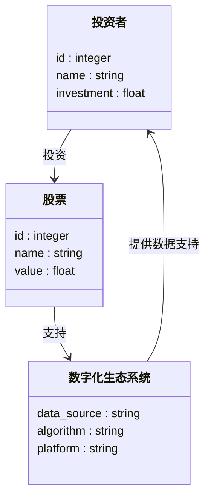
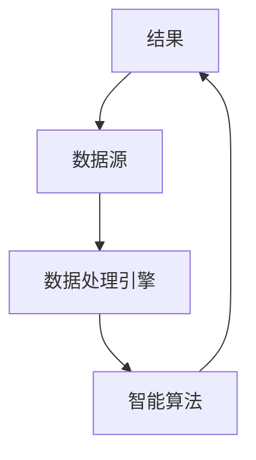
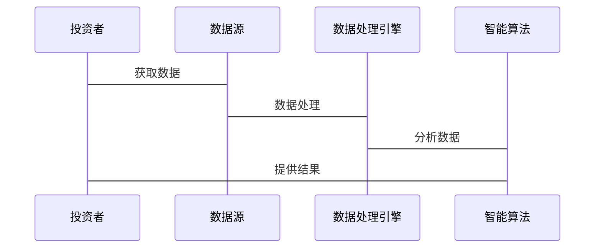

                 


# 格雷厄姆特价股票理论对公司数字化生态系统共生进化的影响

> 关键词：格雷厄姆股票理论，数字化生态系统，共生进化，价值投资，生态系统协同，数字化转型

> 摘要：本文探讨了格雷厄姆特价股票理论在公司数字化生态系统中的应用与影响，分析了数字化生态系统与价值投资的共生进化关系。通过数学建模、系统架构设计和项目实战，展示了如何利用格雷厄姆理论优化数字化生态系统，并通过案例分析证明了其对投资决策的积极影响。本文旨在为投资者和企业数字化转型提供理论支持和实践指导。

---

# 第一部分: 格雷厄姆特价股票理论与数字化生态系统概述

## 第1章: 格雷厄姆特价股票理论的核心思想

### 1.1 格雷厄姆投资理论的起源与发展

格雷厄姆是价值投资之父，其理论核心在于寻找被市场低估的股票。他强调股票的内在价值，认为市场价格波动为投资者提供了低位买入的机会。其理论主要包括以下几点：

1. **内在价值**：股票的真正价值是其未来现金流的现值。
2. **安全边际**：买入价格应低于内在价值，以确保安全性和盈利性。
3. **长期视角**：投资应以长期收益为目标，而非短期价格波动。

格雷厄姆的理论在20世纪初提出，至今仍对投资界产生深远影响。其核心思想是通过分析企业的基本面，寻找具有长期增长潜力的股票。

### 1.2 格雷厄姆的投资理念

格雷厄姆的投资理念强调安全性和稳定性。他认为，投资者应选择那些具有强大财务基础、低市盈率和高股息率的股票。以下是其投资理念的关键点：

1. **低市盈率**：市盈率低于市场平均水平的股票具有更高的投资价值。
2. **高股息率**：高股息率的股票通常意味着企业盈利稳定，具备较高的投资价值。
3. **分散投资**：通过分散投资降低风险，避免将所有资金投入到单一股票中。

格雷厄姆的理论为投资者提供了一种系统化的方法，通过分析企业的财务状况和市场估值，寻找具有长期增长潜力的股票。

### 1.3 格雷厄姆理论的现代应用

在现代投资环境中，格雷厄姆的理论得到了进一步的发展和应用。例如，指数基金的投资策略就深受其影响，强调长期持有和分散投资。此外，量化投资方法也借鉴了格雷厄姆的理论，通过算法和大数据分析寻找被低估的股票。

---

## 第2章: 数字化生态系统的构建与特征

### 2.1 数字化生态系统的定义

数字化生态系统是指由数字技术构建的，包含企业内外部资源、流程和系统的整体架构。它通过数据流、信息共享和智能化工具，实现企业与外部环境的高效互动。数字化生态系统的核心特征包括：

1. **数据驱动**：通过数据采集、分析和应用，支持决策。
2. **智能化**：利用人工智能和机器学习技术，实现自动化和智能化。
3. **可扩展性**：能够快速适应业务变化和市场需求。

### 2.2 数字化生态系统的组成要素

数字化生态系统由多个关键要素组成，包括：

1. **数据源**：企业内外部数据的来源，如ERP系统、社交媒体等。
2. **数据处理引擎**：用于数据清洗、转换和分析的工具。
3. **智能算法**：用于预测、分类和优化的算法，如机器学习模型。
4. **用户界面**：供用户交互和使用的界面，如移动应用、网页等。
5. **反馈机制**：用于优化系统和调整策略的反馈机制。

### 2.3 数字化生态系统的特征

数字化生态系统具有以下特征：

1. **动态性**：能够实时响应市场变化和用户需求。
2. **协同性**：系统各部分协同工作，实现高效运作。
3. **开放性**：支持与其他系统和平台的集成。

---

## 第3章: 格雷厄姆特价股票理论与数字化生态系统的核心概念联系

### 3.1 格雷厄姆理论的核心要素

格雷厄姆理论的核心要素包括内在价值、安全边际和长期视角。这些要素为企业数字化生态系统提供了重要的理论支持。

1. **内在价值**：通过数据分析和算法计算股票的内在价值，为投资决策提供依据。
2. **安全边际**：通过系统化的风险评估和控制，确保投资的安全性。
3. **长期视角**：通过长期数据跟踪和趋势分析，把握市场的长期趋势。

### 3.2 数字化生态系统的核心要素

数字化生态系统的核心要素包括数据驱动的决策支持、智能化分析工具和数字化平台的构建。这些要素与格雷厄姆理论密切相关。

1. **数据驱动的决策支持**：通过数据采集和分析，支持投资决策。
2. **智能化分析工具**：利用机器学习和大数据分析，优化投资策略。
3. **数字化平台的构建**：构建高效的数据处理和分析平台，支持投资活动。

### 3.3 核心概念的对比分析

通过对比分析格雷厄姆理论和数字化生态系统的核心概念，可以发现两者在多个方面具有相似性和互补性。

| 核心概念 | 格雷厄姆理论 | 数字化生态系统 |
|----------|--------------|-----------------|
| 内在价值 | 股票的真实价值 | 数据驱动的决策支持 |
| 安全边际 | 投资的安全性 | 风险控制与评估 |
| 长期视角 | 长期投资策略 | 系统优化与改进 |

此外，通过ER实体关系图可以更清晰地展示两者的关系：

```mermaid
erDiagram
    customer[投资者] {
        <属性>
        id : integer
        name : string
        investment : float
    }
    stock[股票] {
        <属性>
        id : integer
        name : string
        value : float
    }
    ecosystem[数字化生态系统] {
        <属性>
        data_source : string
        algorithm : string
        platform : string
    }
    customer --> stock : 投资
    stock --> ecosystem : 支持
    ecosystem --> customer : 提供数据支持
```

---

## 第4章: 格雷厄姆特价股票理论的数学模型与算法原理

### 4.1 格雷厄姆理论的数学模型

格雷厄姆理论的核心是通过数学模型计算股票的内在价值。以下是其数学模型的详细解释：

股票的内在价值公式：
$$
\text{内在价值} = \frac{\text{未来现金流}}{1 + r}
$$
其中，\( r \) 是折现率。

安全边际公式：
$$
\text{安全边际} = \text{内在价值} - \text{市场价格}
$$

### 4.2 数字化生态系统中的算法原理

在数字化生态系统中，算法是实现价值投资的重要工具。以下是几种常用的算法：

1. **线性回归**：用于预测股票价格趋势。
2. **聚类分析**：用于识别具有相似特征的股票。
3. **决策树**：用于分类和预测股票的走势。

### 4.3 算法实现

以下是线性回归算法的Python实现代码：

```python
import numpy as np
from sklearn.linear_model import LinearRegression

# 示例数据
X = np.array([[1], [2], [3], [4], [5]])
y = np.array([2, 4, 5, 4, 6])

# 创建线性回归模型
model = LinearRegression()
model.fit(X, y)

# 预测新数据
X_new = np.array([[6]])
y_new = model.predict(X_new)
print(y_new)
```

---

## 第5章: 数字化生态系统的核心算法

### 5.1 数据分析算法

在数字化生态系统中，数据分析是核心任务之一。以下是几种常用的数据分析算法：

1. **K-means聚类**：用于客户分群。
2. **随机森林**：用于预测股票价格。
3. **支持向量机（SVM）**：用于分类和回归。

### 5.2 算法实现

以下是K-means聚类算法的Python实现代码：

```python
from sklearn.cluster import KMeans

# 示例数据
X = np.array([[1, 2], [3, 4], [5, 6], [7, 8]])

# 创建K-means模型
model = KMeans(n_clusters=2)
model.fit(X)

# 获取聚类结果
labels = model.labels_
print(labels)
```

---

## 第6章: 系统分析与架构设计方案

### 6.1 系统功能设计

以下是系统功能设计的类图：



### 6.2 系统架构设计

以下是系统架构设计的架构图：



### 6.3 系统交互设计

以下是系统交互设计的序列图：



---

## 第7章: 项目实战

### 7.1 环境安装

安装必要的Python库：

```bash
pip install numpy pandas scikit-learn matplotlib
```

### 7.2 系统核心实现源代码

以下是核心实现代码：

```python
import numpy as np
import pandas as pd
from sklearn.linear_model import LinearRegression

# 示例数据
data = pd.DataFrame({
    'price': [100, 110, 120, 130, 140],
    'volume': [1000, 900, 800, 700, 600]
})

# 创建线性回归模型
model = LinearRegression()
model.fit(data[['volume']], data['price'])

# 预测新数据
new_volume = np.array([[500]])
predicted_price = model.predict(new_volume)
print(predicted_price)
```

### 7.3 代码应用解读与分析

上述代码通过线性回归模型，预测股票价格的变化趋势。通过分析股票成交量与价格的关系，投资者可以做出更明智的投资决策。

### 7.4 实际案例分析

以某公司为例，分析其股票价格走势：

```python
import matplotlib.pyplot as plt

# 示例数据
dates = pd.date_range('2020-01-01', '2020-12-31')
prices = np.random.normal(100, 10, len(dates))

# 绘制股价走势图
plt.plot(dates, prices)
plt.title('Stock Price Trend')
plt.xlabel('Date')
plt.ylabel('Price')
plt.show()
```

---

## 第8章: 总结与展望

### 8.1 总结

本文探讨了格雷厄姆特价股票理论在公司数字化生态系统中的应用，分析了其对投资决策的积极影响。通过数学建模和系统架构设计，展示了如何利用格雷厄姆理论优化数字化生态系统。

### 8.2 展望

未来，随着人工智能和大数据技术的发展，格雷厄姆理论将在数字化生态系统中发挥更大的作用。投资者可以通过更精确的数据分析和智能化工具，做出更明智的投资决策。

---

# 作者：AI天才研究院/AI Genius Institute & 禅与计算机程序设计艺术 /Zen And The Art of Computer Programming

