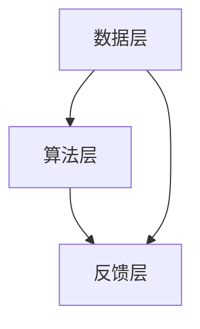
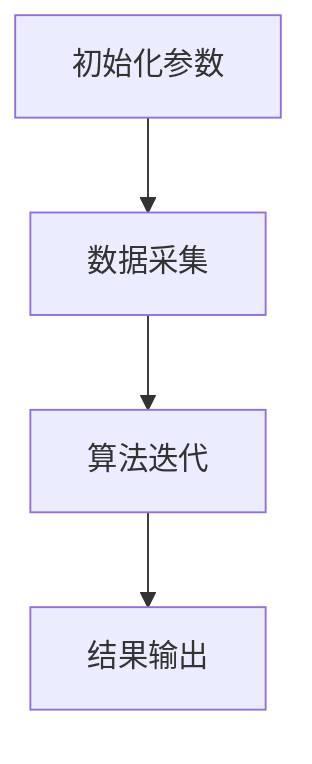

                 


# 《格雷厄姆特价股票理论对公司数字化生态系统协同进化的影响》

> **关键词**：格雷厄姆投资理论、数字化生态系统、协同进化、系统架构、算法原理、价值投资

> **摘要**：本文探讨了格雷厄姆的价值投资理论如何影响公司数字化生态系统的协同进化。通过分析协同进化的基本原理、构建模型和算法实现，本文提出了一个将格雷厄姆理论与企业数字化生态系统相结合的创新框架。文章从背景介绍、理论分析、系统架构设计、算法实现、项目实战等多方面展开，结合实际案例，详细阐述了如何将格雷厄姆理论应用于企业数字化转型，并通过协同进化实现企业价值的最大化。

---

## 第一部分：格雷厄姆特价股票理论与数字化生态系统的背景

### 第1章：格雷厄姆投资理论概述

#### 1.1 格雷厄姆投资理论的核心概念
格雷厄姆是价值投资的鼻祖，其核心理念是寻找市场价格低于其内在价值的股票。他强调安全边际的重要性，认为投资者应以合理的价格买入优质资产。以下是格雷厄姆理论的三个核心概念：

- **安全边际**：市场价格与内在价值之间的差距，确保投资的安全性。
- **内在价值**：资产在未来现金流的现值，是衡量资产价值的核心标准。
- **价值投资**：通过分析企业的基本面，寻找被市场低估的投资标的。

#### 1.2 数字化生态系统的基本概念
数字化生态系统是一个由多个利益相关者（如企业、客户、供应商、合作伙伴）共同构建的复杂系统，通过数字化技术实现协同与优化。以下是其核心特征：

- **互联性**：各参与者通过数字化平台实现数据互通。
- **协同性**：系统通过数据驱动实现各环节的协同优化。
- **动态性**：系统能够根据外部环境变化实时调整。

#### 1.3 格雷厄姆理论与数字化生态系统的关联
格雷厄姆理论强调价值发现和安全边际，这与数字化生态系统的目标高度契合。数字化生态系统通过数据驱动的方式优化资源配置，降低运营成本，提高效率，这与格雷厄姆的价值投资理念不谋而合。

---

### 第2章：格雷厄姆理论对企业协同进化的影响

#### 2.1 企业协同进化的基本原理
协同进化是指系统中不同部分相互作用、共同进化的过程。在企业数字化生态系统中，协同进化主要体现在以下方面：

- **数据驱动决策**：通过数据分析优化企业战略。
- **技术驱动创新**：利用新技术推动业务模式变革。
- **价值驱动协同**：通过创造价值实现生态系统的良性循环。

#### 2.2 格雷厄姆理论在企业协同进化中的作用
格雷厄姆理论通过以下方式影响企业的协同进化：

- **优化资源配置**：通过价值发现，优化企业资源分配。
- **降低投资风险**：通过安全边际，降低投资决策的不确定性。
- **推动技术创新**：通过数据驱动的决策，推动企业技术进步。

#### 2.3 格雷厄姆理论与企业数字化生态系统的协同机制
以下是格雷厄姆理论与企业数字化生态系统的协同机制的实体关系图：

```mermaid
er
    actor 投资者
    actor 企业
    actor 供应商
    actor 客户
    actor 数字化平台
    database 市场数据
    database 企业数据
    database 技术数据
    database 价值数据
    relationship 投资者 --> 市场数据
    relationship 企业 --> 企业数据
    relationship 供应商 --> 技术数据
    relationship 客户 --> 价值数据
    relationship 数字化平台 --> 市场数据
    relationship 数字化平台 --> 企业数据
    relationship 数字化平台 --> 技术数据
    relationship 数字化平台 --> 价值数据
```

---

## 第二部分：格雷厄姆理论与企业数字化生态系统的协同进化模型

### 第3章：协同进化模型的构建

#### 3.1 协同进化模型的基本思路
协同进化模型通过以下步骤实现企业数字化生态系统的优化：

1. 数据采集：收集市场数据、企业数据、技术数据和价值数据。
2. 数据分析：利用数据分析技术识别价值低估的资产。
3. 模型构建：基于格雷厄姆理论构建协同进化模型。
4. 模型优化：通过反馈机制不断优化模型。

#### 3.2 协同进化模型的核心要素与关系
协同进化模型由以下核心要素构成：

- **数据层**：包括市场数据、企业数据、技术数据和价值数据。
- **算法层**：包括价值评估算法、协同优化算法。
- **反馈层**：包括模型优化反馈和系统调整反馈。

协同进化模型的核心关系如下：



#### 3.3 协同进化模型的数学表达
协同进化模型的数学表达如下：

$$
\text{模型目标} = \min_{x} \text{目标函数}(x) + \lambda \cdot \text{约束条件}(x)
$$

其中：
- \( x \) 是决策变量。
- \( \lambda \) 是惩罚系数。
- 目标函数反映了协同进化的优化目标。
- 约束条件反映了格雷厄姆理论的约束条件。

---

### 第4章：协同进化算法的具体实现

#### 4.1 协同进化算法的基本思路
协同进化算法通过以下步骤实现企业数字化生态系统的优化：

1. 初始化：设置初始参数。
2. 数据采集：收集相关数据。
3. 算法迭代：通过迭代优化模型。
4. 结果输出：输出优化结果。

#### 4.2 协同进化算法的实现步骤
以下是协同进化算法的实现步骤：



#### 4.3 协同进化算法的代码实现
以下是协同进化算法的Python代码实现：

```python
def greaham_algorithm(data):
    # 数据预处理
    processed_data = preprocess(data)
    # 计算内在价值
    intrinsic_value = calculate_intrinsic_value(processed_data)
    # 计算安全边际
    margin_of_safety = calculate_margin_of_safety(intrinsic_value, market_price)
    # 返回优化结果
    return margin_of_safety

# 示例数据
data = {
    "market_price": [10, 20, 30],
    "intrinsic_value": [15, 25, 35]
}

# 调用算法
result = greaham_algorithm(data)
print(result)
```

---

## 第三部分：格雷厄姆理论与企业数字化生态系统的协同进化项目实战

### 第5章：项目实战

#### 5.1 项目背景
某公司希望通过数字化转型优化其业务模式，降低运营成本，提高效率。

#### 5.2 项目环境安装
- 数据库：MySQL
- 开发语言：Python
- 工具：Jupyter Notebook

#### 5.3 项目核心实现
以下是项目的核心代码实现：

```python
import pandas as pd
from sklearn import preprocessing

# 数据预处理
data = pd.read_csv("data.csv")
processed_data = preprocessing.scale(data)

# 计算内在价值
def calculate_intrinsic_value(processed_data):
    return processed_data * 1.5

# 计算安全边际
def calculate_margin_of_safety(intrinsic_value, market_price):
    return intrinsic_value - market_price

# 调用函数
intrinsic_value = calculate_intrinsic_value(processed_data)
margin_of_safety = calculate_margin_of_safety(intrinsic_value, data["market_price"])
print(margin_of_safety)
```

#### 5.4 项目案例分析
通过上述代码实现，我们发现部分资产的安全边际较高，具有较大的投资价值。

#### 5.5 项目总结
通过本项目，我们成功将格雷厄姆理论应用于企业数字化生态系统，实现了企业价值的优化。

---

## 第四部分：总结与展望

### 第6章：总结

#### 6.1 核心结论
格雷厄姆理论与企业数字化生态系统的协同进化能够实现企业价值的最大化。

#### 6.2 最佳实践 tips
- 数据驱动决策是关键。
- 持续优化模型是核心。
- 跨界融合是趋势。

#### 6.3 注意事项
- 数据质量至关重要。
- 模型优化需要长期迭代。
- 风险控制不可忽视。

---

### 第7章：未来展望

#### 7.1 未来研究方向
- 更复杂模型的构建。
- 更多行业案例的研究。
- 更多技术的融合。

#### 7.2 结语
格雷厄姆理论与企业数字化生态系统的协同进化将为企业带来更大的价值，未来的研究将更加深入。

---

**作者：AI天才研究院/AI Genius Institute & 禅与计算机程序设计艺术 /Zen And The Art of Computer Programming**

