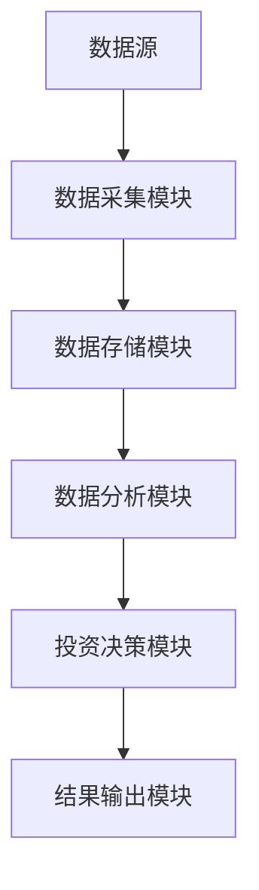

                 


# 格雷厄姆特价股票理论对公司数字化转型策略的影响

> 关键词：格雷厄姆投资理论，数字化转型，企业价值评估，数据分析，投资策略，安全边际

> 摘要：本文探讨了本杰明·格雷厄姆的特价股票理论如何影响企业的数字化转型策略。通过分析价值投资的核心概念、数学模型和企业数字化转型的系统架构设计，本文展示了如何利用格雷厄姆理论优化企业的投资决策和价值评估过程。文章还提供了实际案例分析和最佳实践建议，帮助企业在数字化转型中实现可持续增长。

---

# 引言

## 1.1 问题背景

在当今快速变化的商业环境中，企业数字化转型已成为企业生存和发展的关键。然而，数字化转型不仅仅是技术的升级，更需要以数据驱动的决策为基础，优化企业的价值评估和投资策略。格雷厄姆的特价股票理论作为一种经典的价值投资方法，为企业在数字化转型中提供了重要的理论支持。

## 1.2 研究目标

本文旨在探讨格雷厄姆的特价股票理论如何影响企业的数字化转型策略，分析其在企业价值评估、投资决策和数据驱动决策中的应用。

## 1.3 研究意义

通过结合格雷厄姆理论与数字化转型，企业可以更好地利用数据驱动的方法优化投资决策，提升企业的长期价值。

---

# 第二章 格雷厄姆特价股票理论的核心概念

## 2.1 价值投资的核心思想

### 2.1.1 什么是价值投资？

价值投资是一种以企业内在价值为基础的投资策略，强调以低于内在价值的价格买入优质资产。

### 2.1.2 格雷厄姆的安全边际概念

安全边际是指股票的内在价值与市场价格之间的差值，确保投资者在市场波动中能够获得超额收益。

$$ 安全边际 = 股票内在价值 - 市场价格 $$

### 2.1.3 格雷厄姆的内在价值公式

$$ 内在价值 = \frac{收益 + 股息}{利率} $$

## 2.2 格雷厄姆的投资策略

### 2.2.1 避免情绪化投资

格雷厄姆强调理性投资，避免因市场情绪波动而做出错误决策。

### 2.2.2 分散投资风险

通过分散投资降低风险，同时关注具有安全边际的股票。

### 2.2.3 长期投资策略

价值投资强调长期持有优质资产，等待市场回归其内在价值。

---

# 第三章 格雷厄姆理论与企业数字化转型的联系

## 3.1 数字化转型的定义与特征

### 3.1.1 数字化转型的内涵

数字化转型是指企业利用数字技术优化业务流程、提升竞争力的过程。

### 3.1.2 数字化转型的核心驱动力

数据驱动的决策、技术创新和组织变革是数字化转型的核心驱动力。

### 3.1.3 数字化转型的实施路径

包括技术选型、数据收集、分析、决策优化和持续改进。

## 3.2 格雷厄姆理论在企业价值评估中的应用

### 3.2.1 企业价值评估的维度

包括财务表现、市场地位、竞争优势和管理能力。

### 3.2.2 格雷厄姆理论与企业价值评估的关联

通过分析企业的财务数据，评估其内在价值，确定是否存在安全边际。

### 3.2.3 数据驱动的决策支持

利用数据分析技术优化投资决策，确保决策的科学性和准确性。

## 3.3 数据分析技术在格雷厄姆理论中的应用

### 3.3.1 数据采集与清洗

通过数据采集工具获取企业财务数据，清洗和预处理数据。

### 3.3.2 数据分析与建模

利用数据分析工具（如Python、Pandas）对数据进行建模，计算内在价值和安全边际。

### 3.3.3 数据可视化与决策支持

通过可视化工具（如Matplotlib）展示分析结果，辅助投资决策。

---

# 第四章 数字化转型的系统架构设计

## 4.1 系统功能设计

### 4.1.1 数据采集模块

负责从企业财务报表中采集数据，清洗和预处理数据。

### 4.1.2 数据分析模块

利用Python和Pandas对数据进行建模，计算股票的内在价值和安全边际。

### 4.1.3 投资决策模块

根据分析结果，生成投资建议，优化投资组合。

## 4.2 系统架构设计



## 4.3 系统接口设计

### 4.3.1 数据接口

负责与数据源进行交互，获取企业财务数据。

### 4.3.2 分析接口

提供数据分析模块与投资决策模块之间的接口，传递分析结果。

### 4.3.3 决策接口

将投资决策模块的建议传递给企业决策层，优化投资策略。

---

# 第五章 格雷厄姆理论在企业数字化转型中的应用实践

## 5.1 实际案例分析

### 5.1.1 某企业的数字化转型实践

通过格雷厄姆理论优化投资决策，提升企业价值。

### 5.1.2 数据分析工具的应用

利用Python和Pandas进行数据分析，计算内在价值和安全边际。

## 5.2 项目实战

### 5.2.1 环境安装

安装Python、Pandas、Matplotlib等工具。

### 5.2.2 核心代码实现

```python
import pandas as pd
import numpy as np

# 数据加载
data = pd.read_csv('stock_data.csv')

# 计算内在价值
data['内在价值'] = (data['收益'] + data['股息']) / data['利率']

# 计算安全边际
data['安全边际'] = data['内在价值'] - data['市场价格']

# 可视化
import matplotlib.pyplot as plt

plt.plot(data['公司'], data['安全边际'])
plt.title('安全边际分析')
plt.xlabel('公司')
plt.ylabel('安全边际')
plt.show()
```

### 5.2.3 实际案例分析

通过上述代码分析某企业的安全边际，确定是否存在投资机会。

## 5.3 项目小结

通过实际案例分析，验证了格雷厄姆理论在企业数字化转型中的应用价值。

---

# 第六章 结论与展望

## 6.1 结论

本文探讨了格雷厄姆特价股票理论对企业数字化转型策略的影响，分析了其在价值评估和投资决策中的应用。

## 6.2 展望

未来，随着人工智能和大数据技术的发展，格雷厄姆理论将在企业数字化转型中发挥更大的作用。

---

# 参考文献

1. 本杰明·格雷厄姆《聪明的投资者》
2. 巴菲特《致股东的信》
3. 大卫·乔姆林《数据驱动的决策》

---

作者：AI天才研究院 & 禅与计算机程序设计艺术

