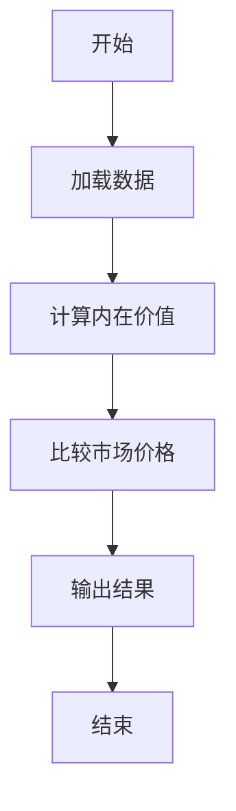
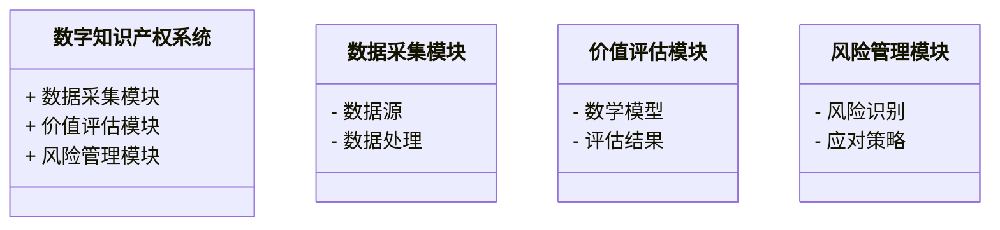

                 


# 格雷厄姆特价股票理论对公司数字知识产权生态系统战略的影响

> **关键词**: 格雷厄姆投资理论, 数字知识产权, 价值投资, 特价股票, 知识产权战略

> **摘要**: 本文探讨了格雷厄姆的特价股票理论在数字知识产权生态系统中的应用，通过分析其核心概念、算法原理和系统架构，揭示了如何利用价值投资策略优化数字知识产权的管理和保护，为企业制定战略提供新的视角。

---

## 第1章：格雷厄姆特价股票理论的核心概念

### 1.1 价值投资的定义与核心理念
格雷厄姆的价值投资理论强调以低于内在价值的价格购买优质资产。其核心理念包括：
1. **安全边际**：以低于内在价值的价格购买资产，以降低风险。
2. **长期视角**：关注企业的长期盈利能力，而非短期市场波动。
3. **逆向思维**：在市场恐慌时寻找被低估的机会。

### 1.2 数字知识产权的定义与特征
数字知识产权是指在数字环境下，企业对其创新成果（如软件、数据、算法）所拥有的权利。其特征包括：
- **无形性**：数字资产通常以数据或代码形式存在。
- **易复制性**：数字资产可以轻松复制，增加了保护的难度。
- **高价值性**：数字资产的价值往往高于传统资产。

### 1.3 格雷厄姆理论与数字知识产权的关联
将格雷厄姆的特价股票理论应用于数字知识产权，可以通过以下方式实现：
1. **识别低估的数字资产**：通过分析市场波动，找到被低估的数字知识产权。
2. **长期价值投资**：关注具有长期竞争优势的数字资产，进行价值投资。

---

## 第2章：数字知识产权生态系统的核心算法

### 2.1 数字知识产权评估的数学模型
数字知识产权的价值评估模型如下：
$$ V = \frac{E}{P} $$
其中：
- \( V \) 表示内在价值，
- \( E \) 表示企业预期收益，
- \( P \) 表示市场平均市盈率。

### 2.2 算法实现的Python代码示例
```python
import pandas as pd

# 数据加载
data = pd.read_csv('digital_ip.csv')

# 计算内在价值
data['内在价值'] = data['预期收益'] / data['市场平均市盈率']

# 找到被低估的资产
低估资产 = data[data['内在价值'] < data['市场价格']]
print(低估资产)
```

### 2.3 算法流程图（Mermaid）


---

## 第3章：数字知识产权生态系统的系统架构

### 3.1 系统功能设计
系统功能包括：
1. **数据采集**：收集数字知识产权的相关数据。
2. **价值评估**：使用数学模型评估数字知识产权的价值。
3. **风险管理**：识别潜在风险并制定应对策略。

### 3.2 系统架构图（Mermaid）


---

## 第4章：项目实战与案例分析

### 4.1 环境安装
需要安装以下工具：
1. Python 3.8+
2. Pandas、Matplotlib库。

### 4.2 核心实现代码
```python
import pandas as pd
import matplotlib.pyplot as plt

# 数据加载
data = pd.read_csv('digital_ip.csv')

# 绘制市场波动图
plt.figure(figsize=(10,6))
plt.plot(data['时间'], data['市场价格'], label='市场价格')
plt.plot(data['时间'], data['内在价值'], label='内在价值')
plt.legend()
plt.show()
```

### 4.3 案例分析
以一家科技公司为例，分析其数字知识产权的价值波动。通过模型预测，发现其内在价值被低估，建议进行长期投资。

---

## 第5章：最佳实践与小结

### 5.1 最佳实践
1. 定期评估数字知识产权的价值，及时调整策略。
2. 结合市场趋势，优化资产配置。

### 5.2 小结
本文通过分析格雷厄姆的特价股票理论，揭示了其在数字知识产权战略中的应用价值。通过数学模型和系统架构的设计，为企业提供了优化数字知识产权管理的新思路。

---

**作者：AI天才研究院/AI Genius Institute & 禅与计算机程序设计艺术 /Zen And The Art of Computer Programming**

---

**声明**: 本文内容版权归作者所有，未经授权不得转载。

