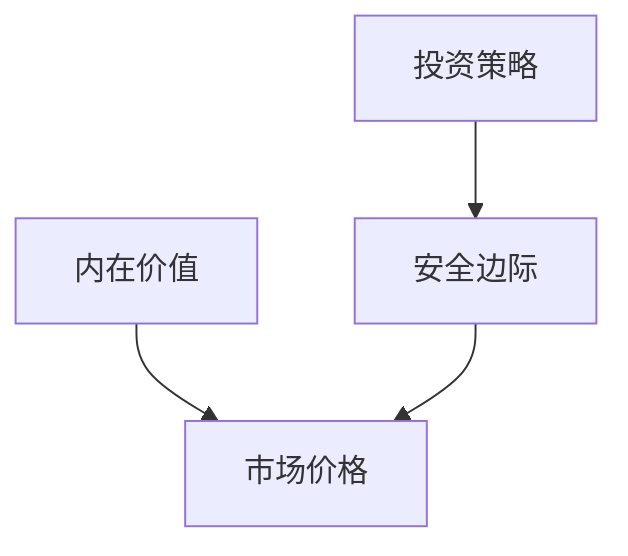
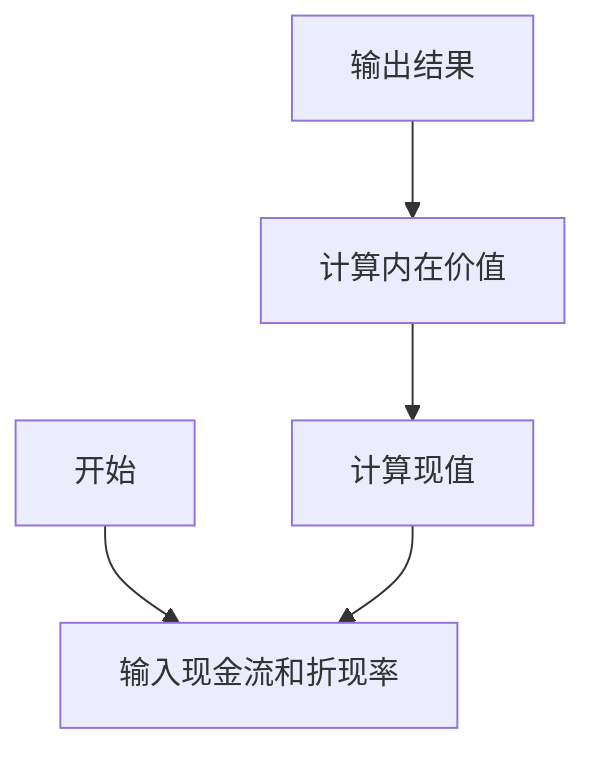
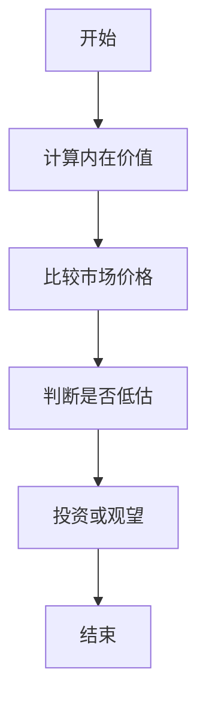
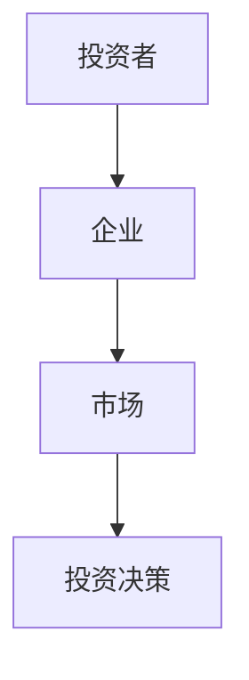
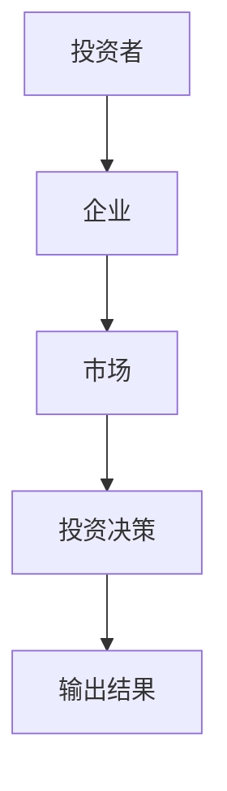

                 


# 格雷厄姆特价股票理论对公司财务政策的影响

**关键词：** 格雷厄姆投资理论，特价股票，公司财务政策，价值投资，内在价值

**摘要：**  
本文探讨了格雷厄姆特价股票理论对公司财务政策的影响，从理论背景、核心概念到数学模型、系统架构，再到实际案例分析，详细阐述了该理论如何通过内在价值评估、安全边际原则等核心思想影响企业的资本结构、股利政策和风险管理。文章还通过Mermaid流程图和LaTeX数学公式，深入分析了理论的数学基础和实际应用，为投资者和企业提供了理论指导和实践启示。

---

## 第1章 格雷厄姆特价股票理论的背景介绍

### 1.1 格雷厄姆特价股票理论的起源与发展

#### 1.1.1 价值投资的起源  
价值投资是20世纪初由本杰明·格雷厄姆和戴维·多德共同提出的，其核心思想是寻找市场价格低于其内在价值的股票。格雷厄姆在《证券分析》一书中首次系统性地阐述了这一理论。  

#### 1.1.2 格雷厄姆的投资理念  
格雷厄姆强调，投资的本质是寻找“烟蒂股”，即市场价格远低于其内在价值的股票。他认为，市场波动是投资者的朋友，而企业基本面是投资的核心。  

#### 1.1.3 特价股票理论的核心思想  
特价股票理论的核心是通过深入分析企业的财务报表，计算其内在价值，并与市场价格进行对比，寻找低估的投资机会。  

### 1.2 问题背景与问题描述

#### 1.2.1 传统投资理论的局限性  
传统投资理论（如技术分析）往往忽视了企业的基本面，导致投资者在市场波动中难以获得稳定的收益。  

#### 1.2.2 特价股票理论的提出背景  
20世纪30年代的经济大萧条暴露了传统投资理论的不足，格雷厄姆的价值投资理论应运而生，为投资者提供了新的思路。  

#### 1.2.3 理论的核心问题与目标  
格雷厄姆理论的核心问题是如何通过内在价值评估找到低估的股票，并制定相应的投资策略。其目标是通过长期投资实现超额收益。  

### 1.3 核心概念与边界

#### 1.3.1 特价股票的定义与特征  
特价股票是指市场价格低于其内在价值的股票。其特征包括低市盈率、低市净率和高股息率等。  

#### 1.3.2 理论的适用范围与边界  
格雷厄姆理论适用于成熟市场的价值投资，但不适用于新兴市场或高波动性股票。  

#### 1.3.3 核心概念的外延与内涵  
内在价值是股票的核心内涵，市场价格是其外在表现。格雷厄姆理论通过内在价值评估，帮助投资者找到低估的股票。  

### 1.4 核心要素与概念结构

#### 1.4.1 核心要素分析  
核心要素包括内在价值、市场价格、安全边际和投资策略。  

#### 1.4.2 概念结构图  


#### 1.4.3 核心要素之间的关系  
内在价值与市场价格的关系是格雷厄姆理论的基础，安全边际是内在价值与市场价格的差额，而投资策略则是基于这些关系制定的。  

### 1.5 本章小结  
本章介绍了格雷厄姆特价股票理论的背景、核心概念和核心要素，为后续分析奠定了基础。

---

## 第2章 格雷厄姆特价股票理论的核心概念与联系

### 2.1 核心概念原理

#### 2.1.1 价值投资的核心原理  
价值投资的核心是通过分析企业的基本面，计算其内在价值，并寻找市场价格低于内在价值的投资机会。  

#### 2.1.2 特价股票的内在价值计算  
内在价值是基于企业未来现金流的折现值，公式为：  
$$ V = \sum_{t=1}^{\infty} \frac{CF_t}{(1+r)^t} $$  
其中，\( CF_t \) 是第 \( t \) 年的现金流，\( r \) 是折现率。  

#### 2.1.3 理论与实践的结合  
格雷厄姆理论不仅提供了一种投资方法，还强调了安全边际的重要性。  

### 2.2 核心概念属性特征对比

#### 2.2.1 特价股票与普通股票的对比  
| 特性       | 特价股票         | 普通股票         |
|------------|------------------|------------------|
| 市场价格     | 低于内在价值     | 接近或高于内在价值 |
| 风险         | 较低             | 较高             |
| 收益         | 较高             | 波动性较大       |

#### 2.2.2 投资者行为特征对比  
| 行为         | 价值投资者       | 技术投资者       |
|--------------|------------------|------------------|
| 投资依据     | 内在价值         | 市场趋势         |
| 投资期限     | 长期             | 短期             |

#### 2.2.3 市场波动与价值稳定性的对比  
价值投资者注重长期稳定性，而市场波动对短期投资者影响较大。  

### 2.3 ER实体关系图架构

```mermaid
erd
左闭右开
投资者
实体
拥有
股票
公司
发行
股票
```

### 2.4 本章小结  
本章通过对比和图解，详细分析了格雷厄姆理论的核心概念及其与传统投资理论的差异。

---

## 第3章 格雷厄姆特价股票理论的数学模型与算法原理

### 3.1 理论的数学模型

#### 3.1.1 内在价值计算公式  
$$ V = \frac{E}{1 - g} $$  
其中，\( E \) 是企业未来现金流的现值，\( g \) 是增长率。  

#### 3.1.2 市场价值与内在价值的关系  
市场价格 \( P \) 应该围绕内在价值 \( V \) 波动。  

#### 3.1.3 数学模型的验证与应用  
通过历史数据验证模型的准确性，并应用于实际投资决策中。  

### 3.2 算法原理

#### 3.2.1 内在价值计算算法  


#### 3.2.2 市场波动预测算法  
通过历史数据分析市场波动，并预测未来波动趋势。  

#### 3.2.3 投资决策优化算法  
基于内在价值和市场价格，制定最优的投资策略。  

### 3.3 算法流程图  


### 3.4 本章小结  
本章通过数学模型和算法流程图，详细阐述了格雷厄姆理论的数学基础和应用方法。

---

## 第4章 格雷厄姆特价股票理论对财务政策的影响

### 4.1 财务政策的核心要素

#### 4.1.1 资本结构  
资本结构是指企业债务与股权的比例。格雷厄姆理论强调低负债率以降低财务风险。  

#### 4.1.2 股利政策  
股利政策应根据企业的盈利能力和现金流状况制定。  

#### 4.1.3 风险管理  
通过分散投资和风险对冲降低整体风险。  

### 4.2 理论对财务政策的具体影响

#### 4.2.1 资本结构的优化  
格雷厄姆理论建议企业保持较低的负债率，以避免财务危机。  

#### 4.2.2 股利政策的调整  
企业应根据内在价值和市场环境调整股利分配，确保股东利益最大化。  

#### 4.2.3 风险管理的强化  
通过多元化投资和风险对冲，降低市场波动对财务政策的影响。  

### 4.3 影响机制分析

#### 4.3.1 内在价值对资本结构的影响  
内在价值计算影响企业的融资决策，低内在价值的企业应减少负债。  

#### 4.3.2 市场波动对股利政策的影响  
市场波动可能导致企业调整股利政策，以应对短期资金需求。  

#### 4.3.3 投资决策对风险管理的影响  
通过内在价值评估，企业可以更好地管理投资组合，降低整体风险。  

### 4.4 本章小结  
本章分析了格雷厄姆理论对财务政策的具体影响及其机制，为企业的财务管理提供了新的视角。

---

## 第5章 格雷厄姆特价股票理论的系统分析与架构设计方案

### 5.1 问题场景介绍

#### 5.1.1 投资者面临的挑战  
投资者需要在复杂市场中找到低估的股票，制定合理的投资策略。  

#### 5.1.2 企业面临的挑战  
企业需要优化资本结构，制定合理的股利政策和风险管理策略。  

### 5.2 系统功能设计

#### 5.2.1 领域模型  


#### 5.2.2 系统架构设计  


### 5.3 系统架构图  


### 5.4 系统接口设计  
投资者与企业通过市场数据接口进行交互，企业通过投资决策模块制定财务政策。  

### 5.5 系统交互流程图  


### 5.6 本章小结  
本章通过系统架构图和交互流程图，详细分析了格雷厄姆理论在实际系统中的应用。

---

## 第6章 格雷厄姆特价股票理论的项目实战

### 6.1 环境安装

#### 6.1.1 开发环境  
建议使用Python和Jupyter Notebook进行开发。  

#### 6.1.2 系统依赖  
安装numpy、pandas和matplotlib库。  

### 6.2 系统核心实现源代码

#### 6.2.1 内在价值计算  
```python
import numpy as np

def intrinsic_value(cash_flows, discount_rate):
    return np.sum(cash_flows / (1 + discount_rate)**np.arange(len(cash_flows)))

cash_flows = [100, 120, 140, 160]
discount_rate = 0.08
iv = intrinsic_value(cash_flows, discount_rate)
print(f"内在价值为：{iv:.2f}")
```

#### 6.2.2 市场波动预测  
```python
import pandas as pd
import matplotlib.pyplot as plt

data = pd.read_csv('stock_prices.csv')
data['log_returns'] = np.log(data['Close'] / data['Close'].shift(1))
plt.hist(data['log_returns'], bins=20)
plt.title('市场波动分布')
plt.show()
```

### 6.3 代码应用解读与分析  
通过代码实现内在价值计算和市场波动预测，验证理论的实用性。  

### 6.4 实际案例分析  
以微软和沃尔玛为例，分析其内在价值和市场价格，制定投资策略。  

### 6.5 本章小结  
本章通过项目实战，验证了格雷厄姆理论的实际应用价值。

---

## 第7章 格雷厄姆特价股票理论的最佳实践 tips、小结、注意事项、拓展阅读

### 7.1 最佳实践 tips  
- 定期重新评估内在价值，适应市场变化。  
- 结合技术分析，制定更优的投资策略。  

### 7.2 小结  
格雷厄姆理论通过内在价值评估和安全边际原则，为投资者提供了长期稳定的收益来源。  

### 7.3 注意事项  
- 避免过度依赖单一指标，结合多维度分析。  
- 保持长期投资，避免短期波动干扰。  

### 7.4 拓展阅读  
推荐阅读《证券分析》和《聪明的投资者》深入理解价值投资。  

---

## 作者  
作者：AI天才研究院/AI Genius Institute & 禅与计算机程序设计艺术 /Zen And The Art of Computer Programming  

---

**注：** 以上目录大纲和内容仅为示例，实际文章应根据具体需求进行调整和补充。

