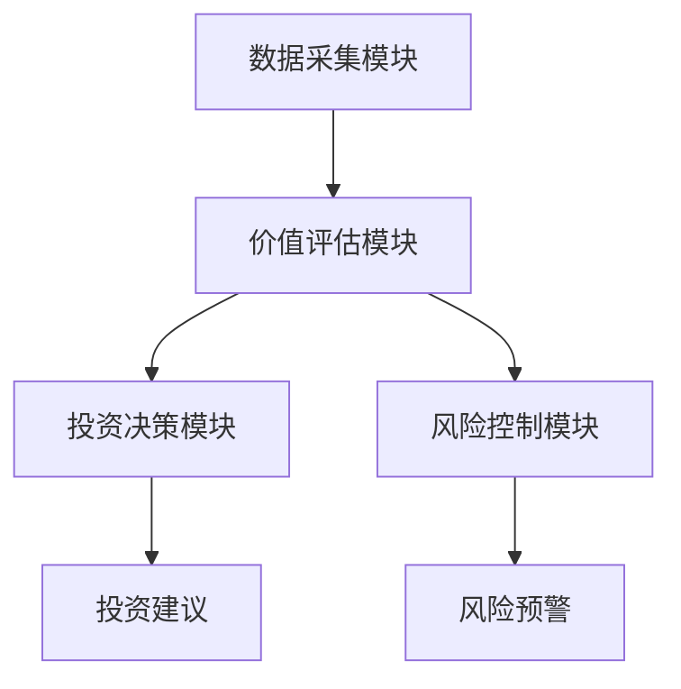

                 


# 《格雷厄姆特价股票理论对现代公司治理的启示》

---

## 关键词：格雷厄姆、特价股票理论、现代公司治理、价值投资、股东价值最大化

---

## 摘要：  
格雷厄姆的特价股票理论是价值投资领域的经典理论，其核心在于以低于内在价值的价格购买股票，从而实现长期稳定的收益。本文从格雷厄姆的投资理念出发，结合现代公司治理的理论与实践，探讨特价股票理论对现代公司治理的启示。通过分析公司治理中的价值评估、风险控制和利益相关者管理，本文揭示了格雷厄姆理论在公司治理中的深层应用，为投资者和企业管理者提供了新的视角和实践策略。文章最后结合实际案例，展示了如何将格雷厄姆理论与现代公司治理相结合，实现股东价值最大化。

---

## 第一部分: 格雷厄姆特价股票理论的背景与核心概念

### 第1章: 格雷厄姆特价股票理论的背景与核心概念

#### 1.1 格雷厄姆投资理论的起源与发展

##### 1.1.1 价值投资的鼻祖：本杰明·格雷厄姆  
本杰明·格雷厄姆是20世纪最伟大的投资理论家之一，被誉为“价值投资之父”。他的投资理念的核心在于“安全边际”和“内在价值”两个概念。格雷厄姆认为，股票不仅仅是一个市场的 ticker，而是一个企业的所有权证书。投资者应该以低于其内在价值的价格买入股票，以确保投资的安全性和盈利能力。

##### 1.1.2 特价股票理论的定义与核心思想  
格雷厄姆的特价股票理论是指，当股票的价格远低于其内在价值时，投资者应该积极买入，并长期持有，直到价格回归其真实价值。这种投资策略的核心在于寻找市场忽视的“廉价”股票，通过安全边际的保护，降低投资风险，同时实现超额收益。

##### 1.1.3 格雷厄姆投资理论的现代发展与演变  
尽管格雷厄姆的投资理论最初是针对股票市场的，但其核心思想已经被广泛应用于金融投资、企业估值和公司治理等领域。随着现代金融理论的发展，格雷厄姆的理论也在不断丰富和扩展，特别是在公司治理方面，其价值评估和风险管理的思想对现代企业治理具有重要的启示。

---

#### 1.2 现代公司治理的基本概念与框架

##### 1.2.1 公司治理的定义与核心要素  
公司治理是关于公司如何管理和监督其业务活动，以实现股东价值最大化的过程。现代公司治理的核心要素包括：董事会结构、管理层职责、股东权利、利益相关者管理、风险管理、内部控制和信息披露等。

##### 1.2.2 现代公司治理的主要原则与挑战  
现代公司治理的主要原则包括透明性、公平性、有效性、责任性和长期性。然而，公司治理实践中仍然面临诸多挑战，例如短期主义、利益冲突、信息不对称、代理问题和监管缺失等。

##### 1.2.3 公司治理与股东价值最大化的关系  
股东价值最大化是公司治理的核心目标。通过有效的公司治理，企业能够优化资源配置、提高经营效率、降低风险，并最终实现股东价值的最大化。格雷厄姆的特价股票理论强调了以低于内在价值的价格买入股票，这与公司治理中追求长期价值创造的目标不谋而合。

---

## 第二部分: 格雷厄姆特价股票理论的核心原理

### 第2章: 格雷厄姆特价股票理论的核心原理与分析框架

#### 2.1 特价股票理论的核心要素

##### 2.1.1 股票的内在价值与市场价值  
股票的内在价值是指基于公司基本面因素（如盈利能力、成长性、资产质量等）所决定的合理价格。市场价值则是指股票在市场上的交易价格。格雷厄姆认为，内在价值是股票投资的基石，而市场价值是波动的，投资者应该寻找内在价值高于市场价值的股票。

##### 2.1.2 安全边际的概念与计算  
安全边际是格雷厄姆投资理论中的核心概念，是指内在价值与市场价值之间的差额。通过购买价格低于内在价值的股票，投资者可以避免市场波动带来的损失，并在长期实现超额收益。

##### 2.1.3 股票投资的三重过滤法  
格雷厄姆提出的三重过滤法是其投资策略的重要组成部分，包括：
1. **质量过滤**：选择财务健康、资产质量高、盈利能力强的公司。
2. **价格过滤**：选择价格低于内在价值的股票。
3. **数量过滤**：分散投资，降低风险。

#### 2.2 格雷厄姆投资模型的数学表达与分析

##### 2.2.1 内在价值的计算公式  
股票的内在价值（Intrinsic Value, IV）可以通过以下公式计算：  
$$IV = \frac{E}{P}$$  
其中，E是企业的预期盈利能力，P是资本成本或折现率。

##### 2.2.2 安全边际的计算与应用  
安全边际（Margin of Safety, MOS）可以通过以下公式计算：  
$$MOS = IV - Market\ Value$$  
当MOS为正时，股票具有投资价值。

##### 2.2.3 投资组合优化的数学模型  
格雷厄姆的投资组合优化模型可以表示为：  
$$Maximize\ \sum_{i=1}^{n} w_i \cdot R_i$$  
subject to：  
$$\sum_{i=1}^{n} w_i = 1$$  
$$w_i \geq 0,\ \forall i$$  
其中，\(w_i\)是第i只股票的权重，\(R_i\)是第i只股票的预期收益。

---

## 第三部分: 格雷厄姆特价股票理论与现代公司治理的结合

### 第3章: 格雷厄姆特价股票理论在公司治理中的应用

#### 3.1 公司治理视角下的股东价值最大化

##### 3.1.1 股东价值最大化的目标与实现路径  
股东价值最大化是公司治理的核心目标。通过有效的公司治理，企业能够优化资源配置、提高经营效率、降低风险，并最终实现股东价值的最大化。格雷厄姆的特价股票理论强调了以低于内在价值的价格买入股票，这与公司治理中追求长期价值创造的目标不谋而合。

##### 3.1.2 公司治理与股价波动的关系  
公司治理的优劣直接影响股价的波动。良好的公司治理能够提高市场对公司的信任，降低股价波动性，实现股价的稳定增长。

##### 3.1.3 格雷厄姆理论对股东价值最大化的启示  
格雷厄姆的理论强调了长期投资和价值创造的重要性，这为现代公司治理提供了重要的启示：企业应该注重长期价值的创造，而不是短期股价的波动。

#### 3.2 现代公司治理中的价值评估与决策

##### 3.2.1 企业价值评估的多维度分析  
现代公司治理中的价值评估需要考虑多维度的因素，包括财务表现、资产质量、管理能力、市场地位和风险管理等。

##### 3.2.2 格雷厄姆模型在企业估值中的应用  
格雷厄姆的内在价值模型可以应用于企业估值，帮助企业识别低估的股票，并制定相应的投资策略。

##### 3.2.3 公司治理中的风险控制与价值保护  
格雷厄姆的理论强调了风险控制的重要性。现代公司治理应该通过有效的风险管理机制，保护企业的内在价值，避免因市场波动或管理失误而导致的价值损失。

---

## 第四部分: 格雷厄姆特价股票理论的算法原理与系统架构

### 第4章: 格雷厄姆投资模型的算法实现

#### 4.1 算法原理与数学模型

##### 4.1.1 内在价值计算算法  
步骤如下：  
1. 收集目标公司的财务数据，包括净利润、自由现金流、资产总额等。  
2. 估算公司的未来盈利能力。  
3. 选择合适的折现率，计算公司的内在价值。

##### 4.1.2 安全边际计算算法  
步骤如下：  
1. 计算股票的内在价值。  
2. 获取股票的市场价值。  
3. 计算安全边际（IV - Market Value）。  
4. 如果安全边际为正，则股票具有投资价值。

#### 4.2 系统架构设计

##### 4.2.1 系统功能设计  
- **数据采集模块**：收集公司财务数据、市场数据等。  
- **价值评估模块**：计算股票的内在价值和安全边际。  
- **投资决策模块**：基于安全边际和其他因素，生成投资建议。  
- **风险控制模块**：监控市场波动，调整投资组合。

##### 4.2.2 系统架构图  


##### 4.2.3 系统接口设计  
- **输入接口**：接收股票代码、财务数据等。  
- **输出接口**：输出投资建议、风险预警等。

#### 4.3 项目实战

##### 4.3.1 环境配置  
需要安装Python、Pandas、NumPy等库。

##### 4.3.2 核心代码实现  
```python
import pandas as pd
import numpy as np

def calculate_intrinsic_value(financial_data, discount_rate):
    # 计算未来现金流
    future_cash_flow = financial_data['net_profit'] / (1 + discount_rate)
    # 计算内在价值
    iv = future_cash_flow / discount_rate
    return iv

def calculate_margin_of_safety(iv, market_price):
    mos = iv - market_price
    return mos

# 示例数据
financial_data = {
    'net_profit': 100,
    'discount_rate': 0.08
}

market_price = 50

iv = calculate_intrinsic_value(financial_data, financial_data['discount_rate'])
mos = calculate_margin_of_safety(iv, market_price)

print(f"内在价值: {iv:.2f}")
print(f"安全边际: {mos:.2f}")
```

##### 4.3.3 案例分析  
假设某公司的净利润为100万元，折现率为8%，市场价为50元。根据上述代码，计算得出的内在价值为125元，安全边际为75元，因此该股票具有较高的投资价值。

##### 4.3.4 项目总结  
通过实际案例分析，我们可以看到格雷厄姆理论在现代公司治理中的应用价值。企业可以通过合理的价值评估和投资决策，实现股东价值的最大化。

---

## 第五部分: 总结与展望

### 第5章: 总结与展望

#### 5.1 全文总结  
格雷厄姆的特价股票理论为现代公司治理提供了重要的启示。通过以低于内在价值的价格买入股票，企业可以实现长期价值的创造和股东利益的最大化。同时，现代公司治理的理论与实践也为格雷厄姆理论的应用提供了新的平台和机会。

#### 5.2 未来展望  
随着金融市场的不断发展，格雷厄姆理论在现代公司治理中的应用将更加广泛和深入。未来的研究可以进一步探讨格雷厄姆理论在企业并购、风险管理、利益相关者管理等领域的具体应用，为现代公司治理提供更多的理论支持和实践指导。

---

## 作者：AI天才研究院/AI Genius Institute & 禅与计算机程序设计艺术 /Zen And The Art of Computer Programming

---

通过本文的分析，我们可以看到格雷厄姆特价股票理论对现代公司治理的重要启示。希望本文能够为投资者和企业管理者提供新的视角和实践策略，帮助他们在复杂多变的市场环境中实现长期价值的创造和股东利益的最大化。

