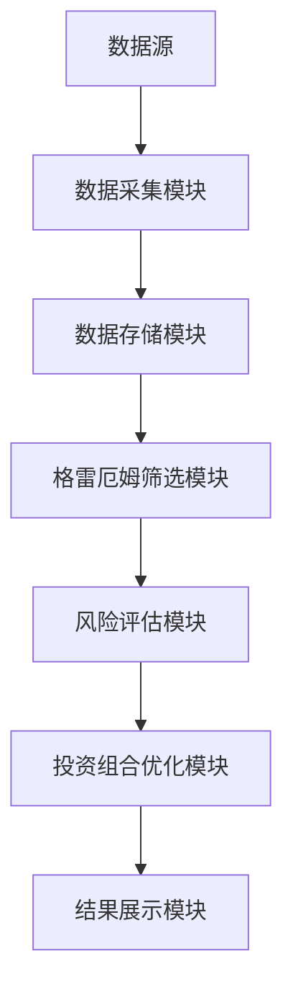

                 


# 《格雷厄姆特价股票理论对现代风险管理的启示》

## 文章关键词：
- 格雷厄姆投资理论
- 风险管理
- 特价股票
- 价值投资
- 投资组合优化

## 摘要：
本文探讨了本杰明·格雷厄姆的特价股票理论及其对现代风险管理的启示。通过分析格雷厄姆的投资理念，结合现代风险管理技术，本文提出了将格雷厄姆的安全边际概念与现代风险评估方法相结合的新思路。文章详细介绍了格雷厄姆理论的核心概念、风险管理的关键指标以及如何将这些理念转化为可操作的算法和系统架构。通过实际案例分析和代码实现，本文展示了如何在现代投资实践中应用格雷厄姆理论，以实现风险可控下的收益最大化。

---

## 第一部分：格雷厄姆特价股票理论基础

### 第1章：格雷厄姆特价股票理论概述

#### 1.1 格雷厄姆投资理论的起源

**1.1.1 价值投资的鼻祖：本杰明·格雷厄姆**

本杰明·格雷厄姆（Benjamin Graham）是20世纪最伟大的投资思想家之一，被誉为“价值投资之父”。他的投资理念在《证券分析》（1934年）和《聪明的投资者》（1949年）中得到了详细阐述。格雷厄姆的核心思想是，股票不仅是一种价格波动的证券，更是一种拥有内在价值的企业所有权证书。投资者应该以低于其内在价值的价格买入股票，并长期持有，直到其价格回归合理区间。

**1.1.2 特价股票理论的核心思想**

格雷厄姆的特价股票理论强调，市场波动往往会导致优质股票的价格偏离其真实价值。投资者的任务是识别这些被低估的股票，并构建一个分散的投资组合以分散风险。他认为，投资的目的是在控制风险的前提下实现收益最大化，而不是追求市场的短期波动。

**1.1.3 格雷厄姆投资理念的现代意义**

尽管格雷厄姆的投资理念诞生于20世纪初，但其核心思想在现代投资实践中依然具有重要价值。尤其是在当前市场波动加剧、风险意识增强的背景下，格雷厄姆的安全边际概念和价值投资理念为现代风险管理提供了重要的理论基础。

---

#### 1.2 格雷厄姆投资策略的关键指标

**1.2.1 市盈率（P/E）的计算与应用**

市盈率是衡量股票价值的重要指标，计算公式为：

$$ P/E = \frac{股票价格}{每股收益} $$

格雷厄姆认为，市盈率过低的股票可能具有投资价值，但需要结合其他指标（如市净率）进行综合判断。

**1.2.2 市净率（P/B）的定义与作用**

市净率是股票价格与每股净资产的比率，计算公式为：

$$ P/B = \frac{股票价格}{每股净资产} $$

格雷厄姆建议关注市净率低于某个阈值的股票，以寻找被市场低估的投资机会。

**1.2.3 股东权益收益率（ROE）的分析**

股东权益收益率是衡量企业盈利能力的重要指标，计算公式为：

$$ ROE = \frac{净利润}{股东权益} $$

格雷厄姆认为，ROE高的企业通常具有较强的盈利能力，但需要结合企业的财务状况和行业特点进行综合分析。

---

#### 1.3 格雷厄姆投资策略的实施步骤

**1.3.1 确定投资目标与风险承受能力**

投资者需要根据自身的财务状况、投资目标和风险偏好，制定合适的投资策略。格雷厄姆建议投资者采取长期持有和分散投资的策略，以降低市场波动带来的风险。

**1.3.2 寻找低于内在价值的股票**

格雷厄姆强调，投资者应寻找那些市场价格低于其内在价值的股票。这通常通过分析公司的财务报表和市场指标（如P/E、P/B）来实现。

**1.3.3 构建投资组合与长期持有策略**

格雷厄姆建议投资者构建一个分散的投资组合，以降低特定股票或行业带来的风险。同时，他强调长期持有的重要性，认为市场波动会逐渐回归其真实价值。

---

## 第二部分：现代风险管理理论与实践

### 第2章：现代风险管理的核心概念

#### 2.1 风险管理的基本框架

**2.1.1 风险的定义与分类**

风险是指在投资过程中，由于不确定性因素的影响，投资收益可能偏离预期值的可能性。根据其来源，风险可以分为市场风险、流动性风险、信用风险等。

**2.1.2 风险管理的目标与原则**

风险管理的目标是通过识别、评估和控制风险，实现投资收益的最大化。风险管理的原则包括全面性、审慎性、分散性等。

**2.1.3 风险管理的流程与方法**

风险管理的流程通常包括风险识别、风险评估、风险控制和风险监控四个阶段。常用的方法包括VaR（风险价值）模型、压力测试和情景分析。

---

#### 2.2 现代风险管理的关键指标

**2.2.1 风险价值（VaR）**

VaR是指在一定置信水平下，投资组合在一定持有期内可能遭受的最大损失。例如，95%置信水平下的VaR意味着在95%的概率下，投资组合的最大损失不会超过VaR值。

**2.2.2 凸性风险（CVaR）**

CVaR是指在VaR的基础上，考虑超出VaR的潜在损失。它通常用于更严格的风险评估。

**2.2.3 波动率与相关性分析**

波动率是衡量资产价格变动程度的指标，相关性分析用于评估不同资产之间的关联性。

---

#### 2.3 现代风险管理的技术与工具

**2.3.1 数量化风险评估模型**

数量化风险评估模型（如VaR模型）通过数学方法量化投资组合的风险。常用工具包括Python中的Pandas和NumPy库。

**2.3.2 Monte Carlo模拟在风险管理中的应用**

Monte Carlo模拟是一种通过随机抽样方法模拟市场情景的技术，广泛应用于风险管理领域。

**2.3.3 压力测试与情景分析**

压力测试通过模拟极端市场情景，评估投资组合在极端条件下的表现。情景分析则是通过设定不同的市场情景，评估投资组合在不同情况下的表现。

---

## 第三部分：格雷厄姆理论与现代风险管理的结合

### 第3章：格雷厄姆投资理念与风险管理的联系

#### 3.1 格雷厄姆理论中的风险管理要素

**3.1.1 估值安全边际与风险控制**

格雷厄姆强调安全边际的概念，即以低于内在价值的价格买入股票，从而在市场波动时降低损失。

**3.1.2 投资组合分散化与风险降低**

通过分散投资组合，投资者可以降低特定资产或行业带来的风险，从而实现风险可控下的收益最大化。

**3.1.3 长期持有策略与风险管理**

长期持有策略有助于避免短期市场波动的影响，同时为企业的发展提供充足的时间，从而降低投资风险。

---

#### 3.2 格雷厄姆理论在现代风险管理中的应用

**3.2.1 通过低估值股票构建防御性投资组合**

格雷厄姆的低估值股票筛选方法可以用于构建防御性投资组合。投资者可以通过筛选P/E和P/B低于行业平均水平的股票，降低投资组合的风险。

**3.2.2 利用安全边际控制下行风险**

安全边际的概念可以应用于现代风险管理，通过设定止损点或选择低波动率的资产，控制投资组合的下行风险。

**3.2.3 结合现代风险指标优化投资组合**

将格雷厄姆的低估值筛选方法与现代风险指标（如VaR）相结合，可以优化投资组合的风险收益比。

---

## 第四部分：系统架构与算法实现

### 第4章：基于格雷厄姆理论的风险管理系统

#### 4.1 系统功能设计

**4.1.1 数据采集与处理**

系统需要采集股票的市场数据（如价格、收益、净资产等）和宏观经济数据，并进行清洗和预处理。

**4.1.2 格雷厄姆筛选模型**

基于格雷厄姆的筛选标准（如P/E、P/B），构建筛选模型，识别低估值股票。

**4.1.3 风险评估与优化**

结合现代风险评估指标（如VaR），对投资组合进行风险评估，并优化其风险收益比。

---

#### 4.2 系统架构设计



---

#### 4.3 系统接口设计

**4.3.1 数据接口**

系统需要通过API接口获取股票数据和宏观经济数据。

**4.3.2 用户接口**

用户可以通过Web界面输入筛选条件，查看筛选结果和风险评估报告。

---

## 第五部分：项目实战

### 第5章：基于格雷厄姆理论的风险管理系统实现

#### 5.1 环境安装

- Python 3.8+
- Pandas、NumPy、Matplotlib库
- 数据源：Yahoo Finance API

#### 5.2 核心代码实现

```python
import pandas as pd
import numpy as np

# 示例数据
data = {
    '股票代码': ['AAPL', 'MSFT', 'GOOGL'],
    '股价': [100, 80, 150],
    '每股收益': [10, 15, 20],
    '每股净资产': [50, 60, 70]
}

df = pd.DataFrame(data)

# 计算P/E和P/B
df['P/E'] = df['股价'] / df['每股收益']
df['P/B'] = df['股价'] / df['每股净资产']

print(df)
```

---

#### 5.3 案例分析与解读

通过上述代码，我们可以计算出每只股票的P/E和P/B值。假设我们筛选P/E < 15且P/B < 2的股票，可以构建一个低估值投资组合。

---

## 第六部分：最佳实践与小结

### 第6章：最佳实践与风险管理 tips

#### 6.1 最佳实践

- 结合格雷厄姆的低估值筛选方法和现代风险指标，优化投资组合。
- 定期监控投资组合的表现，及时调整投资策略。

#### 6.2 小结

格雷厄姆的特价股票理论为现代风险管理提供了重要的启示。通过将格雷厄姆的安全边际概念与现代风险评估方法相结合，投资者可以在控制风险的前提下实现收益最大化。

---

## 作者：AI天才研究院/AI Genius Institute & 禅与计算机程序设计艺术 /Zen And The Art of Computer Programming

