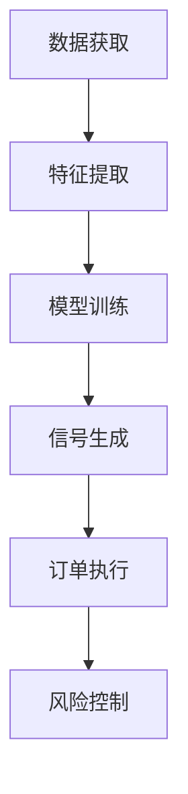
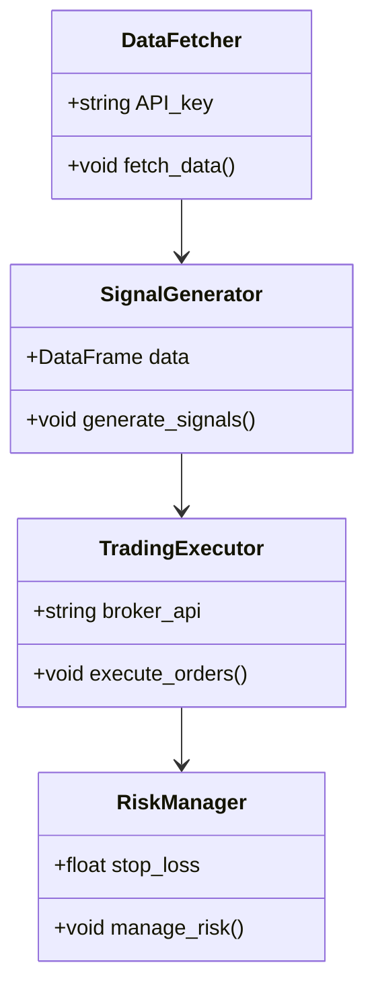

                 


# 格雷厄姆特价股票理论对算法交易的影响

> 关键词：格雷厄姆理论, 算法交易, 价值投资, 量化交易, 投资策略

> 摘要：格雷厄姆的价值投资理论为算法交易提供了新的思路，通过量化分析低估股票，结合安全边际和市场情绪，优化交易策略，实现长期收益最大化。本文将深入探讨格雷厄姆理论与算法交易的结合，分析其对投资策略的影响。

## 第一部分: 格雷厄姆特价股票理论与算法交易概述

### 第1章: 格雷厄姆投资哲学的起源

#### 1.1 价值投资的起源与发展
价值投资是一种以低于内在价值的价格买入优质股票的投资策略，由本杰明·格雷厄姆在20世纪初提出。其核心思想是寻找市场低估的股票，长期持有，等待其价值回归。格雷厄姆的学生彼得·林奇进一步发展了这一理论，使其更加系统化。

#### 1.2 安全边际理论
安全边际是指股票的市场价格低于其内在价值的部分。格雷厄姆认为，购买价格低于内在价值的股票可以有效降低投资风险，确保收益的稳定性。安全边际的计算公式为：  
$$ \text{安全边际} = \text{内在价值} - \text{市场价格} $$

#### 1.3 低估股票的定义与特征
低估股票通常具有较低的市盈率（P/E）和市净率（P/B），且股息率较高。格雷厄姆建议投资者关注那些市值较小、流动性较高的股票，这些股票更容易出现价格低估的情况。

### 第2章: 算法交易的基本原理

#### 2.1 算法交易的定义与分类
算法交易是指利用数学模型和计算机程序自动执行交易决策的过程。根据交易频率，算法交易可以分为高频交易（HFT）和低频交易（LFT）。

#### 2.2 量化交易的框架与流程
量化交易的框架包括数据获取、信号生成、订单执行和风险控制四个主要步骤。以下是信号生成的流程图：



## 第二部分: 格雷厄姆理论与算法交易的结合

### 第3章: 格雷厄姆理论在算法交易中的应用

#### 3.1 格雷厄姆选股策略的量化模型
格雷厄姆的选股策略可以通过量化模型转化为可执行的交易信号。以下是具体的模型构建步骤：

1. **数据预处理**：获取目标股票的历史数据，包括价格、成交量、财务指标等。
2. **特征提取**：计算市盈率（P/E）、市净率（P/B）等指标。
3. **内在价值计算**：使用格雷厄姆的内在价值公式估算股票的合理价格。
4. **安全边际计算**：比较市场价格与内在价值，确定是否存在足够的安全边际。
5. **交易信号生成**：当市场价格低于内在价值且存在足够安全边际时，生成买入信号；反之，生成卖出信号。

#### 3.2 格雷厄姆策略的算法实现
以下是基于格雷厄姆理论的算法交易策略的Python代码示例：

```python
import pandas as pd
import numpy as np

# 假设data是一个包含股票历史数据的DataFrame
# 计算内在价值
data['Intrinsic_Value'] = data['Earnings'] * 20  # 假设合理市盈率为20

# 计算安全边际
data['Safety_Margin'] = data['Intrinsic_Value'] - data['Price']

# 生成交易信号
data['Signal'] = np.where(data['Safety_Margin'] > 0, 1, -1)
```

### 第4章: 算法交易中的格雷厄姆策略优化

#### 4.1 策略优化的核心要素
为了提高交易效率和收益，可以在格雷厄姆策略的基础上进行优化。例如：

1. **动态调整安全边际**：根据市场波动情况，动态调整安全边际的计算方式。
2. **引入技术分析**：结合趋势指标，如移动平均线和相对强弱指数（RSI），优化交易信号。
3. **风险管理**：设置止损和止盈点，控制单次交易的风险敞口。

#### 4.2 算法实现的优化方法
以下是优化后的策略代码示例：

```python
import pandas as pd
import numpy as np

# 计算移动平均线
data['SMA_20'] = data['Price'].rolling(20).mean()

# 结合技术分析生成优化信号
data['Optimized_Signal'] = np.where((data['Safety_Margin'] > 0) & (data['Price'] > data['SMA_20']), 1, -1)
```

## 第三部分: 系统分析与架构设计

### 第5章: 系统架构设计

#### 5.1 系统功能设计
以下是系统功能的类图：



## 第四部分: 项目实战

### 第6章: 项目实战

#### 6.1 环境安装
需要安装以下Python库：
- pandas
- numpy
- matplotlib
- backtrader

#### 6.2 核心实现代码
以下是完整的策略实现代码：

```python
import pandas as pd
import numpy as np

def graham_strategy(data):
    # 计算内在价值
    data['Intrinsic_Value'] = data['Earnings'] * 20

    # 计算安全边际
    data['Safety_Margin'] = data['Intrinsic_Value'] - data['Price']

    # 生成交易信号
    data['Signal'] = np.where(data['Safety_Margin'] > 0, 1, -1)

    return data

# 示例数据
data = pd.DataFrame({
    'Price': [100, 90, 80, 70, 60],
    'Earnings': [5, 4, 3, 2, 1]
})

result = graham_strategy(data)
print(result)
```

## 结论

格雷厄姆的价值投资理论为算法交易提供了丰富的理论基础和实践指导。通过量化分析和算法优化，投资者可以在保持价值投资理念的同时，提高交易效率和收益。未来，随着人工智能和大数据技术的发展，格雷厄姆策略在算法交易中的应用将更加广泛和深入。

作者：AI天才研究院 & 禅与计算机程序设计艺术

