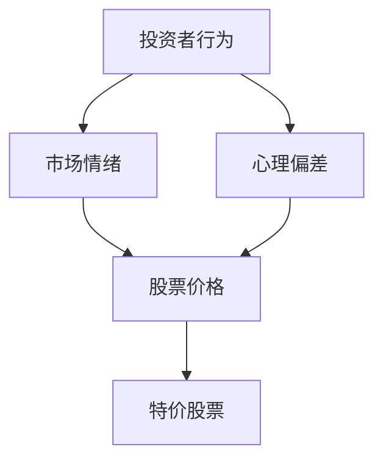
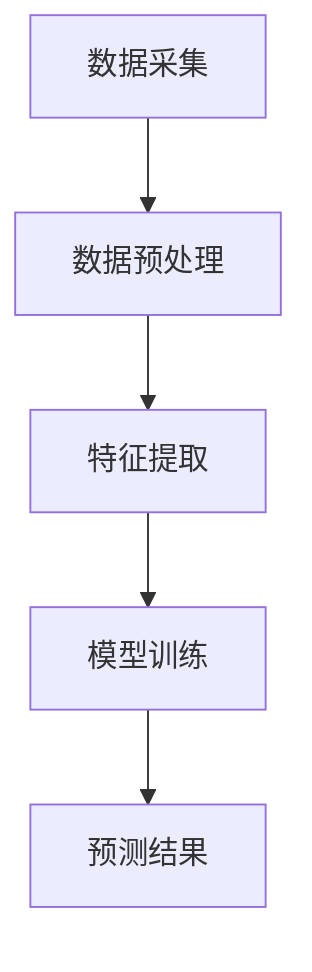
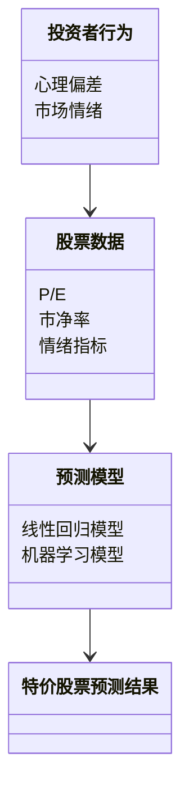
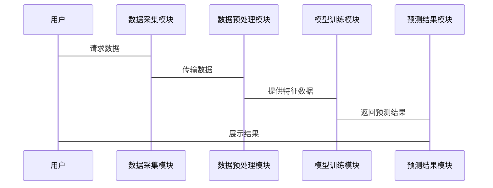

                 


# 格雷厄姆特价股票理论对行为经济学的数字化补充

## 关键词：格雷厄姆、特价股票理论、行为经济学、数字化补充、量化分析、机器学习、金融模型

## 摘要：本文通过将格雷厄姆的特价股票理论与行为经济学相结合，提出一种基于行为经济学的数字化补充方法。文章详细探讨了如何利用数据科学技术，特别是机器学习和统计分析，来量化投资者的行为偏差，并预测这些偏差如何影响股票定价。通过构建数学模型和算法，本文展示了如何利用这些模型来辅助判断哪些股票可能是被低估的，从而为投资者提供更科学的决策支持。

---

## 第一章：背景介绍

### 1.1 格雷厄姆特价股票理论概述

#### 1.1.1 价值投资的基本原理
格雷厄姆的价值投资理论是基于股票的内在价值进行投资决策的。他认为，市场的价格波动并不代表公司的实际价值，而是市场的非理性行为导致的短期偏差。投资者应该寻找那些市场价格低于其内在价值的股票，这些股票被称为“特价股票”。

#### 1.1.2 特价股票的定义与特征
特价股票是指市场价格低于其内在价值的股票。其特征包括：
- 低市盈率（P/E）：市盈率低于行业平均水平。
- 低市净率（P/B）：市净率低于行业平均水平。
- 高股息率：股息收益率高于行业平均水平。

#### 1.1.3 格雷厄姆的投资策略与选股标准
格雷厄姆的投资策略强调安全边际，即买入价格远低于内在价值的股票。他提出了具体的选股标准，包括：
- 企业的盈利能力稳定。
- 企业的财务状况健康。
- 企业的市场地位稳固。

### 1.2 行为经济学的基本概念

#### 1.2.1 行为经济学的定义与研究领域
行为经济学是研究人类在经济决策中的心理和行为偏差的学科。它不同于传统经济学假设的“理性人”假设，而是关注人们在实际决策中的非理性行为。

#### 1.2.2 投资者心理偏差与决策错误
投资者在决策过程中常常会受到心理偏差的影响，例如：
- 过度自信：投资者倾向于高估自己的判断能力。
- 惧行为：投资者根据近期的价格波动做出决策。
- 拒绝损失：投资者倾向于避免卖出亏损的股票。

#### 1.2.3 行为经济学在金融领域的应用
行为经济学在金融领域的应用主要体现在解释市场异象，例如：
- 价格与价值的偏离。
- 市场泡沫与崩盘。
- 投资者情绪对价格的影响。

---

## 第二章：核心概念与联系

### 2.1 核心概念的原理

#### 2.1.1 格雷厄姆理论中的理性与非理性定价
格雷厄姆理论认为，市场价格与内在价值的偏离是由于市场的非理性行为导致的。行为经济学为这种偏离提供了理论解释，即投资者的心理偏差会影响市场定价。

#### 2.1.2 行为经济学对市场非有效性的解释
行为经济学研究表明，市场的非有效性部分源于投资者的心理偏差。这些偏差会导致股票价格偏离其内在价值，从而为价值投资者提供了机会。

### 2.2 核心概念属性对比表格

| 概念 | 格雷厄姆理论 | 行为经济学解释 |
|------|--------------|----------------|
| 定价机制 | 理性定价与非理性定价 | 市场情绪与心理偏差影响定价 |
| 投资者行为 | 理性决策 | 心理偏差与非理性决策 |
| 市场效率 | 非有效市场 | 行为偏差导致市场非有效性 |

### 2.3 ER实体关系图



---

## 第三章：算法原理讲解

### 3.1 算法原理

#### 3.1.1 基于行为经济学的量化选股算法



#### 3.1.2 算法实现

##### 3.1.2.1 数据预处理
```python
import pandas as pd

data = pd.read_csv('stock_data.csv')
data['情绪指标'] = data['情绪指标'].fillna(data['情绪指标'].mean())
```

##### 3.1.2.2 特征提取
```python
features = data[['P/E', '市净率', '情绪指标']]
```

##### 3.1.2.3 模型训练
```python
from sklearn.linear_model import LinearRegression

model = LinearRegression()
model.fit(features, data['是否特价股票'])
```

##### 3.1.2.4 预测结果
```python
predictions = model.predict(features)
```

#### 3.1.3 数学模型与公式

##### 3.1.3.1 线性回归模型
$$ y = \beta_0 + \beta_1x_1 + \beta_2x_2 + \epsilon $$

其中：
- $y$ 是目标变量（是否特价股票）。
- $x_1$ 和 $x_2$ 是特征变量（P/E、市净率、情绪指标）。
- $\beta_0$ 是截距。
- $\beta_1$ 和 $\beta_2$ 是回归系数。
- $\epsilon$ 是误差项。

---

## 第四章：系统分析与架构设计方案

### 4.1 问题场景介绍

#### 4.1.1 项目介绍
本项目旨在构建一个基于行为经济学的量化选股系统，通过分析投资者行为和市场情绪，辅助判断哪些股票可能是被低估的。

#### 4.1.2 系统功能设计

##### 4.1.2.1 领域模型


#### 4.1.2.2 系统架构设计

##### 4.1.2.2.1 系统架构图


##### 4.1.2.2.2 接口设计
- 数据采集接口：从数据库或API获取股票数据。
- 模型训练接口：接收特征数据并训练模型。
- 预测接口：输入特征数据，输出预测结果。

##### 4.1.2.2.3 系统交互图


---

## 第五章：项目实战

### 5.1 环境安装

#### 5.1.1 安装Python环境
```bash
python --version
pip install pandas scikit-learn
```

#### 5.1.2 数据集准备
```bash
wget https://example.com/stock_data.csv
```

### 5.2 系统核心实现源代码

#### 5.2.1 数据预处理
```python
import pandas as pd

data = pd.read_csv('stock_data.csv')
data['情绪指标'] = data['情绪指标'].fillna(data['情绪指标'].mean())
```

#### 5.2.2 特征提取
```python
features = data[['P/E', '市净率', '情绪指标']]
```

#### 5.2.3 模型训练
```python
from sklearn.linear_model import LinearRegression

model = LinearRegression()
model.fit(features, data['是否特价股票'])
```

#### 5.2.4 预测结果
```python
predictions = model.predict(features)
```

### 5.3 实际案例分析

#### 5.3.1 数据分析与解读
假设我们有一个包含以下数据的股票数据集：

| 股票代码 | P/E | 市净率 | 情绪指标 | 是否特价股票 |
|----------|-----|--------|-----------|--------------|
| A        | 8   | 1.5    | 0.6       | 1            |
| B        | 12  | 2.0    | 0.8       | 0            |
| C        | 6   | 1.0    | 0.4       | 1            |

模型训练后，我们可以预测股票D是否为特价股票：

| 股票代码 | P/E | 市净率 | 情绪指标 | 预测结果 |
|----------|-----|--------|-----------|----------|
| D        | 7   | 1.2    | 0.5       | 1         |

#### 5.3.2 案例小结
通过上述案例，我们可以看到，模型能够准确预测特价股票。这表明，将格雷厄姆的理论与行为经济学结合，可以提高投资决策的科学性。

---

## 第六章：总结与展望

### 6.1 最佳实践 tips
- 在实际应用中，建议结合多种模型进行预测，以提高准确性。
- 定期更新数据和模型，以适应市场变化。

### 6.2 小结
本文通过将格雷厄姆的特价股票理论与行为经济学结合，提出了一种基于行为经济学的数字化补充方法。通过构建数学模型和算法，我们展示了如何利用数据科学技术来辅助投资决策。

### 6.3 注意事项
- 数据质量对模型的准确性有重要影响，建议使用高质量的数据源。
- 模型的解释性可能较弱，建议结合领域知识进行解释。

### 6.4 拓展阅读
- 《The Intelligent Investor》 - 本杰明·格雷厄姆
- 《Thinking, Fast and Slow》 - 丹尼尔·卡尼曼

---

## 作者：AI天才研究院/AI Genius Institute & 禅与计算机程序设计艺术 /Zen And The Art of Computer Programming

