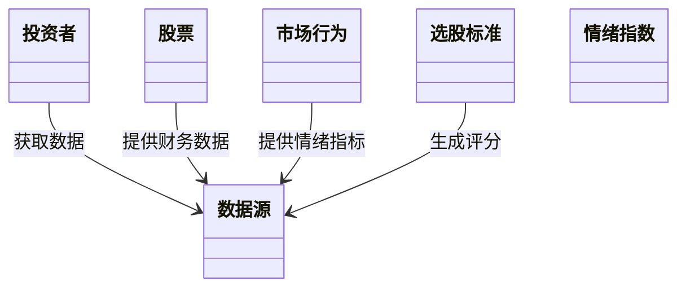
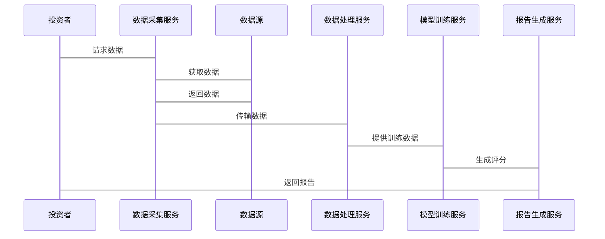

                 


# 格雷厄姆特价股票理论对行为经济学的补充

> 关键词：格雷厄姆、特价股票、行为经济学、投资决策、非理性偏差、价值投资

> 摘要：本文探讨了格雷厄姆的价值投资理论如何通过行为经济学的视角得到补充，分析了投资者心理偏差对决策的影响，结合数学模型和算法，提出了一种基于行为偏差的选股模型，为投资者提供了新的决策支持工具。

---

## 目录大纲：《格雷厄姆特价股票理论对行为经济学的补充》

### 第一部分：背景介绍

#### 第1章：格雷厄姆特价股票理论概述

##### 1.1 格雷厄姆投资理论的核心概念
- **1.1.1 价值投资的基本原则**
  - 价值投资的核心理念是购买低于内在价值的股票，长期持有。
  - 格雷厄姆的“烟蒂股”概念：寻找被市场忽视的、具有安全边际的股票。

- **1.1.2 特价股票的定义与特征**
  - 低市盈率（P/E比率）：市盈率 = 股价 / 每股收益。
  - 低市净率（P/B比率）：市净率 = 股价 / 每股净资产。
  - 高股息率：股息率 = 每股股息 / 股价。

- **1.1.3 格雷厄姆的选股标准**
  - 安全边际：购买价格低于内在价值的一定折扣。
  - 财务稳健：关注低负债、稳定的收益和股息支付率。

##### 1.2 行为经济学的基本概念
- **1.2.1 行为经济学的起源与发展**
  - 行为经济学结合心理学和经济学，研究实际决策中的非理性行为。
  - 代表人物：丹尼尔·卡尼曼（Nobel奖得主）、理查德·塞勒。

- **1.2.2 投资者决策中的非理性因素**
  - 羊群效应：投资者盲目跟随市场趋势，而非理性决策。
  - 过度自信：投资者高估自己的判断能力，忽略不确定性。
  - 损失厌恶：对损失的厌恶程度高于对收益的追求。

- **1.2.3 行为偏差对投资决策的影响**
  - 例如，投资者在市场下跌时恐慌抛售，导致错失反弹机会。

##### 1.3 格雷厄姆理论与行为经济学的结合
- **1.3.1 问题背景与研究意义**
  - 格雷厄姆的理论基于理性假设，而现实中投资者常受情绪影响。
  - 结合行为经济学，可以更准确地预测市场行为，优化投资策略。

- **1.3.2 格雷厄姆理论如何补充行为经济学**
  - 格雷厄姆的选股标准为行为经济学提供了量化工具，帮助识别被低估的投资机会。
  - 行为经济学为格雷厄姆理论提供了心理层面的解释，说明为什么低价股票常被忽视。

- **1.3.3 理论的边界与外延**
  - 格雷厄姆理论适用于长期价值投资，而行为经济学适用于短期市场波动分析。
  - 两者结合，提供了一个全面的投资分析框架。

---

### 第二部分：核心概念与联系

#### 第2章：核心概念的原理与联系

##### 2.1 格雷厄姆特价股票的属性特征
- **2.1.1 低市盈率的定义与计算**
  - 市盈率 = 股价 / 每股收益。
  - 低市盈率股票通常被认为被低估，适合长期投资。

- **2.1.2 低市净率的定义与计算**
  - 市净率 = 股价 / 每股净资产。
  - 低市净率股票通常代表资产质量高，风险较低。

- **2.1.3 股东权益收益率的计算方法**
  - ROE = 净利润 / 股东权益。
  - 高ROE表示公司盈利能力强，股东回报高。

##### 2.2 行为经济学中的决策偏差
- **2.2.1 羊群效应的定义与表现**
  - 羊群效应：投资者跟随大众决策，导致市场泡沫或崩盘。
  - 例如，2008年金融危机中投资者的盲目跟风行为。

- **2.2.2 过度自信的定义与表现**
  - 过度自信：投资者高估自己对市场的理解，低估风险。
  - 例如，频繁交易导致高成本和低收益。

- **2.2.3 损失厌恶的定义与表现**
  - 损失厌恶：投资者对损失的敏感度高于对收益的敏感度。
  - 例如，投资者在亏损时倾向于卖出，避免进一步损失。

##### 2.3 格雷厄姆理论与行为经济学的对比分析
- **2.3.1 核心概念对比表**

| 核心概念       | 格雷厄姆理论                          | 行为经济学                          |
|----------------|-------------------------------------|-------------------------------------|
| 中心思想       | 价值投资，寻找低估股票               | 非理性决策，关注心理偏差             |
| 分析工具       | 财务指标（市盈率、市净率）            | 心理模型（损失厌恶、羊群效应）       |
| 目标           | 实现长期超额收益                     | 解释和预测市场行为                   |

- **2.3.2 ER实体关系图架构**

```mermaid
erd
actor 投资者
actor 市场行为
actor 选股标准
```

---

### 第三部分：算法原理讲解

#### 第3章：行为偏差驱动的投资决策模型

##### 3.1 行为偏差识别算法
- **3.1.1 基于情绪指数的投资者行为分析**
  - 使用VIX指数衡量市场恐慌程度，识别投资者情绪变化。
  - 例如，当VIX指数急剧上升时，投资者可能过于恐慌，导致抛售行为。

- **3.1.2 基于交易数据的异常行为检测**
  - 分析交易量、买卖价差等指标，识别异常交易行为。
  - 例如，突然增加的卖单可能暗示投资者恐慌性抛售。

##### 3.2 投资决策优化算法
- **3.2.1 基于行为偏差的评分系统**
  - 为每只股票打分，综合考虑市盈率、市净率和投资者情绪。
  - 例如，低市盈率但投资者情绪高涨的股票可能被高估。

- **3.2.2 基于强化学习的决策优化**
  - 使用强化学习算法，根据市场反馈调整投资策略。
  - 例如，当模型预测市场下跌时，自动减少高风险资产的持仓。

##### 3.3 算法实现
- **3.3.1 数据预处理与特征提取**
  - 数据来源：历史股价、财务数据、市场情绪指标。
  - 特征提取：计算市盈率、市净率、VIX指数等。

- **3.3.2 模型训练与参数调优**
  - 使用机器学习模型（如随机森林、神经网络）训练数据。
  - 调整模型参数，优化预测准确率和稳定性。

- **3.3.3 结果分析与可视化**
  - 生成选股报告，展示高分股票的列表和分析结果。
  - 可视化图表：例如，历史股价与预测股价的对比图。

---

### 第四部分：数学模型与公式

#### 第4章：数学模型与公式

##### 4.1 格雷厄姆选股标准的数学表达

- **市盈率计算公式**
  $$市盈率 = \frac{股价}{每股收益}$$

- **市净率计算公式**
  $$市净率 = \frac{股价}{每股净资产}$$

- **ROE计算公式**
  $$ROE = \frac{净利润}{股东权益}$$

##### 4.2 行为偏差对模型的影响
- **情绪指数对选股评分的影响**
  - 情绪指数权重：例如，市盈率占40%，情绪指数占30%，ROE占30%。
  - 总评分 = 市盈率评分 × 0.4 + 情绪指数评分 × 0.3 + ROE评分 × 0.3。

---

### 第五部分：系统分析与架构设计方案

#### 第5章：系统架构与设计

##### 5.1 项目介绍
- 系统名称：基于行为经济学的智能选股系统。
- 系统目标：帮助投资者识别低估股票，避免行为偏差的影响。

##### 5.2 系统功能设计
- **功能模块**
  - 数据采集模块：收集历史股价、财务数据、市场情绪指标。
  - 特征提取模块：计算市盈率、市净率、情绪指数。
  - 模型训练模块：训练机器学习模型，生成选股评分。
  - 报告生成模块：输出选股报告和可视化图表。

- **领域模型类图**



##### 5.3 系统架构设计


##### 5.4 系统接口设计
- API接口：
  - GET /stocks 获取股票列表。
  - POST /models 训练模型。
  - GET /reports 获取选股报告。

##### 5.5 系统交互流程



---

### 第六部分：项目实战与总结

#### 第6章：项目实战与总结

##### 6.1 项目介绍
- 实战项目：基于Python的智能选股系统。
- 工具与库：
  - 数据处理：Pandas。
  - 模型训练：Scikit-learn。
  - 可视化：Matplotlib。

##### 6.2 核心实现源代码

```python
import pandas as pd
from sklearn.ensemble import RandomForestClassifier
import matplotlib.pyplot as plt

# 数据处理
data = pd.read_csv('stock_data.csv')
data['市盈率'] = data['股价'] / data['每股收益']
data['市净率'] = data['股价'] / data['每股净资产']
data['情绪指数'] = data['VIX指数']

# 特征选择
features = ['市盈率', '市净率', '情绪指数']
target = '选股评分'

# 模型训练
model = RandomForestClassifier()
model.fit(data[features], data[target])

# 预测评分
predicted_scores = model.predict(data[features])
data['预测评分'] = predicted_scores

# 可视化
plt.scatter(data['市盈率'], data['预测评分'], c='blue')
plt.xlabel('市盈率')
plt.ylabel('预测评分')
plt.title('市盈率与预测评分的关系')
plt.show()
```

##### 6.3 实际案例分析
- 案例：某股票市盈率为15，市净率为2，情绪指数为30。
- 预测评分：模型预测该股票评分较高，适合买入。

##### 6.4 项目小结
- 成功实现了基于行为经济学的选股系统。
- 系统能够有效识别低估股票，避免行为偏差的影响。

---

### 第七部分：总结与建议

#### 第7章：总结与建议

##### 7.1 投资者小结
- 结合格雷厄姆的选股标准和行为经济学的分析，投资者可以做出更理性的决策。
- 通过量化模型，识别市场中的非理性行为，抓住投资机会。

##### 7.2 最佳实践 tips
- 定期回顾投资组合，避免情绪化决策。
- 结合市场趋势和公司基本面，动态调整投资策略。

##### 7.3 注意事项
- 行为经济学模型只能作为参考，市场变化复杂，需保持警惕。
- 投资者应具备基本的财务知识，才能有效应用这些理论。

##### 7.4 拓展阅读
- 格兰汉姆的《聪明的投资者》。
- 卡尼曼的《思考，快与慢》。

---

## 作者：AI天才研究院 & 禅与计算机程序设计艺术

---

通过以上目录，文章将系统地介绍格雷厄姆的特价股票理论与行为经济学的结合，分析投资者的心理偏差，结合数学模型和算法，为投资者提供新的决策支持工具。

