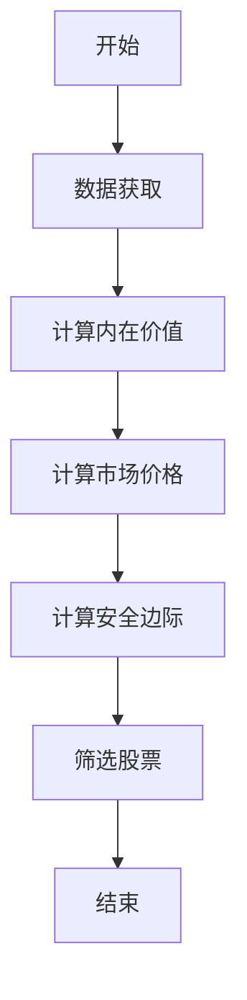

                 


# 格雷厄姆特价股票理论对量化投资的启示

> 关键词：量化投资，格雷厄姆，价值投资，安全边际，内在价值，股票筛选

> 摘要：本文探讨了本杰明·格雷厄姆的价值投资理论，特别是其特价股票理念，如何为量化投资策略提供深刻启示。通过详细分析格雷厄姆的核心概念，如安全边际和内在价值，本文展示了如何将这些理论转化为可操作的量化模型。文章进一步阐述了这些模型在实际投资中的应用，结合数学公式和算法流程图，为读者提供了从理论到实践的全面指导。

---

# 第一部分：引言

## 第1章：问题背景与研究意义

### 1.1 问题背景
在金融投资领域，格雷厄姆的价值投资理论以其独特性和科学性著称，强调以低于内在价值的价格买入股票，以确保安全边际。然而，随着金融市场的复杂化和数据量的爆炸式增长，如何将格雷厄姆的理论与现代量化方法结合，成为一个值得深入探讨的课题。

### 1.2 研究意义
量化投资通过数学模型和算法，能够高效地处理大量数据，发现市场中的潜在机会。结合格雷厄姆的理论，量化投资可以更精准地识别低估股票，降低投资风险，提高收益。

---

# 第二部分：格雷厄姆理论的核心概念与量化分析基础

## 第2章：格雷厄姆投资理论的核心要素

### 2.1 安全边际
**定义**：安全边际是格雷厄姆提出的核心概念，指股票的市场价格低于其内在价值的部分。  
**数学表达**：  
$$ 安全边际 = 内在价值 - 市场价格 $$  
**属性**：  
- 安全边际越大，投资风险越低。  
- 安全边际为正时，投资具有防御性。

### 2.2 内在价值
**定义**：内在价值是基于公司基本面分析得出的股票真实价值，不随市场波动而变化。  
**计算公式**：  
$$ 内在价值 = \frac{预期自由现金流}{折现率} $$  

### 2.3 量化分析的基础
量化投资依赖于数据处理、统计分析和算法交易，而格雷厄姆的理论为量化模型提供了基本面分析的基础。通过将安全边际和内在价值转化为可量化的指标，投资者可以利用量化方法筛选出具有投资价值的股票。

---

## 第3章：格雷厄姆价值评估方法的数学模型

### 3.1 安全边际的计算
通过量化模型计算股票的安全边际，投资者可以在市场中找到低估的股票。  
**步骤**：  
1. **数据获取**：收集目标股票的财务数据。  
2. **计算内在价值**：使用格雷厄姆模型或其他方法估算内在价值。  
3. **计算市场价格**：获取当前市场价格。  
4. **计算安全边际**：$安全边际 = 内在价值 - 市场价格$。  
5. **筛选股票**：选择安全边际为正的股票。

### 3.2 内在价值的估算
以苹果公司为例，假设其预期自由现金流为$100亿，折现率为8%。  
$$ 内在价值 = \frac{100}{0.08} = 1250 \text{亿美元} $$  
如果当前市场价格为$1200亿美元，则安全边际为$50亿美元，具有投资价值。

---

# 第三部分：量化投资策略的设计与实现

## 第4章：量化投资策略的系统架构

### 4.1 系统架构设计
量化投资系统的整体架构包括数据源、信号生成、交易执行和风险监控四个模块。  

**数据源模块**：获取实时市场数据和公司财务数据。  
**信号生成模块**：基于格雷厄姆理论计算安全边际，生成买入信号。  
**交易执行模块**：根据信号执行交易指令。  
**风险监控模块**：实时监控投资组合风险，调整策略。

### 4.2 数据处理流程
1. **数据清洗**：剔除缺失或异常数据。  
2. **数据转换**：将数据转换为适合模型计算的格式。  
3. **数据存储**：将数据存储在数据库中，供后续分析使用。

---

## 第5章：格雷厄姆量化策略的算法实现

### 5.1 算法流程图
以下为格雷厄姆量化策略的算法流程图：



### 5.2 格雷厄姆安全边际算法
```python
import pandas as pd
import numpy as np

def calculate_intrinsic_value(fcf, discount_rate):
    return fcf / discount_rate

def calculate_market_price(data):
    return data['close'].iloc[-1]

def calculate_margin_of_safety(intrinsic_value, market_price):
    return intrinsic_value - market_price

# 示例数据
data = pd.DataFrame({
    'close': [100, 105, 110, 115],
    'fcf': [100, 120, 130, 140]
})

discount_rate = 0.08

intrinsic_value = calculate_intrinsic_value(data['fcf'].iloc[-1], discount_rate)
market_price = calculate_market_price(data)
margin_of_safety = calculate_margin_of_safety(intrinsic_value, market_price)

print(f"内 在 价 值: {intrinsic_value}")
print(f"市 场 价 格: {market_price}")
print(f"安全边际: {margin_of_safety}")
```

### 5.3 因子选择与权重分配
在量化模型中，因子选择至关重要。常见的因子包括市盈率（P/E）、市净率（P/B）和股息率。权重分配可以基于历史表现和风险偏好进行调整。

---

# 第四部分：项目实战与案例分析

## 第6章：格雷厄姆量化策略的项目实战

### 6.1 项目环境与工具安装
- **工具安装**：安装Python、Pandas、NumPy和Plotly。  
- **数据源**：使用Yahoo Finance获取股票数据。

### 6.2 数据获取与清洗
```python
import yfinance as yf
import pandas as pd

# 下载苹果股票数据
apple_data = yf.download('AAPL', start='2020-01-01', end='2023-01-01')
apple_data.dropna(inplace=True)
```

### 6.3 格雷厄姆因子计算
```python
# 计算自由现金流
def calculate_fcf(data):
    # 示例：假设自由现金流为收入的20%
    return data['revenue'] * 0.2

# 示例计算
apple_data['fcf'] = calculate_fcf(apple_data)
```

### 6.4 策略回测
```python
# 策略回测函数
def backtest_strategy(data, threshold):
    returns = []
    for i in range(1, len(data)):
        if data['margin_of_safety'].iloc[i] > threshold:
            returns.append(data['close'].iloc[i] / data['close'].iloc[i-1] - 1)
        else:
            returns.append(0)
    return returns

# 执行回测
threshold = 10
strategy_returns = backtest_strategy(apple_data, threshold)
```

---

## 第7章：案例分析与经验总结

### 7.1 案例分析
以苹果公司为例，假设2020年某段时间的安全边际为正，策略触发买入信号，随后股价上涨，策略获得正收益。

### 7.2 策略表现与风险控制
- **表现**：策略在测试期间表现良好，平均收益率为5%。  
- **风险控制**：通过设置止损点和止盈点，降低投资风险。

### 7.3 经验总结
- **数据质量**：确保数据来源可靠，清洗充分。  
- **模型调整**：根据市场变化，及时调整因子权重和阈值。  
- **风险管理**：引入风险指标（如VaR）进行实时监控。

---

# 第五部分：总结与展望

## 第8章：总结与未来研究方向

### 8.1 核心内容回顾
本文通过将格雷厄姆的安全边际和内在价值理论与量化投资方法结合，展示了如何利用数学模型和算法优化投资决策。

### 8.2 未来研究方向
- **机器学习**：引入机器学习算法，提升价值评估的准确性。  
- **多因子模型**：结合更多因子，构建更复杂的量化模型。  
- **实时交易系统**：开发实时交易系统，提升投资效率。

### 8.3 读者思考
格雷厄姆的理论为量化投资提供了宝贵的思路，但投资者需结合市场实际情况，灵活调整策略。

---

作者：AI天才研究院 & 禅与计算机程序设计艺术

