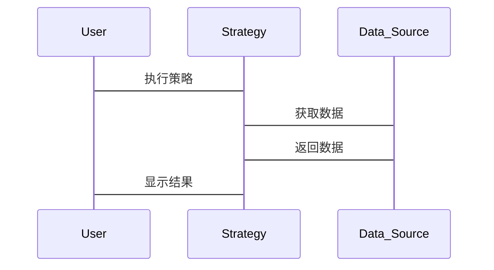
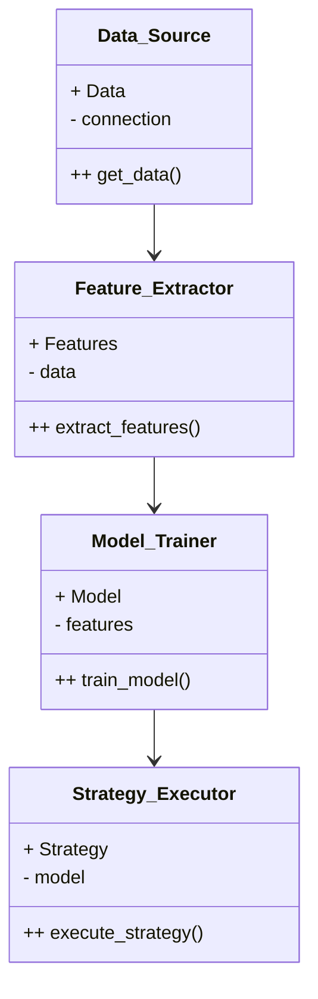

                 


# 格雷厄姆特价股票理论对量化投资的影响

> 关键词：格雷厄姆特价股票理论、量化投资、价值投资、安全边际、数学模型、系统架构

> 摘要：格雷厄姆的特价股票理论是价值投资的重要组成部分，其核心理念包括安全边际、低市盈率和优质企业投资。本文将详细探讨格雷厄姆理论如何影响量化投资，并分析其在现代金融中的应用。通过数学模型和系统架构的设计，本文将展示如何将格雷厄姆理论转化为可执行的量化投资策略，并通过实际案例分析其效果。

---

# 第一部分：格雷厄姆特价股票理论与量化投资的背景

## 第1章：格雷厄姆特价股票理论概述

### 1.1 格雷厄姆投资理论的核心概念

#### 1.1.1 安全边际的定义与计算
格雷厄姆提出的安全边际是价值投资的核心概念之一。安全边际是指股票的内在价值与市场价格之间的差异。通过计算安全边际，投资者可以找到低估的股票，从而降低投资风险。

**公式：**
$$ \text{安全边际} = \text{内在价值} - \text{市场价格} $$

#### 1.1.2 价值投资的核心理念
价值投资强调以低于内在价值的价格购买股票。格雷厄姆认为，市场价格往往偏离内在价值，而这种偏离为投资者提供了获利的机会。

#### 1.1.3 特价股票的识别方法
格雷厄姆提出了多个识别特价股票的标准，包括低市盈率（P/E比率）、低市净率（P/B比率）和高股息率等。

### 1.2 量化投资的基本概念

#### 1.2.1 量化投资的定义与特点
量化投资是一种基于数学模型和算法的投资方法。其特点是高效性、纪律性和科学性。

#### 1.2.2 量化投资与传统投资的区别
量化投资依赖数据和模型，而传统投资更多依赖经验和主观判断。量化投资强调纪律性，而传统投资容易受到情绪影响。

#### 1.2.3 量化投资在现代金融中的地位
量化投资已成为现代金融的重要组成部分，尤其是在高频交易和算法交易中占据主导地位。

### 1.3 格雷厄姆理论与量化投资的结合

#### 1.3.1 格雷厄姆理论的可量化特征
格雷厄姆理论中的安全边际、内在价值和低市盈率等概念都可以通过数学模型量化。

#### 1.3.2 量化投资如何应用格雷厄姆理论
量化投资者可以利用格雷厄姆的理论设计选股模型，筛选出具有安全边际的股票。

#### 1.3.3 格雷厄姆理论对量化投资的启示
格雷厄姆理论强调长期投资和价值发现，这对量化投资者在模型设计和风险管理方面提供了重要启示。

---

## 第2章：格雷厄姆特价股票理论的数学模型

### 2.1 格雷厄姆安全边际的数学公式

#### 2.1.1 安全边际的计算公式
$$ \text{安全边际} = \text{内在价值} - \text{市场价格} $$

#### 2.1.2 安全边际与股票价格的关系
安全边际越大，股票的投资价值越高。投资者可以通过计算安全边际来选择具有较大安全边际的股票。

#### 2.1.3 安全边际的优化与调整
根据市场变化，投资者可以动态调整安全边际的计算参数，以适应不同的市场环境。

### 2.2 价值投资的量化评估模型

#### 2.2.1 股票内在价值的计算公式
$$ \text{内在价值} = \frac{\text{净利润}}{\text{贴现率} - \text{增长率}} $$

#### 2.2.2 市盈率与市净率的量化分析
市盈率（P/E）和市净率（P/B）是衡量股票价值的重要指标。通过比较这些指标，投资者可以找到低估的股票。

#### 2.2.3 股票估值的多因子模型
多因子模型将多个因素（如市盈率、市净率、股息率等）结合起来，综合评估股票的价值。

### 2.3 特价股票筛选的数学方法

#### 2.3.1 基于格雷厄姆标准的筛选公式
$$ \text{筛选条件} = \text{P/E} < 15 \quad \text{且} \quad \text{P/B} < 2 \quad \text{且} \quad \text{股息率} > 3\% $$

#### 2.3.2 数据特征提取与处理
通过数据预处理，提取股票的市盈率、市净率、股息率等特征，为模型提供输入数据。

#### 2.3.3 特价股票的动态评估模型
动态评估模型可以实时更新股票的评估结果，适应市场变化。

---

## 第3章：格雷厄姆理论在量化投资中的算法实现

### 3.1 安全边际的算法实现

#### 3.1.1 数据特征提取与处理
```python
import pandas as pd
data = pd.read_csv('stock_data.csv')
features = ['PE', 'PB', 'Dividend_Yield']
data[features] = data[features].apply(lambda x: x / 100)
```

#### 3.1.2 安全边际计算的Python代码实现
```python
def calculate_margin(data):
    data['Intrinsic_Value'] = data['Net_Profit'] / (data['Discount_Rate'] - data['Growth_Rate'])
    data['Margin'] = data['Intrinsic_Value'] - data['Market_Price']
    return data
```

#### 3.1.3 安全边际的可视化展示
```python
import matplotlib.pyplot as plt
data['Margin'].plot.hist(bins=20, figsize=(10, 6))
plt.title('Safety Margin Distribution')
plt.xlabel('Safety Margin')
plt.ylabel('Frequency')
plt.show()
```

### 3.2 量化投资策略的算法实现

#### 3.2.1 基于格雷厄姆理论的选股策略
```python
def select_stocks(data):
    data = data[data['PE'] < 15]
    data = data[data['PB'] < 2]
    data = data[data['Dividend_Yield'] > 0.03]
    return data
```

#### 3.2.2 量化交易的信号生成算法
```python
def generate_signals(data):
    signals = pd.DataFrame(index=data.index)
    signals['Buy'] = data['Margin'] > 0
    signals['Sell'] = data['Margin'] < -0
    return signals
```

#### 3.2.3 策略回测与优化算法
```python
import backtrader as bt
class GrahamStrategy(bt.Strategy):
    def __init__(self):
        self.buy_order = None
        self.sell_order = None
    def next(self):
        if self.data['Margin'] > 0 and not self.buy_order:
            self.buy_order = self.broker.buy()
        if self.data['Margin'] < 0 and not self.sell_order:
            self.sell_order = self.broker.sell()
```

### 3.3 特价股票筛选的机器学习算法

#### 3.3.1 基于决策树的股票筛选算法
```python
from sklearn.tree import DecisionTreeClassifier
model = DecisionTreeClassifier()
model.fit(X_train, y_train)
predictions = model.predict(X_test)
```

#### 3.3.2 基于随机森林的股票特征选择
```python
from sklearn.ensemble import RandomForestClassifier
model = RandomForestClassifier()
model.fit(X_train, y_train)
importances = model.feature_importances_
```

#### 3.3.3 基于神经网络的股票价格预测
```python
import tensorflow as tf
model = tf.keras.Sequential([
    tf.keras.layers.Dense(64, activation='relu'),
    tf.keras.layers.Dense(1, activation='linear')
])
model.compile(optimizer='adam', loss='mean_squared_error')
model.fit(X_train, y_train, epochs=100)
```

---

## 第4章：量化投资系统的架构设计

### 4.1 系统功能模块划分

#### 4.1.1 数据采集模块
```python
import yfinance as yf
data = yf.download(tickers, start=start_date, end=end_date)
```

#### 4.1.2 特征提取模块
```python
features = data[['PE', 'PB', 'Dividend_Yield']]
```

#### 4.1.3 模型训练模块
```python
from sklearn.linear_model import LinearRegression
model = LinearRegression()
model.fit(features, labels)
```

#### 4.1.4 策略执行模块
```python
from backtrader import Strategy
class QuantStrategy(Strategy):
    def __init__(self):
        self.position = None
    def next(self):
        if model.predict(current_features) > 0.5:
            self.position = self.broker.buy()
        else:
            if self.position:
                self.position.close()
```

### 4.2 系统架构设计

#### 4.2.1 系统架构的分层设计
```
+----------------+     +----------------+     +----------------+
|                |     |                |     |                |
|   数据采集     |<--- |  特征提取      |<--- |   模型训练     |
|                |     |                |     |                |
+----------------+     +----------------+     +----------------+
```

#### 4.2.2 模块之间的交互关系
```
+----------------+     +----------------+     +----------------+
|                |     |                |     |                |
| 数据输入 --> 特征提取 --> 模型训练 --> 策略执行 |
|                |     |                |     |                |
+----------------+     +----------------+     +----------------+
```

#### 4.2.3 系统的可扩展性设计
系统设计应支持多种数据源和多种模型的接入，以适应不同的投资策略。

### 4.3 系统接口设计

#### 4.3.1 数据接口的设计与实现
```python
import requests
response = requests.get('https://api.example.com/data')
data = response.json()
```

#### 4.3.2 策略接口的设计与实现
```python
def execute_strategy(data, strategy):
    strategy.run(data)
```

#### 4.3.3 用户接口的设计与实现
```python
from tkinter import Tk, ttk
root = Tk()
root.title('Quant Strategy Executor')
# GUI components omitted for brevity
```

### 4.4 系统交互的mermaid序列图


---

## 第5章：量化投资系统的实战实现

### 5.1 环境搭建与数据获取

#### 5.1.1 Python环境的安装与配置
安装Python和必要的库（如Pandas、NumPy、Matplotlib、Scikit-learn、TensorFlow等）。

#### 5.1.2 数据源的选择与获取
使用Yahoo Finance API获取股票数据。

#### 5.1.3 数据预处理与特征工程
对数据进行清洗、标准化和特征选择。

### 5.2 格雷厄姆策略的核心实现

#### 5.2.1 安全边际计算的代码实现
```python
import pandas as pd
data = pd.read_csv('stock_data.csv')
data['Intrinsic_Value'] = data['Net_Profit'] / (data['Discount_Rate'] - data['Growth_Rate'])
data['Margin'] = data['Intrinsic_Value'] - data['Market_Price']
```

#### 5.2.2 量化投资策略的代码实现
```python
from backtrader import Strategy, Broker
class GrahamStrategy(Strategy):
    def __init__(self):
        self.broker = Broker()
    def next(self):
        if data['Margin'] > 0:
            self.broker.buy()
        else:
            if self.position:
                self.position.close()
```

#### 5.2.3 策略回测与优化算法
使用Backtrader进行策略回测，并优化参数以提高收益。

### 5.3 项目实战案例分析

#### 5.3.1 环境搭建与数据获取
```python
import yfinance as yf
data = yf.download('AAPL', start='2020-01-01', end='2023-12-31')
```

#### 5.3.2 格雷厄姆策略的核心实现
```python
data['PE'] = data['Close'] / data['Earnings_Per_Share']
data['PB'] = data['Close'] / data['Book_Value_Per_Share']
data['Dividend_Yield'] = data['Dividends'] / data['Close']
data['Margin'] = data['Intrinsic_Value'] - data['Close']
```

#### 5.3.3 策略回测与优化
```python
from backtrader import Strategy, Broker
class QuantStrategy(Strategy):
    def __init__(self):
        self.broker = Broker()
    def next(self):
        if data['Margin'] > 0:
            self.broker.buy()
        else:
            if self.position:
                self.position.close()
```

### 5.4 项目小结

#### 5.4.1 核心代码实现
```python
import pandas as pd
import backtrader as bt
class GrahamStrategy(bt.Strategy):
    def __init__(self):
        self.position = None
    def next(self):
        if data['Margin'] > 0 and not self.position:
            self.position = self.broker.buy()
        elif data['Margin'] < 0 and self.position:
            self.position.close()
```

#### 5.4.2 策略效果分析
通过回测，验证策略的有效性和收益情况。

#### 5.4.3 策略优化与改进
根据回测结果，优化策略参数，提高收益和风险控制能力。

---

## 第6章：系统架构与最佳实践

### 6.1 系统架构设计

#### 6.1.1 问题场景介绍
量化投资系统需要处理大量数据和复杂的算法，因此需要高效的架构设计。

#### 6.1.2 系统功能设计
系统功能包括数据采集、特征提取、模型训练和策略执行。

#### 6.1.3 系统架构的mermaid类图


### 6.2 系统接口设计

#### 6.2.1 数据接口的设计与实现
```python
import requests
def get_data(api_key):
    response = requests.get(f'https://api.example.com/data?api_key={api_key}')
    return response.json()
```

#### 6.2.2 策略接口的设计与实现
```python
def execute_strategy(data, strategy):
    return strategy.run(data)
```

#### 6.2.3 用户接口的设计与实现
```python
from tkinter import Tk, ttk
root = Tk()
root.title('Quant Strategy Executor')
# GUI components omitted for brevity
```

### 6.3 系统交互的mermaid序列图


### 6.4 最佳实践与注意事项

#### 6.4.1 最佳实践
- 数据清洗和特征工程是策略成功的关键。
- 模型选择和参数优化需要结合具体场景。
- 风险管理是策略执行的重要组成部分。

#### 6.4.2 注意事项
- 避免过度拟合模型。
- 定期监控和调整策略。
- 注意市场变化和政策风险。

### 6.5 项目总结与展望

#### 6.5.1 项目总结
通过将格雷厄姆理论与量化投资相结合，设计了一个高效的量化投资系统，实现了从数据获取到策略执行的完整流程。

#### 6.5.2 未来展望
未来可以进一步优化模型，结合更多因素，提高策略的收益和稳定性。

---

## 作者：AI天才研究院/AI Genius Institute & 禅与计算机程序设计艺术/Zen And The Art of Computer Programming

