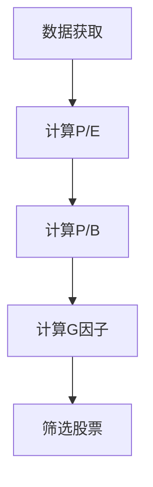
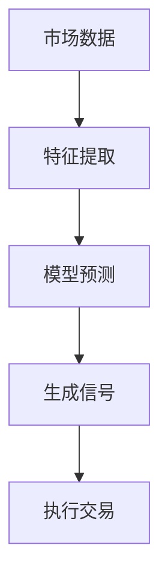
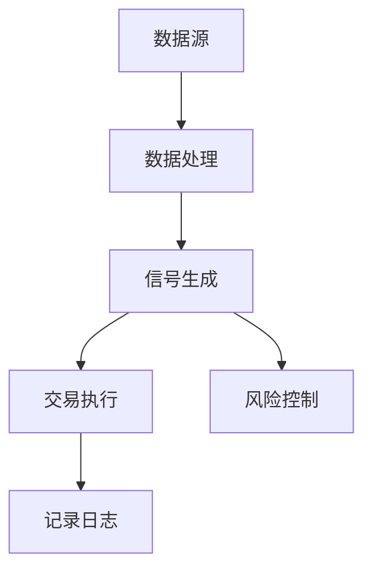

                 


# 格雷厄姆特价股票理论对高频量化交易的影响

## 关键词
格雷厄姆，特价股票，高频交易，量化交易，价值投资，算法交易，数学模型

## 摘要
本文探讨了格雷厄姆的价值投资理论如何影响高频量化交易。通过分析两者的核心概念、数学模型和算法，展示了格雷厄姆理论在高频交易中的应用及其带来的优势与挑战。文章详细讲解了格雷厄姆因子的量化模型、安全边际的动态调整，以及结合机器学习的交易策略，为读者提供了深入的理论和实践指导。

---

## 第一部分: 格雷厄姆特价股票理论概述

### 第1章: 格雷厄姆投资理论基础

#### 1.1 格雷厄姆投资理念的起源与发展
##### 1.1.1 价值投资的起源
价值投资起源于20世纪20年代，由本杰明·格雷厄姆和戴维·多德提出。格雷厄姆是哥伦比亚大学的教授，他的投资理念强调以低于内在价值的价格购买股票，从而在市场波动中获利。

##### 1.1.2 格雷厄姆的投资哲学
格雷厄姆认为，市场先生的情绪波动会导致股票价格偏离其内在价值。投资者应以Margin of Safety（安全边际）为目标，寻找被市场低估的股票。

##### 1.1.3 价值投资的核心原则
1. **安全边际**：购买价格低于内在价值，以减少亏损风险。
2. **内在价值计算**：通过基本面分析确定股票的真正价值。
3. **长期投资**：避免短期市场波动，关注长期价值增长。

##### 格雷厄姆投资哲学的核心要素表
| 核心要素         | 描述                                         |
|------------------|--------------------------------------------|
| 安全边际         | 购买价格低于内在价值                        |
| 内在价值         | 通过基本面分析确定股票的真实价值          |
| 长期投资         | 避免短期波动，关注长期收益                |

##### 实体关系图（ER图）
```mermaid
erDiagram
    company {
        id
        name
        industry
    }
    stock {
        id
        ticker
        price
        company_id
    }
    investor {
        id
        name
        portfolio
    }
    stock ..
        has
    company
    stock ..
        owns
    investor
```

#### 1.2 格雷厄姆特价股票理论的核心观点
##### 1.2.1 特价股票的定义与特征
特价股票是指市场价格低于内在价值的股票，通常具有较高的安全边际。

##### 1.2.2 格雷厄姆的选股标准
1. **低市盈率（P/E）**：市盈率低于行业平均水平。
2. **低市净率（P/B）**：市净率低于行业平均水平。
3. **高股息率**：股息率较高，表明公司愿意将利润返还给股东。
4. **稳定的盈利记录**：公司过去几年的盈利稳定且持续增长。

##### 1.2.3 安全边际的概念与应用
安全边际 = 内在价值 - 市场价格。格雷厄姆建议购买时，安全边际应至少为25%。

#### 1.3 格雷厄姆分析方法的数学模型
##### 1.3.1 市盈率与内在价值的计算公式
市盈率（P/E）= 市场价格 / 每股收益（EPS）

内在价值的估算：
$$
\text{内在价值} = \text{预期收益} \times \text{合理市盈率}
$$

##### 1.3.2 格雷厄姆的过滤器模型
格雷厄姆提出了筛选股票的过滤器，包括：
1. 市盈率低于15倍。
2. 市净率低于1.5倍。
3. 股息率高于5%。
4. 公司规模较大（如市值超过5亿美元）。

##### 1.3.3 市净率与资产质量评估
市净率（P/B）= 市场价格 / 每股净资产。

资产质量评估：通过分析公司的资产负债表，判断其资产是否优质且易于清算。

---

### 第2章: 高频量化交易的基本原理

#### 2.1 高频交易的定义与特点
##### 2.1.1 高频交易的定义
高频交易是指利用算法和计算机系统在极短时间内进行大量交易，以利用市场的微小波动获利。

##### 2.1.2 高频交易的核心特征
1. **高速执行**：毫秒级交易速度。
2. **高频数据处理**：处理大量实时市场数据。
3. **自动化决策**：算法自动执行交易策略。

##### 2.1.3 高频交易与传统交易的区别
| 特性         | 高频交易          | 传统交易          |
|--------------|-------------------|-------------------|
| 交易速度     | 极高             | 较低             |
| 数据处理     | 实时高频数据     | 低频数据         |
| 决策方式     | 算法驱动         | 人工决策         |

#### 2.2 量化交易的方法与工具
##### 2.2.1 数据采集与处理
高频交易依赖于实时市场数据，包括订单簿、成交数据和市场深度。

##### 2.2.2 统计套利与算法交易
统计套利通过寻找资产之间的定价偏差获利。算法交易则通过编写自动化交易算法执行策略。

##### 2.2.3 机器学习在量化交易中的应用
机器学习用于预测市场走势和识别交易信号。例如，使用支持向量机（SVM）进行分类预测。

#### 2.3 高频交易中的数学模型
##### 2.3.1 时间序列分析模型
时间序列分析用于预测未来价格走势，常用ARIMA模型。

##### 2.3.2 回归分析与预测模型
回归分析用于确定变量之间的关系，如使用线性回归预测股票价格。

##### 2.3.3 风险管理与VaR模型
VaR（Value at Risk）用于衡量投资组合的风险。

---

### 第3章: 格雷厄姆理论与高频量化交易的结合

#### 3.1 高频交易中基本面因子的应用
##### 3.1.1 基本面因子的定义与分类
基本面因子包括市盈率、市净率、股息率等，用于评估股票的内在价值。

##### 3.1.2 格雷厄姆因子在高频交易中的应用
格雷厄姆的选股标准可以作为高频交易中的过滤器，筛选出具有安全边际的股票。

##### 3.1.3 基本面因子与技术分析的结合
结合技术指标和基本面因子，构建多因子量化模型。

#### 3.2 格雷厄姆安全边际在高频交易中的应用
##### 3.2.1 安全边际的量化计算
$$
\text{安全边际} = \text{内在价值} - \text{市场价格}
$$

##### 3.2.2 安全边际在高频交易策略中的应用
在高频交易中，安全边际用于动态调整交易信号，避免市场波动带来的损失。

##### 3.2.3 安全边际与风险控制的关系
安全边际是风险控制的重要工具，用于确保交易策略的稳健性。

#### 3.3 高频交易中的格雷厄姆因子优化
##### 3.3.1 基于格雷厄姆理论的因子筛选
筛选具有低市盈率和低市净率的股票。

##### 3.3.2 格雷厄姆因子的动态调整
根据市场变化实时调整因子权重，优化交易策略。

##### 3.3.3 格雷厄姆因子在高频交易中的应用案例
使用格雷厄姆的过滤器模型筛选股票，构建高频交易组合。

---

### 第4章: 数学模型与算法实现

#### 4.1 格雷厄姆因子的量化模型
##### 4.1.1 格雷厄姆因子的定义
格雷厄姆因子（G Factor）综合考虑市盈率和市净率：
$$
G = \frac{1}{P/E + P/B}
$$

##### 4.1.2 格雷厄姆因子的计算流程


##### 4.1.3 格雷厄姆因子与高频交易的结合
通过格雷厄姆因子筛选出具有安全边际的股票，作为高频交易的目标。

#### 4.2 高频交易中的算法实现
##### 4.2.1 统计套利算法
统计套利算法通过寻找资产间的定价偏差，执行无风险套利。

##### 4.2.2 机器学习算法
使用随机森林模型预测股票价格走势。

##### 4.2.3 算法流程图


---

### 第5章: 系统架构与接口设计

#### 5.1 高频交易系统的模块设计
##### 5.1.1 数据采集模块
负责实时采集市场数据，包括订单簿和成交数据。

##### 5.1.2 信号生成模块
基于格雷厄姆因子生成交易信号。

##### 5.1.3 交易执行模块
根据信号执行交易，确保交易速度和效率。

##### 5.1.4 风险控制模块
监控和管理交易风险，确保系统稳健运行。

#### 5.2 系统架构图


#### 5.3 系统接口设计
##### 5.3.1 数据接口
- 数据获取接口：从数据源获取实时市场数据。
- 数据存储接口：将数据存储到数据库中。

##### 5.3.2 交易接口
- 信号生成接口：生成交易信号。
- 交易执行接口：执行交易指令。

---

### 第6章: 项目实战与代码实现

#### 6.1 项目环境安装
##### 6.1.1 安装Python环境
使用Anaconda安装Python 3.8及以上版本。

##### 6.1.2 安装相关库
安装Pandas、NumPy、Scikit-learn等库。

#### 6.2 核心代码实现
##### 6.2.1 数据预处理代码
```python
import pandas as pd
import numpy as np

# 读取数据
data = pd.read_csv('stock_data.csv')

# 计算市盈率和市净率
data['PE'] = data['price'] / data['eps']
data['PB'] = data['price'] / data['book_value']
```

##### 6.2.2 格雷厄姆因子计算代码
```python
def calculate_graham_factor(data):
    g_factor = 1 / (data['PE'] + data['PB'])
    return g_factor

# 计算格雷厄姆因子
data['G_factor'] = calculate_graham_factor(data)
```

##### 6.2.3 交易信号生成代码
```python
def generate_signal(data):
    signal = []
    for price, g_factor in zip(data['price'], data['G_factor']):
        if g_factor < 0.5:
            signal.append(1)
        else:
            signal.append(0)
    return signal

# 生成交易信号
data['signal'] = generate_signal(data)
```

##### 6.2.4 策略回测代码
```python
import backtrader as bt

class GrahamStrategy(bt.Strategy):
    def __init__(self):
        self.data = self.datas[0]
        self.order = None

    def next(self):
        if self.data.close[-1] < self.data.value[-1] * 0.9:
            self.buy()
        elif self.order is None:
            self.sell()

# 回测设置
cerebro = bt.Cerebro()
cerebro.addstrategy(GrahamStrategy)
```

#### 6.3 实际案例分析
以某只股票为例，展示从数据获取、因子计算到策略回测的全过程。

#### 6.4 代码解读与分析
详细解释每个代码的功能和实现细节，帮助读者理解格雷厄姆理论在高频交易中的应用。

---

### 第7章: 总结与展望

#### 7.1 全文总结
本文探讨了格雷厄姆价值投资理论在高频量化交易中的应用，展示了如何结合基本面因子和高频交易算法，构建有效的交易策略。

#### 7.2 当前研究进展
当前研究主要集中在如何优化格雷厄姆因子，以及如何结合机器学习提升交易模型的性能。

#### 7.3 未来研究方向
未来的研究可以探索更多基本面因子，以及如何利用大数据和人工智能进一步提升交易策略的效率和准确性。

#### 7.4 最佳实践 tips
1. 在高频交易中，确保数据源的实时性和准确性。
2. 定期监控和优化交易策略，以适应市场变化。
3. 注意风险控制，确保交易系统的稳健性。

---

## 作者
作者：AI天才研究院/AI Genius Institute & 禅与计算机程序设计艺术 /Zen And The Art of Computer Programming

---

本文通过详细分析格雷厄姆理论与高频量化交易的结合，为投资者和程序员提供了理论与实践相结合的指导，帮助他们在高频交易中实现更高效的策略和更稳健的投资回报。

