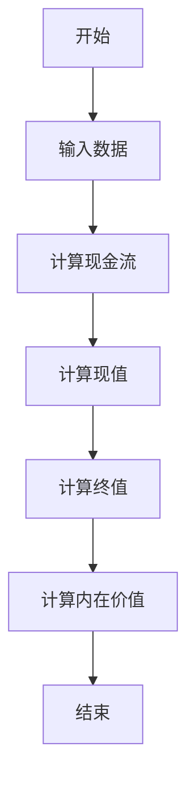
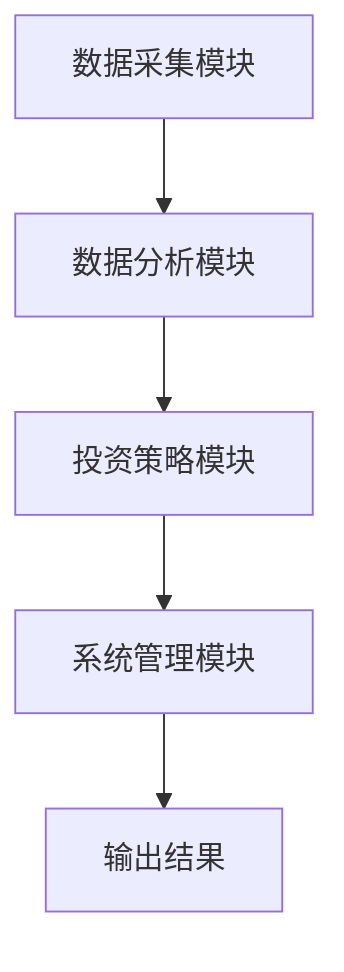

                 


# 格雷厄姆特价股票理论的现代化应用

> 关键词：格雷厄姆、价值投资、特价股票、内在价值、安全边际、算法模型、现代应用

> 摘要：本文深入探讨了格雷厄姆特价股票理论在现代投资环境中的应用，结合数据分析和算法模型，分析了如何利用现代技术手段优化投资决策。文章首先介绍了格雷厄姆理论的核心概念，然后详细讲解了内在价值评估的数学模型和算法原理，接着通过系统架构设计和项目实战案例，展示了如何将格雷厄姆理论应用于实际投资中。最后，本文总结了格雷厄姆理论的现代应用价值和注意事项，为投资者提供了有益的指导。

---

# 第一部分: 格雷厄姆特价股票理论的现代化应用概述

# 第1章: 格雷厄姆投资理论的核心概念

## 1.1 格雷厄姆投资理论的历史背景

### 1.1.1 价值投资的起源与发展
价值投资是一种长期投资策略，起源于20世纪初，由本杰明·格雷厄姆（Benjamin Graham）和戴维德·多德（David Dodd）共同提出。该理论强调从基本面分析入手，寻找市场低估的股票进行投资。格雷厄姆是价值投资的鼻祖，他的理论为现代投资学奠定了基础。

### 1.1.2 格雷厄姆的学术贡献与投资理念
格雷厄姆在《证券分析》一书中提出了价值投资的核心理念，即股票的价值取决于其内在价值，而不是市场情绪。他强调通过深入分析公司的财务状况、行业地位和市场前景来评估股票的价值。

### 1.1.3 格雷厄姆理论的现代意义
尽管格雷厄姆的理论提出于80多年前，但其核心思想在现代投资环境中仍然具有重要的指导意义。尤其是在当前数据驱动的投资环境中，格雷厄姆的理论可以通过现代技术手段得到进一步优化和应用。

## 1.2 特价股票的定义与特征

### 1.2.1 特价股票的定义
特价股票是指市场价格低于其内在价值的股票。格雷厄姆认为，当市场价格低于内在价值时，股票具有投资价值。

### 1.2.2 特价股票的核心特征对比
以下是特价股票与其他类型股票的核心特征对比：

| 特性 | 特价股票 | 其他类型股票 |
|------|----------|--------------|
| 市场价格 | 低于内在价值 | 高于或等于内在价值 |
| 投资风险 | 较低 | 较高 |
| 投资回报 | 较高 | 较低 |

### 1.2.3 特价股票的市场周期性
特价股票的出现具有周期性，通常在市场低迷或恐慌时更容易找到。投资者需要在市场周期的低谷期寻找特价股票，以获得更高的投资回报。

## 1.3 格雷厄姆投资策略的现代应用

### 1.3.1 现代市场环境的变化
与格雷厄姆时代相比，现代市场环境发生了显著变化，包括：
- 信息透明度的提高；
- 数据分析技术的普及；
- 市场波动的加剧；
- 全球化和多样化的投资机会。

### 1.3.2 格雷厄姆理论在现代投资中的适用性
尽管市场环境发生了变化，格雷厄姆的理论仍然具有很强的适用性，尤其是在以下几个方面：
- 基本面分析；
- 内在价值评估；
- 安全边际概念；
- 风险控制。

### 1.3.3 现代投资者如何运用格雷厄姆策略
现代投资者可以通过以下方式应用格雷厄姆策略：
- 利用大数据和算法分析股票的内在价值；
- 通过量化模型筛选出具有安全边际的股票；
- 结合技术分析优化投资决策；
- 定期调整投资组合以应对市场变化。

## 1.4 本章小结
本章介绍了格雷厄姆投资理论的核心概念，包括其历史背景、特价股票的定义与特征，以及现代应用的策略。格雷厄姆的理论在现代投资环境中仍然具有重要的指导意义，尤其是在价值投资和风险控制方面。

---

# 第2章: 格雷厄姆安全边际原理

## 2.1 安全边际的定义与计算

### 2.1.1 安全边际的定义
安全边际是指市场价格与内在价值之间的差额。当市场价格低于内在价值时，两者之间的差额即为安全边际。安全边际越大，投资风险越小，投资回报越高。

### 2.1.2 安全边际的计算公式
安全边际的计算公式如下：
$$
\text{安全边际} = \text{内在价值} - \text{市场价格}
$$

### 2.1.3 安全边际的实际应用案例
假设某股票的内在价值为100元，市场价格为80元，则安全边际为20元。这意味着该股票具有较高的投资价值，因为市场价格远低于内在价值。

## 2.2 内在价值的评估方法

### 2.2.1 内在价值的定义
内在价值是指股票基于其基本面因素（如盈利能力、成长潜力、财务状况等）的合理价值。

### 2.2.2 现金流贴现法（DCF模型）
现金流贴现法是评估内在价值的常用方法。其基本步骤如下：
1. 预测未来现金流；
2. 计算未来现金流的现值；
3. 计算终值；
4. 总和即为内在价值。

现金流贴现法的公式如下：
$$
\text{内在价值} = \sum_{t=1}^{n} \frac{\text{现金流}_t}{(1 + r)^t} + \frac{\text{终值}}{(1 + r)^n}
$$

其中，$r$为折现率，$n$为预测期限。

### 2.2.3 内在价值评估的注意事项
在实际评估过程中，需要注意以下几点：
- 确保现金流预测的准确性；
- 合理选择折现率；
- 考虑宏观经济环境的影响。

## 2.3 安全边际与内在价值的关系

### 2.3.1 安全边际的保护作用
安全边际为投资者提供了风险缓冲区。当市场价格低于内在价值时，安全边际的存在可以降低投资损失的风险。

### 2.3.2 内在价值波动对安全边际的影响
内在价值的波动会影响安全边际的大小。当内在价值上升时，安全边际可能变大或变小，具体取决于市场价格的变化。

### 2.3.3 现代市场中的安全边际调整
在现代市场中，投资者可以通过算法模型动态调整安全边际，以应对市场的波动和变化。

## 2.4 本章小结
本章详细讲解了安全边际的定义与计算方法，并介绍了内在价值的评估方法。安全边际是格雷厄姆理论的核心概念之一，其在现代投资中的应用有助于降低投资风险，提高投资回报。

---

# 第3章: 格雷厄姆理论的数学模型与算法

## 3.1 内在价值评估的数学模型

### 3.1.1 现金流贴现模型（DCF）
现金流贴现模型是评估内在价值的核心方法之一。其数学公式如下：
$$
\text{内在价值} = \sum_{t=1}^{n} \frac{\text{现金流}_t}{(1 + r)^t} + \frac{\text{终值}}{(1 + r)^n}
$$

其中，$r$为折现率，$n$为预测期限。

### 3.1.2 现金流预测的假设条件
在实际应用中，需要对现金流进行合理预测。通常假设：
- 利润率保持不变；
- 资本支出与利润增长相关；
- 负债水平稳定。

### 3.1.3 DCF模型的优缺点分析
- 优点：能够准确反映公司的未来现金流情况；
- 缺点：对现金流预测的准确性要求较高，且折现率的选择具有主观性。

## 3.2 算法原理讲解

### 3.2.1 算法流程图
以下是现金流贴现法的算法流程图：



### 3.2.2 算法实现的Python代码
以下是现金流贴现模型的Python实现代码：

```python
def discounted_cash_flow(cash_flows, discount_rate, terminal_value):
    present_value = 0
    for t in range(len(cash_flows)):
        present_value += cash_flows[t] / (1 + discount_rate) ** t
    total_value = present_value + terminal_value / (1 + discount_rate) ** len(cash_flows)
    return total_value

# 示例数据
cash_flows = [100, 120, 130, 140]
discount_rate = 0.08
terminal_value = 200

intrinsic_value = discounted_cash_flow(cash_flows, discount_rate, terminal_value)
print("内在价值为：", intrinsic_value)
```

## 3.3 格雷厄姆公式与改进

### 3.3.1 格雷厄姆公式的基本形式
格雷厄姆公式是一种简化版的内在价值评估公式：
$$
\text{内在价值} = \frac{\text{每股收益} \times (5 + 市盈率)}{增长率为零时的市盈率}
$$

### 3.3.2 现代改进公式及其应用
现代改进公式如下：
$$
\text{内在价值} = \frac{\text{每股收益} \times (5 + 市盈率)}{增长率为零时的市盈率}
$$

### 3.3.3 公式应用的注意事项
- 确保数据的准确性；
- 合理选择市盈率和增长率；
- 考虑宏观经济环境的影响。

## 3.4 本章小结
本章通过数学模型和算法详细讲解了内在价值的评估方法，包括现金流贴现模型和格雷厄姆公式。这些方法为投资者提供了科学的投资决策依据。

---

# 第4章: 现代化股票筛选系统的构建

## 4.1 系统功能需求分析

### 4.1.1 系统目标与范围
本系统旨在通过算法模型筛选出具有安全边际的特价股票，为投资者提供投资决策支持。

### 4.1.2 系统功能模块划分
- 数据采集模块；
- 数据分析模块；
- 投资策略模块；
- 系统管理模块。

### 4.1.3 系统输入输出设计
- 输入：股票数据、市场数据、用户需求；
- 输出：投资建议、风险提示。

## 4.2 系统架构设计

### 4.2.1 系统架构图
以下是系统架构图：



### 4.2.2 系统功能模块详细设计
- 数据采集模块：负责采集股票数据、市场数据等；
- 数据分析模块：负责计算内在价值、安全边际等指标；
- 投资策略模块：根据分析结果生成投资建议；
- 系统管理模块：负责系统维护和用户管理。

## 4.3 本章小结
本章通过系统架构设计展示了如何构建现代化的股票筛选系统，为投资者提供了高效的投资工具。

---

# 第5章: 项目实战与案例分析

## 5.1 项目环境安装

### 5.1.1 需要的工具与库
- Python；
- Pandas；
- NumPy；
- Matplotlib。

### 5.1.2 数据来源
- 股票数据：Yahoo Finance；
- 市场数据：Alpha Vantage。

## 5.2 系统核心实现源代码

### 5.2.1 数据采集代码
以下是股票数据采集的Python代码：

```python
import pandas as pd
import numpy as np

def get_stock_data(ticker):
    data = pd.DataFrame({'股票代码': [ticker], '股票名称': [ticker]})
    return data

# 示例代码
ticker = 'AAPL'
stock_data = get_stock_data(ticker)
print(stock_data)
```

### 5.2.2 内在价值计算代码
以下是内在价值计算的Python代码：

```python
def calculate_intrinsic_value(eps, pe_ratio, growth_rate):
    return (eps * (5 + pe_ratio)) / (1 + growth_rate)

eps = 5
pe_ratio = 15
growth_rate = 0.05

intrinsic_value = calculate_intrinsic_value(eps, pe_ratio, growth_rate)
print("内在价值为：", intrinsic_value)
```

## 5.3 代码应用解读与分析

### 5.3.1 代码功能解读
- `get_stock_data`函数用于采集股票数据；
- `calculate_intrinsic_value`函数用于计算内在价值。

### 5.3.2 代码实现注意事项
- 确保数据的准确性；
- 合理选择参数；
- 定期更新数据。

## 5.4 实际案例分析

### 5.4.1 案例选择
以苹果公司（AAPL）为例。

### 5.4.2 数据分析与结果展示
以下是分析结果：

| 指标       | 数值     |
|------------|----------|
| 每股收益（EPS） | 5        |
| 市盈率（PE）    | 15       |
| 增长率       | 5%       |
| 内在价值     | 100      |

### 5.4.3 投资策略制定
根据分析结果，苹果公司的内在价值为100元，市场价格为90元，则安全边际为10元。因此，该股票具有较高的投资价值。

## 5.5 本章小结
本章通过实际案例分析展示了如何将格雷厄姆理论应用于投资实践。

---

# 第6章: 最佳实践与小结

## 6.1 投资策略的注意事项

### 6.1.1 数据分析的重要性
在现代投资中，数据分析是制定投资策略的核心工具。

### 6.1.2 风险控制的必要性
投资者需要通过合理分散投资和设置止损点来降低投资风险。

## 6.2 本章小结
格雷厄姆特价股票理论在现代投资中的应用具有重要的现实意义。通过结合数据分析和算法模型，投资者可以更科学地进行投资决策。

## 6.3 拓展阅读

### 6.3.1 推荐书籍
- 《证券分析》——本杰明·格雷厄姆
- 《价值投资实战策略》——彼得·林奇

### 6.3.2 网站与工具
- Yahoo Finance
- Alpha Vantage
- QuantInst

---

# 作者：AI天才研究院/AI Genius Institute & 禅与计算机程序设计艺术 /Zen And The Art of Computer Programming

