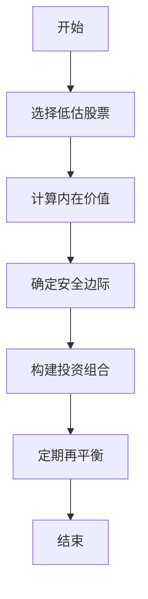
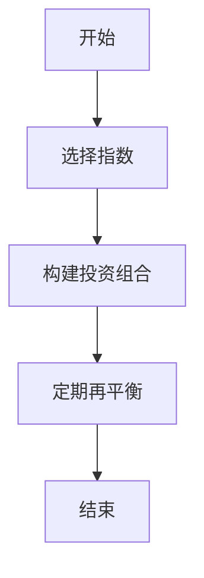
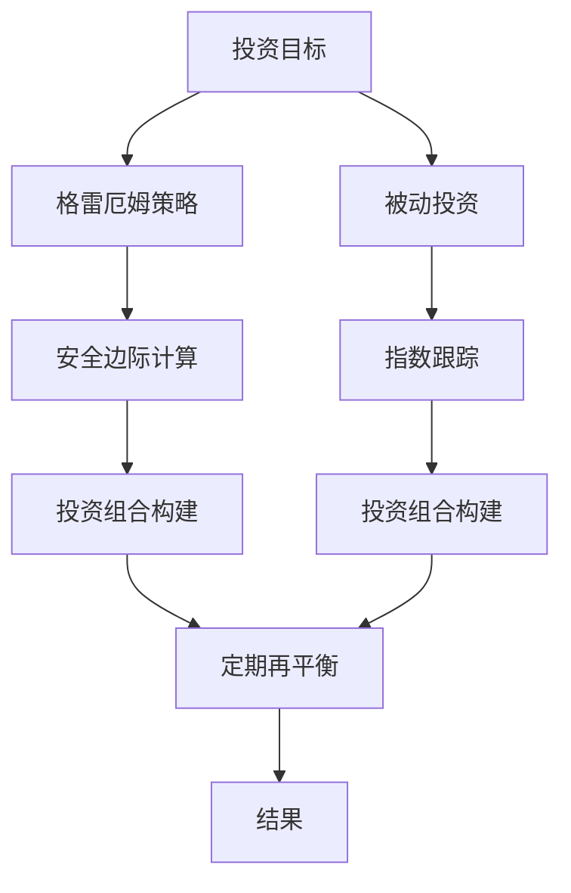

                 


# 《格雷厄姆特价股票策略与被动投资的比较》

---

## 关键词：
- 格雷厄姆投资策略
- 被动投资
- 股票投资
- 安全边际
- 投资组合
- 数学模型

---

## 摘要：
本文系统地比较了格雷厄姆的特价股票策略与被动投资策略在理论基础、操作方法、风险收益等方面的核心差异。通过分析格雷厄姆策略的选股原则、安全边际计算以及被动投资的指数化策略，结合实际案例和数学模型，揭示了两种策略在不同市场环境下的适用性与优劣势。最终，本文为投资者提供了在选择投资策略时的重要参考，并提出了结合两者优势的综合投资思路。

---

# 第一部分: 格雷厄姆特价股票策略的核心理念与实践

---

## 第1章: 格雷厄姆投资策略的背景与发展

### 1.1 投资的基本概念与目标
- 1.1.1 投资的定义与分类
- 1.1.2 投资的基本目标与风险
- 1.1.3 股票投资的核心要素

### 1.2 格雷厄姆投资策略的起源与发展
- 1.2.1 本杰明·格雷厄姆的生平简介
- 1.2.2 格雷厄姆投资理论的核心思想
  - 安全边际的概念
  - 价值投资的核心原则
  - 非有效市场假设
- 1.2.3 格雷厄姆策略的现代应用
  - 格雷厄姆策略的现代变形
  - 现代投资者如何应用格雷厄姆策略

---

## 第2章: 格雷厄姆投资策略的理论基础

### 2.1 格雷厄姆的投资理念
- 2.1.1 安全边际的概念与计算
  - 安全边际的定义
  - 安全边际的计算公式
  - 安全边际与股票价格的关系
- 2.1.2 股票的内在价值评估
  - 内在价值的定义
  - 内在价值的计算方法
  - 格雷厄姆的估值公式
- 2.1.3 股票市场的波动性与非理性
  - 市场波动的周期性
  - 投资者情绪的影响
  - 非理性决策的后果

---

## 第3章: 格雷厄姆策略的数学模型与公式

### 3.1 格雷厄姆策略的核心公式
- 3.1.1 安全边际计算公式
  $$ \text{安全边际} = \text{内在价值} \times (1 - \text{折扣率}) $$
- 3.1.2 市盈率与市净率的计算
  $$ \text{市盈率} = \frac{\text{股价}}{\text{每股收益}} $$
  $$ \text{市净率} = \frac{\text{股价}}{\text{每股净资产}} $$
- 3.1.3 格雷厄姆的筛选标准
  $$ \text{筛选条件} = \text{市盈率} < 15 \quad \text{且} \quad \text{市净率} < 2 $$

---

# 第二部分: 被动投资的理论与实践

---

## 第4章: 被动投资的定义与特点

### 4.1 被动投资的定义
- 被动投资的核心概念
- 被动投资与主动投资的区别

### 4.2 被动投资的特点
- 被动投资的低成本优势
- 被动投资的分散化特征
- 被动投资的长期持有策略

---

## 第5章: 被动投资的兴起与发展趋势

### 5.1 被动投资的兴起背景
- 机构投资者的兴起
- 低成本投资工具的发展
- 技术进步对投资的影响

### 5.2 被动投资的现代发展趋势
- 指数基金的普及
- ETF（交易所交易基金）的兴起
- 被动投资在全球市场的应用

---

## 第6章: 被动投资的数学模型与公式

### 6.1 被动投资的核心公式
- 6.1.1 指数跟踪误差的计算
  $$ \text{跟踪误差} = \sqrt{\text{残差方差}} $$
- 6.1.2 投资组合的预期收益
  $$ \text{预期收益} = \sum_{i=1}^{n} w_i \times r_i $$
- 6.1.3 投资组合的风险衡量
  $$ \text{风险} = \text{标准差} = \sqrt{\sum_{i=1}^{n} w_i^2 \sigma_i^2 + \sum_{i \neq j} w_i w_j \sigma_{ij}} $$

---

# 第三部分: 格雷厄姆策略与被动投资的比较分析

---

## 第7章: 格雷厄姆策略与被动投资的核心概念对比

### 7.1 核心概念对比表
| 核心概念       | 格雷厄姆策略               | 被动投资                     |
|----------------|--------------------------|-----------------------------|
| 理论基础       | 价值投资与安全边际       | 市场有效与指数化              |
| 投资目标       | 寻找被低估的股票           | 持有市场指数                 |
| 操作方式       | 主动选股与安全边际计算     | 被动跟踪指数                 |
| 风险管理       | 通过安全边际降低风险       | 通过分散化降低风险           |
| 成本           | 高交易成本与研究成本       | 低成本                      |

### 7.2 核心概念的ER实体关系图
```mermaid
erDiagram
    安全边际<----(拥有)---- 格雷厄姆策略
    市场指数<----(跟踪)---- 被动投资
    股票池       : 格雷厄姆策略, 被动投资
    股票池       : 市场指数, 安全边际
```

---

## 第8章: 格雷厄姆策略与被动投资的算法原理对比

### 8.1 格雷厄姆策略的算法流程图


### 8.2 被动投资的算法流程图


---

## 第9章: 格雷厄姆策略与被动投资的系统架构对比

### 9.1 系统架构图


---

# 第四部分: 综合策略与风险管理

---

## 第10章: 格雷厄姆策略与被动投资的综合应用

### 10.1 综合策略的核心思想
- 结合格雷厄姆策略的安全边际与被动投资的分散化优势
- 在不同市场环境下灵活调整投资策略
- 通过组合投资降低风险

### 10.2 综合策略的实施步骤
1. 确定投资目标与风险承受能力
2. 构建基于格雷厄姆策略的股票组合
3. 补充被动投资指数基金以分散风险
4. 定期调整与再平衡

---

## 第11章: 格雷厄姆策略与被动投资的风险管理

### 11.1 格雷厄姆策略的风险
- 市场整体低估时的流动性风险
- 个股选择的错误风险
- 市场波动对安全边际的影响

### 11.2 被动投资的风险
- 市场下跌时的系统性风险
- 指数跟踪误差的影响
- 税务与费用成本

### 11.3 综合策略的风险管理
- 通过组合投资降低风险
- 定期监控与调整
- 风险分散化与流动性管理

---

## 第12章: 格雷厄姆策略与被动投资的案例分析

### 12.1 格雷厄姆策略的经典案例
- 案例1：可口可乐的低估投资
- 案例2：IBM的低估投资

### 12.2 被动投资的案例分析
- 案例1：标普500指数基金的长期表现
- 案例2：Vanguard指数基金的长期表现

---

## 第13章: 未来展望与投资者建议

### 13.1 未来投资环境的展望
- 人工智能对投资的影响
- 新兴市场的投资机会
- 可持续投资与ESG因素

### 13.2 对投资者的建议
- 根据自身情况选择合适的投资策略
- 结合主动与被动投资的优势
- 长期持有与定期再平衡

---

## 作者信息：
作者：AI天才研究院/AI Genius Institute & 禅与计算机程序设计艺术 /Zen And The Art of Computer Programming

