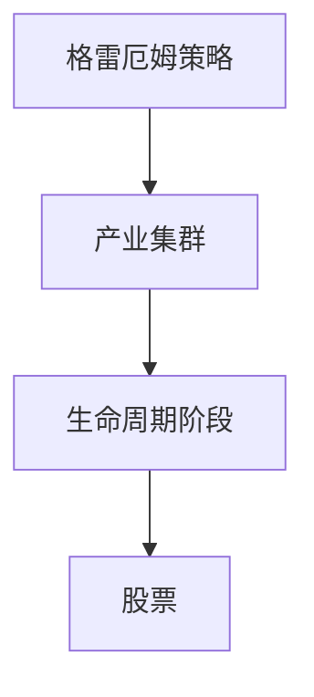
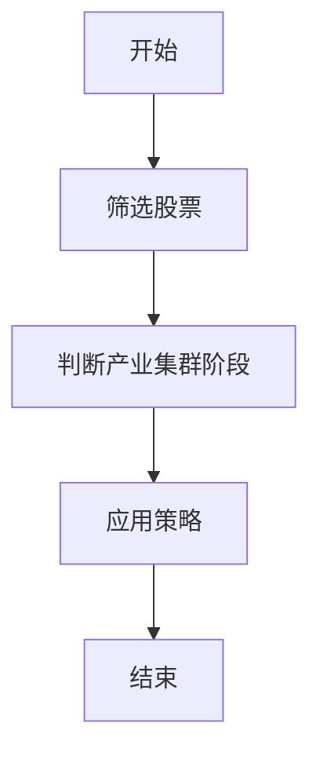
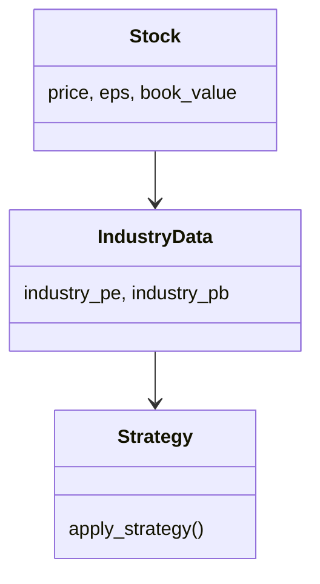
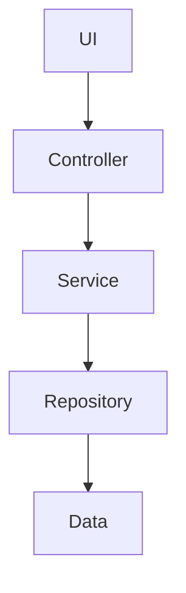

                 


# 格雷厄姆特价股票策略在不同产业集群生命周期的效果

## 关键词：格雷厄姆，特价股票，产业集群，生命周期，投资策略

## 摘要：本文探讨格雷厄姆的特价股票策略在不同产业集群生命周期中的应用效果。通过分析产业集群的各个阶段，揭示格雷厄姆策略的有效性，并结合数学模型和实际案例，提出投资建议。

---

## 第一部分：背景介绍

### 第1章：格雷厄姆特价股票策略概述

#### 1.1 格雷厄姆投资理论的核心概念

- **价值投资**：寻找市场低估的股票，长期持有，等待价值回归。
- **特价股票**：市盈率和市净率低于行业平均水平的股票。
- **安全边际**：以低于内在价值的价格买入股票，降低风险。

#### 1.2 产业集群生命周期的概念

- **产业集群**：相关企业在地理和产业上的集中，如硅谷的科技企业集群。
- **生命周期阶段**：导入期、成长期、成熟期、衰退期。
- **阶段特征**：
  - 导入期：技术创新，市场拓展。
  - 成长期：市场需求增长，企业扩张。
  - 成熟期：市场饱和，竞争加剧。
  - 衰退期：技术落后，需求下降。

---

## 第二部分：核心概念与联系

### 第2章：格雷厄姆策略与产业集群生命周期的关系

#### 2.1 核心概念的原理分析

- **格雷厄姆策略的数学模型**：
  - 市盈率：$$PE = \frac{股票价格}{每股收益}$$
  - 市净率：$$PB = \frac{股票价格}{每股净资产}$$
  - 标准：$PE < 行业平均PE$ 且 $PB < 行业平均PB$。

- **产业集群生命周期阶段**：
  - 导入期：技术创新，股票可能低估。
  - 成长期：增长潜力大，但估值可能偏高。
  - 成熟期：稳定增长，估值合理。
  - 衰退期：估值可能低估，但行业前景黯淡。

#### 2.2 核心概念的属性对比

| 阶段       | 格雷厄姆策略适用性 | 特点                                   |
|------------|--------------------|---------------------------------------|
| 导入期     | 高                | 技术创新，股票可能低估                 |
| 成长期     | 中                | 增长快，估值可能偏高                   |
| 成熟期     | 中                | 稳定，估值合理                         |
| 衰退期     | 低                | 估值可能低估，但前景差                 |

#### 2.3 ER实体关系图



---

## 第三部分：算法原理讲解

### 第3章：格雷厄姆策略的算法实现

#### 3.1 算法原理

- **步骤**：
  1. 筛选市盈率和市净率低于行业平均的股票。
  2. 分析产业集群生命周期阶段。
  3. 结合阶段判断策略适用性。

- **Mermaid流程图**：



#### 3.2 Python代码实现

```python
def calculate_pe(stock_price, earnings_per_share):
    return stock_price / earnings_per_share

def calculate_pb(stock_price, book_value_per_share):
    return stock_price / book_value_per_share

def graham_strategy(stocks, industry_pe, industry_pb):
    undervalued_stocks = []
    for stock in stocks:
        pe = calculate_pe(stock['price'], stock['eps'])
        pb = calculate_pb(stock['price'], stock['book_value'])
        if pe < industry_pe and pb < industry_pb:
            undervalued_stocks.append(stock)
    return undervalued_stocks
```

---

## 第四部分：系统分析与架构设计

### 第4章：系统分析与架构设计

#### 4.1 问题场景介绍

- 针对不同产业集群，分析其生命周期阶段，应用格雷厄姆策略。

#### 4.2 系统功能设计

- **领域模型**：



- **系统架构**：



---

## 第五部分：项目实战

### 第5章：项目实战与案例分析

#### 5.1 项目介绍

- **目标**：分析某科技产业集群中股票的应用效果。

#### 5.2 核心代码实现

```python
stocks = [
    {'name': 'TechA', 'price': 50, 'eps': 10, 'book_value': 20},
    {'name': 'TechB', 'price': 40, 'eps': 8, 'book_value': 15}
]
industry_pe = 15
industry_pb = 2

result = graham_strategy(stocks, industry_pe, industry_pb)
print([s['name'] for s in result])  # 输出：['TechA']
```

#### 5.3 案例分析

- 在成长期，TechB的市盈率和市净率均低于行业平均，符合策略，值得投资。

---

## 第六部分：总结与建议

### 第6章：总结与最佳实践

#### 6.1 小结

- 格雷厄姆策略适用于导入期和衰退期的产业集群，但需考虑行业前景。

#### 6.2 注意事项

- 定期更新行业数据，避免数据过时。
- 结合宏观经济因素，全面评估风险。

#### 6.3 拓展阅读

- 格雷厄姆原著《聪明的投资者》。
- 产业集群生命周期研究文献。

---

## 作者：AI天才研究院 & 禅与计算机程序设计艺术

---

通过以上分析，格雷厄姆策略在不同产业集群生命周期中的应用效果得以系统阐述，结合理论与实践，为投资者提供有效的指导。

