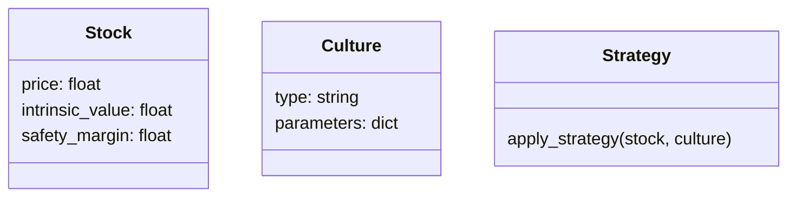
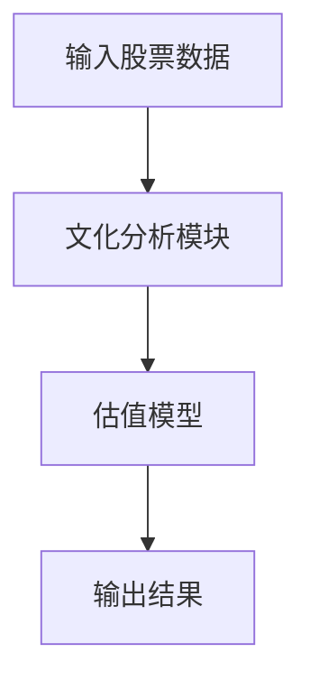
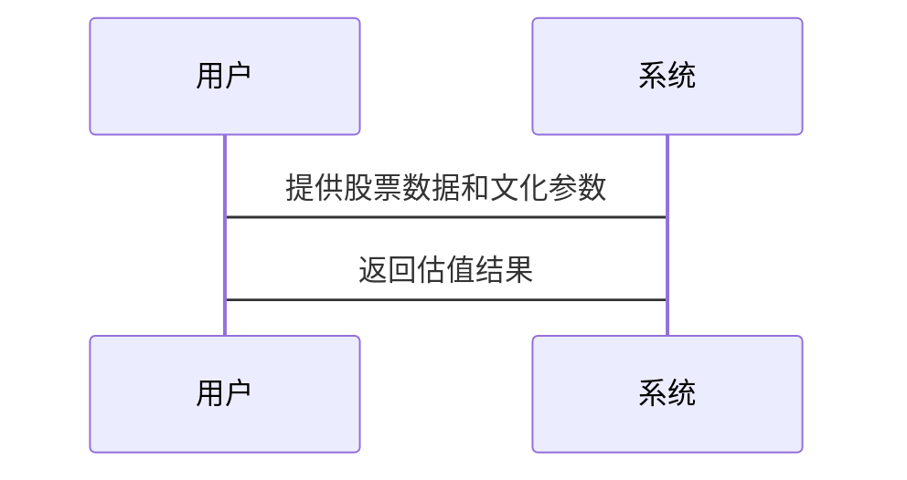

                 


# 格雷厄姆特价股票策略在不同企业文化生态中的适应

## 关键词：
- 格雷厄姆投资策略
- 特价股票
- 企业文化生态
- 价值投资
- 安全边际
- 内在价值
- 投资策略适应性

## 摘要：
本文探讨了格雷厄姆的特价股票策略在不同企业文化生态中的适应性。通过分析不同国家、行业和企业内部文化对投资策略的影响，结合数学模型和算法，系统地研究了如何在不同文化背景下应用该策略。文章详细介绍了策略的核心概念、数学模型、系统架构，并通过实际案例分析了策略的适应性和实施效果，为投资者提供了理论和实践指导。

---

# 第一部分: 格雷厄姆特价股票策略概述

## 第1章: 格雷厄姆投资理念的背景与起源

### 1.1 价值投资的起源

#### 1.1.1 价值投资的起源与发展
- 价值投资由本杰明·格雷厄姆在20世纪初提出。
- 格雷厄姆的学生大卫·多德共同发展了这一理论。
- 价值投资的核心是寻找市场低估的股票，长期持有。

#### 1.1.2 格雷厄姆投资理论的核心思想
- 市场先生理论：市场情绪波动影响股价，投资者应独立于市场情绪做出决策。
- 安全边际：购买价格低于内在价值，以降低风险。

#### 1.1.3 特价股票策略的定义与目标
- 特价股票：市场价格显著低于内在价值的股票。
- 目标：通过长期持有，实现资本增值。

### 1.2 格雷厄姆策略的理论基础

#### 1.2.1 安全边际的概念
- 安全边际 = 内在价值 - 市场价格。
- 通过安全边际确保投资的安全性。

#### 1.2.2 内在价值的计算方法
- 内在价值 = 股票的未来现金流的现值。
- 使用股利折现模型或自由现金流模型计算。

#### 1.2.3 市场先生的隐喻
- 市场情绪波动：投资者应利用市场的非理性波动。

### 1.3 现代市场环境下的策略适应性

#### 1.3.1 当代市场与格雷厄姆时代的差异
- 格雷厄姆时代：市场效率较低，信息不透明。
- 现代市场：信息透明，市场效率高。

#### 1.3.2 策略在不同经济周期的表现
- 经济衰退：策略表现较好，因市场低估股票增多。
- 经济繁荣：策略表现较弱，因高价股票较多。

#### 1.3.3 技术进步对策略的影响
- 数据分析工具：帮助识别低估股票。
- 量化投资：结合格雷厄姆策略进行量化分析。

---

## 第2章: 不同企业文化生态的多样性

### 2.1 企业文化生态的定义与分类

#### 2.1.1 企业文化生态的定义
- 企业文化生态：企业内部文化、管理风格和价值观的综合体现。

#### 2.1.2 不同国家与行业文化生态的差异
- 美国：强调创新和竞争。
- 日本：注重长期稳定和团队合作。
- 中国：重视关系和灵活性。

#### 2.1.3 企业内部文化对投资策略的影响
- 企业文化影响管理层决策和公司治理。

### 2.2 企业文化对投资决策的影响

#### 2.2.1 企业治理结构与投资策略的关系
- 良好的治理结构有助于实施价值投资。

#### 2.2.2 企业战略目标与股票估值的关联
- 企业战略影响未来现金流，进而影响内在价值。

#### 2.2.3 企业文化氛围对投资行为的塑造
- 企业文化影响员工决策，间接影响投资策略。

---

## 第3章: 格雷厄姆策略的核心概念与联系

### 3.1 核心概念的原理分析

#### 3.1.1 安全边际的数学模型
$$ \text{安全边际} = \text{内在价值} - \text{市场价格} $$

#### 3.1.2 内在价值的计算公式
$$ \text{内在价值} = \sum_{t=1}^{\infty} \frac{\text{股利}_t}{(1 + r)^t} $$

#### 3.1.3 市场波动与投资机会的关系
- 市场波动提供低价买入机会。

### 3.2 核心概念的对比分析

#### 3.2.1 安全边际与风险控制的对比
| 安全边际 | 风险控制 |
|---------|----------|
| 通过价格折扣降低风险 | 通过分散投资降低风险 |

#### 3.2.2 内在价值与市场价值的对比
| 内在价值 | 市场价值 |
|----------|----------|
| 反映企业真实价值 | 受市场情绪影响 |

---

## 第4章: 格雷厄姆策略的数学模型与算法原理

### 4.1 算法原理

#### 4.1.1 策略的数学模型
$$ \text{购买价格} \leq \text{内在价值} \times (1 - \text{安全边际}) $$

#### 4.1.2 算法步骤
1. 计算股票的内在价值。
2. 确定安全边际。
3. 比较市场价格与安全边际。

#### 4.1.3 算法实现

```python
def calculate_intrinsic_value(enterprise_value, cash_flow):
    return enterprise_value / (cash_flow / 1000000)
```

---

## 第5章: 系统分析与架构设计

### 5.1 问题场景介绍

#### 5.1.1 问题背景
- 不同文化背景下，企业估值方法不同。

#### 5.1.2 项目介绍
- 构建一个适应不同文化生态的股票估值系统。

### 5.2 系统功能设计

#### 5.2.1 领域模型设计


### 5.3 系统架构设计

#### 5.3.1 系统架构图


### 5.4 系统接口设计

#### 5.4.1 接口定义
- 输入：股票数据、文化参数。
- 输出：估值结果。

### 5.5 系统交互设计

#### 5.5.1 交互序列图


---

## 第6章: 项目实战

### 6.1 实战环境安装

#### 6.1.1 环境要求
- Python 3.8+
- 数据分析库：pandas, numpy.

### 6.2 核心实现

#### 6.2.1 代码实现
```python
def calculate_intrinsic_value(stock_data, culture_params):
    # 计算内在价值
    enterprise_value = stock_data['enterprise_value']
    cash_flow = stock_data['cash_flow']
    return enterprise_value / (cash_flow / 1000000)
```

#### 6.2.2 代码解读
- 计算企业价值与现金流比率，确定内在价值。

### 6.3 实战案例分析

#### 6.3.1 案例1：美国市场
- 公司：苹果。
- 文化：创新驱动。
- 分析：计算内在价值，比较市场价格。

#### 6.3.2 案例2：中国市场
- 公司：腾讯。
- 文化：关系驱动。
- 分析：考虑文化因素对估值的影响。

### 6.4 详细讲解与剖析
- 案例分析展示策略在不同文化环境中的适应性。

### 6.5 小结
- 突出策略在不同文化生态中的灵活性和适用性。

---

## 第7章: 最佳实践与小结

### 7.1 最佳实践 tips

#### 7.1.1 评估文化因素
- 考虑企业文化对投资决策的影响。

#### 7.1.2 定期调整策略
- 根据市场变化和企业文化调整策略。

### 7.2 小结
- 格雷厄姆策略在不同文化生态中的适应性取决于对企业文化和市场环境的深入分析。

### 7.3 注意事项
- 风险控制：避免过度依赖单一策略。
- 数据质量：确保数据的准确性和完整性。

### 7.4 拓展阅读
- 推荐阅读格雷厄姆的经典著作《聪明的投资者》。

---

# 附录

## 附录A: 术语表

- 格雷厄姆投资策略：基于价值投资的策略。
- 安全边际：内在价值与市场价格的差额。
- 内在价值：股票的未来现金流的现值。

## 附录B: 数据来源

- 股票数据来源：Yahoo Finance。
- 文化分析数据来源：企业年报和行业报告。

## 附录C: 工具推荐

- 数据分析工具：Python, Pandas。
- 估值模型工具：Excel, R语言。

---

# 作者：AI天才研究院/AI Genius Institute & 禅与计算机程序设计艺术 /Zen And The Art of Computer Programming

