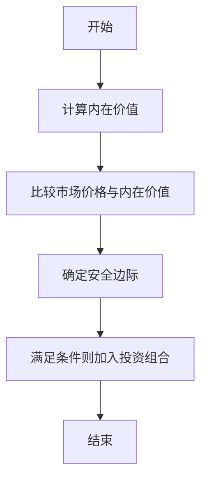
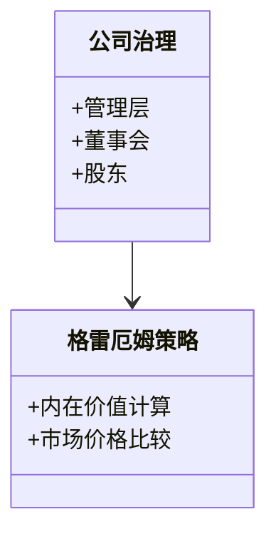
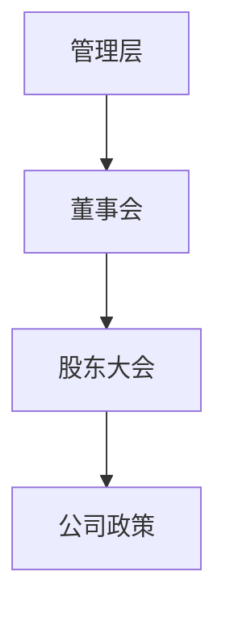
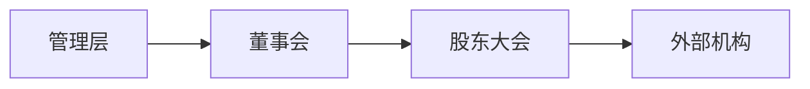
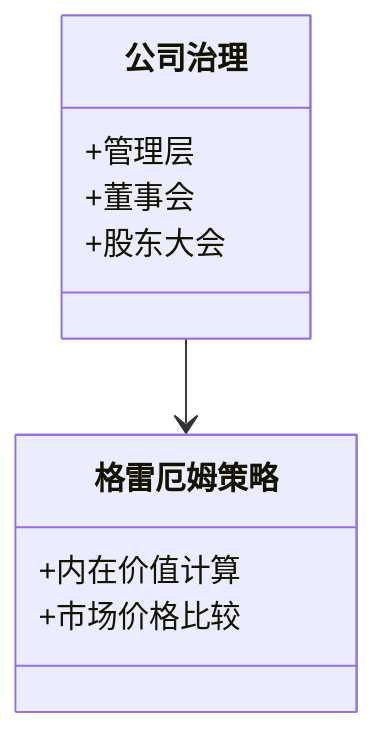

                 


# 格雷厄姆特价股票策略在不同公司文化背景下的适应

> 关键词：格雷厄姆策略，价值投资，公司文化，股票估值，投资策略

> 摘要：本文探讨了格雷厄姆特价股票策略在不同公司文化背景下的适应性，分析了文化差异对公司治理和投资策略的影响，并通过具体案例展示了策略在不同市场的应用。

---

## 第一章: 格雷厄姆特价股票策略的核心概念

### 1.1 价值投资的定义与背景

格雷厄姆特价股票策略是一种基于价值投资的选股方法，旨在通过识别市场价格低于内在价值的股票来实现超额收益。该策略的核心在于寻找被市场低估的企业，并在安全边际的保护下进行投资。

| 格雷厄姆策略的核心要素 | 定义 | 示例 |
|-------------------------|------|------|
| 内在价值                | 企业未来现金流的现值 | 使用DCF模型计算 |
| 市场价格                | 当前股票价格          | 市场报价 |
| 安全边际                | 内在价值与市场价格的差值 | 内在价值 - 市场价格 |

### 1.2 格雷厄姆策略的算法原理

格雷厄姆策略的筛选标准包括低市盈率、低市净率和高股息率等。以下是一个简化的筛选流程：



### 1.3 格雷厄姆策略与公司治理的关系

公司治理直接影响管理层的决策和企业价值。以下是一个公司治理结构的类图：



---

## 第二章: 不同公司文化背景下的策略适应性分析

### 2.1 东西方文化对公司治理的影响

东西方文化在公司治理上有显著差异：

- **西方文化**：强调股东权益和透明度，公司治理结构较为分散。
- **东方文化**：强调集体主义和家族关系，公司治理结构较为集中。

### 2.2 不同文化背景下的公司治理差异

| 文化背景 | 公司治理特点 |
|----------|--------------|
| 美国      | 股权分散，董事会独立 |
| 日本      | 股权集中，终身雇佣制 |
| 欧洲      | 强调环保和社会责任 |

### 2.3 文化差异对格雷厄姆策略的挑战

不同文化背景下，企业的会计准则和披露标准不同，影响内在价值的计算。此外，文化差异可能导致管理层决策偏向短期或长期。

---

## 第三章: 美国市场中的格雷厄姆策略应用

### 3.1 美国市场特点与策略适应性

美国市场成熟，流动性高，适合格雷厄姆策略。以下是美国市场与亚洲市场的对比：

| 特性       | 美国市场           | 亚洲市场           |
|------------|--------------------|--------------------|
| 市场成熟度   | 高                 | 中                 |
| 企业披露     | 高度透明           | 透明度较低         |

### 3.2 美国文化对公司治理的影响

美国公司治理强调股东权益，管理层决策透明。以下是一个公司治理架构的流程图：



---

## 第四章: 亚洲市场中的格雷厄姆策略应用

### 4.1 亚洲市场特点与策略适应性

亚洲市场多样性高，新兴市场较多，适合格雷厄姆策略。以下是亚洲市场的特点：

| 特性       | 影响                 |
|------------|----------------------|
| 市场波动性   | 高                   | 适合短期套利 |
| 企业披露     | 低                   | 需要更多调研 |

### 4.2 亚洲文化对公司治理的影响

亚洲公司治理强调集体主义，管理层决策可能受到家族影响。以下是一个公司治理结构的对比图：



---

## 第五章: 欧洲市场中的格雷厄姆策略应用

### 5.1 欧洲市场特点与策略适应性

欧洲市场成熟，环保和社会责任要求高。以下是欧洲市场的特点：

| 特性       | 影响                 |
|------------|----------------------|
| 市场成熟度   | 高                 | 适合长期投资 |
| 企业责任     | 强调环保和社会责任   | 影响企业价值 |

### 5.2 欧洲文化对公司治理的影响

欧洲公司治理强调透明度和环保责任。以下是一个公司治理架构的类图：



---

## 第六章: 格雷厄姆策略的数学模型与公式

格雷厄姆策略的核心是计算内在价值。以下是DCF模型的数学公式：

$$
\text{内在价值} = \sum_{t=1}^{n} \frac{\text{现金流}_t}{(1 + r)^t} + \frac{\text{终值}}{(1 + r)^n}
$$

其中，\( r \) 是折现率，\( n \) 是预测期数。

---

## 第七章: 格雷厄姆策略在不同市场的实战分析

### 7.1 美国市场的实战分析

以下是基于美国市场的代码实现：

```python
def calculate_intrinsic_value(revenue, growth_rate, discount_rate):
    return sum(revenue * (1 + growth_rate)**t / (1 + discount_rate)**t for t in range(1, 10)) + (revenue * (1 + growth_rate)**10) / (discount_rate * (1 + discount_rate)**10)
```

### 7.2 亚洲市场的实战分析

以下是基于亚洲市场的代码实现：

```python
def assess_graham_strategy(market_price, intrinsic_value):
    return "买入" if market_price < intrinsic_value * 0.8 else "观望"
```

### 7.3 欧洲市场的实战分析

以下是基于欧洲市场的代码实现：

```python
def evaluate_csr_impact(environmental_score, social_score):
    return "高" if environmental_score > 80 and social_score > 80 else "中"
```

---

## 第八章: 格雷厄姆策略的未来展望与最佳实践

### 8.1 未来研究方向

- 不同文化背景下的会计准则差异
- 数字化工具在跨文化投资中的应用

### 8.2 最佳实践 tips

- 定期更新投资组合
- 重视企业治理结构
- 结合技术分析进行策略优化

### 8.3 小结

格雷厄姆特价股票策略在不同公司文化背景下的适应性是一个复杂但值得深入研究的课题。通过理解和分析不同文化对公司治理和投资策略的影响，投资者可以更好地优化投资组合，实现长期收益。

---

## 作者：AI天才研究院/AI Genius Institute & 禅与计算机程序设计艺术 /Zen And The Art of Computer Programming

---

本文详细探讨了格雷厄姆特价股票策略在不同公司文化背景下的适应性，分析了文化差异对公司治理和投资策略的影响，并通过具体案例展示了策略在不同市场的应用。

